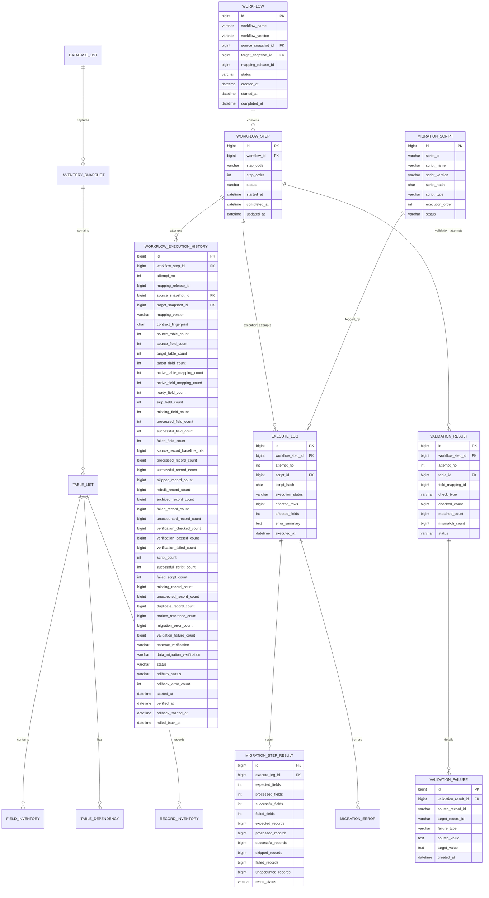

# End-to-End Database Migration Workflow Tutorial

> Controlled top-down database migration using preserved inventory detail, mapping definitions, one row per workflow step, attempt-aware execution history, rollback-before-retry, migration script logging, and validation evidence.

---

## Contents

1. [Final Architecture](#1-final-architecture)
2. [Core Responsibility](#2-core-responsibility)
3. [Hard-Coded Workflow Enum](#3-hard-coded-workflow-enum)
4. [Workflow](#4-workflow)
5. [Workflow Step](#5-workflow-step)
6. [Workflow Execution History and Attempts](#6-workflow-execution-history-and-attempts)
7. [Rollback and Retry Contract](#7-rollback-and-retry-contract)
8. [Inventory Detail Tables](#8-inventory-detail-tables)
9. [Mapping Tables](#9-mapping-tables)
10. [Execution and Validation Detail](#10-execution-and-validation-detail)
11. [Top-Down Step Gate](#11-top-down-step-gate)
12. [Insert / Update Flow](#12-insert--update-flow)
13. [JOOMLA_CORE Seed Example](#13-joomla_core-seed-example)
14. [ERD](#14-erd)
15. [Recommended MySQL DDL](#15-recommended-mysql-ddl)
16. [Codex Prompts Per Workflow Step](#16-codex-prompts-per-workflow-step)
17. [Final Verification Rules](#17-final-verification-rules)

---

# 1. Final Architecture

The workflow is one strict top-down flow.

`INVENTORY` and `MAPPING` are combined into one preparation step. Inventory and mapping are still verified independently by the next two steps.

```text
workflow_enum                       hard-coded step definition/order
        ↓
workflow                            one named migration flow, e.g. JOOMLA_CORE
        ↓
workflow_step                       one row for every step in that workflow
        ↓
workflow_execution_history          one immutable result row per attempt
```

Canonical workflow:

```text
INVENTORY_MAPPING
    ↓ PASS
INVENTORY_VERIFY
    ↓ PASS
MAPPING_VERIFY
    ↓ PASS
MIGRATION
    ↓ PASS
VALIDATION_DATA
    ↓ PASS
FINAL_VERIFY
    ↓ PASS
WORKFLOW PASS
```

Every step follows the same execution lifecycle:

```text
PRECHECK
    ↓
CREATE ATTEMPT N
    ↓
CAPTURE PRE-ATTEMPT BASELINE / ROLLBACK EVIDENCE
    ↓
EXECUTE CURRENT STEP
    ↓
VERIFY CURRENT ATTEMPT
    ↓
PASS?
 ┌──┴──┐
YES   NO
 │     │
 │     ↓
 │   ROLLBACK ATTEMPT N
 │     ↓
 │   VERIFY ROLLBACK
 │     ↓
 │   rollback_status = PASS?
 │     ├── NO  → BLOCK
 │     └── YES → workflow_step = PENDING → RETRY AS ATTEMPT N+1
 │
 ↓
workflow_step = PASS
    ↓
NEXT STEP ALLOWED
```

The complete preparation output remains:

```text
INVENTORY_MAPPING
│
├── migration_inventory
│   ├── inventory_snapshot
│   ├── table_list
│   ├── field_inventory
│   ├── table_dependency
│   └── record_inventory
│
└── migration_mapping
    ├── mapping_release
    ├── table_mapping
    ├── field_mapping
    └── value_mapping
```

The two independent verification gates remain:

```text
INVENTORY_VERIFY
    = verify actual source/target inventory evidence

MAPPING_VERIFY
    = verify mapping contract against verified inventory
```

---

# 2. Core Responsibility

## `migration_inventory`

`migration_inventory` is the migration control/audit database.

```text
migration_inventory
│
├── INVENTORY DETAIL
│   ├── database_list
│   ├── inventory_snapshot
│   ├── table_list
│   ├── field_inventory
│   ├── table_dependency
│   └── record_inventory
│
├── WORKFLOW CONTROL
│   ├── workflow
│   ├── workflow_step
│   └── workflow_execution_history
│
├── EXECUTION DETAIL
│   ├── migration_script
│   ├── execute_log
│   ├── migration_step_result
│   └── migration_error
│
└── VALIDATION DETAIL
    ├── validation_result
    └── validation_failure
```

It answers:

```text
WHAT EXISTS
+ WHICH WORKFLOW/STEP IS ACTIVE
+ WHICH ATTEMPT RAN
+ WHAT WAS EXECUTED
+ WHAT WAS VERIFIED
+ WHAT FAILED
+ WHETHER FAILED WORK WAS ROLLED BACK
+ WHETHER RETRY IS SAFE
```

## `migration_mapping`

`migration_mapping` stores executable mapping definitions only:

```text
migration_mapping
├── mapping_release
├── table_mapping
├── field_mapping
└── value_mapping
```

Workflow execution history remains centralized in:

```text
migration_inventory.workflow_execution_history
```

---

# 3. Hard-Coded Workflow Enum

`workflow_enum` is hard-coded in source code. It is not a database table.

Canonical order:

```text
10 INVENTORY_MAPPING
20 INVENTORY_VERIFY
30 MAPPING_VERIFY
40 MIGRATION
50 VALIDATION_DATA
60 FINAL_VERIFY
```

Recommended PHP enum:

```php
enum MigrationWorkflowStep: string
{
    case INVENTORY_MAPPING = 'INVENTORY_MAPPING';
    case INVENTORY_VERIFY = 'INVENTORY_VERIFY';
    case MAPPING_VERIFY = 'MAPPING_VERIFY';
    case MIGRATION = 'MIGRATION';
    case VALIDATION_DATA = 'VALIDATION_DATA';
    case FINAL_VERIFY = 'FINAL_VERIFY';

    public function order(): int
    {
        return match ($this) {
            self::INVENTORY_MAPPING => 10,
            self::INVENTORY_VERIFY => 20,
            self::MAPPING_VERIFY => 30,
            self::MIGRATION => 40,
            self::VALIDATION_DATA => 50,
            self::FINAL_VERIFY => 60,
        };
    }

    public function previous(): ?self
    {
        return match ($this) {
            self::INVENTORY_MAPPING => null,
            self::INVENTORY_VERIFY => self::INVENTORY_MAPPING,
            self::MAPPING_VERIFY => self::INVENTORY_VERIFY,
            self::MIGRATION => self::MAPPING_VERIFY,
            self::VALIDATION_DATA => self::MIGRATION,
            self::FINAL_VERIFY => self::VALIDATION_DATA,
        };
    }

    public function next(): ?self
    {
        return match ($this) {
            self::INVENTORY_MAPPING => self::INVENTORY_VERIFY,
            self::INVENTORY_VERIFY => self::MAPPING_VERIFY,
            self::MAPPING_VERIFY => self::MIGRATION,
            self::MIGRATION => self::VALIDATION_DATA,
            self::VALIDATION_DATA => self::FINAL_VERIFY,
            self::FINAL_VERIFY => null,
        };
    }
}
```

The enum defines only step identity/order. Runtime attempts and rollback state are stored in the control database.

---

# 4. Workflow

One `workflow` row represents one complete named migration flow.

Examples:

```text
JOOMLA_CORE
HIKASHOP
ACYMAILING
JCE
SP_PAGE_BUILDER
CUSTOM_COMPONENT_CARS
```

Recommended fields:

| Column | Type | Purpose |
|---|---|---|
| `id` | bigint UN AI PK | Workflow ID. |
| `workflow_name` | varchar(128) | Scope such as `JOOMLA_CORE`. |
| `workflow_version` | varchar(64) | Workflow version. |
| `source_snapshot_id` | bigint UN NULL | Filled by `INVENTORY_MAPPING`. |
| `target_snapshot_id` | bigint UN NULL | Filled by `INVENTORY_MAPPING`. |
| `mapping_release_id` | bigint UN NULL | Filled by `INVENTORY_MAPPING`. |
| `status` | varchar(16) | `PENDING/RUNNING/PASS/FAIL/LOCKED`. |
| `created_at` | datetime(6) | Created time. |
| `started_at` | datetime(6) NULL | Started time. |
| `completed_at` | datetime(6) NULL | Completed time. |

Recommended identity:

```text
UNIQUE (workflow_name, workflow_version)
```

---

# 5. Workflow Step

Each enum step is a separate row in `workflow_step`.

For `JOOMLA_CORE V1`:

| step_order | step_code | Initial status |
|---:|---|---|
| 10 | `INVENTORY_MAPPING` | `PENDING` |
| 20 | `INVENTORY_VERIFY` | `PENDING` |
| 30 | `MAPPING_VERIFY` | `PENDING` |
| 40 | `MIGRATION` | `PENDING` |
| 50 | `VALIDATION_DATA` | `PENDING` |
| 60 | `FINAL_VERIFY` | `PENDING` |

Recommended fields:

| Column | Type | Purpose |
|---|---|---|
| `id` | bigint UN AI PK | Workflow-step ID. |
| `workflow_id` | bigint UN | Parent workflow. |
| `step_code` | varchar(64) | Hard-coded enum value. |
| `step_order` | int UN | Hard-coded enum order. |
| `status` | varchar(16) | `PENDING/RUNNING/PASS/FAIL/ROLLING_BACK/BLOCKED`. |
| `started_at` | datetime(6) NULL | Current attempt start. |
| `completed_at` | datetime(6) NULL | PASS completion time. |
| `updated_at` | datetime(6) | Last state update. |

Recommended keys:

```text
UNIQUE (workflow_id, step_code)
UNIQUE (workflow_id, step_order)
```

Current allowed step is derived as:

```text
1. RUNNING / FAIL / ROLLING_BACK step if one exists;
2. otherwise the lowest step_order whose status is not PASS.
```

Retry does not create another `workflow_step`. It creates another `workflow_execution_history.attempt_no` for the same step.

---

# 6. Workflow Execution History and Attempts

`workflow_execution_history` is append-only attempt history.

Relationship:

```text
workflow
   1
   │
   N
workflow_step
   1
   │
   N
workflow_execution_history
```

One step may therefore have:

```text
attempt 1 = FAIL, rollback PASS
attempt 2 = FAIL, rollback PASS
attempt 3 = PASS
```

History references only `workflow_step_id`; workflow and step identity are available by join.

Required attempt identity:

```text
attempt_no
UNIQUE (workflow_step_id, attempt_no)
```

## 6.1 Existing evidence retained

```text
mapping_release_id
source_snapshot_id
target_snapshot_id
mapping_version
contract_fingerprint
source_table_count
source_field_count
target_table_count
target_field_count
active_table_mapping_count
active_field_mapping_count
source_record_baseline_total
contract_verification
data_migration_verification
```

## 6.2 Field accounting

```text
ready_field_count
skip_field_count
missing_field_count
processed_field_count
successful_field_count
failed_field_count
```

## 6.3 Record accounting

```text
processed_record_count
successful_record_count
skipped_record_count
rebuilt_record_count
archived_record_count
failed_record_count
unaccounted_record_count
```

## 6.4 Verification accounting

```text
verification_checked_count
verification_passed_count
verification_failed_count
```

## 6.5 Script accounting

```text
script_count
successful_script_count
failed_script_count
```

## 6.6 Failure summary

```text
missing_record_count
unexpected_record_count
duplicate_record_count
broken_reference_count
migration_error_count
validation_failure_count
```

## 6.7 Attempt and rollback result

```text
attempt_no
status
rollback_status
rollback_error_count
started_at
verified_at
rollback_started_at
rolled_back_at
```

Allowed result semantics:

```text
status = PASS
    → rollback_status = NOT_REQUIRED
    → step is complete
    → no retry allowed

status = FAIL
    → next step is blocked
    → retry is blocked until rollback_status = PASS

status = FAIL + rollback_status = PASS
    → failed attempt remains immutable evidence
    → workflow_step returns to PENDING
    → retry as attempt_no + 1 is allowed

status = FAIL + rollback_status = FAIL/PENDING
    → workflow_step remains blocked
    → retry is forbidden
```

---

# 7. Rollback and Retry Contract

Rollback is part of each step's generated SQL and plan. It is not a separate workflow step.

## 7.1 Retry gate

A new attempt is allowed only when:

```text
current workflow_step has no PASS attempt
AND
(
    there is no previous attempt
    OR latest attempt.status = FAIL
       AND latest attempt.rollback_status = PASS
)
```

Next attempt number:

```sql
SELECT COALESCE(MAX(attempt_no), 0) + 1 AS next_attempt_no
FROM migration_inventory.workflow_execution_history
WHERE workflow_step_id = :workflow_step_id;
```

## 7.2 PASS is final

If any attempt has:

```text
status = PASS
```

then:

```text
workflow_step.status = PASS
retry = BLOCKED
next workflow step may become eligible
```

## 7.3 Failed attempt must be rolled back before retry

A failed attempt is not reusable and cannot be ignored.

Required flow:

```text
attempt N FAIL
    ↓
workflow_step = ROLLING_BACK
    ↓
execute attempt-N rollback
    ↓
verify target/control state returned to the recorded pre-attempt baseline
    ↓
rollback_status = PASS
    ↓
workflow_step = PENDING
    ↓
attempt N+1 allowed
```

## 7.4 Rollback strategy inside generated SQL

Each Codex-generated SQL file must select the safest rollback strategy for the statements it actually generates:

```text
A. Transaction rollback
   Use START TRANSACTION / COMMIT / ROLLBACK for transactional DML where the complete change set can safely remain inside one transaction.

B. Explicit compensating rollback
   For changes that cannot safely depend on transaction rollback, capture the required pre-attempt baseline/backup and generate explicit reverse/restore SQL.
```

The generated plan must state which strategy applies to every write block.

Never claim rollback support without executable rollback SQL and a rollback-verification query.

## 7.5 Rollback verification

Rollback PASS requires evidence that the current attempt no longer leaves application/control changes that would contaminate the retry.

At minimum verify applicable:

```text
row counts restored
attempt-created rows removed/restored/invalidated as defined
changed values restored
runtime mappings from failed attempt removed/restored
no unresolved migration_error caused by rollback
no failed-attempt script is treated as successful for retry
pre-attempt fingerprint/count checks match
```

---

# 8. Inventory Detail Tables

Keep all inventory evidence tables:

```text
database_list
inventory_snapshot
table_list
field_inventory
table_dependency
record_inventory
```

They remain the detailed evidence. `workflow_execution_history` stores only attempt-level summary and verification results.

For failed `INVENTORY_MAPPING` attempts, the generated rollback must preserve historical evidence while ensuring the failed attempt's unfinished snapshot/release cannot be reused as an approved input for the retry.

---

# 9. Mapping Tables

Keep mapping definitions:

```text
mapping_release
      ↓
table_mapping
      ↓
field_mapping
      ↓
value_mapping
```

`field_mapping.field_status` remains:

```text
READY
SKIP
MISSING
```

`INVENTORY_MAPPING` writes mapping definitions. `MAPPING_VERIFY` verifies them; it does not silently rewrite the contract.

---

# 10. Execution and Validation Detail

## Migration execution

Each migration script has a stable identity in `migration_script`.

Every execution is logged in `execute_log`.

Because a failed attempt can be rolled back and retried, script uniqueness is scoped to the attempt:

```text
UNIQUE (workflow_step_id, attempt_no, script_id)
```

Therefore:

```text
same script twice in attempt N      → BLOCK
same script in attempt N+1 after
attempt N rollback PASS             → ALLOWED
same step already has PASS attempt  → BLOCK ALL RETRIES
```

`execute_log` must store:

```text
workflow_step_id
attempt_no
script_id
script_hash
execution_status
affected_rows
affected_fields
error_summary
executed_at
```

Execution totals remain in `migration_step_result`; runtime errors remain in `migration_error`.

## Data validation

`validation_result` and `validation_failure` remain detailed validation evidence.

For retry isolation, validation detail must include the current `attempt_no` or otherwise be unambiguously linked to the current workflow attempt.

The workflow-level result is summarized into `workflow_execution_history`.

---

# 11. Top-Down Step Gate

For requested workflow step `X`:

```text
1. Load workflow and ordered workflow_step rows.
2. Confirm every earlier required step has a PASS history attempt.
3. Confirm no later step is being requested out of order.
4. Confirm current step has no PASS attempt.
5. Load latest current-step attempt.
6. If latest attempt FAIL and rollback_status != PASS → BLOCK.
7. Calculate next attempt_no = MAX(attempt_no) + 1.
8. Capture pre-attempt rollback baseline/evidence.
9. Execute only current step.
10. Verify current attempt.
11. If PASS: insert/finalize PASS history and mark workflow_step PASS.
12. If FAIL: record FAIL, rollback the same attempt, verify rollback.
13. Only after rollback PASS may workflow_step return to PENDING for retry.
14. Never execute the next workflow step automatically.
```

Previous-step PASS query pattern:

```sql
SELECT previous_ws.id
FROM migration_inventory.workflow_step current_ws
JOIN migration_inventory.workflow_step previous_ws
  ON previous_ws.workflow_id = current_ws.workflow_id
 AND previous_ws.step_order = :previous_step_order
WHERE current_ws.id = :current_workflow_step_id
  AND previous_ws.status = 'PASS'
  AND EXISTS (
      SELECT 1
      FROM migration_inventory.workflow_execution_history h
      WHERE h.workflow_step_id = previous_ws.id
        AND h.status = 'PASS'
  );
```

Current-step PASS guard:

```sql
SELECT id
FROM migration_inventory.workflow_execution_history
WHERE workflow_step_id = :current_workflow_step_id
  AND status = 'PASS'
LIMIT 1;
```

If found:

```text
BLOCK
STEP_ALREADY_PASSED
```

Latest-attempt retry guard:

```sql
SELECT attempt_no, status, rollback_status
FROM migration_inventory.workflow_execution_history
WHERE workflow_step_id = :current_workflow_step_id
ORDER BY attempt_no DESC
LIMIT 1;
```

Retry is allowed only when no row exists or the latest row is:

```text
status = FAIL
rollback_status = PASS
```

---

# 12. Insert / Update Flow

## Step 1 — `INVENTORY_MAPPING`

Prepare inventory detail and mapping definitions.

If attempt fails:

```text
- do not allow INVENTORY_VERIFY;
- rollback/retire/restore artifacts created or modified by that attempt according to the generated plan;
- verify rollback;
- set failed history.rollback_status = PASS only after proof;
- reset workflow_step to PENDING;
- retry as a new attempt.
```

If PASS, mark step PASS.

## Step 2 — `INVENTORY_VERIFY`

Require a PASS attempt for `INVENTORY_MAPPING`.

This step is verification-focused. If its execution fails, rollback only its attempt-specific control/validation artifacts; do not rewrite the underlying inventory merely to make verification pass.

Retry only after rollback PASS.

## Step 3 — `MAPPING_VERIFY`

Require a PASS attempt for `INVENTORY_VERIFY`.

Do not change mapping decisions while verifying. Failed-attempt verification artifacts must be isolated/rolled back before retry.

## Step 4 — `MIGRATION`

Require a PASS attempt for `MAPPING_VERIFY`.

For attempt N:

```text
capture rollback baseline
    ↓
execute each required script once for attempt N
    ↓
execute_log(attempt_no=N)
    ↓
migration_step_result
    ↓
verify migration attempt
```

If any required migration gate fails:

```text
FAIL attempt N
    ↓
rollback all changes belonging to attempt N
    ↓
verify rollback baseline restored
    ↓
rollback_status = PASS
    ↓
retry as attempt N+1
```

## Step 5 — `VALIDATION_DATA`

Require a PASS attempt for `MIGRATION`.

Validation does not repair business data. A failed validation attempt records evidence and rolls back only attempt-specific validation/control writes before a retry of the validation step.

If validation proves the migrated data itself is wrong, do not mark rollback PASS for MIGRATION implicitly. The workflow remains blocked until the responsible migration state is handled explicitly.

## Step 6 — `FINAL_VERIFY`

Require a PASS attempt for `VALIDATION_DATA`.

Read the authoritative PASS attempt for every previous step and confirm no unresolved failed attempt remains without rollback PASS.

Only then mark `FINAL_VERIFY` and the parent workflow PASS.

---

# 13. JOOMLA_CORE Seed Example

Create workflow:

```sql
INSERT INTO migration_inventory.workflow (
    workflow_name,
    workflow_version,
    status
) VALUES (
    'JOOMLA_CORE',
    'V1',
    'PENDING'
);

SET @workflow_id = LAST_INSERT_ID();
```

Materialize enum steps:

```sql
INSERT INTO migration_inventory.workflow_step (
    workflow_id,
    step_code,
    step_order,
    status
) VALUES
    (@workflow_id, 'INVENTORY_MAPPING', 10, 'PENDING'),
    (@workflow_id, 'INVENTORY_VERIFY',  20, 'PENDING'),
    (@workflow_id, 'MAPPING_VERIFY',    30, 'PENDING'),
    (@workflow_id, 'MIGRATION',         40, 'PENDING'),
    (@workflow_id, 'VALIDATION_DATA',   50, 'PENDING'),
    (@workflow_id, 'FINAL_VERIFY',      60, 'PENDING');
```

Find current allowed step:

```sql
SELECT ws.*
FROM migration_inventory.workflow_step ws
WHERE ws.workflow_id = @workflow_id
  AND ws.status <> 'PASS'
ORDER BY ws.step_order
LIMIT 1;
```

For the selected step, calculate next attempt:

```sql
SELECT COALESCE(MAX(h.attempt_no), 0) + 1 AS next_attempt_no
FROM migration_inventory.workflow_execution_history h
WHERE h.workflow_step_id = :workflow_step_id;
```

---

# 14. ERD

## `migration_inventory`



---

# 15. Recommended MySQL DDL

```sql
CREATE TABLE migration_inventory.workflow (
    id BIGINT UNSIGNED NOT NULL AUTO_INCREMENT,
    workflow_name VARCHAR(128) NOT NULL,
    workflow_version VARCHAR(64) NOT NULL,
    source_snapshot_id BIGINT UNSIGNED NULL,
    target_snapshot_id BIGINT UNSIGNED NULL,
    mapping_release_id BIGINT UNSIGNED NULL,
    status VARCHAR(16) NOT NULL DEFAULT 'PENDING',
    created_at DATETIME(6) NOT NULL DEFAULT CURRENT_TIMESTAMP(6),
    started_at DATETIME(6) NULL,
    completed_at DATETIME(6) NULL,
    PRIMARY KEY (id),
    UNIQUE KEY uk_workflow_name_version (workflow_name, workflow_version),
    CHECK (status IN ('PENDING','RUNNING','PASS','FAIL','LOCKED'))
);

CREATE TABLE migration_inventory.workflow_step (
    id BIGINT UNSIGNED NOT NULL AUTO_INCREMENT,
    workflow_id BIGINT UNSIGNED NOT NULL,
    step_code VARCHAR(64) NOT NULL,
    step_order INT UNSIGNED NOT NULL,
    status VARCHAR(16) NOT NULL DEFAULT 'PENDING',
    started_at DATETIME(6) NULL,
    completed_at DATETIME(6) NULL,
    updated_at DATETIME(6) NOT NULL DEFAULT CURRENT_TIMESTAMP(6)
        ON UPDATE CURRENT_TIMESTAMP(6),
    PRIMARY KEY (id),
    UNIQUE KEY uk_workflow_step (workflow_id, step_code),
    UNIQUE KEY uk_workflow_step_order (workflow_id, step_order),
    CHECK (status IN ('PENDING','RUNNING','PASS','FAIL','ROLLING_BACK','BLOCKED'))
);

CREATE TABLE migration_inventory.workflow_execution_history (
    id BIGINT UNSIGNED NOT NULL AUTO_INCREMENT,
    workflow_step_id BIGINT UNSIGNED NOT NULL,
    attempt_no INT UNSIGNED NOT NULL,

    mapping_release_id BIGINT UNSIGNED NULL,
    source_snapshot_id BIGINT UNSIGNED NULL,
    target_snapshot_id BIGINT UNSIGNED NULL,
    mapping_version VARCHAR(64) NULL,
    contract_fingerprint CHAR(64) NULL,

    source_table_count INT UNSIGNED NOT NULL DEFAULT 0,
    source_field_count INT UNSIGNED NOT NULL DEFAULT 0,
    target_table_count INT UNSIGNED NOT NULL DEFAULT 0,
    target_field_count INT UNSIGNED NOT NULL DEFAULT 0,
    active_table_mapping_count INT UNSIGNED NOT NULL DEFAULT 0,
    active_field_mapping_count INT UNSIGNED NOT NULL DEFAULT 0,

    ready_field_count INT UNSIGNED NOT NULL DEFAULT 0,
    skip_field_count INT UNSIGNED NOT NULL DEFAULT 0,
    missing_field_count INT UNSIGNED NOT NULL DEFAULT 0,
    processed_field_count INT UNSIGNED NOT NULL DEFAULT 0,
    successful_field_count INT UNSIGNED NOT NULL DEFAULT 0,
    failed_field_count INT UNSIGNED NOT NULL DEFAULT 0,

    source_record_baseline_total BIGINT UNSIGNED NOT NULL DEFAULT 0,
    processed_record_count BIGINT UNSIGNED NOT NULL DEFAULT 0,
    successful_record_count BIGINT UNSIGNED NOT NULL DEFAULT 0,
    skipped_record_count BIGINT UNSIGNED NOT NULL DEFAULT 0,
    rebuilt_record_count BIGINT UNSIGNED NOT NULL DEFAULT 0,
    archived_record_count BIGINT UNSIGNED NOT NULL DEFAULT 0,
    failed_record_count BIGINT UNSIGNED NOT NULL DEFAULT 0,
    unaccounted_record_count BIGINT UNSIGNED NOT NULL DEFAULT 0,

    verification_checked_count BIGINT UNSIGNED NOT NULL DEFAULT 0,
    verification_passed_count BIGINT UNSIGNED NOT NULL DEFAULT 0,
    verification_failed_count BIGINT UNSIGNED NOT NULL DEFAULT 0,

    script_count INT UNSIGNED NOT NULL DEFAULT 0,
    successful_script_count INT UNSIGNED NOT NULL DEFAULT 0,
    failed_script_count INT UNSIGNED NOT NULL DEFAULT 0,

    missing_record_count BIGINT UNSIGNED NOT NULL DEFAULT 0,
    unexpected_record_count BIGINT UNSIGNED NOT NULL DEFAULT 0,
    duplicate_record_count BIGINT UNSIGNED NOT NULL DEFAULT 0,
    broken_reference_count BIGINT UNSIGNED NOT NULL DEFAULT 0,
    migration_error_count BIGINT UNSIGNED NOT NULL DEFAULT 0,
    validation_failure_count BIGINT UNSIGNED NOT NULL DEFAULT 0,

    contract_verification VARCHAR(16) NULL,
    data_migration_verification VARCHAR(16) NULL,
    status VARCHAR(16) NOT NULL,

    rollback_status VARCHAR(16) NOT NULL DEFAULT 'NOT_REQUIRED',
    rollback_error_count INT UNSIGNED NOT NULL DEFAULT 0,

    started_at DATETIME(6) NOT NULL DEFAULT CURRENT_TIMESTAMP(6),
    verified_at DATETIME(6) NULL,
    rollback_started_at DATETIME(6) NULL,
    rolled_back_at DATETIME(6) NULL,

    PRIMARY KEY (id),
    UNIQUE KEY uk_workflow_history_attempt (workflow_step_id, attempt_no),
    KEY ix_workflow_history_result (workflow_step_id, status, rollback_status),

    CHECK (status IN ('PASS','FAIL')),
    CHECK (rollback_status IN ('NOT_REQUIRED','PENDING','PASS','FAIL')),
    CHECK (contract_verification IS NULL OR contract_verification IN ('PASS','FAIL')),
    CHECK (data_migration_verification IS NULL OR data_migration_verification IN ('PASS','FAIL')),
    CHECK (
        (status = 'PASS' AND rollback_status = 'NOT_REQUIRED')
        OR status = 'FAIL'
    )
);
```

`execute_log` must include `attempt_no`, then enforce one script execution per attempt:

```sql
CREATE UNIQUE INDEX uk_execute_log_attempt_script
ON migration_inventory.execute_log (workflow_step_id, attempt_no, script_id);
```

`validation_result` should also include `attempt_no` so evidence from separate retries cannot be mixed.

---

# 16. Codex Prompts Per Workflow Step

## Required output convention for every step

Every prompt creates exactly two files:

```text
1. <order>-<step-code>-plan.md
2. <order>-<step-code>.sql
```

Every plan file must include:

```text
- scope and evidence;
- ordered implementation tasks;
- 100%-scope checklist;
- pre-attempt baseline/backup requirements;
- rollback strategy for every write block;
- rollback verification checklist;
- retry gate;
- PASS/FAIL criteria.
```

Every SQL file must be copy/paste runnable MySQL and contain numbered sections in this order:

```text
00. Resolve workflow/workflow_step and previous-step gate
01. Check no PASS attempt already exists
02. Check latest failed attempt was rollback PASS before retry
03. Allocate current attempt_no
04. Capture pre-attempt baseline / rollback evidence
05. Execute current-step SQL only
06. Write detail execution/validation evidence
07. Verify the current attempt
08. PASS path: record PASS + mark workflow_step PASS
09. FAIL path: record FAIL + set workflow_step ROLLING_BACK
10. Rollback current attempt
11. Verify rollback
12. Rollback PASS path: set rollback_status PASS + reset workflow_step PENDING
13. Rollback FAIL path: set rollback_status FAIL + BLOCK
```

Do not execute the next workflow step.

### Prompt — `INVENTORY_MAPPING`

```text
# Goal
Build the INVENTORY_MAPPING step for the selected workflow. Inventory 100% of the defined source/target schema scope and materialize the reviewed mapping contract into migration_inventory and migration_mapping, with a complete rollback path that allows a clean retry if this attempt fails.

# Success criteria
- Confirm INVENTORY_MAPPING is the current allowed step and earlier-step requirements are satisfied.
- Allocate a new attempt_no only when there is no PASS attempt and the latest failed attempt, if any, has rollback_status = PASS.
- Account for every in-scope source/target table and physical field.
- Capture record baselines and required dependencies.
- Create the mapping_release bound to the exact snapshots and materialize all reviewed table/field/STATIC value mappings.
- Preserve READY/SKIP/MISSING decisions exactly.
- Update workflow snapshot/release references only for the successful current attempt.
- Produce complete history counts/fingerprints.
- If any gate fails, rollback/retire/restore all attempt-created control artifacts, verify the rollback, and leave the step retryable only when rollback_status = PASS.

# Constraints
- Do not invent schema objects, mappings, dependencies, values, or counts.
- Do not silently drop in-scope source/target objects.
- Do not run INVENTORY_VERIFY or later steps.
- Preserve evidence from earlier attempts; never overwrite history.
- Every write block must have an explicit rollback strategy and rollback verification query.
- Use transaction rollback only where the generated statements are safely transactional; otherwise generate explicit compensating restore/reversal SQL from a captured pre-attempt baseline.

# Output
Create exactly two files:
1. `10-inventory-mapping-plan.md` — ordered plan and 100%-scope checklist, including pre-attempt baseline, per-write rollback strategy, rollback verification, retry criteria, and PASS/FAIL gates.
2. `10-inventory-mapping.sql` — copy/paste runnable MySQL with numbered PRECHECK, ATTEMPT, BASELINE, EXECUTE, VERIFY, PASS, FAIL, ROLLBACK, ROLLBACK_VERIFY, and RETRY-READY sections.
```

### Prompt — `INVENTORY_VERIFY`

```text
# Goal
Build INVENTORY_VERIFY to independently prove the inventory from INVENTORY_MAPPING matches the actual source/target databases, while preserving failed-attempt evidence and supporting rollback/retry of this verification attempt.

# Success criteria
- Require a PASS attempt for INVENTORY_MAPPING.
- Confirm INVENTORY_VERIFY is the current allowed step.
- Isolate the new attempt_no from previous attempts.
- Verify source/target tables, fields, record baselines, dependencies, snapshot identity, and missing/duplicate evidence.
- PASS only with zero unresolved inventory failures.
- If this verification attempt fails, rollback only attempt-specific control/verification writes, verify rollback, and allow retry only after rollback_status = PASS.

# Constraints
- Do not change inventory facts merely to make verification pass.
- Do not modify mapping definitions or business data.
- Do not run MAPPING_VERIFY or later steps.
- Never overwrite previous history.
- Every attempt-specific write must have executable rollback and rollback verification.

# Output
Create exactly two files:
1. `20-inventory-verify-plan.md` — evidence matrix, ordered checks, 100%-scope checklist, rollback plan, rollback verification, retry gate, PASS/FAIL criteria.
2. `20-inventory-verify.sql` — copy/paste runnable MySQL with numbered workflow gate, attempt allocation, verification queries, result accounting, FAIL rollback, rollback verification, retry-ready state, and PASS state.
```

### Prompt — `MAPPING_VERIFY`

```text
# Goal
Build MAPPING_VERIFY to prove the mapping release completely and unambiguously covers the inventory already proven by INVENTORY_VERIFY, with attempt isolation and rollback/retry for verification-control writes.

# Success criteria
- Require a PASS attempt for INVENTORY_VERIFY.
- Confirm MAPPING_VERIFY is the current allowed step.
- Allocate a valid new attempt_no.
- Verify release/snapshot identity, table mapping coverage, field mapping coverage, READY/SKIP/MISSING classification, required migration/verification rules, ambiguity/duplicate/unmapped counts, and contract fingerprint.
- PASS only when all required contract failures are zero.
- On FAIL, rollback attempt-specific verification/control writes and allow retry only after rollback_status = PASS.

# Constraints
- Do not alter mapping decisions to make verification pass.
- Do not migrate business data.
- Do not run MIGRATION or later steps.
- Never overwrite prior attempts.
- Every attempt-specific write must have rollback SQL and rollback-verification evidence.

# Output
Create exactly two files:
1. `30-mapping-verify-plan.md` — coverage formulas, evidence matrix, 100%-scope checklist, rollback/retry plan, zero-tolerance failures, PASS gate.
2. `30-mapping-verify.sql` — copy/paste runnable MySQL with numbered gate, attempt allocation, contract checks, accounting, PASS path, FAIL path, rollback, rollback verification, and retry-ready update.
```

### Prompt — `MIGRATION`

```text
# Goal
Build MIGRATION from the verified mapping contract. Execute all required migration scripts for the current attempt, fully account fields/records, and provide an executable rollback that restores the pre-attempt target state so a failed migration attempt can be safely retried.

# Success criteria
- Require a PASS attempt for MAPPING_VERIFY.
- Confirm MIGRATION is the current allowed step and has no PASS attempt.
- If there is a prior failed migration attempt, require rollback_status = PASS before retry.
- Allocate attempt_no and capture a sufficient pre-attempt target/control baseline before any migration write.
- Determine every required script_id/hash/order/dependency.
- Execute each script at most once within the current attempt using UNIQUE(workflow_step_id, attempt_no, script_id).
- Write execute_log, migration_step_result, and migration_error evidence for the current attempt.
- PASS only when required scripts are fully accounted and failed_script_count, failed_field_count, failed_record_count, unaccounted_record_count, and migration_error_count are zero.
- On FAIL, rollback every application/control change belonging to the current attempt, verify restoration against the pre-attempt baseline, mark rollback_status = PASS only after proof, then leave the step PENDING for retry.

# Constraints
- Never rerun the same script inside the same attempt.
- Never retry the step after a PASS attempt.
- Do not change the verified mapping contract during execution.
- Do not run VALIDATION_DATA or FINAL_VERIFY.
- Preserve all prior failed-attempt history/logs.
- Do not assume a plain ROLLBACK reverses every generated statement. Use transaction rollback for safely transactional DML; generate explicit compensating restore/reversal SQL when required.
- A rollback that is not verified must leave the workflow BLOCKED.

# Output
Create exactly two files:
1. `40-migration-plan.md` — script inventory/order/dependencies, 100%-scope checklist, pre-attempt backup/baseline, rollback strategy per write block/script, rollback verification, retry gate, accounting formulas, PASS/FAIL criteria.
2. `40-migration.sql` — copy/paste runnable MySQL with numbered PRECHECK, ATTEMPT, BASELINE/BACKUP, FORWARD MIGRATION, EXECUTION LOGGING, VERIFY, PASS, FAIL, ROLLBACK, ROLLBACK_VERIFY, and RETRY-READY sections with comments explaining exactly how to run each block.
```

### Prompt — `VALIDATION_DATA`

```text
# Goal
Build VALIDATION_DATA to verify migrated target data against the verified inventory/mapping/migration evidence, with attempt isolation and rollback/retry for validation-control writes only.

# Success criteria
- Require a PASS attempt for MIGRATION.
- Confirm VALIDATION_DATA is the current allowed step.
- Allocate a valid attempt_no.
- Verify required record identity/counts, mapped fields, structured transformations, runtime mappings, missing/unexpected/duplicate records, and broken references.
- Write validation_result and concrete validation_failure rows scoped to the current attempt.
- PASS only when all required validation failure counters are zero.
- If the validation attempt itself fails, rollback its attempt-specific control/validation writes and allow validation retry only after rollback_status = PASS.

# Constraints
- Verification only: do not repair or mutate migrated business data.
- Do not reinterpret mapping rules.
- Do not run FINAL_VERIFY.
- Preserve previous validation attempts.
- If validation proves MIGRATION data is wrong, report/block it; do not silently roll back or rewrite the earlier MIGRATION step from this validation step.

# Output
Create exactly two files:
1. `50-validation-data-plan.md` — validation matrix, 100%-scope checklist, attempt isolation, rollback of validation-control writes, rollback verification, retry gate, PASS/FAIL formulas.
2. `50-validation-data.sql` — copy/paste runnable MySQL with numbered gate, attempt allocation, validation queries, result/failure evidence, PASS path, FAIL path, validation-control rollback, rollback verification, and retry-ready state.
```

### Prompt — `FINAL_VERIFY`

```text
# Goal
Build FINAL_VERIFY to prove the complete workflow chain is valid: each previous step has an authoritative PASS attempt, every failed earlier attempt was either successfully rolled back or superseded safely, all data is accounted, and no unresolved migration/validation failure remains.

# Success criteria
- Require a PASS attempt for VALIDATION_DATA.
- Confirm FINAL_VERIFY is the current allowed step.
- Allocate a valid attempt_no.
- For each previous workflow_step, locate its PASS attempt and verify required detail evidence.
- Confirm every earlier FAIL attempt that required rollback has rollback_status = PASS; unresolved rollback failures must block final PASS.
- Confirm workflow snapshots/release match authoritative PASS evidence.
- Reconcile script, field, record, error, validation, and reference counts with detail tables.
- Insert a PASS FINAL_VERIFY attempt and mark workflow PASS only when all gates pass.
- If FINAL_VERIFY attempt-specific control writes fail, rollback those writes, verify rollback, and permit retry only after rollback_status = PASS.

# Constraints
- Do not mutate migrated business data.
- Do not repair earlier steps from FINAL_VERIFY.
- Do not mark PASS from workflow_step.status alone; use attempt history and detail evidence.
- Preserve all prior attempt history.
- Any unresolved rollback_status = FAIL/PENDING blocks workflow PASS.

# Output
Create exactly two files:
1. `60-final-verify-plan.md` — history-chain reconciliation, authoritative PASS-attempt selection, rollback audit checklist, 100%-scope final accounting checklist, PASS/FAIL and retry gates.
2. `60-final-verify.sql` — copy/paste runnable MySQL with numbered gate, attempt allocation, history/rollback audit, detail reconciliation, final PASS path, FAIL path, attempt-specific rollback where applicable, rollback verification, and workflow PASS update only on success.
```

---

# 17. Final Verification Rules

## General retry rule

```text
PASS attempt exists
    → step closed; no retry

latest attempt FAIL + rollback_status PASS
    → retry allowed

latest attempt FAIL + rollback_status PENDING/FAIL
    → retry blocked
```

## `INVENTORY_VERIFY` PASS

```text
actual source tables accounted       = 100%
actual source fields accounted       = 100%
actual target tables accounted       = 100%
actual target fields accounted       = 100%
required inventory dependencies      = accounted
missing/duplicate inventory evidence = 0
status                               = PASS
rollback_status                      = NOT_REQUIRED
```

## `MAPPING_VERIFY` PASS

```text
required table mappings             = 100% explicit
required field mappings             = 100% explicit
invalid READY/SKIP/MISSING          = 0
unmapped mappings                   = 0
ambiguous mappings                  = 0
missing migration rules             = 0
missing verification rules          = 0
contract_verification               = PASS
status                              = PASS
rollback_status                     = NOT_REQUIRED
```

## `MIGRATION` PASS

```text
failed_script_count              = 0
failed_field_count               = 0
failed_record_count              = 0
unaccounted_record_count         = 0
migration_error_count            = 0
data_migration_verification      = PASS
status                           = PASS
rollback_status                  = NOT_REQUIRED
```

## `VALIDATION_DATA` PASS

```text
verification_failed_count        = 0
missing_record_count             = 0
unexpected_record_count          = 0
duplicate_record_count           = 0
broken_reference_count           = 0
validation_failure_count         = 0
status                           = PASS
rollback_status                  = NOT_REQUIRED
```

## `FINAL_VERIFY` PASS

Required authoritative PASS attempts:

```text
INVENTORY_MAPPING = PASS
INVENTORY_VERIFY  = PASS
MAPPING_VERIFY    = PASS
MIGRATION         = PASS
VALIDATION_DATA   = PASS
```

Rollback audit:

```text
failed attempts requiring rollback with rollback_status != PASS = 0
```

Only then:

```text
FINAL_VERIFY.status          = PASS
FINAL_VERIFY.rollback_status = NOT_REQUIRED
workflow.status              = PASS
```

---

# Final Design Check

```text
workflow_enum
    = 6 hard-coded top-down steps

workflow
    = named migration flow such as JOOMLA_CORE

workflow_step
    = one step identity/state row per enum step per workflow

workflow_execution_history
    = immutable 1:N attempt history per workflow_step

rollback
    = part of the current attempt, never a separate workflow step

retry
    = allowed only after the latest failed attempt has rollback_status = PASS

inventory detail tables
    = retained for detailed source/target evidence

mapping tables
    = retained for executable mapping definitions

execute_log / migration_step_result / migration_error
    = attempt-aware migration execution detail

validation_result / validation_failure
    = attempt-aware data-validation detail
```

The workflow order and migration/mapping semantics are unchanged. Rollback/retry only adds a safe recovery path for a failed attempt before the same workflow step is tried again.
