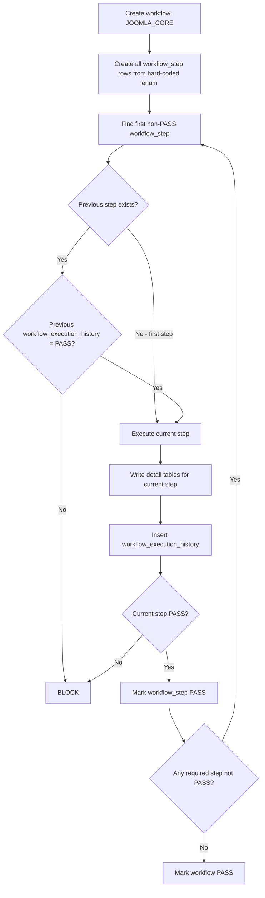
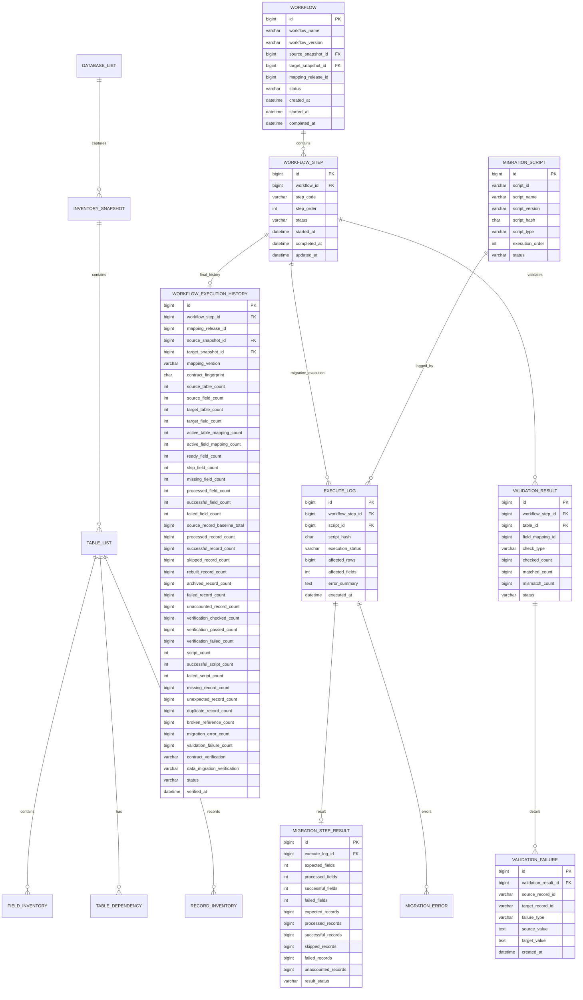
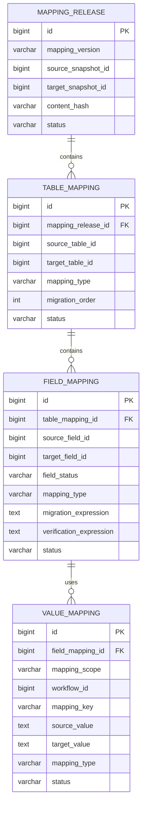

# End-to-End Database Migration Workflow Tutorial

> Controlled top-down database migration using preserved inventory detail, mapping definitions, one row per workflow step, centralized execution history, one-time migration-script execution, and validation evidence.

---

## Contents

1. [Final Architecture](#1-final-architecture)
2. [Core Responsibility](#2-core-responsibility)
3. [Hard-Coded Workflow Enum](#3-hard-coded-workflow-enum)
4. [Workflow](#4-workflow)
5. [Workflow Step](#5-workflow-step)
6. [Workflow Execution History](#6-workflow-execution-history)
7. [Inventory Detail Tables](#7-inventory-detail-tables)
8. [Mapping Tables](#8-mapping-tables)
9. [Execution and Validation Detail](#9-execution-and-validation-detail)
10. [Top-Down Step Gate](#10-top-down-step-gate)
11. [Insert / Update Flow](#11-insert--update-flow)
12. [JOOMLA_CORE Seed Example](#12-joomla_core-seed-example)
13. [ERD](#13-erd)
14. [Recommended MySQL DDL](#14-recommended-mysql-ddl)
15. [Codex Prompts Per Workflow Step](#15-codex-prompts-per-workflow-step)
16. [Final Verification Rules](#16-final-verification-rules)

---

# 1. Final Architecture

The workflow is one strict top-down flow.

`INVENTORY` and `MAPPING` are intentionally combined into one preparation step because both are produced before execution. They are still verified independently by two following verification steps.

```text
workflow_enum                       hard-coded step definition/order
        ↓
workflow                            one named migration flow, e.g. JOOMLA_CORE
        ↓
workflow_step                       one row for every step in that workflow
        ↓
workflow_execution_history          one final evidence row for every workflow_step
```

Canonical workflow:

```text
INVENTORY_MAPPING
    ↓ PASS
INVENTORY_VERIFY
    ↓ PASS
MAPPING_VERIFY
    ↓ PASS
MIGRATION
    ↓ PASS
VALIDATION_DATA
    ↓ PASS
FINAL_VERIFY
    ↓ PASS
WORKFLOW PASS
```

The first step writes both groups of definitions/details:

```text
INVENTORY_MAPPING
│
├── migration_inventory
│   ├── inventory_snapshot
│   ├── table_list
│   ├── field_inventory
│   ├── table_dependency
│   └── record_inventory
│
└── migration_mapping
    ├── mapping_release
    ├── table_mapping
    ├── field_mapping
    └── value_mapping
```

Then the two independent verification gates run:

```text
INVENTORY_VERIFY
    = verify discovered source/target inventory evidence

MAPPING_VERIFY
    = verify mapping contract against the verified inventory
```

Execution detail remains available for drill-down:

```text
migration_script
      ↓
execute_log
      ↓
migration_step_result
      ↓
migration_error
```

Validation detail remains available for drill-down:

```text
validation_result
      ↓
validation_failure
```

Complete control flow:



Core rule:

```text
A step may run only when:
1. it is the first non-PASS step by step_order;
2. its previous workflow_step has PASS history, except the first step;
3. the current workflow_step has no existing workflow_execution_history row;
4. all step-specific preconditions pass.
```

---

# 2. Core Responsibility

## `migration_inventory`

`migration_inventory` is the migration control/audit database.

```text
migration_inventory
│
├── INVENTORY DETAIL
│   ├── database_list
│   ├── inventory_snapshot
│   ├── table_list
│   ├── field_inventory
│   ├── table_dependency
│   └── record_inventory
│
├── WORKFLOW CONTROL
│   ├── workflow
│   ├── workflow_step
│   └── workflow_execution_history
│
├── EXECUTION DETAIL
│   ├── migration_script
│   ├── execute_log
│   ├── migration_step_result
│   └── migration_error
│
└── VALIDATION DETAIL
    ├── validation_result
    └── validation_failure
```

It answers:

```text
WHAT EXISTS
+ WHICH WORKFLOW/STEP IS RUNNING
+ WHAT WAS EXECUTED
+ WHAT WAS VERIFIED
+ WHAT PASSED/FAILED
```

## `migration_mapping`

`migration_mapping` stores executable mapping definitions only:

```text
migration_mapping
├── mapping_release
├── table_mapping
├── field_mapping
└── value_mapping
```

Workflow-level history is centralized in:

```text
migration_inventory.workflow_execution_history
```

---

# 3. Hard-Coded Workflow Enum

`workflow_enum` is hard-coded in source code. It is **not a database table**, therefore there is no SQL `INSERT` into an enum table.

Canonical order:

```text
10 INVENTORY_MAPPING
20 INVENTORY_VERIFY
30 MAPPING_VERIFY
40 MIGRATION
50 VALIDATION_DATA
60 FINAL_VERIFY
```

Recommended PHP enum:

```php
enum MigrationWorkflowStep: string
{
    case INVENTORY_MAPPING = 'INVENTORY_MAPPING';
    case INVENTORY_VERIFY = 'INVENTORY_VERIFY';
    case MAPPING_VERIFY = 'MAPPING_VERIFY';
    case MIGRATION = 'MIGRATION';
    case VALIDATION_DATA = 'VALIDATION_DATA';
    case FINAL_VERIFY = 'FINAL_VERIFY';

    public function order(): int
    {
        return match ($this) {
            self::INVENTORY_MAPPING => 10,
            self::INVENTORY_VERIFY => 20,
            self::MAPPING_VERIFY => 30,
            self::MIGRATION => 40,
            self::VALIDATION_DATA => 50,
            self::FINAL_VERIFY => 60,
        };
    }

    public function previous(): ?self
    {
        return match ($this) {
            self::INVENTORY_MAPPING => null,
            self::INVENTORY_VERIFY => self::INVENTORY_MAPPING,
            self::MAPPING_VERIFY => self::INVENTORY_VERIFY,
            self::MIGRATION => self::MAPPING_VERIFY,
            self::VALIDATION_DATA => self::MIGRATION,
            self::FINAL_VERIFY => self::VALIDATION_DATA,
        };
    }

    public function next(): ?self
    {
        return match ($this) {
            self::INVENTORY_MAPPING => self::INVENTORY_VERIFY,
            self::INVENTORY_VERIFY => self::MAPPING_VERIFY,
            self::MAPPING_VERIFY => self::MIGRATION,
            self::MIGRATION => self::VALIDATION_DATA,
            self::VALIDATION_DATA => self::FINAL_VERIFY,
            self::FINAL_VERIFY => null,
        };
    }
}
```

The enum answers only:

```text
What steps exist?
What is their order?
What is the previous step?
What is the next step?
```

Runtime state is stored in `workflow_step`; execution proof is stored in `workflow_execution_history`.

---

# 4. Workflow

One `workflow` row represents one complete named migration flow.

`workflow_name` identifies the migration scope.

Examples:

```text
JOOMLA_CORE
HIKASHOP
ACYMAILING
JCE
SP_PAGE_BUILDER
CUSTOM_COMPONENT_CARS
```

Recommended fields:

| Column | Type | Purpose |
|---|---|---|
| `id` | bigint UN AI PK | Workflow ID. |
| `workflow_name` | varchar(128) | Scope/name such as `JOOMLA_CORE`. |
| `workflow_version` | varchar(64) | Workflow version. |
| `source_snapshot_id` | bigint UN NULL | Filled by `INVENTORY_MAPPING`. |
| `target_snapshot_id` | bigint UN NULL | Filled by `INVENTORY_MAPPING`. |
| `mapping_release_id` | bigint UN NULL | Filled by `INVENTORY_MAPPING`. |
| `status` | varchar(16) | `PENDING/RUNNING/PASS/FAIL/LOCKED`. |
| `created_at` | datetime(6) | Created time. |
| `started_at` | datetime(6) NULL | Started time. |
| `completed_at` | datetime(6) NULL | Completed time. |

Recommended identity:

```text
UNIQUE (workflow_name, workflow_version)
```

Example:

```text
id               = 1
workflow_name    = JOOMLA_CORE
workflow_version = V1
status           = PENDING
```

---

# 5. Workflow Step

Each enum step is a separate row in `workflow_step`.

For `JOOMLA_CORE V1` there are six rows:

| step_order | step_code | Initial status |
|---:|---|---|
| 10 | `INVENTORY_MAPPING` | `PENDING` |
| 20 | `INVENTORY_VERIFY` | `PENDING` |
| 30 | `MAPPING_VERIFY` | `PENDING` |
| 40 | `MIGRATION` | `PENDING` |
| 50 | `VALIDATION_DATA` | `PENDING` |
| 60 | `FINAL_VERIFY` | `PENDING` |

Recommended fields:

| Column | Type | Purpose |
|---|---|---|
| `id` | bigint UN AI PK | Workflow-step ID. |
| `workflow_id` | bigint UN | Parent workflow. |
| `step_code` | varchar(64) | Hard-coded enum value. |
| `step_order` | int UN | Hard-coded enum order. |
| `status` | varchar(16) | `PENDING/RUNNING/PASS/FAIL/BLOCKED`. |
| `started_at` | datetime(6) NULL | Start time. |
| `completed_at` | datetime(6) NULL | Completion time. |
| `updated_at` | datetime(6) | Last update time. |

Recommended key:

```text
UNIQUE (workflow_id, step_code)
```

Current step is derived as:

```text
1. RUNNING step if one exists;
2. otherwise the lowest step_order whose status is not PASS.
```

No `previous_step`, `current_step`, or `next_step` columns are required because those values are derived from the enum and the six workflow-step rows.

---

# 6. Workflow Execution History

`workflow_execution_history` is the centralized workflow-level result/evidence table.

Every `workflow_step` produces exactly one final history row.

```text
workflow
   1
   │
   N
workflow_step
   1
   │
   0..1
workflow_execution_history
```

History references only:

```text
workflow_step_id
```

because `workflow_id`, `step_code`, and `step_order` are available through `workflow_step`.

Recommended uniqueness:

```text
UNIQUE (workflow_step_id)
```

## 6.1 Inventory and mapping evidence

Retained from the original structure:

```text
mapping_release_id
source_snapshot_id
target_snapshot_id
mapping_version
contract_fingerprint
source_table_count
source_field_count
target_table_count
target_field_count
active_table_mapping_count
active_field_mapping_count
source_record_baseline_total
contract_verification
data_migration_verification
verified_at
```

## 6.2 Field accounting

```text
ready_field_count
skip_field_count
missing_field_count
processed_field_count
successful_field_count
failed_field_count
```

## 6.3 Record accounting

```text
processed_record_count
successful_record_count
skipped_record_count
rebuilt_record_count
archived_record_count
failed_record_count
unaccounted_record_count
```

## 6.4 Verification accounting

```text
verification_checked_count
verification_passed_count
verification_failed_count
```

## 6.5 Script accounting

```text
script_count
successful_script_count
failed_script_count
```

## 6.6 Integrity/failure summary

```text
missing_record_count
unexpected_record_count
duplicate_record_count
broken_reference_count
migration_error_count
validation_failure_count
```

## 6.7 Canonical result

```text
status = PASS / FAIL
```

The next step gates on this field.

`contract_verification` and `data_migration_verification` remain step-specific supporting evidence.

Recommended columns:

| Column | Type | Purpose |
|---|---|---|
| `id` | bigint UN AI PK | History ID. |
| `workflow_step_id` | bigint UN | Exact workflow step. |
| `mapping_release_id` | bigint UN NULL | Mapping release evidence. |
| `source_snapshot_id` | bigint UN NULL | Source snapshot evidence. |
| `target_snapshot_id` | bigint UN NULL | Target snapshot evidence. |
| `mapping_version` | varchar(64) NULL | Mapping version. |
| `contract_fingerprint` | char(64) NULL | Contract fingerprint. |
| `source_table_count` | int UN | Source tables. |
| `source_field_count` | int UN | Source fields. |
| `target_table_count` | int UN | Target tables. |
| `target_field_count` | int UN | Target fields. |
| `active_table_mapping_count` | int UN | Active table mappings. |
| `active_field_mapping_count` | int UN | Active field mappings. |
| `ready_field_count` | int UN | READY fields. |
| `skip_field_count` | int UN | SKIP fields. |
| `missing_field_count` | int UN | MISSING fields. |
| `processed_field_count` | int UN | Fields processed. |
| `successful_field_count` | int UN | Successful fields. |
| `failed_field_count` | int UN | Failed fields. |
| `source_record_baseline_total` | bigint UN | Source baseline total. |
| `processed_record_count` | bigint UN | Records processed. |
| `successful_record_count` | bigint UN | Successfully accounted records. |
| `skipped_record_count` | bigint UN | Explicit skips. |
| `rebuilt_record_count` | bigint UN | Rebuilt records. |
| `archived_record_count` | bigint UN | Archived records. |
| `failed_record_count` | bigint UN | Failed records. |
| `unaccounted_record_count` | bigint UN | Unaccounted records. |
| `verification_checked_count` | bigint UN | Verification items checked. |
| `verification_passed_count` | bigint UN | Verification PASS items. |
| `verification_failed_count` | bigint UN | Verification FAIL items. |
| `script_count` | int UN | Scripts expected/used. |
| `successful_script_count` | int UN | Successful scripts. |
| `failed_script_count` | int UN | Failed scripts. |
| `missing_record_count` | bigint UN | Missing records. |
| `unexpected_record_count` | bigint UN | Unexpected records. |
| `duplicate_record_count` | bigint UN | Duplicates. |
| `broken_reference_count` | bigint UN | Broken references. |
| `migration_error_count` | bigint UN | Migration errors. |
| `validation_failure_count` | bigint UN | Validation failures. |
| `contract_verification` | varchar(16) NULL | Contract PASS/FAIL when applicable. |
| `data_migration_verification` | varchar(16) NULL | Data migration PASS/FAIL when applicable. |
| `status` | varchar(16) | Canonical `PASS/FAIL`. |
| `verified_at` | datetime(6) | Finalized time. |

---

# 7. Inventory Detail Tables

Keep all inventory evidence tables:

```text
database_list
inventory_snapshot
table_list
field_inventory
table_dependency
record_inventory
```

Responsibility:

```text
inventory detail
= exact discovered facts

workflow_execution_history
= summarized step result and reusable checkpoint
```

The history table does not replace detailed inventory evidence.

---

# 8. Mapping Tables

Keep mapping definitions:

```text
mapping_release
      ↓
table_mapping
      ↓
field_mapping
      ↓
value_mapping
```

`field_mapping.field_status` remains:

```text
READY
SKIP
MISSING
```

`INVENTORY_MAPPING` writes these definitions.

`MAPPING_VERIFY` verifies them and writes only its summary/evidence into `workflow_execution_history`.

---

# 9. Execution and Validation Detail

## Migration execution

Each migration script has a stable identity in:

```text
migration_script
```

Each actual execution is logged in:

```text
execute_log
```

A script may run only once for one migration workflow step:

```text
UNIQUE (workflow_step_id, script_id)
```

Before execution:

```sql
SELECT id
FROM migration_inventory.execute_log
WHERE workflow_step_id = :migration_step_id
  AND script_id = :script_id
LIMIT 1;
```

If any row exists:

```text
BLOCK
SCRIPT_ALREADY_EXECUTED
```

Execution totals are stored in:

```text
migration_step_result
```

Runtime failures are stored in:

```text
migration_error
```

## Data validation

Aggregate/detail validation evidence is stored in:

```text
validation_result
```

Concrete failures are stored in:

```text
validation_failure
```

The workflow-level result is summarized into the `VALIDATION_DATA` history row.

---

# 10. Top-Down Step Gate

For requested workflow step `X`:

```text
1. Load the workflow.
2. Load all workflow_step rows ordered by step_order.
3. Determine the first non-PASS step.
4. Requested workflow_step must equal that step.
5. Resolve the previous step from workflow_enum.
6. If a previous step exists, its workflow_execution_history.status must equal PASS.
7. Current workflow_step must not already have workflow_execution_history.
8. Execute only the current step.
9. Write required detail tables.
10. Insert one workflow_execution_history row.
11. Set workflow_step.status = PASS only when history.status = PASS.
12. Never execute the next step automatically.
```

Previous-step check:

```sql
SELECT
    previous_ws.id,
    previous_ws.step_code,
    previous_ws.status AS step_status,
    previous_h.status AS history_status
FROM migration_inventory.workflow_step current_ws
JOIN migration_inventory.workflow_step previous_ws
  ON previous_ws.workflow_id = current_ws.workflow_id
 AND previous_ws.step_order = :previous_step_order
LEFT JOIN migration_inventory.workflow_execution_history previous_h
  ON previous_h.workflow_step_id = previous_ws.id
WHERE current_ws.id = :current_workflow_step_id;
```

Required before continuing:

```text
previous_ws.status = PASS
previous_h.status  = PASS
```

Current-step duplicate guard:

```sql
SELECT id
FROM migration_inventory.workflow_execution_history
WHERE workflow_step_id = :current_workflow_step_id
LIMIT 1;
```

If a row exists:

```text
BLOCK
STEP_ALREADY_EXECUTED
```

---

# 11. Insert / Update Flow

## Step 1 — `INVENTORY_MAPPING`

Check that this is the first allowed step.

Create/update inventory evidence:

```text
migration_inventory.database_list
migration_inventory.inventory_snapshot
migration_inventory.table_list
migration_inventory.field_inventory
migration_inventory.table_dependency
migration_inventory.record_inventory
```

Create mapping definitions:

```text
migration_mapping.mapping_release
migration_mapping.table_mapping
migration_mapping.field_mapping
migration_mapping.value_mapping
```

Update the parent `workflow` with:

```text
source_snapshot_id
target_snapshot_id
mapping_release_id
```

Then insert exactly one:

```text
workflow_execution_history
```

for the `INVENTORY_MAPPING` workflow-step row.

This history row records preparation counts and fingerprints, but **does not replace either verification step**.

## Step 2 — `INVENTORY_VERIFY`

Require:

```text
INVENTORY_MAPPING history = PASS
```

Verify actual source/target inventory against the captured inventory detail.

Check at minimum:

```text
source tables
source fields
target tables
target fields
record baselines
dependencies
snapshot hashes
missing inventory objects
```

Insert one `workflow_execution_history` row for `INVENTORY_VERIFY`.

Do not modify mapping rules in this step.

## Step 3 — `MAPPING_VERIFY`

Require:

```text
INVENTORY_VERIFY history = PASS
```

Verify the mapping release against the verified snapshots.

Check at minimum:

```text
active table mapping coverage
active field mapping coverage
READY / SKIP / MISSING classification
unmapped definitions
ambiguous definitions
missing migration rules
missing verification rules
contract fingerprint
```

Insert one `workflow_execution_history` row for `MAPPING_VERIFY`.

Do not migrate application data in this step.

## Step 4 — `MIGRATION`

Require:

```text
MAPPING_VERIFY history = PASS
```

For every migration script:

```text
migration_script
      ↓
precheck execute_log
      ↓
execute script once
      ↓
execute_log
      ↓
migration_step_result
      ↓
migration_error when required
```

After all required scripts are accounted, insert one `workflow_execution_history` row for `MIGRATION`.

## Step 5 — `VALIDATION_DATA`

Require:

```text
MIGRATION history = PASS
```

Verify migrated target data and write:

```text
validation_result
validation_failure
```

Then insert one `workflow_execution_history` row for `VALIDATION_DATA`.

Do not change migrated data in this step.

## Step 6 — `FINAL_VERIFY`

Require:

```text
VALIDATION_DATA history = PASS
```

Read all previous workflow steps, history rows, execution details, and validation details.

Confirm all required counts and failure counters are fully accounted.

Insert one `workflow_execution_history` row for `FINAL_VERIFY`.

If PASS:

```text
workflow.status = PASS
workflow.completed_at = current time
```

---

# 12. JOOMLA_CORE Seed Example

Create the workflow:

```sql
INSERT INTO migration_inventory.workflow (
    workflow_name,
    workflow_version,
    status
) VALUES (
    'JOOMLA_CORE',
    'V1',
    'PENDING'
);

SET @workflow_id = LAST_INSERT_ID();
```

Materialize the hard-coded enum into six workflow-step rows:

```sql
INSERT INTO migration_inventory.workflow_step (
    workflow_id,
    step_code,
    step_order,
    status
) VALUES
    (@workflow_id, 'INVENTORY_MAPPING', 10, 'PENDING'),
    (@workflow_id, 'INVENTORY_VERIFY',  20, 'PENDING'),
    (@workflow_id, 'MAPPING_VERIFY',    30, 'PENDING'),
    (@workflow_id, 'MIGRATION',         40, 'PENDING'),
    (@workflow_id, 'VALIDATION_DATA',   50, 'PENDING'),
    (@workflow_id, 'FINAL_VERIFY',      60, 'PENDING');
```

Check current allowed step:

```sql
SELECT id, workflow_id, step_code, step_order, status
FROM migration_inventory.workflow_step
WHERE workflow_id = @workflow_id
  AND status <> 'PASS'
ORDER BY step_order
LIMIT 1;
```

Initially:

```text
CURRENT STEP = INVENTORY_MAPPING
```

---

# 13. ERD

## `migration_inventory`



## `migration_mapping`



---

# 14. Recommended MySQL DDL

The following DDL covers workflow-control structures. Existing inventory/mapping/detail DDL remains unchanged except where it references `workflow_step_id`.

```sql
CREATE TABLE migration_inventory.workflow (
    id BIGINT UNSIGNED NOT NULL AUTO_INCREMENT,
    workflow_name VARCHAR(128) NOT NULL,
    workflow_version VARCHAR(64) NOT NULL,
    source_snapshot_id BIGINT UNSIGNED NULL,
    target_snapshot_id BIGINT UNSIGNED NULL,
    mapping_release_id BIGINT UNSIGNED NULL,
    status VARCHAR(16) NOT NULL DEFAULT 'PENDING',
    created_at DATETIME(6) NOT NULL DEFAULT CURRENT_TIMESTAMP(6),
    started_at DATETIME(6) NULL,
    completed_at DATETIME(6) NULL,

    PRIMARY KEY (id),
    UNIQUE KEY uk_workflow_name_version (workflow_name, workflow_version),
    CHECK (status IN ('PENDING','RUNNING','PASS','FAIL','LOCKED'))
);

CREATE TABLE migration_inventory.workflow_step (
    id BIGINT UNSIGNED NOT NULL AUTO_INCREMENT,
    workflow_id BIGINT UNSIGNED NOT NULL,
    step_code VARCHAR(64) NOT NULL,
    step_order INT UNSIGNED NOT NULL,
    status VARCHAR(16) NOT NULL DEFAULT 'PENDING',
    started_at DATETIME(6) NULL,
    completed_at DATETIME(6) NULL,
    updated_at DATETIME(6) NOT NULL DEFAULT CURRENT_TIMESTAMP(6)
        ON UPDATE CURRENT_TIMESTAMP(6),

    PRIMARY KEY (id),
    UNIQUE KEY uk_workflow_step (workflow_id, step_code),
    UNIQUE KEY uk_workflow_step_order (workflow_id, step_order),
    CHECK (status IN ('PENDING','RUNNING','PASS','FAIL','BLOCKED'))
);

CREATE TABLE migration_inventory.workflow_execution_history (
    id BIGINT UNSIGNED NOT NULL AUTO_INCREMENT,
    workflow_step_id BIGINT UNSIGNED NOT NULL,

    mapping_release_id BIGINT UNSIGNED NULL,
    source_snapshot_id BIGINT UNSIGNED NULL,
    target_snapshot_id BIGINT UNSIGNED NULL,
    mapping_version VARCHAR(64) NULL,
    contract_fingerprint CHAR(64) NULL,

    source_table_count INT UNSIGNED NOT NULL DEFAULT 0,
    source_field_count INT UNSIGNED NOT NULL DEFAULT 0,
    target_table_count INT UNSIGNED NOT NULL DEFAULT 0,
    target_field_count INT UNSIGNED NOT NULL DEFAULT 0,
    active_table_mapping_count INT UNSIGNED NOT NULL DEFAULT 0,
    active_field_mapping_count INT UNSIGNED NOT NULL DEFAULT 0,

    ready_field_count INT UNSIGNED NOT NULL DEFAULT 0,
    skip_field_count INT UNSIGNED NOT NULL DEFAULT 0,
    missing_field_count INT UNSIGNED NOT NULL DEFAULT 0,
    processed_field_count INT UNSIGNED NOT NULL DEFAULT 0,
    successful_field_count INT UNSIGNED NOT NULL DEFAULT 0,
    failed_field_count INT UNSIGNED NOT NULL DEFAULT 0,

    source_record_baseline_total BIGINT UNSIGNED NOT NULL DEFAULT 0,
    processed_record_count BIGINT UNSIGNED NOT NULL DEFAULT 0,
    successful_record_count BIGINT UNSIGNED NOT NULL DEFAULT 0,
    skipped_record_count BIGINT UNSIGNED NOT NULL DEFAULT 0,
    rebuilt_record_count BIGINT UNSIGNED NOT NULL DEFAULT 0,
    archived_record_count BIGINT UNSIGNED NOT NULL DEFAULT 0,
    failed_record_count BIGINT UNSIGNED NOT NULL DEFAULT 0,
    unaccounted_record_count BIGINT UNSIGNED NOT NULL DEFAULT 0,

    verification_checked_count BIGINT UNSIGNED NOT NULL DEFAULT 0,
    verification_passed_count BIGINT UNSIGNED NOT NULL DEFAULT 0,
    verification_failed_count BIGINT UNSIGNED NOT NULL DEFAULT 0,

    script_count INT UNSIGNED NOT NULL DEFAULT 0,
    successful_script_count INT UNSIGNED NOT NULL DEFAULT 0,
    failed_script_count INT UNSIGNED NOT NULL DEFAULT 0,

    missing_record_count BIGINT UNSIGNED NOT NULL DEFAULT 0,
    unexpected_record_count BIGINT UNSIGNED NOT NULL DEFAULT 0,
    duplicate_record_count BIGINT UNSIGNED NOT NULL DEFAULT 0,
    broken_reference_count BIGINT UNSIGNED NOT NULL DEFAULT 0,
    migration_error_count BIGINT UNSIGNED NOT NULL DEFAULT 0,
    validation_failure_count BIGINT UNSIGNED NOT NULL DEFAULT 0,

    contract_verification VARCHAR(16) NULL,
    data_migration_verification VARCHAR(16) NULL,
    status VARCHAR(16) NOT NULL,
    verified_at DATETIME(6) NOT NULL DEFAULT CURRENT_TIMESTAMP(6),

    PRIMARY KEY (id),
    UNIQUE KEY uk_workflow_execution_history_step (workflow_step_id),
    CHECK (status IN ('PASS','FAIL')),
    CHECK (contract_verification IS NULL OR contract_verification IN ('PASS','FAIL')),
    CHECK (data_migration_verification IS NULL OR data_migration_verification IN ('PASS','FAIL'))
);
```

One-time migration-script rule:

```sql
CREATE UNIQUE INDEX uk_execute_log_step_script
ON migration_inventory.execute_log (workflow_step_id, script_id);
```

---

# 15. Codex Prompts Per Workflow Step

## Required output convention for every step

Every Codex prompt below must create **exactly two files** for the requested workflow step:

```text
1. <order>-<step-code>-plan.md
2. <order>-<step-code>.sql
```

Example:

```text
10-inventory-mapping-plan.md
10-inventory-mapping.sql
```

The plan file must include a complete implementation/checklist for the step so Codex can account for **100% of the defined step scope** before generating the SQL file.

The SQL file must:

```text
- be runnable MySQL code;
- be ordered exactly as it should be executed;
- include SQL comments before every logical block;
- include prechecks and blocking checks;
- write required detail evidence;
- write exactly one workflow_execution_history row for the current workflow_step;
- mark the current workflow_step PASS only when all success criteria are satisfied;
- never execute or mark the next workflow step.
```

### Prompt — `INVENTORY_MAPPING`

```text
# Goal
Build the INVENTORY_MAPPING step for the selected migration workflow. Inventory 100% of the defined source/target schema scope and materialize the reviewed table/field/value mapping contract into migration_inventory and migration_mapping without migrating application data.

# Success criteria
- Confirm the requested workflow_step is INVENTORY_MAPPING and is the first allowed non-PASS step.
- Create/reuse the correct source and target inventory snapshots.
- Account for every in-scope source/target table and physical field in the inventory detail tables.
- Capture required record baselines and known dependencies.
- Create one mapping_release bound to the exact source/target snapshots.
- Materialize all reviewed table_mapping, field_mapping, and required STATIC value_mapping rows.
- Preserve READY / SKIP / MISSING field classification exactly as defined by the mapping contract.
- Update workflow.source_snapshot_id, target_snapshot_id, and mapping_release_id.
- Produce one final workflow_execution_history row for this workflow_step with complete preparation counts/fingerprints.
- No application migration data is written.

# Constraints
- Do not invent tables, fields, dependencies, mapping rules, values, or counts.
- Use actual database metadata and the approved migration documents as evidence.
- Do not silently drop any in-scope source table or field.
- Do not run INVENTORY_VERIFY, MAPPING_VERIFY, MIGRATION, VALIDATION_DATA, or FINAL_VERIFY.
- Do not overwrite an existing workflow_execution_history row for this workflow_step.
- Keep existing migration logic and mapping decisions unchanged.
- SQL must stop/block when workflow order or required identity checks fail.

# Output
Create exactly two files:
1. `10-inventory-mapping-plan.md` — implementation plan, source/evidence list, ordered tasks, 100%-scope checklist, expected counts, failure/blocking conditions, and completion checklist.
2. `10-inventory-mapping.sql` — copy/paste runnable MySQL with numbered step-by-step comments, workflow prechecks, inventory inserts, mapping inserts, workflow updates, accounting queries, PASS/FAIL decision, history insert, and current workflow_step update.
Do not create files for later workflow steps.
```

### Prompt — `INVENTORY_VERIFY`

```text
# Goal
Build the INVENTORY_VERIFY step that independently proves the inventory created by INVENTORY_MAPPING matches the actual selected source and target databases and is complete enough for mapping verification.

# Success criteria
- Confirm INVENTORY_MAPPING has workflow_execution_history.status = PASS.
- Confirm the requested workflow_step is the current first non-PASS step and equals INVENTORY_VERIFY.
- Re-check source/target snapshot identity and schema evidence.
- Verify all in-scope tables and physical fields are represented in inventory detail.
- Verify record baselines and required dependency inventory are accounted.
- Produce explicit missing/duplicate/unresolved counts.
- PASS only when the inventory success criteria have zero unresolved failures.
- Insert exactly one workflow_execution_history row for INVENTORY_VERIFY with verification counts.

# Constraints
- Read inventory detail; do not change mapping definitions or migrate application data.
- Do not fabricate expected counts.
- Do not treat summary history as a replacement for table_list/field_inventory/table_dependency/record_inventory evidence.
- Do not run MAPPING_VERIFY or any later step.
- Do not overwrite existing history.
- SQL must block if the previous step is not proven PASS.

# Output
Create exactly two files:
1. `20-inventory-verify-plan.md` — verification plan, evidence matrix, ordered checks, 100%-scope checklist, PASS/FAIL rules, and expected zero-failure conditions.
2. `20-inventory-verify.sql` — copy/paste runnable MySQL with numbered comments, previous-step gate, inventory reconciliation queries, failure counters, PASS/FAIL decision, history insert, and workflow_step update.
Do not create files for later workflow steps.
```

### Prompt — `MAPPING_VERIFY`

```text
# Goal
Build the MAPPING_VERIFY step that proves the mapping_release produced by INVENTORY_MAPPING completely and unambiguously covers the inventory already proven by INVENTORY_VERIFY.

# Success criteria
- Confirm INVENTORY_VERIFY history = PASS.
- Confirm MAPPING_VERIFY is the current first non-PASS workflow step.
- Verify the mapping_release references the expected source/target snapshots.
- Verify all required table mappings are explicit and unique.
- Verify all required field mappings are explicit and unique.
- Verify READY / SKIP / MISSING classifications are valid.
- Verify required migration and verification expressions/rules exist.
- Verify unmapped, ambiguous, duplicate, and missing-rule counts are zero.
- Recompute/confirm contract_fingerprint or approved content hash.
- Insert exactly one workflow_execution_history row with mapping verification evidence and contract_verification = PASS/FAIL.

# Constraints
- Do not alter mapping decisions to make verification pass.
- Do not migrate application data.
- Do not run MIGRATION or any later step.
- Do not overwrite current-step history.
- Use inventory and mapping tables as evidence; do not infer missing mappings silently.
- SQL must block when previous-step history is not PASS.

# Output
Create exactly two files:
1. `30-mapping-verify-plan.md` — mapping verification plan, coverage formulas, ordered checks, 100%-scope checklist, zero-tolerance failure list, and PASS gate.
2. `30-mapping-verify.sql` — copy/paste runnable MySQL with numbered comments, workflow gate, snapshot/release checks, table/field coverage checks, READY/SKIP/MISSING checks, fingerprint check, PASS/FAIL decision, history insert, and workflow_step update.
Do not create files for later workflow steps.
```

### Prompt — `MIGRATION`

```text
# Goal
Build the MIGRATION step that generates and executes the required MySQL migration scripts from the verified mapping contract exactly once per script, records execution evidence, and fully accounts for migrated fields and records.

# Success criteria
- Confirm MAPPING_VERIFY history = PASS.
- Confirm MIGRATION is the current first non-PASS workflow step.
- Determine all required migration scripts and their stable script_id, version/hash, execution_order, and dependencies.
- Before each script, block if execute_log already contains the same workflow_step_id + script_id.
- Every executed script writes execute_log.
- Every script writes migration_step_result with field and record accounting.
- Every runtime error writes migration_error.
- All required scripts are accounted once.
- failed_script_count = 0, failed_field_count = 0, failed_record_count = 0, unaccounted_record_count = 0, migration_error_count = 0 before PASS.
- Insert exactly one workflow_execution_history row for MIGRATION with data_migration_verification = PASS/FAIL.

# Constraints
- Do not rerun a script once any execute_log row exists for the same workflow_step_id + script_id.
- Do not change the verified mapping contract while executing migration.
- Respect mapping order, dependencies, ID/value mappings, transforms, rebuild/archive/skip rules exactly as approved.
- Do not run VALIDATION_DATA or FINAL_VERIFY.
- Do not overwrite existing history or execution logs.
- SQL must be deterministic and must expose all failure conditions instead of silently continuing.

# Output
Create exactly two files:
1. `40-migration-plan.md` — complete script inventory, dependency/order plan, per-script checklist, accounting formulas, one-time execution guards, rollback/error notes where already required by existing logic, and 100%-scope completion checklist.
2. `40-migration.sql` — copy/paste runnable MySQL with numbered comments, previous-step gate, current-step duplicate guard, per-script one-time execute_log checks, migration SQL blocks in dependency order, migration_step_result/error logging, aggregate accounting, history insert, and workflow_step update.
Do not create files for later workflow steps.
```

### Prompt — `VALIDATION_DATA`

```text
# Goal
Build the VALIDATION_DATA step that verifies the actual migrated target data against the verified inventory/mapping contract and migration evidence without changing migrated business data.

# Success criteria
- Confirm MIGRATION history = PASS.
- Confirm VALIDATION_DATA is the current first non-PASS workflow step.
- Verify required record counts and identity/accounting expectations.
- Verify required mapped field values and structured transformations.
- Verify runtime ID/value mapping outcomes where applicable.
- Verify missing, unexpected, duplicate, and broken-reference counts.
- Write validation_result for every required validation check and validation_failure for every concrete mismatch.
- PASS only when verification_failed_count = 0, missing_record_count = 0, unexpected_record_count = 0, duplicate_record_count = 0, broken_reference_count = 0, and validation_failure_count = 0.
- Insert exactly one workflow_execution_history row for VALIDATION_DATA.

# Constraints
- Verification only: do not repair or mutate application data in this step.
- Do not reinterpret or change mapping rules.
- Do not run FINAL_VERIFY.
- Do not hide mismatches inside free-text only; concrete failures must be queryable.
- Do not overwrite existing history or validation evidence.
- SQL must block when MIGRATION is not proven PASS.

# Output
Create exactly two files:
1. `50-validation-data-plan.md` — validation matrix, ordered checks, table/field/record/reference coverage checklist, PASS/FAIL formulas, and 100%-scope completion checklist.
2. `50-validation-data.sql` — copy/paste runnable MySQL with numbered comments, previous-step gate, validation queries, validation_result/failure inserts, aggregate failure counters, PASS/FAIL decision, history insert, and workflow_step update.
Do not create FINAL_VERIFY files.
```

### Prompt — `FINAL_VERIFY`

```text
# Goal
Build the FINAL_VERIFY step that proves the complete workflow chain executed in order, all prior required steps are PASS, all required data is accounted, and no unresolved migration or validation failure remains before marking the workflow PASS.

# Success criteria
- Confirm VALIDATION_DATA history = PASS.
- Confirm FINAL_VERIFY is the current first non-PASS workflow step.
- Confirm exactly one PASS history row exists for every required previous workflow_step.
- Confirm workflow source_snapshot_id, target_snapshot_id, and mapping_release_id match the evidence used by prior steps.
- Confirm all required migration scripts have exactly one execute_log row for the MIGRATION workflow_step.
- Confirm all aggregate field/record/script counts reconcile with detail evidence.
- Confirm failed/unaccounted/missing/unexpected/duplicate/broken-reference/migration-error/validation-failure counts are zero where required.
- Insert exactly one FINAL_VERIFY workflow_execution_history row.
- Set FINAL_VERIFY workflow_step.status = PASS and workflow.status = PASS only when every gate passes.

# Constraints
- Do not mutate migrated business data.
- Do not repair earlier steps or alter their history.
- Do not mark PASS based only on workflow_step.status; verify workflow_execution_history and detail evidence.
- Do not create new migration/mapping behavior.
- Do not overwrite any earlier evidence.
- SQL must fail/block clearly if any previous gate or reconciliation fails.

# Output
Create exactly two files:
1. `60-final-verify-plan.md` — end-to-end reconciliation plan, history-chain checklist, detail-to-summary reconciliation checklist, zero-failure gate, and final 100%-scope accounting checklist.
2. `60-final-verify.sql` — copy/paste runnable MySQL with numbered comments, previous-step gate, complete workflow history checks, detail reconciliation, final zero-failure assertions, FINAL_VERIFY history insert, workflow_step PASS update, and workflow PASS update.
Do not generate any additional workflow step.
```

---

# 16. Final Verification Rules

## `INVENTORY_VERIFY` PASS

At minimum:

```text
actual source tables accounted       = 100%
actual source fields accounted       = 100%
actual target tables accounted       = 100%
actual target fields accounted       = 100%
required inventory dependencies      = accounted
missing/duplicate inventory evidence = 0
status                               = PASS
```

## `MAPPING_VERIFY` PASS

At minimum:

```text
required table mappings             = 100% explicit
required field mappings             = 100% explicit
invalid READY/SKIP/MISSING          = 0
unmapped mappings                   = 0
ambiguous mappings                  = 0
missing migration rules             = 0
missing verification rules          = 0
contract_verification               = PASS
status                              = PASS
```

## `MIGRATION` PASS

At minimum:

```text
failed_script_count              = 0
failed_field_count               = 0
failed_record_count              = 0
unaccounted_record_count         = 0
migration_error_count            = 0
data_migration_verification      = PASS
status                           = PASS
```

## `VALIDATION_DATA` PASS

At minimum:

```text
verification_failed_count        = 0
missing_record_count             = 0
unexpected_record_count          = 0
duplicate_record_count           = 0
broken_reference_count           = 0
validation_failure_count         = 0
status                           = PASS
```

## `FINAL_VERIFY` PASS

Required previous history:

```text
INVENTORY_MAPPING.status = PASS
INVENTORY_VERIFY.status  = PASS
MAPPING_VERIFY.status    = PASS
MIGRATION.status         = PASS
VALIDATION_DATA.status   = PASS
```

Then reconcile history summaries with inventory, mapping, execute-log, migration-result, and validation detail evidence.

Only then:

```text
FINAL_VERIFY.status = PASS
workflow.status     = PASS
```

---

# Final Design Check

```text
workflow_enum
    = 6 hard-coded top-down steps

workflow
    = named migration flow, e.g. JOOMLA_CORE

workflow_step
    = one immutable step identity row per enum step per workflow

workflow_execution_history
    = exactly one final result/evidence row per workflow_step

inventory detail tables
    = retained exactly for detailed source/target evidence

mapping tables
    = retained exactly for executable mapping definitions

execute_log / migration_step_result / migration_error
    = retained for migration execution detail

validation_result / validation_failure
    = retained for data-validation detail
```

No additional migration feature or mapping behavior is introduced by this revision. The change only combines preparation into `INVENTORY_MAPPING`, keeps two independent verification gates, renames `VALIDATION` to `VALIDATION_DATA`, and standardizes Codex artifact generation for every workflow step.
