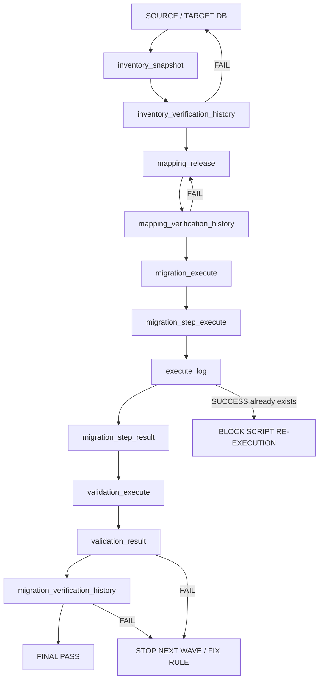
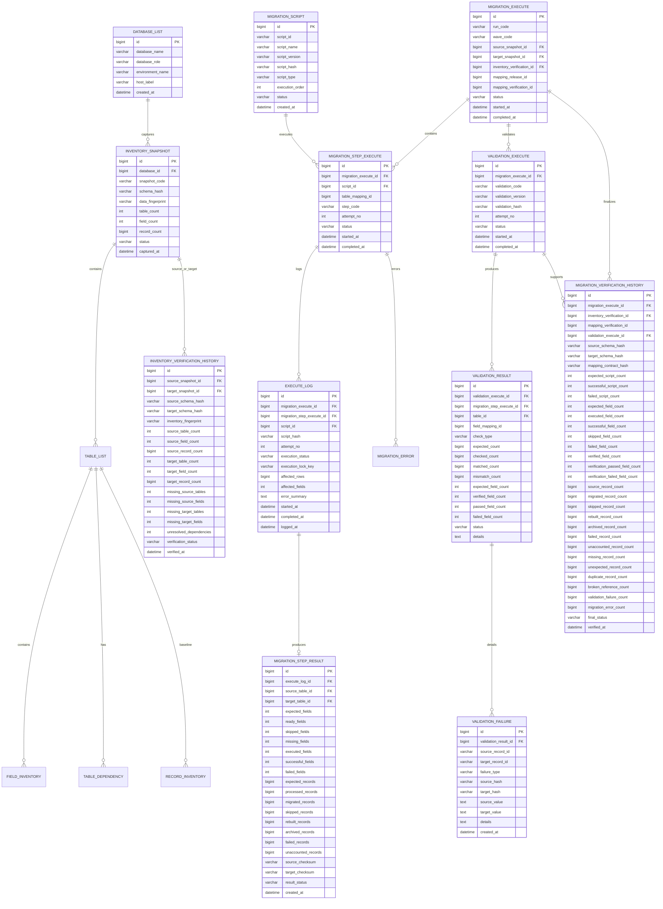
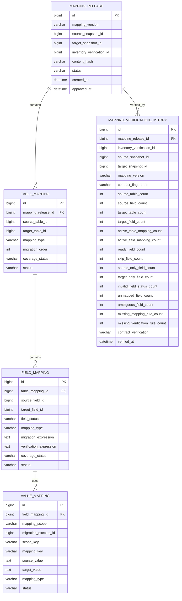

# End-to-End Database Migration Workflow Tutorial

> Build a controlled migration chain in which every later wave reuses verified evidence from the previous stages, every script has a stable identity, every execution attempt is logged, and a script that has already completed successfully cannot be executed again in the same migration run.

---

## Contents

1. [Canonical Migration Flow](#1-canonical-migration-flow)
2. [Core Databases](#2-core-databases)
3. [Chain-of-Trust Rules](#3-chain-of-trust-rules)
4. [`migration_inventory` ERD](#4-migration_inventory-erd)
5. [`migration_mapping` ERD](#5-migration_mapping-erd)
6. [History and Reuse Contract](#6-history-and-reuse-contract)
7. [Script Identity and One-Time Execution](#7-script-identity-and-one-time-execution)
8. [Recommended MySQL DDL](#8-recommended-mysql-ddl)
9. [Pre-Run Gates](#9-pre-run-gates)
10. [Wave Reuse Rules](#10-wave-reuse-rules)
11. [Final Accounting Gate](#11-final-accounting-gate)

---

# 1. Canonical Migration Flow

The canonical flow is:

```text
SOURCE / TARGET DB
        ↓
inventory_snapshot
        ↓
inventory_verification_history
        ↓
mapping_release
        ↓
mapping_verification_history
        ↓
migration_execute
        ↓
migration_step_execute
        ↓
execute_log
        ↓
migration_step_result
        ↓
validation_execute
        ↓
validation_result
        ↓
migration_verification_history
        ↓
FINAL PASS
```



The governing rule is:

```text
NO VERIFIED PREVIOUS STAGE
        ↓
NO NEXT STAGE
```

Every stage must keep enough immutable evidence so the next wave can verify the exact inputs, counts, hashes, script identities, and PASS result before reusing them.

---

# 2. Core Databases

The existing four-database model remains:

| Role | Database | Purpose |
|---|---|---|
| Application source | Source DB | Legacy/current business data. |
| Application target | Target DB | Destination business data. |
| Migration control | `migration_inventory` | Inventory, execution, history, verification, audit evidence. |
| Migration control | `migration_mapping` | Approved mapping contract and static/runtime value maps. |

Recommended physical structure:

```text
migration_inventory
├── database_list
├── inventory_snapshot
├── table_list
├── field_inventory
├── table_dependency
├── record_inventory
│
├── inventory_verification_history
│
├── migration_execute
├── migration_script
├── migration_step_execute
├── execute_log
├── migration_step_result
├── migration_error
│
├── validation_execute
├── validation_result
├── validation_failure
│
└── migration_verification_history

migration_mapping
├── mapping_release
├── table_mapping
├── field_mapping
├── value_mapping
└── mapping_verification_history
```

`history` tables are append-only audit checkpoints. They are not scratch tables and must not be overwritten by later waves.

---

# 3. Chain-of-Trust Rules

## 3.1 Every downstream object references upstream evidence

Example:

```text
inventory_verification_history.id
        ↓
mapping_release.inventory_verification_id
        ↓
mapping_verification_history.id
        ↓
migration_execute.mapping_verification_id
        ↓
migration_step_execute.migration_execute_id
        ↓
execute_log.migration_step_execute_id
        ↓
migration_step_result.execute_log_id
        ↓
validation_execute.migration_execute_id
        ↓
validation_result.validation_execute_id
        ↓
migration_verification_history.validation_execute_id
```

A final PASS can therefore be traced back to the exact source/target snapshots and contract that allowed the run.

## 3.2 Hashes make history reusable safely

History is reusable only when hashes still match.

Store and compare:

```text
source_schema_hash
target_schema_hash
inventory_fingerprint
mapping_contract_hash
script_hash
validation_hash
```

If a current object hash differs from the historical PASS hash:

```text
HISTORY REUSE = BLOCKED
```

A new verification/history record must be created.

## 3.3 History tables are append-only

Never replace an old PASS/FAIL row.

```text
old verification
    = historical evidence

new verification
    = new row
```

## 3.4 Counts are stored as evidence, not recalculated from memory

Each checkpoint should persist summary counts required by later waves.

At minimum keep:

```text
table counts
field counts
READY / SKIP / MISSING field counts
record baseline counts
executed fields
successful fields
failed fields
processed records
migrated records
skipped records
failed records
verified fields
passed verification fields
failed verification fields
missing records
unexpected records
duplicate records
broken references
validation failures
migration errors
```

---

# 4. `migration_inventory` ERD



---

# 5. `migration_mapping` ERD



---

# 6. History and Reuse Contract

## `inventory_verification_history`

Purpose:

```text
prove that source + target inventory were complete
and bind the exact schema/data baseline reused downstream
```

PASS requires:

```text
missing_source_tables  = 0
missing_source_fields  = 0
missing_target_tables  = 0
missing_target_fields  = 0
unresolved_dependencies = 0
verification_status    = PASS
```

## `mapping_verification_history`

Purpose:

```text
prove that a mapping release is complete and executable
against the exact verified inventory pair
```

Required summary evidence:

```text
source/target table counts
source/target field counts
active table mappings
active field mappings
READY / SKIP
source-only / target-only
invalid status count
unmapped count
ambiguous count
missing mapping rule count
missing verification rule count
contract fingerprint
```

PASS requires all invalid/unresolved counts = `0`.

## `migration_step_result`

Purpose:

```text
persist actual execution accounting for one successfully or unsuccessfully executed script attempt
```

Required field accounting:

```text
expected_fields
ready_fields
skipped_fields
missing_fields
executed_fields
successful_fields
failed_fields
```

Required record accounting:

```text
expected_records
processed_records
migrated_records
skipped_records
rebuilt_records
archived_records
failed_records
unaccounted_records
```

## `migration_verification_history`

Purpose:

```text
final reusable checkpoint for later waves
```

It must contain enough aggregate evidence so the next wave can reject stale, incomplete, or failed prerequisites without reinterpreting free-text logs.

---

# 7. Script Identity and One-Time Execution

## 7.1 Every script has a stable ID

Every executable migration script must first exist in:

```text
migration_script
```

Example:

```text
script_id      = JCORE-G2-CATEGORIES-001
script_name    = migrate_categories.sql
script_version = 1.0.0
script_hash    = SHA256(file contents)
script_type    = MIGRATION
```

`script_id` is the canonical identity. File name alone is not enough.

## 7.2 Every attempt writes `execute_log`

Before execution:

```text
create migration_step_execute
        ↓
insert execute_log RUNNING
        ↓
execute script
        ↓
update execute_log SUCCESS or FAILED
        ↓
write migration_step_result
```

No execution is allowed without an `execute_log` row.

## 7.3 A successful script cannot run twice in the same run/wave

Execution lock key:

```text
< migration_execute_id >:< script_id >
```

Example:

```text
900:JCORE-G2-CATEGORIES-001
```

Database rule:

```text
For one migration_execute_id + script_id:
there may be many FAILED attempts,
but at most one SUCCESS.
```

Pre-run guard:

```sql
SELECT id
FROM migration_inventory.execute_log
WHERE migration_execute_id = :migration_execute_id
  AND script_id = :script_id
  AND execution_status = 'SUCCESS'
LIMIT 1;
```

If a row exists:

```text
SCRIPT ALREADY EXECUTED SUCCESSFULLY
→ BLOCK
→ DO NOT RUN AGAIN
```

## 7.4 Script content changes invalidate reuse

Before running or reusing history:

```text
migration_script.script_hash
=
current script SHA-256
```

If not:

```text
SCRIPT VERSION/HASH CHANGED
→ historical execution cannot authorize reuse
→ create a new script_id or script_version according to release policy
```

---

# 8. Recommended MySQL DDL

The following DDL shows the new history-chain tables and one-time execution lock. Existing `database_list`, `table_list`, `field_inventory`, `table_dependency`, `table_mapping`, `field_mapping`, and `value_mapping` remain part of the model.

```sql
CREATE TABLE migration_inventory.inventory_verification_history (
    id BIGINT UNSIGNED AUTO_INCREMENT PRIMARY KEY,
    source_snapshot_id BIGINT UNSIGNED NOT NULL,
    target_snapshot_id BIGINT UNSIGNED NOT NULL,
    source_schema_hash CHAR(64) NOT NULL,
    target_schema_hash CHAR(64) NOT NULL,
    inventory_fingerprint CHAR(64) NOT NULL,
    source_table_count INT UNSIGNED NOT NULL,
    source_field_count INT UNSIGNED NOT NULL,
    source_record_count BIGINT UNSIGNED NOT NULL,
    target_table_count INT UNSIGNED NOT NULL,
    target_field_count INT UNSIGNED NOT NULL,
    target_record_count BIGINT UNSIGNED NOT NULL,
    missing_source_tables INT UNSIGNED NOT NULL DEFAULT 0,
    missing_source_fields INT UNSIGNED NOT NULL DEFAULT 0,
    missing_target_tables INT UNSIGNED NOT NULL DEFAULT 0,
    missing_target_fields INT UNSIGNED NOT NULL DEFAULT 0,
    unresolved_dependencies INT UNSIGNED NOT NULL DEFAULT 0,
    verification_status VARCHAR(16) NOT NULL,
    verified_at DATETIME(6) NOT NULL DEFAULT CURRENT_TIMESTAMP(6),
    CHECK (verification_status IN ('PASS','FAIL'))
);

CREATE TABLE migration_inventory.migration_script (
    id BIGINT UNSIGNED AUTO_INCREMENT PRIMARY KEY,
    script_id VARCHAR(128) NOT NULL,
    script_name VARCHAR(255) NOT NULL,
    script_version VARCHAR(64) NOT NULL,
    script_hash CHAR(64) NOT NULL,
    script_type VARCHAR(32) NOT NULL,
    execution_order INT UNSIGNED NOT NULL,
    status VARCHAR(16) NOT NULL DEFAULT 'ACTIVE',
    created_at DATETIME(6) NOT NULL DEFAULT CURRENT_TIMESTAMP(6),
    UNIQUE KEY uk_migration_script_id (script_id),
    UNIQUE KEY uk_migration_script_hash_version (script_id, script_version, script_hash)
);

CREATE TABLE migration_inventory.execute_log (
    id BIGINT UNSIGNED AUTO_INCREMENT PRIMARY KEY,
    migration_execute_id BIGINT UNSIGNED NOT NULL,
    migration_step_execute_id BIGINT UNSIGNED NOT NULL,
    script_id BIGINT UNSIGNED NOT NULL,
    script_hash CHAR(64) NOT NULL,
    attempt_no INT UNSIGNED NOT NULL,
    execution_status VARCHAR(16) NOT NULL,
    execution_lock_key VARCHAR(255) NOT NULL,
    affected_rows BIGINT UNSIGNED NOT NULL DEFAULT 0,
    affected_fields INT UNSIGNED NOT NULL DEFAULT 0,
    error_summary LONGTEXT NULL,
    started_at DATETIME(6) NOT NULL,
    completed_at DATETIME(6) NULL,
    logged_at DATETIME(6) NOT NULL DEFAULT CURRENT_TIMESTAMP(6),

    UNIQUE KEY uk_execute_attempt
        (migration_execute_id, script_id, attempt_no),
    KEY ix_execute_lock
        (migration_execute_id, script_id, execution_status),

    CHECK (execution_status IN ('RUNNING','SUCCESS','FAILED','BLOCKED'))
);
```

MySQL does not support a partial unique index such as “unique only where status = SUCCESS”. Enforce the one-success rule with a generated column:

```sql
ALTER TABLE migration_inventory.execute_log
ADD COLUMN success_lock VARCHAR(255)
GENERATED ALWAYS AS (
    CASE
        WHEN execution_status = 'SUCCESS'
        THEN execution_lock_key
        ELSE NULL
    END
) STORED,
ADD UNIQUE KEY uk_execute_success_once (success_lock);
```

This guarantees at database level:

```text
same run + same script
+ SUCCESS already exists
→ second SUCCESS INSERT/UPDATE is impossible
```

```sql
CREATE TABLE migration_inventory.migration_step_result (
    id BIGINT UNSIGNED AUTO_INCREMENT PRIMARY KEY,
    execute_log_id BIGINT UNSIGNED NOT NULL,
    source_table_id BIGINT UNSIGNED NOT NULL,
    target_table_id BIGINT UNSIGNED NULL,

    expected_fields INT UNSIGNED NOT NULL DEFAULT 0,
    ready_fields INT UNSIGNED NOT NULL DEFAULT 0,
    skipped_fields INT UNSIGNED NOT NULL DEFAULT 0,
    missing_fields INT UNSIGNED NOT NULL DEFAULT 0,
    executed_fields INT UNSIGNED NOT NULL DEFAULT 0,
    successful_fields INT UNSIGNED NOT NULL DEFAULT 0,
    failed_fields INT UNSIGNED NOT NULL DEFAULT 0,

    expected_records BIGINT UNSIGNED NOT NULL DEFAULT 0,
    processed_records BIGINT UNSIGNED NOT NULL DEFAULT 0,
    migrated_records BIGINT UNSIGNED NOT NULL DEFAULT 0,
    skipped_records BIGINT UNSIGNED NOT NULL DEFAULT 0,
    rebuilt_records BIGINT UNSIGNED NOT NULL DEFAULT 0,
    archived_records BIGINT UNSIGNED NOT NULL DEFAULT 0,
    failed_records BIGINT UNSIGNED NOT NULL DEFAULT 0,
    unaccounted_records BIGINT UNSIGNED NOT NULL DEFAULT 0,

    source_checksum CHAR(64) NULL,
    target_checksum CHAR(64) NULL,
    result_status VARCHAR(16) NOT NULL,
    created_at DATETIME(6) NOT NULL DEFAULT CURRENT_TIMESTAMP(6),

    UNIQUE KEY uk_step_result_execute_log (execute_log_id),
    CHECK (result_status IN ('PASS','FAIL'))
);

CREATE TABLE migration_inventory.validation_execute (
    id BIGINT UNSIGNED AUTO_INCREMENT PRIMARY KEY,
    migration_execute_id BIGINT UNSIGNED NOT NULL,
    validation_code VARCHAR(128) NOT NULL,
    validation_version VARCHAR(64) NOT NULL,
    validation_hash CHAR(64) NOT NULL,
    attempt_no INT UNSIGNED NOT NULL DEFAULT 1,
    status VARCHAR(16) NOT NULL,
    started_at DATETIME(6) NOT NULL,
    completed_at DATETIME(6) NULL,
    UNIQUE KEY uk_validation_attempt
        (migration_execute_id, validation_code, attempt_no),
    CHECK (status IN ('RUNNING','PASS','FAIL'))
);

CREATE TABLE migration_inventory.migration_verification_history (
    id BIGINT UNSIGNED AUTO_INCREMENT PRIMARY KEY,
    migration_execute_id BIGINT UNSIGNED NOT NULL,
    inventory_verification_id BIGINT UNSIGNED NOT NULL,
    mapping_verification_id BIGINT UNSIGNED NOT NULL,
    validation_execute_id BIGINT UNSIGNED NOT NULL,

    source_schema_hash CHAR(64) NOT NULL,
    target_schema_hash CHAR(64) NOT NULL,
    mapping_contract_hash CHAR(64) NOT NULL,

    expected_script_count INT UNSIGNED NOT NULL DEFAULT 0,
    successful_script_count INT UNSIGNED NOT NULL DEFAULT 0,
    failed_script_count INT UNSIGNED NOT NULL DEFAULT 0,

    expected_field_count INT UNSIGNED NOT NULL DEFAULT 0,
    executed_field_count INT UNSIGNED NOT NULL DEFAULT 0,
    successful_field_count INT UNSIGNED NOT NULL DEFAULT 0,
    skipped_field_count INT UNSIGNED NOT NULL DEFAULT 0,
    failed_field_count INT UNSIGNED NOT NULL DEFAULT 0,

    verified_field_count INT UNSIGNED NOT NULL DEFAULT 0,
    verification_passed_field_count INT UNSIGNED NOT NULL DEFAULT 0,
    verification_failed_field_count INT UNSIGNED NOT NULL DEFAULT 0,

    source_record_count BIGINT UNSIGNED NOT NULL DEFAULT 0,
    migrated_record_count BIGINT UNSIGNED NOT NULL DEFAULT 0,
    skipped_record_count BIGINT UNSIGNED NOT NULL DEFAULT 0,
    rebuilt_record_count BIGINT UNSIGNED NOT NULL DEFAULT 0,
    archived_record_count BIGINT UNSIGNED NOT NULL DEFAULT 0,
    failed_record_count BIGINT UNSIGNED NOT NULL DEFAULT 0,
    unaccounted_record_count BIGINT UNSIGNED NOT NULL DEFAULT 0,

    missing_record_count BIGINT UNSIGNED NOT NULL DEFAULT 0,
    unexpected_record_count BIGINT UNSIGNED NOT NULL DEFAULT 0,
    duplicate_record_count BIGINT UNSIGNED NOT NULL DEFAULT 0,
    broken_reference_count BIGINT UNSIGNED NOT NULL DEFAULT 0,
    validation_failure_count BIGINT UNSIGNED NOT NULL DEFAULT 0,
    migration_error_count BIGINT UNSIGNED NOT NULL DEFAULT 0,

    final_status VARCHAR(16) NOT NULL,
    verified_at DATETIME(6) NOT NULL DEFAULT CURRENT_TIMESTAMP(6),
    CHECK (final_status IN ('PASS','FAIL'))
);
```

Recommended `migration_mapping.mapping_verification_history`:

```sql
CREATE TABLE migration_mapping.mapping_verification_history (
    id BIGINT UNSIGNED AUTO_INCREMENT PRIMARY KEY,
    mapping_release_id BIGINT UNSIGNED NOT NULL,
    inventory_verification_id BIGINT UNSIGNED NOT NULL,
    source_snapshot_id BIGINT UNSIGNED NOT NULL,
    target_snapshot_id BIGINT UNSIGNED NOT NULL,
    mapping_version VARCHAR(64) NOT NULL,
    contract_fingerprint CHAR(64) NOT NULL,

    source_table_count INT UNSIGNED NOT NULL,
    source_field_count INT UNSIGNED NOT NULL,
    target_table_count INT UNSIGNED NOT NULL,
    target_field_count INT UNSIGNED NOT NULL,

    active_table_mapping_count INT UNSIGNED NOT NULL,
    active_field_mapping_count INT UNSIGNED NOT NULL,
    ready_field_count INT UNSIGNED NOT NULL DEFAULT 0,
    skip_field_count INT UNSIGNED NOT NULL DEFAULT 0,
    source_only_field_count INT UNSIGNED NOT NULL DEFAULT 0,
    target_only_field_count INT UNSIGNED NOT NULL DEFAULT 0,

    invalid_field_status_count INT UNSIGNED NOT NULL DEFAULT 0,
    unmapped_field_count INT UNSIGNED NOT NULL DEFAULT 0,
    ambiguous_field_count INT UNSIGNED NOT NULL DEFAULT 0,
    missing_mapping_rule_count INT UNSIGNED NOT NULL DEFAULT 0,
    missing_verification_rule_count INT UNSIGNED NOT NULL DEFAULT 0,

    contract_verification VARCHAR(16) NOT NULL,
    verified_at DATETIME(6) NOT NULL DEFAULT CURRENT_TIMESTAMP(6),
    CHECK (contract_verification IN ('PASS','FAIL'))
);
```

---

# 9. Pre-Run Gates

Before a migration run starts:

```text
SOURCE SNAPSHOT
source snapshot exists                     PASS
source schema hash matches history          PASS

TARGET SNAPSHOT
target snapshot exists                     PASS
target schema hash matches history          PASS

INVENTORY
inventory_verification_history exists       PASS
inventory verification status               PASS
unresolved dependencies                     0

MAPPING
mapping release approved/frozen             PASS
mapping verification history exists         PASS
contract fingerprint matches release hash   PASS
unmapped fields                              0
ambiguous fields                             0
invalid field statuses                       0
missing mapping rules                        0
missing verification rules                   0

SCRIPTS
all required script_id values exist         PASS
current script hashes match registry         PASS
required predecessor scripts SUCCESS         PASS
current script SUCCESS already exists        NO
```

Only then:

```text
EXECUTION ALLOWED
```

---

# 10. Wave Reuse Rules

A later wave may reuse previous history only when all referenced evidence remains valid.

Example:

```text
WAVE-01
inventory verification #10 PASS
mapping verification   #20 PASS
migration verification #30 PASS
        ↓
WAVE-02 precheck reads #10 + #20 + #30
```

Wave 2 must verify:

```text
same required source baseline or explicitly approved new snapshot
same target predecessor state expected by Wave 2
required Wave 1 scripts have SUCCESS execute_log rows
Wave 1 migration_verification_history.final_status = PASS
Wave 1 failed_script_count = 0
Wave 1 failed_field_count = 0
Wave 1 verification_failed_field_count = 0
Wave 1 failed_record_count = 0
Wave 1 unaccounted_record_count = 0
Wave 1 broken_reference_count = 0
Wave 1 validation_failure_count = 0
Wave 1 migration_error_count = 0
```

Do not determine predecessor completion only by checking target records. Use the history IDs and hashes as the authoritative migration-control evidence.

---

# 11. Final Accounting Gate

Final PASS requires:

```text
INVENTORY
----------------------------------------
Verified inventory chain                    YES
Snapshot hashes still match                 YES
Unresolved inventory dependencies           0

MAPPING
----------------------------------------
Verified mapping chain                      YES
Mapping contract hash matches               YES
Unmapped fields                             0
Ambiguous fields                            0
Invalid field statuses                      0

SCRIPT EXECUTION
----------------------------------------
Expected scripts                            N
Successful scripts                          N
Failed scripts                              0
Duplicate successful script executions      0
Script hash mismatches                      0

FIELDS
----------------------------------------
Failed executed fields                      0
Verification failed fields                  0
Unaccounted required fields                 0

RECORDS
----------------------------------------
Failed records                              0
Unaccounted records                         0
Missing records                             0
Unexpected records                          0
Duplicate records                           0

RELATIONSHIPS / VALIDATION
----------------------------------------
Broken references                           0
Validation failures                         0
Migration errors                            0

HISTORY
----------------------------------------
Every stage references previous PASS ID     YES
Every reusable checkpoint has hashes        YES
Every script attempt has execute_log        YES
Every successful script locked once         YES

========================================
FINAL MIGRATION                             PASS
100% IN-SCOPE DATA ACCOUNTED                YES
========================================
```

> **100% means every in-scope table, field, record, mapping decision, script execution, and verification outcome is explicitly accounted for and traceable through the history chain.**
