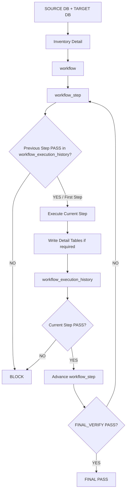
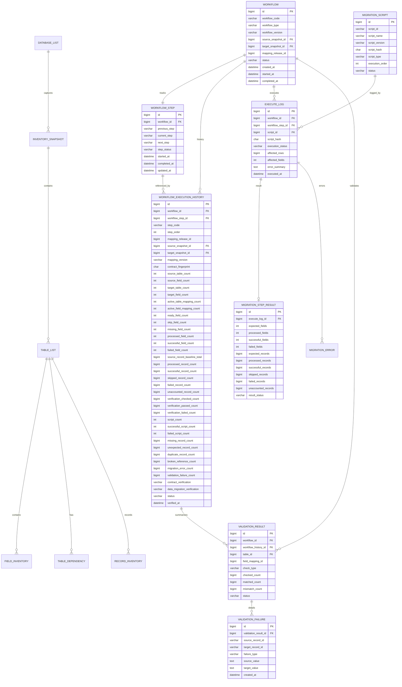
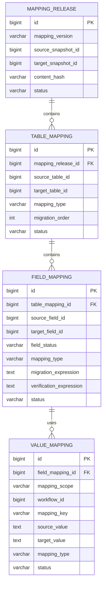

# End-to-End Database Migration Workflow Tutorial

> Controlled database migration using immutable inventory detail, a hard-coded workflow enum, one current workflow-step pointer, one centralized workflow execution history, mapping definitions, script execution logs, and validation detail.

---

## Contents

1. [Final Architecture](#1-final-architecture)
2. [Core Responsibility](#2-core-responsibility)
3. [Workflow Enum](#3-workflow-enum)
4. [Workflow](#4-workflow)
5. [Workflow Step](#5-workflow-step)
6. [Workflow Execution History](#6-workflow-execution-history)
7. [Inventory Detail Tables](#7-inventory-detail-tables)
8. [Mapping Tables](#8-mapping-tables)
9. [Execution and Validation Detail](#9-execution-and-validation-detail)
10. [Step Execution Rule](#10-step-execution-rule)
11. [Insert Flow](#11-insert-flow)
12. [ERD](#12-erd)
13. [Recommended DDL](#13-recommended-ddl)
14. [Final Verification Rules](#14-final-verification-rules)

---

# 1. Final Architecture

The workflow is intentionally simple:

```text
workflow_enum                 hard-coded step definition/order
      ↓
workflow                      one migration workflow/run/wave
      ↓
workflow_step                 current / previous / next step pointer
      ↓
workflow_execution_history    result and reusable verification evidence
```

Inventory detail remains preserved separately:

```text
SOURCE DB + TARGET DB
        ↓
inventory_snapshot
        ↓
table_list
        ↓
field_inventory
        ↓
table_dependency
        ↓
record_inventory
```

Mapping remains definition-only:

```text
mapping_release
      ↓
table_mapping
      ↓
field_mapping
      ↓
value_mapping
```

Execution detail remains available for drill-down:

```text
migration_script
      ↓
execute_log
      ↓
migration_step_result
      ↓
migration_error
```

Validation detail remains available for drill-down:

```text
validation_result
      ↓
validation_failure
```

The complete control flow is:



---

# 2. Core Responsibility

## `migration_inventory`

`migration_inventory` is the migration control/audit database.

It stores:

```text
WHAT EXISTS
+ CURRENT WORKFLOW STATE
+ WHAT WAS EXECUTED
+ WHAT WAS VERIFIED
+ SUMMARY HISTORY
+ DETAIL ERRORS / VALIDATION EVIDENCE
```

Recommended structure:

```text
migration_inventory
│
├── INVENTORY DETAIL
│   ├── database_list
│   ├── inventory_snapshot
│   ├── table_list
│   ├── field_inventory
│   ├── table_dependency
│   └── record_inventory
│
├── WORKFLOW CONTROL
│   ├── workflow
│   ├── workflow_step
│   └── workflow_execution_history
│
├── EXECUTION DETAIL
│   ├── migration_script
│   ├── execute_log
│   ├── migration_step_result
│   └── migration_error
│
└── VALIDATION DETAIL
    ├── validation_result
    └── validation_failure
```

## `migration_mapping`

`migration_mapping` stores definitions only.

```text
migration_mapping
├── mapping_release
├── table_mapping
├── field_mapping
└── value_mapping
```

No separate inventory/mapping/migration history tables are required. All workflow-level PASS/FAIL history is centralized in:

```text
migration_inventory.workflow_execution_history
```

---

# 3. Workflow Enum

`workflow_enum` is hard-coded in application/source code. It is not a database table.

Canonical order:

```text
10 INVENTORY
20 INVENTORY_VERIFY
30 MAPPING
40 MAPPING_VERIFY
50 MIGRATION
60 VALIDATION
70 FINAL_VERIFY
```

Example PHP representation:

```php
enum MigrationWorkflowStep: string
{
    case INVENTORY = 'INVENTORY';
    case INVENTORY_VERIFY = 'INVENTORY_VERIFY';
    case MAPPING = 'MAPPING';
    case MAPPING_VERIFY = 'MAPPING_VERIFY';
    case MIGRATION = 'MIGRATION';
    case VALIDATION = 'VALIDATION';
    case FINAL_VERIFY = 'FINAL_VERIFY';
}
```

The enum answers only:

```text
What steps exist?
What is the order?
What is the previous step?
What is the next step?
```

It does not store runtime state.

---

# 4. Workflow

One `workflow` row represents one controlled migration workflow/run/wave.

Recommended fields:

| Column | Type | Purpose |
|---|---|---|
| `id` | bigint UN AI PK | Workflow ID. |
| `workflow_code` | varchar(128) | Stable workflow/run name. |
| `workflow_type` | varchar(64) | Migration scope/type. |
| `workflow_version` | varchar(64) | Workflow version. |
| `source_snapshot_id` | bigint UN | Source inventory snapshot. |
| `target_snapshot_id` | bigint UN | Target inventory snapshot. |
| `mapping_release_id` | bigint UN NULL | Mapping release once available. |
| `status` | varchar(16) | `PENDING/RUNNING/PASS/FAIL/LOCKED`. |
| `created_at` | datetime(6) | Created time. |
| `started_at` | datetime(6) NULL | Started time. |
| `completed_at` | datetime(6) NULL | Completed time. |

Example:

```text
id                  = 1001
workflow_code       = JCORE-WAVE-01
source_snapshot_id  = 101
target_snapshot_id  = 201
mapping_release_id  = 401
status              = RUNNING
```

---

# 5. Workflow Step

`workflow_step` is the current-state pointer for one workflow.

There is one row per workflow:

```sql
UNIQUE (workflow_id)
```

Recommended fields:

| Column | Type | Purpose |
|---|---|---|
| `id` | bigint UN AI PK | State row ID. |
| `workflow_id` | bigint UN | Parent workflow. |
| `previous_step` | varchar(64) NULL | Previous enum step. |
| `current_step` | varchar(64) | Current allowed enum step. |
| `next_step` | varchar(64) NULL | Next enum step. |
| `step_status` | varchar(16) | Current pointer status. |
| `started_at` | datetime(6) NULL | Current step start. |
| `completed_at` | datetime(6) NULL | Current step completion. |
| `updated_at` | datetime(6) | Pointer update time. |

Example:

```text
workflow_id   = 1001
previous_step = MAPPING
current_step  = MAPPING_VERIFY
next_step     = MIGRATION
step_status   = RUNNING
```

Important separation:

```text
workflow_step
= WHERE THE WORKFLOW CURRENTLY POINTS

workflow_execution_history
= PROOF THAT A STEP ACTUALLY PASSED/FAILED
```

Therefore a pointer alone can never authorize the next step.

---

# 6. Workflow Execution History

`workflow_execution_history` is the single workflow-level history/checkpoint table.

The provided mapping-verification structure is retained as the base:

```text
mapping_release_id
source_snapshot_id
target_snapshot_id
mapping_version
contract_fingerprint
source_table_count
source_field_count
target_table_count
target_field_count
active_table_mapping_count
active_field_mapping_count
source_record_baseline_total
contract_verification
data_migration_verification
verified_at
```

To make this structure reusable for every workflow step, the following missing groups are required.

## 6.1 Workflow identity — required

```text
workflow_id
workflow_step_id
step_code
step_order
```

`step_code` must be stored in history even though `workflow_step_id` exists because `workflow_step` is a mutable current-state pointer. Historical rows must preserve which enum step produced the evidence.

Recommended uniqueness:

```text
UNIQUE (workflow_id, step_code)
```

This gives one authoritative final history row for each step of one workflow.

## 6.2 Canonical step result — required

```text
status
```

Allowed:

```text
PASS
FAIL
```

`status` is the field used by the workflow gate.

The existing fields remain supporting evidence:

```text
contract_verification
    = mapping/contract-specific result when applicable

data_migration_verification
    = migration/data-specific result when applicable
```

They do not replace the generic `status` used to advance the workflow.

## 6.3 Field accounting — required

The mapping contract now classifies fields as `READY / SKIP / MISSING`, so history needs:

```text
ready_field_count
skip_field_count
missing_field_count
```

Execution/verification additionally needs:

```text
processed_field_count
successful_field_count
failed_field_count
```

## 6.4 Record accounting — required

The supplied structure has only the source baseline total. To prove migration completion and support later-wave checks, retain it and add:

```text
processed_record_count
successful_record_count
skipped_record_count
failed_record_count
unaccounted_record_count
```

## 6.5 Verification accounting — required

```text
verification_checked_count
verification_passed_count
verification_failed_count
```

This allows a later step/wave to prove that the previous result was actually verified rather than only executed.

## 6.6 Script accounting — required for migration step

```text
script_count
successful_script_count
failed_script_count
```

Script detail remains in `execute_log`; these columns are only the workflow-level summary.

## 6.7 Integrity/failure summary — required

```text
missing_record_count
unexpected_record_count
duplicate_record_count
broken_reference_count
migration_error_count
validation_failure_count
```

The detail remains in `migration_error` and `validation_failure`.

## Final recommended structure

| Column | Type | Purpose |
|---|---|---|
| `id` | bigint UN AI PK | History ID. |
| `workflow_id` | bigint UN | Workflow. |
| `workflow_step_id` | bigint UN | Linked current-state row. |
| `step_code` | varchar(64) | Immutable enum step snapshot. |
| `step_order` | int UN | Enum order snapshot. |
| `mapping_release_id` | bigint UN NULL | Mapping release when applicable. |
| `source_snapshot_id` | bigint UN | Source snapshot. |
| `target_snapshot_id` | bigint UN | Target snapshot. |
| `mapping_version` | varchar(64) NULL | Mapping version when applicable. |
| `contract_fingerprint` | char(64) NULL | Mapping contract fingerprint when applicable. |
| `source_table_count` | int UN | Source table count. |
| `source_field_count` | int UN | Source field count. |
| `target_table_count` | int UN | Target table count. |
| `target_field_count` | int UN | Target field count. |
| `active_table_mapping_count` | int UN | Active table mappings. |
| `active_field_mapping_count` | int UN | Active field mappings. |
| `ready_field_count` | int UN | READY fields. |
| `skip_field_count` | int UN | SKIP fields. |
| `missing_field_count` | int UN | MISSING fields. |
| `processed_field_count` | int UN | Fields processed by this step. |
| `successful_field_count` | int UN | Successful fields. |
| `failed_field_count` | int UN | Failed fields. |
| `source_record_baseline_total` | bigint UN | Source baseline records. |
| `processed_record_count` | bigint UN | Records processed. |
| `successful_record_count` | bigint UN | Successfully accounted records. |
| `skipped_record_count` | bigint UN | Explicitly skipped records. |
| `failed_record_count` | bigint UN | Failed records. |
| `unaccounted_record_count` | bigint UN | Records not accounted for. |
| `verification_checked_count` | bigint UN | Verification checks/items executed. |
| `verification_passed_count` | bigint UN | Verification PASS items. |
| `verification_failed_count` | bigint UN | Verification FAIL items. |
| `script_count` | int UN | Expected/used scripts for the step. |
| `successful_script_count` | int UN | Successful scripts. |
| `failed_script_count` | int UN | Failed scripts. |
| `missing_record_count` | bigint UN | Missing expected records. |
| `unexpected_record_count` | bigint UN | Unexpected target records. |
| `duplicate_record_count` | bigint UN | Duplicate records. |
| `broken_reference_count` | bigint UN | Broken relationships/references. |
| `migration_error_count` | bigint UN | Runtime migration errors. |
| `validation_failure_count` | bigint UN | Validation failures. |
| `contract_verification` | varchar(16) NULL | Contract result when applicable. |
| `data_migration_verification` | varchar(16) NULL | Data migration result when applicable. |
| `status` | varchar(16) | Canonical workflow step `PASS/FAIL`. |
| `verified_at` | datetime(6) | Finalized/verified time. |

No additional workflow feature is introduced by these columns. They only materialize the evidence already produced by inventory, mapping, migration, and validation steps so later steps can verify it without reconstructing prior results.

---

# 7. Inventory Detail Tables

Keep the inventory tables.

```text
database_list
inventory_snapshot
table_list
field_inventory
table_dependency
record_inventory
```

Responsibility:

```text
inventory detail
= EXACT FACTS / EVIDENCE

workflow_execution_history
= STEP SUMMARY / RESULT / REUSABLE CHECKPOINT
```

Example:

```text
workflow_execution_history.source_field_count = 711
```

To determine exactly which 711 fields:

```text
field_inventory
```

To determine their tables:

```text
table_list
```

To determine dependencies:

```text
table_dependency
```

The history table must not replace detailed inventory evidence.

---

# 8. Mapping Tables

Keep mapping definitions unchanged:

```text
mapping_release
      ↓
table_mapping
      ↓
field_mapping
      ↓
value_mapping
```

`field_mapping.field_status` uses:

```text
READY
SKIP
MISSING
```

Mapping definitions belong in `migration_mapping`.

Mapping verification summary belongs in the `MAPPING_VERIFY` row of:

```text
migration_inventory.workflow_execution_history
```

No separate `mapping_verification_history` table is required.

---

# 9. Execution and Validation Detail

## Script execution

Each migration script has a stable ID in:

```text
migration_script
```

Each script execution is recorded in:

```text
execute_log
```

A script may be executed only once per workflow:

```text
UNIQUE (workflow_id, script_id)
```

Before execution:

```sql
SELECT id
FROM migration_inventory.execute_log
WHERE workflow_id = :workflow_id
  AND script_id = :script_id
LIMIT 1;
```

If a row exists:

```text
BLOCK
SCRIPT_ALREADY_EXECUTED
```

Execution totals are stored in:

```text
migration_step_result
```

Runtime errors are stored in:

```text
migration_error
```

## Validation

Aggregate/detail validation results remain in:

```text
validation_result
```

Concrete failures remain in:

```text
validation_failure
```

The workflow-level summary is copied into the relevant `workflow_execution_history` row.

---

# 10. Step Execution Rule

For requested step `X`:

```text
1. Read workflow_step.current_step.
2. requested step must equal current_step.
3. Resolve previous step from workflow_enum.
4. If X is not the first step, previous step must have PASS history.
5. Current step must not already have a history row.
6. Execute X.
7. Write required detail tables.
8. Insert workflow_execution_history for X.
9. If status = PASS, advance workflow_step using workflow_enum.
10. If status = FAIL, do not advance.
```

Previous-step gate:

```sql
SELECT id, status
FROM migration_inventory.workflow_execution_history
WHERE workflow_id = :workflow_id
  AND step_code = :previous_step
LIMIT 1;
```

Required:

```text
row exists
status = PASS
```

Current-step duplicate guard:

```sql
SELECT id
FROM migration_inventory.workflow_execution_history
WHERE workflow_id = :workflow_id
  AND step_code = :current_step
LIMIT 1;
```

If a row exists:

```text
BLOCK
STEP_ALREADY_EXECUTED
```

Therefore:

```text
wrong step
→ BLOCK

previous step missing
→ BLOCK

previous step FAIL
→ BLOCK

current step already executed
→ BLOCK

current step allowed + previous PASS
→ EXECUTE
```

---

# 11. Insert Flow

## Step 1 — INVENTORY

Write detailed facts:

```text
inventory_snapshot
table_list
field_inventory
table_dependency
record_inventory
```

Then write one history row:

```text
workflow_execution_history
step_code = INVENTORY
```

Typical evidence:

```text
source_table_count
source_field_count
target_table_count
target_field_count
source_record_baseline_total
processed counts
status
```

If PASS, move pointer to `INVENTORY_VERIFY`.

## Step 2 — INVENTORY_VERIFY

Read inventory detail and previous `INVENTORY PASS` history.

Write:

```text
workflow_execution_history
step_code = INVENTORY_VERIFY
```

Use verification counts and `status`.

If PASS, move to `MAPPING`.

## Step 3 — MAPPING

Insert definitions into:

```text
migration_mapping.mapping_release
migration_mapping.table_mapping
migration_mapping.field_mapping
migration_mapping.value_mapping
```

Write summary to:

```text
workflow_execution_history
step_code = MAPPING
```

Including:

```text
mapping_release_id
mapping_version
contract_fingerprint
active_table_mapping_count
active_field_mapping_count
ready_field_count
skip_field_count
missing_field_count
```

If PASS, move to `MAPPING_VERIFY`.

## Step 4 — MAPPING_VERIFY

Verify inventory + mapping contract.

Write:

```text
workflow_execution_history
step_code = MAPPING_VERIFY
contract_verification = PASS/FAIL
status = PASS/FAIL
```

If PASS, move to `MIGRATION`.

## Step 5 — MIGRATION

For every required script:

```text
migration_script
      ↓
execute_log
      ↓
migration_step_result
      ↓
migration_error when required
```

After all required scripts finish, write one summary:

```text
workflow_execution_history
step_code = MIGRATION
```

Including script/field/record counts and data migration result.

If PASS, move to `VALIDATION`.

## Step 6 — VALIDATION

Write detail:

```text
validation_result
validation_failure
```

Then write summary:

```text
workflow_execution_history
step_code = VALIDATION
```

If PASS, move to `FINAL_VERIFY`.

## Step 7 — FINAL_VERIFY

Read all previous history rows and detailed evidence.

Write:

```text
workflow_execution_history
step_code = FINAL_VERIFY
status = PASS/FAIL
```

If PASS:

```text
workflow.status = PASS
workflow_step.current_step = FINAL_VERIFY
workflow_step.step_status = PASS
```

Workflow is complete.

---

# 12. ERD

## `migration_inventory`



## `migration_mapping`



---

# 13. Recommended DDL

The following DDL covers only the workflow-control structures relevant to this design. Existing inventory, mapping, execution-detail, and validation-detail tables remain unchanged except for their references to `workflow_id`/`workflow_step_id` where applicable.

```sql
CREATE TABLE migration_inventory.workflow (
    id BIGINT UNSIGNED NOT NULL AUTO_INCREMENT,
    workflow_code VARCHAR(128) NOT NULL,
    workflow_type VARCHAR(64) NOT NULL,
    workflow_version VARCHAR(64) NOT NULL,
    source_snapshot_id BIGINT UNSIGNED NOT NULL,
    target_snapshot_id BIGINT UNSIGNED NOT NULL,
    mapping_release_id BIGINT UNSIGNED NULL,
    status VARCHAR(16) NOT NULL DEFAULT 'PENDING',
    created_at DATETIME(6) NOT NULL DEFAULT CURRENT_TIMESTAMP(6),
    started_at DATETIME(6) NULL,
    completed_at DATETIME(6) NULL,

    PRIMARY KEY (id),
    UNIQUE KEY uk_workflow_code (workflow_code),
    CHECK (status IN ('PENDING','RUNNING','PASS','FAIL','LOCKED'))
);

CREATE TABLE migration_inventory.workflow_step (
    id BIGINT UNSIGNED NOT NULL AUTO_INCREMENT,
    workflow_id BIGINT UNSIGNED NOT NULL,
    previous_step VARCHAR(64) NULL,
    current_step VARCHAR(64) NOT NULL,
    next_step VARCHAR(64) NULL,
    step_status VARCHAR(16) NOT NULL DEFAULT 'PENDING',
    started_at DATETIME(6) NULL,
    completed_at DATETIME(6) NULL,
    updated_at DATETIME(6) NOT NULL DEFAULT CURRENT_TIMESTAMP(6)
        ON UPDATE CURRENT_TIMESTAMP(6),

    PRIMARY KEY (id),
    UNIQUE KEY uk_workflow_step_workflow (workflow_id),
    CHECK (step_status IN ('PENDING','RUNNING','PASS','FAIL'))
);

CREATE TABLE migration_inventory.workflow_execution_history (
    id BIGINT UNSIGNED NOT NULL AUTO_INCREMENT,

    workflow_id BIGINT UNSIGNED NOT NULL,
    workflow_step_id BIGINT UNSIGNED NOT NULL,
    step_code VARCHAR(64) NOT NULL,
    step_order INT UNSIGNED NOT NULL,

    mapping_release_id BIGINT UNSIGNED NULL,
    source_snapshot_id BIGINT UNSIGNED NOT NULL,
    target_snapshot_id BIGINT UNSIGNED NOT NULL,
    mapping_version VARCHAR(64) NULL,
    contract_fingerprint CHAR(64) NULL,

    source_table_count INT UNSIGNED NOT NULL DEFAULT 0,
    source_field_count INT UNSIGNED NOT NULL DEFAULT 0,
    target_table_count INT UNSIGNED NOT NULL DEFAULT 0,
    target_field_count INT UNSIGNED NOT NULL DEFAULT 0,
    active_table_mapping_count INT UNSIGNED NOT NULL DEFAULT 0,
    active_field_mapping_count INT UNSIGNED NOT NULL DEFAULT 0,

    ready_field_count INT UNSIGNED NOT NULL DEFAULT 0,
    skip_field_count INT UNSIGNED NOT NULL DEFAULT 0,
    missing_field_count INT UNSIGNED NOT NULL DEFAULT 0,
    processed_field_count INT UNSIGNED NOT NULL DEFAULT 0,
    successful_field_count INT UNSIGNED NOT NULL DEFAULT 0,
    failed_field_count INT UNSIGNED NOT NULL DEFAULT 0,

    source_record_baseline_total BIGINT UNSIGNED NOT NULL DEFAULT 0,
    processed_record_count BIGINT UNSIGNED NOT NULL DEFAULT 0,
    successful_record_count BIGINT UNSIGNED NOT NULL DEFAULT 0,
    skipped_record_count BIGINT UNSIGNED NOT NULL DEFAULT 0,
    failed_record_count BIGINT UNSIGNED NOT NULL DEFAULT 0,
    unaccounted_record_count BIGINT UNSIGNED NOT NULL DEFAULT 0,

    verification_checked_count BIGINT UNSIGNED NOT NULL DEFAULT 0,
    verification_passed_count BIGINT UNSIGNED NOT NULL DEFAULT 0,
    verification_failed_count BIGINT UNSIGNED NOT NULL DEFAULT 0,

    script_count INT UNSIGNED NOT NULL DEFAULT 0,
    successful_script_count INT UNSIGNED NOT NULL DEFAULT 0,
    failed_script_count INT UNSIGNED NOT NULL DEFAULT 0,

    missing_record_count BIGINT UNSIGNED NOT NULL DEFAULT 0,
    unexpected_record_count BIGINT UNSIGNED NOT NULL DEFAULT 0,
    duplicate_record_count BIGINT UNSIGNED NOT NULL DEFAULT 0,
    broken_reference_count BIGINT UNSIGNED NOT NULL DEFAULT 0,
    migration_error_count BIGINT UNSIGNED NOT NULL DEFAULT 0,
    validation_failure_count BIGINT UNSIGNED NOT NULL DEFAULT 0,

    contract_verification VARCHAR(16) NULL,
    data_migration_verification VARCHAR(16) NULL,
    status VARCHAR(16) NOT NULL,
    verified_at DATETIME(6) NOT NULL DEFAULT CURRENT_TIMESTAMP(6),

    PRIMARY KEY (id),
    UNIQUE KEY uk_workflow_history_step (workflow_id, step_code),
    KEY ix_workflow_history_workflow_step (workflow_step_id),
    KEY ix_workflow_history_status (workflow_id, status),

    CHECK (status IN ('PASS','FAIL')),
    CHECK (contract_verification IS NULL OR contract_verification IN ('PASS','FAIL')),
    CHECK (data_migration_verification IS NULL OR data_migration_verification IN ('PASS','FAIL'))
);
```

Script execution remains one-time per workflow:

```sql
CREATE UNIQUE INDEX uk_execute_log_workflow_script
ON migration_inventory.execute_log (workflow_id, script_id);
```

This implements the existing rule:

```text
script already has execute_log for workflow
→ script cannot execute again
```

---

# 14. Final Verification Rules

## Previous-step gate

Before current step `X` runs:

```text
workflow_step.current_step = X
previous step from workflow_enum = P
workflow_execution_history(P).status = PASS
workflow_execution_history(X) does not exist
```

Otherwise:

```text
BLOCK
```

## MAPPING_VERIFY PASS

At minimum:

```text
source_table_count > 0
source_field_count > 0
target_table_count > 0
target_field_count > 0
active_table_mapping_count is fully accounted
active_field_mapping_count is fully accounted
failed_field_count = 0
contract_verification = PASS
status = PASS
```

## MIGRATION PASS

At minimum:

```text
failed_script_count = 0
failed_field_count = 0
failed_record_count = 0
unaccounted_record_count = 0
migration_error_count = 0
data_migration_verification = PASS
status = PASS
```

## VALIDATION PASS

At minimum:

```text
verification_failed_count = 0
missing_record_count = 0
unexpected_record_count = 0
duplicate_record_count = 0
broken_reference_count = 0
validation_failure_count = 0
status = PASS
```

## FINAL_VERIFY PASS

`FINAL_VERIFY` reads the earlier rows from the same table:

```text
INVENTORY.status        = PASS
INVENTORY_VERIFY.status = PASS
MAPPING.status          = PASS
MAPPING_VERIFY.status   = PASS
MIGRATION.status        = PASS
VALIDATION.status       = PASS
```

and confirms the final counts have no unresolved failures.

Only then:

```text
FINAL_VERIFY.status = PASS
workflow.status = PASS
```

---

# Final Design Check

The design intentionally keeps the existing logic and removes redundant workflow-level history tables.

```text
workflow_enum
    = hard-coded order

workflow
    = workflow identity

workflow_step
    = current pointer

workflow_execution_history
    = one centralized PASS/FAIL + reusable summary/evidence table

inventory_* / table_list / field_inventory / dependencies / record_inventory
    = detailed inventory evidence retained

mapping_release / table_mapping / field_mapping / value_mapping
    = mapping definitions retained

execute_log / migration_step_result / migration_error
    = execution detail retained

validation_result / validation_failure
    = validation detail retained
```

No workflow step, mapping rule, migration behavior, or validation behavior is added by this revision. The change only centralizes existing workflow-level history and adds the missing summary columns required to verify previous steps and reuse their results safely in later steps/waves.
