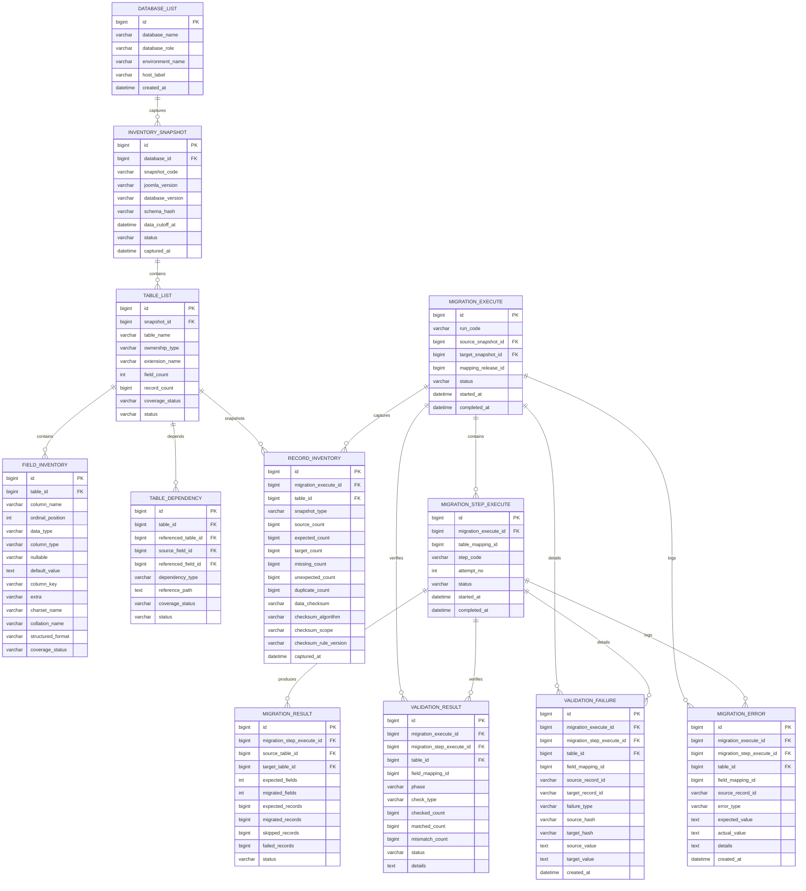
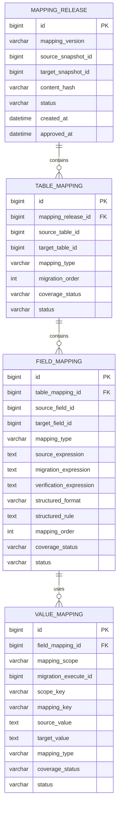
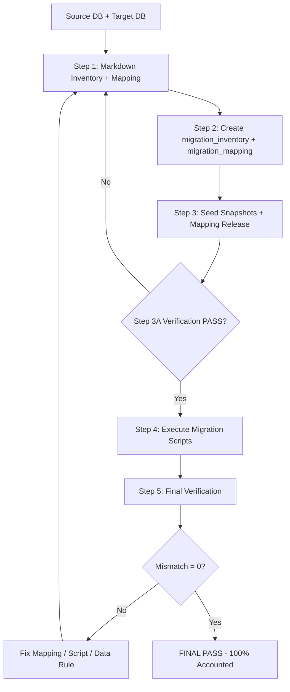

# End-to-End Database Migration Workflow Tutorial

> Build a controlled migration from an **old/source database** to a **new/target database** by creating inventory and mapping artifacts, materializing them into two migration-control databases, validating the contract, executing migration scripts, and proving that every in-scope table, field, record, dependency, and mapping decision is accounted for.

---

## Overview

- [Migration Model](#migration-model)
- [Core Databases](#core-databases)
- [Design Rules](#design-rules)
- [Migration Control Database ERDs](#migration-control-database-erds)
- [MySQL DDL for Migration Control Databases](#mysql-ddl-for-migration-control-databases)
- [End-to-End Flow](#end-to-end-flow)
- [Step 1 — Create Inventory and Mapping Markdown Artifacts](#step-1--create-inventory-and-mapping-markdown-artifacts)
- [Step 2 — Create the Inventory and Mapping Databases](#step-2--create-the-inventory-and-mapping-databases)
- [Step 3 — Seed Inventory and Mapping Data](#step-3--seed-inventory-and-mapping-data)
- [Step 3A — Run the Pre-Migration Verification Gate](#step-3a--run-the-pre-migration-verification-gate)
- [Step 4 — Generate and Execute Migration Scripts](#step-4--generate-and-execute-migration-scripts)
- [Step 5 — Verify the Completed Migration](#step-5--verify-the-completed-migration)
- [Final 100% Accounting Gate](#final-100-accounting-gate)
- [Master Checklist](#master-checklist)

---

# Migration Model

The workflow intentionally keeps the existing four-database model:

| Role | Database | Purpose |
|---|---|---|
| Application source | Source DB | Old/current application data. |
| Application target | Target DB | New/destination application data. |
| Migration control | `migration_inventory` | Immutable inventory snapshots, dependencies, execution evidence, reconciliation evidence, validation failures, and errors. |
| Migration control | `migration_mapping` | Versioned executable table/field/value mapping contract. |

The source and target databases continue to hold the application/business data. The two migration-control databases hold **metadata, decisions, mappings, execution evidence, and verification evidence**.

The high-level workflow is unchanged:

```text
Source + Target
      ↓
Markdown inventory + mapping
      ↓
migration_inventory + migration_mapping
      ↓
Pre-migration verification gate
      ↓
Migration execution
      ↓
Final verification
```

---

# Core Databases

```text
SOURCE DATABASE
(old/current data)

TARGET DATABASE
(new/destination data)

migration_inventory
├── database_list
├── inventory_snapshot
├── table_list
├── field_inventory
├── table_dependency
├── migration_execute
├── migration_step_execute
├── record_inventory
├── migration_result
├── validation_result
├── validation_failure
└── migration_error

migration_mapping
├── mapping_release
├── table_mapping
├── field_mapping
└── value_mapping
```

### Responsibility rule

```text
Source / Target DB
    = application/business data

migration_inventory
    = what existed at a specific snapshot
    + what execution happened
    + what was verified
    + what failed

migration_mapping
    = approved mapping contract
    + static semantic mappings
    + run-scoped runtime ID/value resolutions
```

`value_mapping` remains the canonical value/ID mapping table used by the existing Joomla table/field mapping documents. It now explicitly distinguishes:

```text
STATIC
    = design-time semantic/value mapping

RUNTIME
    = source identity/value -> target identity/value
      generated or resolved during one migration run
```

This preserves the existing mapping flow while preventing runtime mappings from different dry-runs/UAT/production runs from colliding.

---

# Design Rules

## 1. Inventory snapshots are immutable

`database_list` identifies a database instance. Each scan creates a new `inventory_snapshot`.

```text
database_list
     ↓
inventory_snapshot #1
inventory_snapshot #2
inventory_snapshot #3
```

A production run must identify exactly which source and target snapshots it used.

Do not overwrite a verified/frozen snapshot when the source or target schema changes. Capture a new snapshot.

## 2. Mapping versions are first-class releases

A string such as `v1` is not sufficient by itself. `mapping_release` binds:

```text
mapping version
+ source snapshot
+ target snapshot
+ content hash
+ approval/freeze status
```

Production execution is allowed only from an approved/frozen mapping release.

## 3. Runtime mappings are run-scoped

The existing `value_mapping` table supports both static and runtime mappings, but runtime rows must include the migration run.

Example:

```text
STATIC:
published:1 -> state:1

RUNTIME / PROD-001:
CONTENT source 928 -> target 1431

RUNTIME / PROD-002:
CONTENT source 928 -> target 1507
```

Those runtime rows are different valid resolutions and must never overwrite each other.

## 4. Table execution is attempt-aware

One migration run can retry one table/step:

```text
PROD-001
├── G1-01 attempt 1 = FAILED
├── G1-01 attempt 2 = PASS
└── G1-02 attempt 1 = PASS
```

`migration_step_execute` records this history.

## 5. Validation stores both aggregates and concrete failures

`validation_result` stores aggregate PASS/FAIL evidence.

`validation_failure` stores concrete record-level mismatches such as:

```text
MISSING_SOURCE
MISSING_TARGET
VALUE_MISMATCH
DUPLICATE_TARGET
UNRESOLVED_REFERENCE
INVALID_STRUCTURE
```

## 6. Checksums are reproducible

A checksum is valid evidence only when the algorithm and normalization scope are recorded.

Store:

```text
data_checksum
checksum_algorithm
checksum_scope
checksum_rule_version
```

## 7. Dependencies are typed

Recommended dependency types:

```text
PHYSICAL_FK
SEMANTIC_REFERENCE
EMBEDDED_ID
JSON_REFERENCE
TREE_PARENT
POLYMORPHIC_REFERENCE
EXTENSION_DEPENDENCY
RUNTIME_GENERATED
```

---

# Migration Control Database ERDs

## `migration_inventory` ERD



## `migration_mapping` ERD



---

# MySQL DDL for Migration Control Databases

## Compatibility assumptions

```text
MySQL              = 8.0.16+
Storage engine     = InnoDB
Character set      = utf8mb4
Collation          = utf8mb4_0900_ai_ci
Control databases  = same MySQL server
```

Cross-database foreign keys are used because the existing design keeps `migration_inventory` and `migration_mapping` as separate databases on the same MySQL server.

If the two control databases are ever deployed on different servers, keep the indexed IDs but remove only the cross-database FK constraints and enforce the same relationships in the verification gates.

## Create databases

```sql
CREATE DATABASE IF NOT EXISTS `migration_inventory`
    CHARACTER SET utf8mb4
    COLLATE utf8mb4_0900_ai_ci;

CREATE DATABASE IF NOT EXISTS `migration_mapping`
    CHARACTER SET utf8mb4
    COLLATE utf8mb4_0900_ai_ci;
```

## Phase A — Inventory identity and immutable snapshots

```sql
CREATE TABLE IF NOT EXISTS `migration_inventory`.`database_list` (
    `id` BIGINT UNSIGNED NOT NULL AUTO_INCREMENT,
    `database_name` VARCHAR(255) NOT NULL,
    `database_role` VARCHAR(32) NOT NULL,
    `environment_name` VARCHAR(64) NOT NULL DEFAULT 'UNKNOWN',
    `host_label` VARCHAR(255) NOT NULL DEFAULT '',
    `created_at` DATETIME(6) NOT NULL DEFAULT CURRENT_TIMESTAMP(6),

    PRIMARY KEY (`id`),
    UNIQUE KEY `uk_database_identity`
        (`database_role`, `environment_name`, `host_label`, `database_name`),

    CONSTRAINT `chk_database_role`
        CHECK (`database_role` IN ('SOURCE', 'TARGET'))
) ENGINE=InnoDB
  DEFAULT CHARSET=utf8mb4
  COLLATE=utf8mb4_0900_ai_ci;


CREATE TABLE IF NOT EXISTS `migration_inventory`.`inventory_snapshot` (
    `id` BIGINT UNSIGNED NOT NULL AUTO_INCREMENT,
    `database_id` BIGINT UNSIGNED NOT NULL,
    `snapshot_code` VARCHAR(128) NOT NULL,
    `joomla_version` VARCHAR(64) NOT NULL DEFAULT '',
    `database_version` VARCHAR(64) NOT NULL DEFAULT '',
    `schema_hash` VARCHAR(128) NULL,
    `data_cutoff_at` DATETIME(6) NULL,
    `status` VARCHAR(32) NOT NULL DEFAULT 'CAPTURED',
    `captured_at` DATETIME(6) NOT NULL DEFAULT CURRENT_TIMESTAMP(6),

    PRIMARY KEY (`id`),
    UNIQUE KEY `uk_snapshot_code` (`database_id`, `snapshot_code`),
    KEY `ix_snapshot_status` (`status`),

    CONSTRAINT `fk_snapshot_database`
        FOREIGN KEY (`database_id`)
        REFERENCES `migration_inventory`.`database_list` (`id`)
        ON UPDATE CASCADE
        ON DELETE RESTRICT,

    CONSTRAINT `chk_snapshot_status`
        CHECK (`status` IN ('CAPTURED', 'VERIFIED', 'FROZEN', 'INVALID'))
) ENGINE=InnoDB
  DEFAULT CHARSET=utf8mb4
  COLLATE=utf8mb4_0900_ai_ci;


CREATE TABLE IF NOT EXISTS `migration_inventory`.`table_list` (
    `id` BIGINT UNSIGNED NOT NULL AUTO_INCREMENT,
    `snapshot_id` BIGINT UNSIGNED NOT NULL,
    `table_name` VARCHAR(255) NOT NULL,
    `ownership_type` VARCHAR(64) NOT NULL,
    `extension_name` VARCHAR(255) NULL,
    `field_count` INT UNSIGNED NOT NULL DEFAULT 0,
    `record_count` BIGINT UNSIGNED NULL,
    `coverage_status` VARCHAR(32) NOT NULL DEFAULT 'PENDING',
    `status` VARCHAR(32) NOT NULL DEFAULT 'IN_SCOPE',

    PRIMARY KEY (`id`),
    UNIQUE KEY `uk_table_snapshot_name` (`snapshot_id`, `table_name`),
    KEY `ix_table_scope` (`status`, `coverage_status`),
    KEY `ix_table_owner` (`ownership_type`, `extension_name`),

    CONSTRAINT `fk_table_snapshot`
        FOREIGN KEY (`snapshot_id`)
        REFERENCES `migration_inventory`.`inventory_snapshot` (`id`)
        ON UPDATE CASCADE
        ON DELETE RESTRICT,

    CONSTRAINT `chk_table_coverage`
        CHECK (`coverage_status` IN ('PENDING', 'PASS', 'FAIL', 'NA')),

    CONSTRAINT `chk_table_status`
        CHECK (`status` IN ('IN_SCOPE', 'OUT_OF_SCOPE'))
) ENGINE=InnoDB
  DEFAULT CHARSET=utf8mb4
  COLLATE=utf8mb4_0900_ai_ci;


CREATE TABLE IF NOT EXISTS `migration_inventory`.`field_inventory` (
    `id` BIGINT UNSIGNED NOT NULL AUTO_INCREMENT,
    `table_id` BIGINT UNSIGNED NOT NULL,
    `column_name` VARCHAR(255) NOT NULL,
    `ordinal_position` INT UNSIGNED NOT NULL,
    `data_type` VARCHAR(64) NOT NULL,
    `column_type` VARCHAR(255) NOT NULL,
    `nullable` VARCHAR(3) NOT NULL,
    `default_value` TEXT NULL,
    `column_key` VARCHAR(32) NULL,
    `extra` VARCHAR(255) NULL,
    `charset_name` VARCHAR(64) NULL,
    `collation_name` VARCHAR(64) NULL,
    `structured_format` VARCHAR(64) NULL,
    `coverage_status` VARCHAR(32) NOT NULL DEFAULT 'PENDING',

    PRIMARY KEY (`id`),
    UNIQUE KEY `uk_field_table_column` (`table_id`, `column_name`),
    UNIQUE KEY `uk_field_table_ordinal` (`table_id`, `ordinal_position`),

    CONSTRAINT `fk_field_table`
        FOREIGN KEY (`table_id`)
        REFERENCES `migration_inventory`.`table_list` (`id`)
        ON UPDATE CASCADE
        ON DELETE RESTRICT,

    CONSTRAINT `chk_field_coverage`
        CHECK (`coverage_status` IN ('PENDING', 'PASS', 'FAIL', 'NA'))
) ENGINE=InnoDB
  DEFAULT CHARSET=utf8mb4
  COLLATE=utf8mb4_0900_ai_ci;


CREATE TABLE IF NOT EXISTS `migration_inventory`.`table_dependency` (
    `id` BIGINT UNSIGNED NOT NULL AUTO_INCREMENT,
    `table_id` BIGINT UNSIGNED NOT NULL,
    `referenced_table_id` BIGINT UNSIGNED NOT NULL,
    `source_field_id` BIGINT UNSIGNED NULL,
    `referenced_field_id` BIGINT UNSIGNED NULL,
    `dependency_type` VARCHAR(64) NOT NULL,
    `reference_path` TEXT NULL,
    `coverage_status` VARCHAR(32) NOT NULL DEFAULT 'PENDING',
    `status` VARCHAR(32) NOT NULL DEFAULT 'ACTIVE',

    PRIMARY KEY (`id`),
    KEY `ix_dependency_source` (`table_id`),
    KEY `ix_dependency_target` (`referenced_table_id`),
    KEY `ix_dependency_type` (`dependency_type`),

    CONSTRAINT `fk_dependency_source_table`
        FOREIGN KEY (`table_id`)
        REFERENCES `migration_inventory`.`table_list` (`id`)
        ON UPDATE CASCADE
        ON DELETE RESTRICT,

    CONSTRAINT `fk_dependency_target_table`
        FOREIGN KEY (`referenced_table_id`)
        REFERENCES `migration_inventory`.`table_list` (`id`)
        ON UPDATE CASCADE
        ON DELETE RESTRICT,

    CONSTRAINT `fk_dependency_source_field`
        FOREIGN KEY (`source_field_id`)
        REFERENCES `migration_inventory`.`field_inventory` (`id`)
        ON UPDATE CASCADE
        ON DELETE RESTRICT,

    CONSTRAINT `fk_dependency_target_field`
        FOREIGN KEY (`referenced_field_id`)
        REFERENCES `migration_inventory`.`field_inventory` (`id`)
        ON UPDATE CASCADE
        ON DELETE RESTRICT,

    CONSTRAINT `chk_dependency_type`
        CHECK (`dependency_type` IN (
            'PHYSICAL_FK',
            'SEMANTIC_REFERENCE',
            'EMBEDDED_ID',
            'JSON_REFERENCE',
            'TREE_PARENT',
            'POLYMORPHIC_REFERENCE',
            'EXTENSION_DEPENDENCY',
            'RUNTIME_GENERATED'
        )),

    CONSTRAINT `chk_dependency_coverage`
        CHECK (`coverage_status` IN ('PENDING', 'PASS', 'FAIL', 'NA'))
) ENGINE=InnoDB
  DEFAULT CHARSET=utf8mb4
  COLLATE=utf8mb4_0900_ai_ci;
```

## Phase B — Versioned mapping contract

```sql
CREATE TABLE IF NOT EXISTS `migration_mapping`.`mapping_release` (
    `id` BIGINT UNSIGNED NOT NULL AUTO_INCREMENT,
    `mapping_version` VARCHAR(64) NOT NULL,
    `source_snapshot_id` BIGINT UNSIGNED NOT NULL,
    `target_snapshot_id` BIGINT UNSIGNED NOT NULL,
    `content_hash` VARCHAR(128) NULL,
    `status` VARCHAR(32) NOT NULL DEFAULT 'DRAFT',
    `created_at` DATETIME(6) NOT NULL DEFAULT CURRENT_TIMESTAMP(6),
    `approved_at` DATETIME(6) NULL,

    PRIMARY KEY (`id`),
    UNIQUE KEY `uk_mapping_version` (`mapping_version`),
    KEY `ix_mapping_release_snapshots`
        (`source_snapshot_id`, `target_snapshot_id`),
    KEY `ix_mapping_release_status` (`status`),

    CONSTRAINT `fk_mapping_release_source_snapshot`
        FOREIGN KEY (`source_snapshot_id`)
        REFERENCES `migration_inventory`.`inventory_snapshot` (`id`)
        ON UPDATE CASCADE
        ON DELETE RESTRICT,

    CONSTRAINT `fk_mapping_release_target_snapshot`
        FOREIGN KEY (`target_snapshot_id`)
        REFERENCES `migration_inventory`.`inventory_snapshot` (`id`)
        ON UPDATE CASCADE
        ON DELETE RESTRICT,

    CONSTRAINT `chk_mapping_release_status`
        CHECK (`status` IN ('DRAFT', 'APPROVED', 'FROZEN', 'RETIRED'))
) ENGINE=InnoDB
  DEFAULT CHARSET=utf8mb4
  COLLATE=utf8mb4_0900_ai_ci;


CREATE TABLE IF NOT EXISTS `migration_mapping`.`table_mapping` (
    `id` BIGINT UNSIGNED NOT NULL AUTO_INCREMENT,
    `mapping_release_id` BIGINT UNSIGNED NOT NULL,
    `source_table_id` BIGINT UNSIGNED NOT NULL,
    `target_table_id` BIGINT UNSIGNED NULL,
    `mapping_type` VARCHAR(32) NOT NULL,
    `migration_order` INT UNSIGNED NOT NULL DEFAULT 0,
    `coverage_status` VARCHAR(32) NOT NULL DEFAULT 'PENDING',
    `status` VARCHAR(32) NOT NULL DEFAULT 'ACTIVE',

    PRIMARY KEY (`id`),
    UNIQUE KEY `uk_table_mapping_release_source`
        (`mapping_release_id`, `source_table_id`),
    KEY `ix_table_mapping_target` (`target_table_id`),
    KEY `ix_table_mapping_order`
        (`mapping_release_id`, `migration_order`),

    CONSTRAINT `fk_table_mapping_release`
        FOREIGN KEY (`mapping_release_id`)
        REFERENCES `migration_mapping`.`mapping_release` (`id`)
        ON UPDATE CASCADE
        ON DELETE RESTRICT,

    CONSTRAINT `fk_table_mapping_source`
        FOREIGN KEY (`source_table_id`)
        REFERENCES `migration_inventory`.`table_list` (`id`)
        ON UPDATE CASCADE
        ON DELETE RESTRICT,

    CONSTRAINT `fk_table_mapping_target`
        FOREIGN KEY (`target_table_id`)
        REFERENCES `migration_inventory`.`table_list` (`id`)
        ON UPDATE CASCADE
        ON DELETE RESTRICT,

    CONSTRAINT `chk_table_mapping_type`
        CHECK (`mapping_type` IN (
            'DIRECT',
            'TRANSFORM',
            'LOOKUP',
            'REBUILD',
            'GENERATED',
            'RECREATE',
            'REFERENCE_ONLY',
            'TARGET_OWNED',
            'ARCHIVE',
            'IGNORE'
        )),

    CONSTRAINT `chk_table_mapping_coverage`
        CHECK (`coverage_status` IN ('PENDING', 'PASS', 'FAIL', 'NA'))
) ENGINE=InnoDB
  DEFAULT CHARSET=utf8mb4
  COLLATE=utf8mb4_0900_ai_ci;


CREATE TABLE IF NOT EXISTS `migration_mapping`.`field_mapping` (
    `id` BIGINT UNSIGNED NOT NULL AUTO_INCREMENT,
    `table_mapping_id` BIGINT UNSIGNED NOT NULL,
    `source_field_id` BIGINT UNSIGNED NULL,
    `target_field_id` BIGINT UNSIGNED NULL,
    `mapping_type` VARCHAR(32) NOT NULL,
    `source_expression` LONGTEXT NULL,
    `migration_expression` LONGTEXT NULL,
    `verification_expression` LONGTEXT NULL,
    `structured_format` VARCHAR(64) NULL,
    `structured_rule` LONGTEXT NULL,
    `mapping_order` INT UNSIGNED NOT NULL DEFAULT 0,
    `coverage_status` VARCHAR(32) NOT NULL DEFAULT 'PENDING',
    `status` VARCHAR(32) NOT NULL DEFAULT 'ACTIVE',

    PRIMARY KEY (`id`),
    KEY `ix_field_mapping_table_order`
        (`table_mapping_id`, `mapping_order`),
    KEY `ix_field_mapping_source` (`source_field_id`),
    KEY `ix_field_mapping_target` (`target_field_id`),

    CONSTRAINT `chk_field_mapping_has_side`
        CHECK (`source_field_id` IS NOT NULL OR `target_field_id` IS NOT NULL),

    CONSTRAINT `fk_field_mapping_table_mapping`
        FOREIGN KEY (`table_mapping_id`)
        REFERENCES `migration_mapping`.`table_mapping` (`id`)
        ON UPDATE CASCADE
        ON DELETE RESTRICT,

    CONSTRAINT `fk_field_mapping_source`
        FOREIGN KEY (`source_field_id`)
        REFERENCES `migration_inventory`.`field_inventory` (`id`)
        ON UPDATE CASCADE
        ON DELETE RESTRICT,

    CONSTRAINT `fk_field_mapping_target`
        FOREIGN KEY (`target_field_id`)
        REFERENCES `migration_inventory`.`field_inventory` (`id`)
        ON UPDATE CASCADE
        ON DELETE RESTRICT,

    CONSTRAINT `chk_field_mapping_type`
        CHECK (`mapping_type` IN (
            'DIRECT',
            'TRANSFORM',
            'LOOKUP',
            'STRUCTURED',
            'GENERATED',
            'REBUILD',
            'REFERENCE_ONLY',
            'ARCHIVE',
            'IGNORE'
        )),

    CONSTRAINT `chk_field_mapping_coverage`
        CHECK (`coverage_status` IN ('PENDING', 'PASS', 'FAIL', 'NA'))
) ENGINE=InnoDB
  DEFAULT CHARSET=utf8mb4
  COLLATE=utf8mb4_0900_ai_ci;
```

## Phase C — Migration run and retry history

```sql
CREATE TABLE IF NOT EXISTS `migration_inventory`.`migration_execute` (
    `id` BIGINT UNSIGNED NOT NULL AUTO_INCREMENT,
    `run_code` VARCHAR(128) NOT NULL,
    `source_snapshot_id` BIGINT UNSIGNED NOT NULL,
    `target_snapshot_id` BIGINT UNSIGNED NOT NULL,
    `mapping_release_id` BIGINT UNSIGNED NOT NULL,
    `status` VARCHAR(32) NOT NULL DEFAULT 'PENDING',
    `started_at` DATETIME(6) NULL,
    `completed_at` DATETIME(6) NULL,

    PRIMARY KEY (`id`),
    UNIQUE KEY `uk_migration_run_code` (`run_code`),
    KEY `ix_migration_run_status` (`status`),
    KEY `ix_migration_run_snapshots`
        (`source_snapshot_id`, `target_snapshot_id`),

    CONSTRAINT `fk_migration_run_source_snapshot`
        FOREIGN KEY (`source_snapshot_id`)
        REFERENCES `migration_inventory`.`inventory_snapshot` (`id`)
        ON UPDATE CASCADE
        ON DELETE RESTRICT,

    CONSTRAINT `fk_migration_run_target_snapshot`
        FOREIGN KEY (`target_snapshot_id`)
        REFERENCES `migration_inventory`.`inventory_snapshot` (`id`)
        ON UPDATE CASCADE
        ON DELETE RESTRICT,

    CONSTRAINT `fk_migration_run_release`
        FOREIGN KEY (`mapping_release_id`)
        REFERENCES `migration_mapping`.`mapping_release` (`id`)
        ON UPDATE CASCADE
        ON DELETE RESTRICT,

    CONSTRAINT `chk_migration_run_status`
        CHECK (`status` IN (
            'PENDING',
            'RUNNING',
            'PASSED',
            'FAILED',
            'CANCELLED'
        ))
) ENGINE=InnoDB
  DEFAULT CHARSET=utf8mb4
  COLLATE=utf8mb4_0900_ai_ci;


CREATE TABLE IF NOT EXISTS `migration_inventory`.`migration_step_execute` (
    `id` BIGINT UNSIGNED NOT NULL AUTO_INCREMENT,
    `migration_execute_id` BIGINT UNSIGNED NOT NULL,
    `table_mapping_id` BIGINT UNSIGNED NOT NULL,
    `step_code` VARCHAR(64) NOT NULL,
    `attempt_no` INT UNSIGNED NOT NULL DEFAULT 1,
    `status` VARCHAR(32) NOT NULL DEFAULT 'PENDING',
    `started_at` DATETIME(6) NULL,
    `completed_at` DATETIME(6) NULL,

    PRIMARY KEY (`id`),
    UNIQUE KEY `uk_step_attempt`
        (`migration_execute_id`, `table_mapping_id`, `attempt_no`),
    KEY `ix_step_code` (`step_code`),
    KEY `ix_step_status` (`status`),

    CONSTRAINT `fk_step_run`
        FOREIGN KEY (`migration_execute_id`)
        REFERENCES `migration_inventory`.`migration_execute` (`id`)
        ON UPDATE CASCADE
        ON DELETE RESTRICT,

    CONSTRAINT `fk_step_table_mapping`
        FOREIGN KEY (`table_mapping_id`)
        REFERENCES `migration_mapping`.`table_mapping` (`id`)
        ON UPDATE CASCADE
        ON DELETE RESTRICT,

    CONSTRAINT `chk_step_status`
        CHECK (`status` IN (
            'PENDING',
            'RUNNING',
            'PASSED',
            'FAILED',
            'SKIPPED'
        ))
) ENGINE=InnoDB
  DEFAULT CHARSET=utf8mb4
  COLLATE=utf8mb4_0900_ai_ci;
```

## Phase D — Static and runtime `value_mapping`

```sql
CREATE TABLE IF NOT EXISTS `migration_mapping`.`value_mapping` (
    `id` BIGINT UNSIGNED NOT NULL AUTO_INCREMENT,
    `field_mapping_id` BIGINT UNSIGNED NOT NULL,
    `mapping_scope` VARCHAR(16) NOT NULL,
    `migration_execute_id` BIGINT UNSIGNED NULL,
    `scope_key` VARCHAR(128) NOT NULL,
    `mapping_key` VARCHAR(255) NOT NULL,
    `source_value` LONGTEXT NULL,
    `target_value` LONGTEXT NULL,
    `mapping_type` VARCHAR(32) NOT NULL,
    `coverage_status` VARCHAR(32) NOT NULL DEFAULT 'PENDING',
    `status` VARCHAR(32) NOT NULL DEFAULT 'ACTIVE',
    `created_at` DATETIME(6) NOT NULL DEFAULT CURRENT_TIMESTAMP(6),

    PRIMARY KEY (`id`),
    UNIQUE KEY `uk_value_mapping_scope_key`
        (`field_mapping_id`, `mapping_key`, `scope_key`),
    KEY `ix_value_mapping_run` (`migration_execute_id`),
    KEY `ix_value_mapping_scope` (`mapping_scope`, `status`),

    CONSTRAINT `fk_value_mapping_field`
        FOREIGN KEY (`field_mapping_id`)
        REFERENCES `migration_mapping`.`field_mapping` (`id`)
        ON UPDATE CASCADE
        ON DELETE RESTRICT,

    CONSTRAINT `fk_value_mapping_run`
        FOREIGN KEY (`migration_execute_id`)
        REFERENCES `migration_inventory`.`migration_execute` (`id`)
        ON UPDATE CASCADE
        ON DELETE RESTRICT,

    CONSTRAINT `chk_value_mapping_scope`
        CHECK (
            (`mapping_scope` = 'STATIC'
             AND `migration_execute_id` IS NULL
             AND `scope_key` = 'STATIC')
            OR
            (`mapping_scope` = 'RUNTIME'
             AND `migration_execute_id` IS NOT NULL
             AND `scope_key` <> 'STATIC')
        ),

    CONSTRAINT `chk_value_mapping_type`
        CHECK (`mapping_type` IN (
            'STATIC_VALUE',
            'ID_MAP',
            'SEMANTIC_LOOKUP',
            'GENERATED'
        )),

    CONSTRAINT `chk_value_mapping_coverage`
        CHECK (`coverage_status` IN ('PENDING', 'PASS', 'FAIL', 'NA'))
) ENGINE=InnoDB
  DEFAULT CHARSET=utf8mb4
  COLLATE=utf8mb4_0900_ai_ci;
```

Recommended runtime `scope_key`:

```text
RUN:<run_code>
```

Example:

```text
STATIC
RUN:DRYRUN-001
RUN:UAT-001
RUN:PROD-001
```

## Phase E — Execution evidence and validation

```sql
CREATE TABLE IF NOT EXISTS `migration_inventory`.`record_inventory` (
    `id` BIGINT UNSIGNED NOT NULL AUTO_INCREMENT,
    `migration_execute_id` BIGINT UNSIGNED NULL,
    `table_id` BIGINT UNSIGNED NOT NULL,
    `snapshot_type` VARCHAR(32) NOT NULL,
    `source_count` BIGINT UNSIGNED NOT NULL DEFAULT 0,
    `expected_count` BIGINT UNSIGNED NOT NULL DEFAULT 0,
    `target_count` BIGINT UNSIGNED NOT NULL DEFAULT 0,
    `missing_count` BIGINT UNSIGNED NOT NULL DEFAULT 0,
    `unexpected_count` BIGINT UNSIGNED NOT NULL DEFAULT 0,
    `duplicate_count` BIGINT UNSIGNED NOT NULL DEFAULT 0,
    `checked_record_count` BIGINT UNSIGNED NOT NULL DEFAULT 0,
    `matched_record_count` BIGINT UNSIGNED NOT NULL DEFAULT 0,
    `mismatched_record_count` BIGINT UNSIGNED NOT NULL DEFAULT 0,
    `min_primary_key` VARCHAR(512) NULL,
    `max_primary_key` VARCHAR(512) NULL,
    `data_checksum` VARCHAR(128) NULL,
    `checksum_algorithm` VARCHAR(32) NULL,
    `checksum_scope` VARCHAR(255) NULL,
    `checksum_rule_version` VARCHAR(64) NULL,
    `captured_at` DATETIME(6) NOT NULL DEFAULT CURRENT_TIMESTAMP(6),

    PRIMARY KEY (`id`),
    KEY `ix_record_inventory_run_table`
        (`migration_execute_id`, `table_id`),
    KEY `ix_record_inventory_table_type`
        (`table_id`, `snapshot_type`),

    CONSTRAINT `fk_record_inventory_run`
        FOREIGN KEY (`migration_execute_id`)
        REFERENCES `migration_inventory`.`migration_execute` (`id`)
        ON UPDATE CASCADE
        ON DELETE RESTRICT,

    CONSTRAINT `fk_record_inventory_table`
        FOREIGN KEY (`table_id`)
        REFERENCES `migration_inventory`.`table_list` (`id`)
        ON UPDATE CASCADE
        ON DELETE RESTRICT
) ENGINE=InnoDB
  DEFAULT CHARSET=utf8mb4
  COLLATE=utf8mb4_0900_ai_ci;


CREATE TABLE IF NOT EXISTS `migration_inventory`.`migration_result` (
    `id` BIGINT UNSIGNED NOT NULL AUTO_INCREMENT,
    `migration_step_execute_id` BIGINT UNSIGNED NOT NULL,
    `source_table_id` BIGINT UNSIGNED NOT NULL,
    `target_table_id` BIGINT UNSIGNED NULL,
    `expected_fields` INT UNSIGNED NOT NULL DEFAULT 0,
    `migrated_fields` INT UNSIGNED NOT NULL DEFAULT 0,
    `expected_records` BIGINT UNSIGNED NOT NULL DEFAULT 0,
    `migrated_records` BIGINT UNSIGNED NOT NULL DEFAULT 0,
    `skipped_records` BIGINT UNSIGNED NOT NULL DEFAULT 0,
    `failed_records` BIGINT UNSIGNED NOT NULL DEFAULT 0,
    `status` VARCHAR(32) NOT NULL DEFAULT 'PENDING',

    PRIMARY KEY (`id`),
    UNIQUE KEY `uk_result_step` (`migration_step_execute_id`),

    CONSTRAINT `fk_result_step`
        FOREIGN KEY (`migration_step_execute_id`)
        REFERENCES `migration_inventory`.`migration_step_execute` (`id`)
        ON UPDATE CASCADE
        ON DELETE RESTRICT,

    CONSTRAINT `fk_result_source_table`
        FOREIGN KEY (`source_table_id`)
        REFERENCES `migration_inventory`.`table_list` (`id`)
        ON UPDATE CASCADE
        ON DELETE RESTRICT,

    CONSTRAINT `fk_result_target_table`
        FOREIGN KEY (`target_table_id`)
        REFERENCES `migration_inventory`.`table_list` (`id`)
        ON UPDATE CASCADE
        ON DELETE RESTRICT
) ENGINE=InnoDB
  DEFAULT CHARSET=utf8mb4
  COLLATE=utf8mb4_0900_ai_ci;


CREATE TABLE IF NOT EXISTS `migration_inventory`.`validation_result` (
    `id` BIGINT UNSIGNED NOT NULL AUTO_INCREMENT,
    `migration_execute_id` BIGINT UNSIGNED NOT NULL,
    `migration_step_execute_id` BIGINT UNSIGNED NULL,
    `table_id` BIGINT UNSIGNED NULL,
    `field_mapping_id` BIGINT UNSIGNED NULL,
    `phase` VARCHAR(32) NOT NULL,
    `check_type` VARCHAR(64) NOT NULL,
    `checked_count` BIGINT UNSIGNED NOT NULL DEFAULT 0,
    `matched_count` BIGINT UNSIGNED NOT NULL DEFAULT 0,
    `mismatch_count` BIGINT UNSIGNED NOT NULL DEFAULT 0,
    `expected_value` VARCHAR(2048) NULL,
    `actual_value` VARCHAR(2048) NULL,
    `status` VARCHAR(32) NOT NULL,
    `details` LONGTEXT NULL,

    PRIMARY KEY (`id`),
    KEY `ix_validation_run` (`migration_execute_id`),
    KEY `ix_validation_step` (`migration_step_execute_id`),
    KEY `ix_validation_table` (`table_id`),
    KEY `ix_validation_field_mapping` (`field_mapping_id`),

    CONSTRAINT `fk_validation_run`
        FOREIGN KEY (`migration_execute_id`)
        REFERENCES `migration_inventory`.`migration_execute` (`id`)
        ON UPDATE CASCADE
        ON DELETE RESTRICT,

    CONSTRAINT `fk_validation_step`
        FOREIGN KEY (`migration_step_execute_id`)
        REFERENCES `migration_inventory`.`migration_step_execute` (`id`)
        ON UPDATE CASCADE
        ON DELETE RESTRICT,

    CONSTRAINT `fk_validation_table`
        FOREIGN KEY (`table_id`)
        REFERENCES `migration_inventory`.`table_list` (`id`)
        ON UPDATE CASCADE
        ON DELETE RESTRICT,

    CONSTRAINT `fk_validation_field_mapping`
        FOREIGN KEY (`field_mapping_id`)
        REFERENCES `migration_mapping`.`field_mapping` (`id`)
        ON UPDATE CASCADE
        ON DELETE RESTRICT,

    CONSTRAINT `chk_validation_status`
        CHECK (`status` IN ('PASS', 'FAIL', 'WARN'))
) ENGINE=InnoDB
  DEFAULT CHARSET=utf8mb4
  COLLATE=utf8mb4_0900_ai_ci;


CREATE TABLE IF NOT EXISTS `migration_inventory`.`validation_failure` (
    `id` BIGINT UNSIGNED NOT NULL AUTO_INCREMENT,
    `migration_execute_id` BIGINT UNSIGNED NOT NULL,
    `migration_step_execute_id` BIGINT UNSIGNED NULL,
    `table_id` BIGINT UNSIGNED NULL,
    `field_mapping_id` BIGINT UNSIGNED NULL,
    `source_record_id` VARCHAR(512) NULL,
    `target_record_id` VARCHAR(512) NULL,
    `failure_type` VARCHAR(64) NOT NULL,
    `source_hash` VARCHAR(128) NULL,
    `target_hash` VARCHAR(128) NULL,
    `source_value` LONGTEXT NULL,
    `target_value` LONGTEXT NULL,
    `details` LONGTEXT NULL,
    `created_at` DATETIME(6) NOT NULL DEFAULT CURRENT_TIMESTAMP(6),

    PRIMARY KEY (`id`),
    KEY `ix_validation_failure_run` (`migration_execute_id`),
    KEY `ix_validation_failure_step` (`migration_step_execute_id`),
    KEY `ix_validation_failure_type` (`failure_type`),
    KEY `ix_validation_failure_source` (`source_record_id`),

    CONSTRAINT `fk_validation_failure_run`
        FOREIGN KEY (`migration_execute_id`)
        REFERENCES `migration_inventory`.`migration_execute` (`id`)
        ON UPDATE CASCADE
        ON DELETE RESTRICT,

    CONSTRAINT `fk_validation_failure_step`
        FOREIGN KEY (`migration_step_execute_id`)
        REFERENCES `migration_inventory`.`migration_step_execute` (`id`)
        ON UPDATE CASCADE
        ON DELETE RESTRICT,

    CONSTRAINT `fk_validation_failure_table`
        FOREIGN KEY (`table_id`)
        REFERENCES `migration_inventory`.`table_list` (`id`)
        ON UPDATE CASCADE
        ON DELETE RESTRICT,

    CONSTRAINT `fk_validation_failure_field_mapping`
        FOREIGN KEY (`field_mapping_id`)
        REFERENCES `migration_mapping`.`field_mapping` (`id`)
        ON UPDATE CASCADE
        ON DELETE RESTRICT,

    CONSTRAINT `chk_validation_failure_type`
        CHECK (`failure_type` IN (
            'MISSING_SOURCE',
            'MISSING_TARGET',
            'VALUE_MISMATCH',
            'DUPLICATE_TARGET',
            'UNRESOLVED_REFERENCE',
            'INVALID_STRUCTURE'
        ))
) ENGINE=InnoDB
  DEFAULT CHARSET=utf8mb4
  COLLATE=utf8mb4_0900_ai_ci;


CREATE TABLE IF NOT EXISTS `migration_inventory`.`migration_error` (
    `id` BIGINT UNSIGNED NOT NULL AUTO_INCREMENT,
    `migration_execute_id` BIGINT UNSIGNED NOT NULL,
    `migration_step_execute_id` BIGINT UNSIGNED NULL,
    `table_id` BIGINT UNSIGNED NULL,
    `field_mapping_id` BIGINT UNSIGNED NULL,
    `source_record_id` VARCHAR(512) NULL,
    `error_type` VARCHAR(64) NOT NULL,
    `expected_value` LONGTEXT NULL,
    `actual_value` LONGTEXT NULL,
    `details` LONGTEXT NULL,
    `created_at` DATETIME(6) NOT NULL DEFAULT CURRENT_TIMESTAMP(6),

    PRIMARY KEY (`id`),
    KEY `ix_migration_error_run` (`migration_execute_id`),
    KEY `ix_migration_error_step` (`migration_step_execute_id`),
    KEY `ix_migration_error_type` (`error_type`),
    KEY `ix_migration_error_source` (`source_record_id`),

    CONSTRAINT `fk_migration_error_run`
        FOREIGN KEY (`migration_execute_id`)
        REFERENCES `migration_inventory`.`migration_execute` (`id`)
        ON UPDATE CASCADE
        ON DELETE RESTRICT,

    CONSTRAINT `fk_migration_error_step`
        FOREIGN KEY (`migration_step_execute_id`)
        REFERENCES `migration_inventory`.`migration_step_execute` (`id`)
        ON UPDATE CASCADE
        ON DELETE RESTRICT,

    CONSTRAINT `fk_migration_error_table`
        FOREIGN KEY (`table_id`)
        REFERENCES `migration_inventory`.`table_list` (`id`)
        ON UPDATE CASCADE
        ON DELETE RESTRICT,

    CONSTRAINT `fk_migration_error_field_mapping`
        FOREIGN KEY (`field_mapping_id`)
        REFERENCES `migration_mapping`.`field_mapping` (`id`)
        ON UPDATE CASCADE
        ON DELETE RESTRICT
) ENGINE=InnoDB
  DEFAULT CHARSET=utf8mb4
  COLLATE=utf8mb4_0900_ai_ci;
```

## Post-DDL verification

Expected physical table counts:

```text
migration_inventory = 12 tables
migration_mapping   = 4 tables
```

Verification:

```sql
SELECT
    table_schema,
    COUNT(*) AS physical_table_count
FROM information_schema.tables
WHERE table_type = 'BASE TABLE'
  AND table_schema IN ('migration_inventory', 'migration_mapping')
GROUP BY table_schema
ORDER BY table_schema;
```

The DDL gate is:

```text
migration_inventory tables          = 12 / 12
migration_mapping tables            = 4 / 4
Missing PKs                         = 0
Missing required unique keys        = 0
Missing declared FK relationships   = 0
Invalid CHECK definitions           = 0
Unexpected DDL errors               = 0

CONTROL DATABASE DDL                = PASS
```

---

# End-to-End Flow

The original workflow is intentionally preserved:



The central rule remains:

```text
NO VERIFIED INVENTORY + MAPPING
            ↓
NO MIGRATION EXECUTION
```

The only internal strengthening is:

```text
inventory
    -> immutable snapshots

mapping
    -> approved/frozen release

execution
    -> run + table-step attempts

value mapping
    -> STATIC or RUNTIME(run-scoped)
```

---

# Step 1 — Create Inventory and Mapping Markdown Artifacts

## Goal

Create a complete human-reviewable migration specification before inserting anything into the control databases.

Required artifact sequence:

```text
SOURCE DB / schema
    ↓
Source migration groups
    ↓
Source field inventory

TARGET DB / schema
    ↓
Target migration groups
    ↓
Target field inventory

Source + Target inventories
    ↓
Migration contract
    ↓
Table mapping
    ↓
Field mapping
```

Joomla core examples:

- [`01-joomla-core-migration-groups-v3.md`](../01-joomla-core-migration-groups-v3.md)
- [`03-joomla-core-migration-fields-v3.md`](../03-joomla-core-migration-fields-v3.md)
- [`02-joomla-core-migration-groups-v6.md`](../02-joomla-core-migration-groups-v6.md)
- [`04-joomla-core-migration-fields-v6.md`](../04-joomla-core-migration-fields-v6.md)
- [`05-joomla-core-j3-j6-migration-contract.md`](../05-joomla-core-j3-j6-migration-contract.md)
- [`06-joomla-core-table-mapping-migration.md`](../06-joomla-core-table-mapping-migration.md)
- [`09-joomla-core-field-mapping-migration.md`](../09-joomla-core-field-mapping-migration.md)

## Step 1 coverage gate

```text
Actual source tables discovered       = 100%
Actual target tables discovered       = 100%
Source tables inventoried             = 100%
Target tables inventoried             = 100%
Source fields inventoried             = 100%
Target fields inventoried             = 100%
Source table mapping decisions        = 100%
Source field mapping decisions        = 100%
Required target tables resolved       = 100%
Required target fields resolved       = 100%

Missing source tables                 = 0
Missing source fields                 = 0
Duplicate inventory entries           = 0
Unknown mapping decisions             = 0
Ambiguous mapping decisions           = 0
Silent source drops                   = 0
```

---

# Step 2 — Create the Inventory and Mapping Databases

## Goal

Create the same two migration-control databases, now with stronger versioning and auditability.

### `migration_inventory`

Main responsibilities:

| Table | Responsibility |
|---|---|
| `database_list` | Stable source/target database identity. |
| `inventory_snapshot` | Immutable schema/data inventory capture identity. |
| `table_list` | Tables belonging to one snapshot. |
| `field_inventory` | Fields belonging to an inventoried table. |
| `table_dependency` | Typed physical/logical/embedded dependencies. |
| `migration_execute` | One migration run bound to source snapshot, target snapshot, and mapping release. |
| `migration_step_execute` | Per-table/step execution attempt history. |
| `record_inventory` | Counts, identity-set evidence, and reproducible checksums. |
| `migration_result` | Per-step execution totals. |
| `validation_result` | Aggregate validation evidence. |
| `validation_failure` | Concrete row-level validation failures. |
| `migration_error` | Runtime/execution errors. |

### `migration_mapping`

| Table | Responsibility |
|---|---|
| `mapping_release` | Versioned mapping package bound to exact source/target snapshots. |
| `table_mapping` | One canonical table-level decision per source table per release. |
| `field_mapping` | Field-level transformation/lookup/structured verification rules. |
| `value_mapping` | Static semantic mappings and run-scoped runtime ID/value resolutions. |

## Step 2 gate

```text
migration_inventory schema created   = YES
migration_mapping schema created     = YES
Immutable inventory snapshot support = YES
Mapping release support              = YES
Run identity support                 = YES
Retry/attempt support                = YES
Run-scoped runtime mapping support   = YES
Row-level validation failure support = YES
Required PK/UNIQUE/FK/CHECK          = PASS
```

---

# Step 3 — Seed Inventory and Mapping Data

## Goal

Materialize the reviewed Markdown artifacts and actual database scans into deterministic control data.

## 3.1 Seed inventory

For both source and target:

```text
database_list
    ↓
inventory_snapshot
    ↓
table_list
    ↓
field_inventory
    ↓
table_dependency
    ↓
record_inventory baseline
```

Rules:

1. The actual database scan remains the production authority.
2. Markdown remains the reviewed specification/evidence layer.
3. A changed schema/data cutoff creates a **new snapshot**, not an overwrite.
4. A snapshot must reach `VERIFIED` and then normally `FROZEN` before production mapping approval.

## 3.2 Seed mapping

```text
mapping_release
    ↓
table_mapping
    ↓
field_mapping
    ↓
value_mapping (STATIC only at seed time)
```

Static `value_mapping` rows must use:

```text
mapping_scope        = STATIC
migration_execute_id = NULL
scope_key            = STATIC
```

Do **not** seed runtime source-record IDs here.

## 3.3 Freeze mapping release

Before Step 3A production approval:

```text
source snapshot = VERIFIED/FROZEN
target snapshot = VERIFIED/FROZEN
mapping coverage = 100%
mapping content hash recorded
mapping release = APPROVED or FROZEN
```

A mapping content change after approval creates a new mapping release/version.

## Deterministic behavior

Required invariant:

```text
same frozen snapshots
+ same mapping artifacts
+ same mapping version
→ same static control-data state
```

---

# Step 3A — Run the Pre-Migration Verification Gate

**Step 4 must not run until this gate passes.**

## 3A.1 Snapshot gate

```sql
SELECT id, snapshot_code, status, schema_hash
FROM migration_inventory.inventory_snapshot
WHERE id IN (:source_snapshot_id, :target_snapshot_id);
```

Required:

```text
2 snapshots found
status IN (VERIFIED, FROZEN)
schema_hash IS NOT NULL
```

## 3A.2 Mapping release gate

```sql
SELECT
    id,
    mapping_version,
    source_snapshot_id,
    target_snapshot_id,
    content_hash,
    status
FROM migration_mapping.mapping_release
WHERE id = :mapping_release_id;
```

Required:

```text
source_snapshot_id = selected source snapshot
target_snapshot_id = selected target snapshot
status IN (APPROVED, FROZEN)
content_hash IS NOT NULL
```

## 3A.3 Inventory coverage

```sql
SELECT
    COUNT(*) AS inventory_tables,
    SUM(CASE WHEN coverage_status <> 'PASS' THEN 1 ELSE 0 END) AS not_covered
FROM migration_inventory.table_list
WHERE snapshot_id = :source_snapshot_id
  AND status = 'IN_SCOPE';
```

Expected:

```text
not_covered = 0
```

## 3A.4 Table mapping coverage

```sql
SELECT
    COUNT(*) AS mapping_rows,
    COUNT(DISTINCT source_table_id) AS unique_source_tables
FROM migration_mapping.table_mapping
WHERE mapping_release_id = :mapping_release_id
  AND status = 'ACTIVE';
```

For Joomla 3 core:

```text
mapping_rows         = 78
unique_source_tables = 78
```

## 3A.5 Missing source table mappings

```sql
SELECT t.id, t.table_name
FROM migration_inventory.table_list t
LEFT JOIN migration_mapping.table_mapping tm
       ON tm.source_table_id = t.id
      AND tm.mapping_release_id = :mapping_release_id
WHERE t.snapshot_id = :source_snapshot_id
  AND t.status = 'IN_SCOPE'
  AND tm.id IS NULL;
```

Expected: `0 rows`.

## 3A.6 Field mapping coverage

```sql
SELECT
    COUNT(*) AS source_fields,
    SUM(CASE WHEN fm.id IS NULL THEN 1 ELSE 0 END) AS unmapped_fields
FROM migration_inventory.field_inventory fi
JOIN migration_inventory.table_list t
  ON t.id = fi.table_id
LEFT JOIN migration_mapping.table_mapping tm
  ON tm.source_table_id = t.id
 AND tm.mapping_release_id = :mapping_release_id
LEFT JOIN migration_mapping.field_mapping fm
  ON fm.table_mapping_id = tm.id
 AND fm.source_field_id = fi.id
WHERE t.snapshot_id = :source_snapshot_id
  AND t.status = 'IN_SCOPE';
```

Expected:

```text
unmapped_fields = 0
```

For Joomla 3 core the definition-level field contract remains:

```text
711 / 711 source fields explicit
```

## 3A.7 Dependency gate

```text
unresolved physical dependencies      = 0
unresolved semantic dependencies      = 0
unresolved polymorphic dependencies   = 0
unresolved embedded references        = 0
unresolved JSON references            = 0
unresolved tree dependencies          = 0
unresolved extension dependencies     = 0
unresolved dependency cycles          = 0
```

Intentional phased cycles are acceptable only when the phased strategy is explicit and verified.

## 3A.8 Pre-migration gate

```text
INVENTORY SNAPSHOTS
---------------------------------------
Source snapshot verified/frozen        YES
Target snapshot verified/frozen        YES
Snapshot schema hashes present         YES

MAPPING RELEASE
---------------------------------------
Release approved/frozen                YES
Release content hash present           YES
Release snapshots match selected run   YES

COVERAGE
---------------------------------------
Source tables accounted                100%
Source fields accounted                100%
Target tables accounted                100%
Target fields accounted                100%
Source table mappings                  100%
Source field mappings                  100%

QUALITY
---------------------------------------
Unknown mappings                       0
Ambiguous mappings                     0
Unresolved dependencies                0
Duplicate mapping keys                 0
Invalid enum/status rows               0

========================================
PRE-MIGRATION GATE                    PASS
========================================
```

---

# Step 4 — Generate and Execute Migration Scripts

## Goal

Execute from the validated mapping database. Do not reinterpret Markdown ad hoc during runtime.

## 4.1 Create migration run

Create exactly one `migration_execute` row for a run:

```text
run_code
source_snapshot_id
target_snapshot_id
mapping_release_id
status
started_at
```

Before setting status to `RUNNING`, verify that the selected snapshots exactly match the mapping release.

## 4.2 Per-table execution

For each active `table_mapping` in dependency/order sequence:

```text
1. Create migration_step_execute attempt.
2. Load table mapping.
3. Verify dependencies are resolved.
4. Load field mappings.
5. Load required STATIC value mappings.
6. Load RUNTIME mappings for the current run when dependencies consume them.
7. Build source SELECT.
8. Apply DIRECT / TRANSFORM / LOOKUP / STRUCTURED rules.
9. INSERT / UPDATE / REBUILD / RECREATE / ARCHIVE / IGNORE as defined.
10. Persist generated/resolved runtime source -> target IDs.
11. Write migration_result for the attempt.
12. Write migration_error for runtime failures.
13. Mark the attempt PASS/FAIL.
```

## 4.3 Runtime value/ID mapping

Runtime rows must use:

```text
mapping_scope        = RUNTIME
migration_execute_id = current run ID
scope_key            = RUN:<run_code>
```

Example:

```text
field_mapping_id     = <content.id mapping>
mapping_scope        = RUNTIME
migration_execute_id = 101
scope_key            = RUN:PROD-001
mapping_key          = CONTENT:928
source_value         = 928
target_value         = 1431
mapping_type         = ID_MAP
```

Never read a runtime mapping from another run.

## 4.4 Retry rule

A failed step may be retried:

```text
same migration_execute_id
same table_mapping_id
attempt_no = previous attempt + 1
```

Do not overwrite the failed attempt.

Final table accounting for the run uses the latest successful attempt, while preserving earlier failed attempts as audit evidence.

## 4.5 Execution ordering

Use:

```text
migration_order
+ dependency graph
+ map producer/consumer relationships
+ phased backfill/rebuild rules
```

Do not use alphabetical table order.

---

# Step 5 — Verify the Completed Migration

## Goal

Prove that the actual target result matches the frozen inventory/mapping contract.

## 5.1 Record accounting

For every production source table:

```text
source_rows
=
migrated/transformed_rows
+ rebuilt_source_rows
+ reference_only_rows
+ archived_rows
+ ignored_rows
+ error_rows
```

Final PASS requires:

```text
error_rows       = 0
unaccounted_rows = 0
```

## 5.2 Record identity verification

Counts alone are insufficient.

Verify:

```text
expected source identity set
vs
resolved/expected target identity set
vs
actual target identity set
```

Required:

```text
missing_count    = 0
unexpected_count = 0
duplicate_count  = 0
```

## 5.3 Runtime mapping verification

For every required runtime ID-map producer:

```text
required source identities
=
RUNTIME value_mapping rows for current run
```

Required:

```text
missing runtime maps    = 0
duplicate runtime maps  = 0
cross-run map reads     = 0
ambiguous target IDs    = 0
```

## 5.4 Field verification

For every active field mapping:

```text
checked_count
matched_count
mismatch_count
```

Required:

```text
mismatch_count = 0
```

## 5.5 Concrete validation failures

Any mismatch must create `validation_failure` evidence with record identity when available.

Final production PASS requires:

```text
validation_failure rows with unresolved status = 0
```

Failures must not exist only inside free-text `details`.

## 5.6 Relationship verification

Check:

```text
broken physical FK references      = 0
broken semantic references         = 0
broken polymorphic references      = 0
unresolved embedded IDs            = 0
unresolved JSON references         = 0
invalid trees/cycles               = 0
forbidden orphan rows              = 0
```

## 5.7 Checksum verification

Where checksums are used, both source and target evidence must use the same:

```text
checksum_algorithm
checksum_scope
checksum_rule_version
ordering/normalization rule
```

A checksum without this metadata is informational only and must not be used as the sole PASS condition.

## 5.8 Execution coverage

Every active table mapping must have a successful execution/accounting attempt:

```sql
SELECT tm.id, tm.mapping_type
FROM migration_mapping.table_mapping tm
LEFT JOIN migration_inventory.migration_step_execute mse
       ON mse.table_mapping_id = tm.id
      AND mse.migration_execute_id = :run_id
      AND mse.status = 'PASSED'
WHERE tm.mapping_release_id = :mapping_release_id
  AND tm.status = 'ACTIVE'
  AND mse.id IS NULL;
```

Expected: `0 rows`.

## 5.9 Final verification gate

```text
CONTRACT
---------------------------------------
Run snapshots match mapping release     YES
Mapping release approved/frozen         YES
Cross-run runtime map usage             0

SCHEMA
---------------------------------------
Unknown source tables                   0
Unknown target tables                   0
Unmapped source tables                  0
Unmapped source fields                  0

EXECUTION
---------------------------------------
Required table mappings without PASS    0
Unresolved failed attempts              0
Migration error rows                    0

RECORDS
---------------------------------------
Unaccounted source rows                 0
Missing expected target records         0
Unexpected target records               0
Duplicate target records                0

FIELDS
---------------------------------------
Field mismatches                        0
Invalid structured values               0
Unresolved required target values       0

RELATIONSHIPS
---------------------------------------
Broken references                       0
Forbidden orphan rows                   0
Unresolved embedded IDs                 0

VALIDATION
---------------------------------------
Unresolved validation failures          0
Checksum-rule mismatches                0

CONSTRAINTS
---------------------------------------
PK/UNIQUE collisions                    0
Constraint violations                   0
Data truncation/range errors            0

========================================
FINAL MIGRATION                        PASS
100% IN-SCOPE DATA ACCOUNTED            YES
========================================
```

---

# Final 100% Accounting Gate

The framework may claim **100% in-scope migration accounting** only when all of the following hold:

```text
100% actual source-table accounting
+ 100% actual source-field accounting
+ 100% required target-table resolution
+ 100% required target-field resolution
+ 100% final mapping decisions
+ 100% dependency/reference classification
+ 100% executable mapping coverage
+ 100% source-record accounting
+ 100% required field verification
+ exact source/target snapshot binding
+ approved/frozen mapping-release binding
+ run-scoped runtime mappings
+ reproducible checksum rules where checksums are used
+ 0 unknown
+ 0 unmapped
+ 0 duplicate accounting
+ 0 ambiguous mappings
+ 0 unaccounted rows
+ 0 migration errors
+ 0 unresolved validation failures
+ 0 missing target records
+ 0 unexpected target records
+ 0 field mismatches
+ 0 broken references
+ 0 unresolved embedded IDs
+ 0 constraint violations
```

> **100% means accounted and verified, not necessarily copied.** A table or row may validly end as `REBUILD`, `REFERENCE_ONLY`, `ARCHIVE`, or `IGNORE` when that outcome is explicit and successfully verified.

---

# Master Checklist

## Step 1 — Markdown inventory and mapping

- [ ] Source database/version identified.
- [ ] Target database/version identified.
- [ ] Actual source schema scanned.
- [ ] Actual target schema scanned.
- [ ] Source group/table inventory complete.
- [ ] Target group/table inventory complete.
- [ ] Source field inventory complete.
- [ ] Target field inventory complete.
- [ ] Migration contract complete.
- [ ] Table mapping complete.
- [ ] Field mapping complete.
- [ ] Source-only cases classified.
- [ ] Target-only cases classified.
- [ ] Rename/rebuild/generated cases classified.
- [ ] Unknown mapping decisions = 0.
- [ ] Silent drops = 0.

## Step 2 — Migration-control databases

- [ ] `migration_inventory` created.
- [ ] `migration_mapping` created.
- [ ] `inventory_snapshot` present.
- [ ] `mapping_release` present.
- [ ] `migration_step_execute` present.
- [ ] `validation_failure` present.
- [ ] Required PK/UNIQUE/FK/CHECK constraints created.
- [ ] Cross-database FKs verified.
- [ ] Runtime value mapping can be scoped to a run.

## Step 3 — Seed

- [ ] Stable source `database_list` row exists.
- [ ] Stable target `database_list` row exists.
- [ ] Source snapshot created.
- [ ] Target snapshot created.
- [ ] Source/target snapshot schema hashes captured.
- [ ] All in-scope source tables inserted for the source snapshot.
- [ ] All required target tables inserted for the target snapshot.
- [ ] All physical fields inserted.
- [ ] Dependencies inserted and typed.
- [ ] Mapping release created.
- [ ] Table mappings inserted.
- [ ] Field mappings inserted.
- [ ] Static value mappings use `mapping_scope=STATIC`.
- [ ] Baseline record snapshots captured.
- [ ] Mapping content hash recorded.
- [ ] Mapping release approved/frozen.

## Step 3A — Pre-migration verification

- [ ] Selected snapshots are VERIFIED/FROZEN.
- [ ] Mapping release points to the selected snapshots.
- [ ] Mapping release is APPROVED/FROZEN.
- [ ] Inventory table coverage = 100%.
- [ ] Inventory field coverage = 100%.
- [ ] Table mapping coverage = 100%.
- [ ] Field mapping coverage = 100%.
- [ ] Required target resolution = 100%.
- [ ] Missing table mappings = 0.
- [ ] Missing field mappings = 0.
- [ ] Duplicate mapping keys = 0.
- [ ] Invalid mapping states = 0.
- [ ] Unresolved dependencies = 0.
- [ ] Pre-migration gate = PASS.

## Step 4 — Migration execution

- [ ] New `migration_execute` run created.
- [ ] Run binds exact source/target snapshots.
- [ ] Run binds exact mapping release.
- [ ] Each table execution creates `migration_step_execute`.
- [ ] Retries create a new attempt instead of overwriting history.
- [ ] Execution follows dependency/order rules.
- [ ] Static value maps are loaded from `STATIC`.
- [ ] Runtime maps are read only from current `RUN:<run_code>`.
- [ ] New runtime IDs are written with `mapping_scope=RUNTIME`.
- [ ] Every attempt writes `migration_result`.
- [ ] Every runtime failure writes `migration_error`.
- [ ] Rebuild/recreate/archive/ignore outcomes are explicitly accounted.

## Step 5 — Final verification

- [ ] Run snapshots still match the mapping release.
- [ ] Source-row accounting complete.
- [ ] Required runtime ID mappings complete.
- [ ] Cross-run runtime mappings used = 0.
- [ ] Missing target records = 0.
- [ ] Unexpected target records = 0.
- [ ] Duplicate target records = 0.
- [ ] Field mismatches = 0.
- [ ] Invalid structured values = 0.
- [ ] Broken relationships = 0.
- [ ] Forbidden orphan records = 0.
- [ ] Unresolved embedded IDs = 0.
- [ ] Validation failures are concrete and resolved.
- [ ] Checksum rules are reproducible.
- [ ] PK/UNIQUE collisions = 0.
- [ ] Constraint violations = 0.
- [ ] Required mappings all have PASS/accounting evidence.
- [ ] Migration errors = 0.
- [ ] Final migration gate = PASS.
