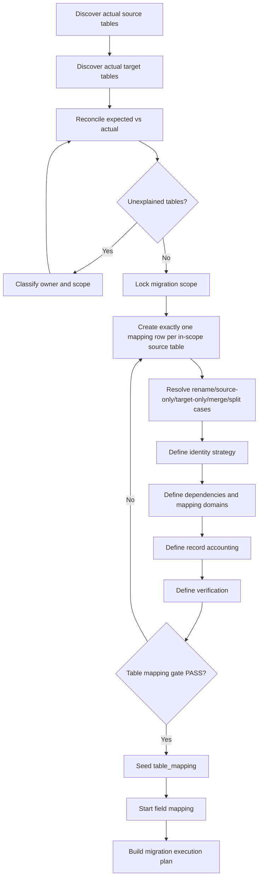

# Generic Database Table Mapping Migration Plan

## Purpose

This document defines a reusable, database-agnostic plan for producing a complete table-level migration mapping between any source database/schema and target database/schema.

It is intended for CMS/core migrations, third-party extensions, custom components/modules, application database upgrades, platform-to-platform migrations, and version-to-version schema migrations.

The objective is not to force every source table to be copied. The objective is to ensure that **every table in migration scope is discovered, classified, mapped, accounted for, and verifiable**.

> **100% table mapping means 100% of actual in-scope source tables are accounted for and 100% of required target tables have an explicit resolution strategy.**
>
> It does **not** mean every source table must be copied row-for-row.

---

## 1. Core Guarantee

A table mapping may claim `100% TABLE MAPPING COVERAGE` only when:

```text
actual_source_tables_in_scope
= unique_source_mapping_rows

missing_source_tables      = 0
duplicate_source_mappings  = 0
unclassified_source_tables = 0
ambiguous_decisions        = 0

required_target_tables
= classified_target_tables

unclassified_target_tables = 0
unresolved_dependencies    = 0
unverifiable_mappings      = 0
```

A production migration may claim `PASS` only after runtime row accounting and verification also pass.

---

## 2. Required Inputs

Do not start table mapping from memory, assumptions, documentation-only lists, or wildcard names.

### 2.1 Source inventory

Capture at minimum:

```text
source_database
source_schema
source_version
source_table
row_count
engine
primary_key
unique_keys
physical_foreign_keys
logical_dependencies
owner/domain
runtime/generated/system/business classification
```

Every physical table in the actual source database must first be discovered before scope exclusion is applied.

### 2.2 Target inventory

Capture at minimum:

```text
target_database
target_schema
target_version
target_table
engine
primary_key
unique_keys
physical_foreign_keys
required dependencies
ownership
runtime/generated/system/business classification
```

### 2.3 Expected baselines

Official schemas, vendor manifests, ERDs, previous inventories, or migration documents may be used as baselines, but never as substitutes for the actual production inventory.

Always reconcile:

```text
actual source vs expected source
actual target vs expected target
```

---

## 3. Inventory Reconciliation Gate

Build these sets:

```text
EXPECTED_SOURCE
ACTUAL_SOURCE
EXPECTED_TARGET
ACTUAL_TARGET
```

Calculate:

```text
SOURCE_EXTRA   = ACTUAL_SOURCE - EXPECTED_SOURCE
SOURCE_MISSING = EXPECTED_SOURCE - ACTUAL_SOURCE
TARGET_EXTRA   = ACTUAL_TARGET - EXPECTED_TARGET
TARGET_MISSING = EXPECTED_TARGET - ACTUAL_TARGET
```

Every difference must be classified, for example:

```text
custom table
third-party table
obsolete table
vendor-version difference
installation-generated table
runtime table
unexpected production table
missing expected component
```

Hard gate:

```text
unexplained_source_tables = 0
unexplained_target_tables = 0
```

If an unexpected table is not classified, mapping is incomplete.

---

## 4. Define Migration Scope

Every discovered source table must be assigned exactly one scope state:

```text
IN_SCOPE
OUT_OF_SCOPE_WITH_REASON
```

Out-of-scope does not mean invisible. Every excluded table still records:

```text
table
owner
reason
approval/policy
expected handling
```

Scope invariant:

```text
discovered_source_tables
= in_scope_tables
+ explicitly_out_of_scope_tables

unaccounted_discovered_tables = 0
```

---

## 5. Canonical Table Mapping Decisions

Every in-scope source table receives exactly one final decision.

| Decision | Meaning |
|---|---|
| `DIRECT` | Same business entity and compatible target structure; row mapping is mainly direct. |
| `TRANSFORM` | Source records migrate with schema or semantic transformation. |
| `LOOKUP` | Source table primarily resolves target-owned identities/reference data. |
| `REBUILD` | Do not copy generated/derived rows; regenerate target data from migrated canonical data. |
| `RECREATE` | Recreate target-compatible configuration/state instead of copying source rows. |
| `REFERENCE_ONLY` | Use source data for semantic reconciliation while target owns active rows. |
| `TARGET_OWNED` | Target installation/application owns the active table state. |
| `ARCHIVE` | Preserve source records outside active target behavior. |
| `IGNORE` | Intentionally do not migrate active runtime/ephemeral/security state; rows remain accounted. |

Forbidden final states:

```text
UNKNOWN
REVIEW
PENDING
OPTIONAL
SELECTIVE
MAYBE
A / B
AMBIGUOUS
UNMAPPED
```

Decision gate:

```text
final_source_decisions = source_tables_in_scope
ambiguous_decisions    = 0
```

---

## 6. Source-to-Target Structural Cases

The plan must explicitly cover every case below.

### Case A — one source → same target

```text
source.customer -> target.customer
```

Same name never automatically means `DIRECT`.

### Case B — renamed table

```text
source.old_history -> target.history
```

Usually `TRANSFORM`.

### Case C — source-only table

Must resolve to one of:

```text
TRANSFORM elsewhere
ARCHIVE
IGNORE
REBUILD elsewhere
```

Silent deletion is prohibited.

### Case D — target-only table

Must classify as:

```text
TARGET_OWNED
GENERATED_FROM_OTHER_SOURCE
RECREATE
DEFAULT_INITIALIZED
NOT_REQUIRED_WITH_REASON
```

### Case E — many source tables → one target

Require:

```text
merge/rebuild strategy
merge key
collision strategy
deduplication/order rule
source row accounting
verification
```

### Case F — one source table → many targets

Require:

```text
all destinations
generation/split conditions
identity flow
dependency order
verification for each target
```

### Case G — many-to-many restructuring

Use an explicit intermediate identity model or dedicated mapping specification. Do not hide it behind one vague `TRANSFORM` row.

### Case H — system/reference table

Prefer semantic identity over numeric ID equality.

### Case I — runtime/generated table

Examples:

```text
sessions
cache
search index
scheduler history
temporary tokens
computed aggregates
```

Usually `IGNORE`, `REBUILD`, `RECREATE`, or `TARGET_OWNED`.

### Case J — historical/compliance table

Choose explicitly between `TRANSFORM`, `ARCHIVE`, and `REFERENCE_ONLY`, considering retention requirements.

---

## 7. Canonical Mapping Row

Create exactly one source mapping row for each in-scope source table.

| Column | Required | Purpose |
|---|:---:|---|
| `source_version` | Yes | Source schema/application version. |
| `source_group` | Yes | Migration group/workstream. |
| `source_table` | Yes | Physical source table. |
| `source_owner` | Yes | Core/extension/component/domain owner. |
| `target_version` | Yes | Target schema/application version. |
| `target_table` | Conditional | Main target destination; null only for explicit no-active-target outcomes. |
| `mapping_type` | Yes | Final canonical decision. |
| `id_strategy` | Yes | Identity-resolution strategy. |
| `identity_key` | Yes | Stable identity or explicit source-ID strategy. |
| `depends_on` | Yes | Required state/maps/tables before execution. |
| `produces_map` | Yes | Mapping domains produced. |
| `consumes_maps` | Yes | Mapping domains consumed. |
| `execution_order` | Yes | Planning order/batch. |
| `record_strategy` | Yes | Row-accounting outcome. |
| `verification_rule` | Yes | Deterministic verification strategy. |
| `reason` | Yes | Why the decision is correct. |

Recommended unique key:

```text
(source_version, source_table)
```

For multiple databases/schemas:

```text
(source_database, source_schema, source_version, source_table)
```

---

## 8. Identity Strategy

Every table must select one identity strategy.

| Strategy | Meaning |
|---|---|
| `PRESERVE` | Source ID is deliberately preserved and proven safe. |
| `ID_MAP` | Target ID may differ; persist source → target mapping. |
| `SEMANTIC_LOOKUP` | Resolve target via stable semantic/business identity. |
| `GENERATED` | Target identity is generated/rebuilt. |
| `NONE` | Table has no independently mapped entity identity. |

Never assume:

```text
source.id = target.id
```

unless preservation is explicitly proven and verified.

For semantic lookup, document a stable key such as:

```text
external_code
business_uuid
language_code
slug + tenant
email + tenant
type + element + folder + client_id
```

Do not invent a natural key when uniqueness is not guaranteed.

---

## 9. Mapping Domains

Use named domains for reusable identity resolution, for example:

```text
USER
CATEGORY
PRODUCT
ORDER
MENU
MODULE
EXTENSION
TAG
CUSTOMER
ACCOUNT
```

Each domain defines:

```text
producer
identity rule
source key
target key
uniqueness rule
collision policy
verification query
```

Runtime source→target values belong in a value/ID mapping store, not the static table contract.

---

## 10. Dependency Mapping

Every mapping row must define dependencies from:

1. physical foreign keys
2. logical foreign keys
3. semantic lookups
4. generated-data dependencies
5. application/runtime dependencies
6. structured/embedded references identified later at field level

Recommended metadata:

```text
depends_on
produces_map
consumes_maps
```

Hard gate:

```text
required_dependencies_defined = 100%
unresolved_dependencies       = 0
```

### Circular dependencies

Resolve cycles explicitly, for example:

```text
create base entity
-> create ID map
-> backfill circular reference
-> verify relationship
```

Do not hide cycles by arbitrary execution order.

---

## 11. Migration Grouping and Order

Group names are optional; dependency order is mandatory.

Reusable grouping pattern:

```text
G0 System / Reference
G1 Identity / Access
G2 Shared Definitions / Taxonomy
G3 Primary Business Entities
G4 Relations / Associations
G5 Presentation / Configuration
G6 Dependent Features
G7 Supporting Business Domains
G8 Runtime / Generated / Target-Owned
```

Projects may rename groups. Execution order must remain derivable from dependencies, not group labels alone.

---

## 12. Table Ownership Classification

Classify each table to help validate the mapping decision:

```text
BUSINESS_DATA
REFERENCE_DATA
CONFIGURATION
SYSTEM_METADATA
RUNTIME
GENERATED
HISTORICAL
SECURITY_STATE
TARGET_OWNED
THIRD_PARTY
CUSTOM
```

Ownership is an aid, not the final decision.

Typical patterns:

```text
BUSINESS_DATA   -> DIRECT / TRANSFORM
REFERENCE_DATA  -> LOOKUP / REFERENCE_ONLY
GENERATED       -> REBUILD
RUNTIME         -> IGNORE / REBUILD
SECURITY_STATE  -> IGNORE / RECREATE
HISTORICAL      -> TRANSFORM / ARCHIVE
TARGET_OWNED    -> TARGET_OWNED / REFERENCE_ONLY
```

---

## 13. Record Accounting Contract

Every source table needs a record-accounting strategy.

Canonical equation:

```text
source_rows
=
  migrated_rows
+ transformed_rows
+ rebuilt_source_rows
+ reference_only_rows
+ archived_rows
+ ignored_rows
+ error_rows
```

Required final conditions:

```text
error_rows       = 0
unaccounted_rows = 0
```

`REBUILD`, `REFERENCE_ONLY`, `ARCHIVE`, and `IGNORE` are valid accounted outcomes when explicitly contracted and verified.

---

## 14. Verification Strategy per Mapping Type

Every mapping row must have deterministic verification.

### `DIRECT`

```text
expected source rows = target mapped rows
identity uniqueness passes
required relationships pass
```

### `TRANSFORM`

```text
all source rows accounted
expected transformed targets exist
transformation errors = 0
```

### `LOOKUP` / `REFERENCE_ONLY`

```text
every required source identity resolves to exactly one target identity
missing = 0
ambiguous = 0
```

### `REBUILD`

```text
all source rows accounted as rebuild input
rebuild completes
rebuilt integrity passes
```

Do not require source count = rebuilt target count unless the model guarantees it.

### `RECREATE`

Verify target-compatible configuration/state exists and matches approved semantics.

### `TARGET_OWNED`

Verify required target state exists and source data did not overwrite target ownership incorrectly.

### `ARCHIVE`

```text
archived_rows = source_rows
archive table/source/key/reason traceable
```

### `IGNORE`

```text
ignored_rows = source_rows
explicit reason exists
no required business dependency still needs ignored data
```

---

## 15. Target Coverage Gate

Source coverage alone is insufficient.

Run a target anti-join:

```text
required_target_tables
MINUS
resolved_target_tables
```

Every remainder must be classified as:

```text
TARGET_OWNED
REBUILD
RECREATE
GENERATED_FROM_OTHER_SOURCE
DEFAULT_INITIALIZED
NOT_REQUIRED_WITH_REASON
```

Hard gate:

```text
required_target_tables        = classified_target_tables
unclassified_required_targets = 0
```

---

## 16. Source-Only and Target-Only Gate

### Source-only tables

For each one:

- identify owner/classification
- check active business dependencies
- choose `TRANSFORM`, `ARCHIVE`, `IGNORE`, or `REBUILD`
- define row accounting
- define verification
- prohibit silent deletion

### Target-only tables

For each one:

- explain why it exists
- classify ownership
- identify target default/generated/recreated/derived behavior
- define dependencies
- define verification

---

## 17. Merge / Split Mapping Gate

### Many-to-one

Require:

```text
all source tables explicitly listed
merge key defined
collision policy defined
deduplication/order defined
source accounting defined
verification defined
```

### One-to-many

Require:

```text
all target destinations explicitly listed
split/generation condition defined
identity flow defined
transaction/retry behavior defined
verification for every destination defined
```

### Many-to-many restructuring

Require a dedicated mapping specification or intermediate staging/identity model.

---

## 18. Runtime, Generated, Security, and Target-Owned Gate

Explicitly review tables for:

```text
sessions
cache
remember-me/authentication tokens
temporary credentials
MFA/WebAuthn enrollment state
search indexes
materialized/generated indexes
scheduler/runtime logs
job locks
application version metadata
update metadata
installation metadata
computed aggregates
target default configuration
```

Each matching table must deliberately resolve to one of:

```text
IGNORE
REBUILD
RECREATE
TARGET_OWNED
ARCHIVE
```

---

## 19. Constraint Risk Review

Before a mapping is executable, review:

```text
primary keys
composite primary keys
unique keys
physical foreign keys
logical uniqueness
partitioning
engine differences
collation/case sensitivity
required child records
cascade behavior
```

If target uniqueness can collapse multiple source rows, define a collision policy before migration.

---

## 20. Field Mapping Handoff

Table mapping is the parent contract for field mapping.

Field mapping must not begin until table mapping passes.

Field mapping inherits:

```text
source table identity
target destination
table decision
identity strategy
dependency context
mapping domains
execution group/order
```

Table mapping answers:

> Where and how does this source table belong in the target model?

Field mapping answers:

> How is every source field and every required target field populated or resolved?

---

## 21. Database Seed Contract

Suggested logical `table_mapping` schema:

```text
id
source_database
source_schema
source_version
source_group
source_table
source_owner

target_database
target_schema
target_version
target_table

mapping_type
id_strategy
identity_key
record_strategy
execution_order
verification_rule
reason
status
```

Dependencies may remain normalized in the existing dependency structure. Runtime identities belong in a separate `value_mapping`/ID mapping store.

Recommended unique key:

```text
(source_database, source_schema, source_version, source_table)
```

---

## 22. Seed Validation Queries

Coverage:

```sql
SELECT
    COUNT(*) AS mapping_rows,
    COUNT(DISTINCT source_table) AS unique_source_tables
FROM table_mapping
WHERE source_version = :source_version;
```

Expected:

```text
mapping_rows         = actual in-scope source table count
unique_source_tables = actual in-scope source table count
```

Duplicate check:

```sql
SELECT source_table, COUNT(*) AS mapping_count
FROM table_mapping
WHERE source_version = :source_version
GROUP BY source_table
HAVING COUNT(*) <> 1;
```

Expected: `0 rows`.

Unfinished decision check:

```sql
SELECT *
FROM table_mapping
WHERE mapping_type IS NULL
   OR mapping_type IN ('UNKNOWN', 'REVIEW', 'PENDING', 'AMBIGUOUS');
```

Expected: `0 rows`.

---

## 23. Reusable Workflow



---

# 24. 100% Table Mapping Checklist

## A. Inventory completeness

- [ ] Actual source database scanned.
- [ ] Actual target database scanned.
- [ ] Every physical source table discovered.
- [ ] Every physical target table discovered.
- [ ] Expected source reconciled with actual source.
- [ ] Expected target reconciled with actual target.
- [ ] Source extra tables classified.
- [ ] Source missing tables explained.
- [ ] Target extra tables classified.
- [ ] Target missing tables explained.
- [ ] Unexplained source tables = 0.
- [ ] Unexplained target tables = 0.

## B. Scope completeness

- [ ] Every discovered source table is `IN_SCOPE` or `OUT_OF_SCOPE_WITH_REASON`.
- [ ] Every exclusion has an explicit reason.
- [ ] Third-party tables classified.
- [ ] Custom tables classified.
- [ ] Runtime/staging/backup tables classified.
- [ ] Unaccounted discovered tables = 0.

## C. Source mapping coverage

- [ ] Every in-scope source table has exactly one mapping row.
- [ ] Unique mapping keys equal in-scope source table count.
- [ ] Missing source mappings = 0.
- [ ] Duplicate source mappings = 0.
- [ ] Wildcard-only mappings = 0.

## D. Mapping decision quality

- [ ] Every source table has one final canonical decision.
- [ ] `UNKNOWN = 0`.
- [ ] `REVIEW = 0`.
- [ ] `PENDING = 0`.
- [ ] `OPTIONAL = 0`.
- [ ] `AMBIGUOUS = 0`.
- [ ] `A / B = 0`.
- [ ] Every `IGNORE` has a reason.
- [ ] Every `ARCHIVE` has an archive rule.
- [ ] Every `REBUILD` has a rebuild rule.
- [ ] Every `TARGET_OWNED` has an ownership reason.

## E. Structural mapping cases

- [ ] Same-name tables validated semantically.
- [ ] Renamed tables explicitly mapped.
- [ ] Source-only tables classified.
- [ ] Target-only tables classified.
- [ ] Many-source → one-target cases handled.
- [ ] One-source → many-target cases handled.
- [ ] Many-to-many restructures handled.
- [ ] System/reference tables handled.
- [ ] Runtime/generated tables handled.
- [ ] Historical/compliance tables handled.
- [ ] Silent table deletion paths = 0.

## F. Identity strategy

- [ ] Every table has an ID strategy.
- [ ] `PRESERVE` only when proven safe.
- [ ] `ID_MAP` producers identified.
- [ ] `SEMANTIC_LOOKUP` keys documented.
- [ ] Generated identities documented.
- [ ] No-identity tables explicitly use `NONE`.
- [ ] Numeric source/target ID equality is never assumed implicitly.
- [ ] Identity collision policy defined where required.

## G. Dependency coverage

- [ ] Physical FK dependencies inventoried.
- [ ] Logical dependencies inventoried.
- [ ] Semantic lookup dependencies inventoried.
- [ ] Generated-data dependencies inventoried.
- [ ] Required mapping domains defined.
- [ ] Map producers identified.
- [ ] Map consumers identified.
- [ ] Circular dependencies identified.
- [ ] Circular backfill/phased strategy defined.
- [ ] Unresolved dependencies = 0.

## H. Ownership / safety

- [ ] Business-data tables classified.
- [ ] Reference-data tables classified.
- [ ] Configuration tables classified.
- [ ] System metadata classified.
- [ ] Runtime tables classified.
- [ ] Generated tables classified.
- [ ] Historical tables classified.
- [ ] Security-state tables classified.
- [ ] Target-owned tables classified.
- [ ] Third-party/custom ownership classified.

## I. Record accounting

- [ ] Every source table has a record strategy.
- [ ] Migrated rows accounted.
- [ ] Transformed rows accounted.
- [ ] Rebuild source rows accounted.
- [ ] Reference-only rows accounted.
- [ ] Archived rows accounted.
- [ ] Ignored rows accounted.
- [ ] Error bucket defined.
- [ ] `unaccounted_rows = 0` required for PASS.
- [ ] `error_rows = 0` required for production PASS.

## J. Verification coverage

- [ ] Every table has a verification rule.
- [ ] Direct verification defined.
- [ ] Transform verification defined.
- [ ] Lookup/reference verification defined.
- [ ] Rebuild verification defined.
- [ ] Recreate verification defined.
- [ ] Target-owned verification defined.
- [ ] Archive verification defined.
- [ ] Ignore verification defined.
- [ ] Unverifiable mappings = 0.

## K. Target coverage

- [ ] Every required target table has a resolution strategy.
- [ ] Target-only tables classified.
- [ ] Generated target tables classified.
- [ ] Target default/initialization tables classified.
- [ ] Target-owned tables classified.
- [ ] Missing required target resolution = 0.

## L. Constraint risk

- [ ] Source PK strategy reviewed.
- [ ] Target PK strategy reviewed.
- [ ] Composite keys reviewed.
- [ ] Unique-key collision risk reviewed.
- [ ] FK/cascade behavior reviewed.
- [ ] Collation/case-sensitive identity risk reviewed.
- [ ] Partition/merge implications reviewed.
- [ ] Unresolved constraint collision = 0.

## M. Seed readiness

- [ ] Mapping row schema standardized.
- [ ] Canonical enums standardized.
- [ ] Unique source mapping key defined.
- [ ] Mapping rows insert deterministically.
- [ ] Re-running seed does not create duplicates.
- [ ] Dependencies are queryable.
- [ ] Mapping domains are queryable.
- [ ] Verification rules are queryable.
- [ ] Runtime IDs/values are separate from the static contract.

## N. Field-mapping handoff

- [ ] Table mapping gate passes before field mapping starts.
- [ ] Every source table has a stable destination/decision.
- [ ] Field mapping can inherit identity strategy.
- [ ] Field mapping can inherit dependency context.
- [ ] Target-only field resolution cannot silently modify the table contract.

---

# 25. Final Definition-Level QA Gate

Declare the table-mapping document complete only when:

```text
INVENTORY
------------------------------------------------
Actual source tables discovered       = 100%
Actual target tables discovered       = 100%
Unexplained source tables             = 0
Unexplained target tables             = 0

SCOPE
------------------------------------------------
Discovered source tables accounted    = 100%
Unaccounted discovered tables         = 0

SOURCE MAPPING
------------------------------------------------
In-scope source tables                = N
Source mapping rows                   = N
Unique source mapping keys            = N
Missing source mappings               = 0
Duplicate source mappings             = 0
Wildcard-only mappings                = 0

DECISIONS
------------------------------------------------
Final mapping decisions               = N / N
Unknown                               = 0
Review                                = 0
Pending                               = 0
Optional                              = 0
Ambiguous                             = 0
Slash decisions                       = 0

TARGET
------------------------------------------------
Required target tables                = M
Target tables classified/resolved     = M
Unclassified required targets         = 0

IDENTITY / DEPENDENCY
------------------------------------------------
ID strategies defined                = N / N
Required mapping domains defined      = 100%
Map producers identified              = 100%
Map consumers identified              = 100%
Unresolved dependencies               = 0
Unresolved cycles                     = 0

ACCOUNTING
------------------------------------------------
Record strategies defined             = N / N
Silent-drop table paths               = 0

VERIFICATION
------------------------------------------------
Verification rules defined            = N / N
Unverifiable mappings                 = 0

DATABASE SEED
------------------------------------------------
Seed-ready source rows                = N / N
Unique DB source keys                 = N / N
Invalid mapping enums                 = 0

================================================
TABLE MAPPING CONTRACT                = PASS
================================================
```

---

# 26. Production Execution Gate

Definition-level `PASS` does not prove migration success.

Production migration can only be marked `PASS` when actual execution verifies:

```text
actual_schema_unknown_tables     = 0
actual_unmapped_tables           = 0
ambiguous_identity_resolutions   = 0
unresolved_dependencies          = 0
unaccounted_source_rows          = 0
migration_error_rows             = 0
missing_target_records           = 0
unexpected_target_records        = 0
broken_relationships             = 0
constraint_violations            = 0
verification_failures            = 0
```

This distinction prevents documentation-level `100%` from being mistaken for a production guarantee.

---

# 27. Reusable Output Template

A generated project-specific document should follow this structure:

```text
table-mapping-migration.md

1. Purpose
2. Scope and Versions
3. Source/Target Inventory Summary
4. Inventory Reconciliation
5. Mapping Decision Definitions
6. Identity Strategy Definitions
7. Verification Rule Definitions
8. Source Table Mapping Matrix
9. Target-Only Table Resolution
10. Source-Only Table Resolution
11. Merge/Split Mapping Cases
12. Dependency and Mapping-Domain Matrix
13. Record Accounting Rules
14. Constraint Risk Review
15. Database Seed Contract
16. 100% Mapping Checklist
17. Definition-Level QA Gate
18. Production Execution Gate
```

---

# 28. Final Rule

> **Never calculate 100% mapping coverage from an expected vendor table list alone. Calculate it from the actual production inventory after scope classification.**

Reusable invariant:

```text
100% TABLE MAPPING
=
100% actual source-table accounting
+ 100% final source mapping decisions
+ 100% required target-table resolution
+ 100% identity/dependency definition
+ 100% record-accounting strategy
+ 100% verification strategy
+ 0 unknown
+ 0 duplicate
+ 0 ambiguous
+ 0 silent drop
```

Only after this contract passes should field mapping and migration execution planning begin.
