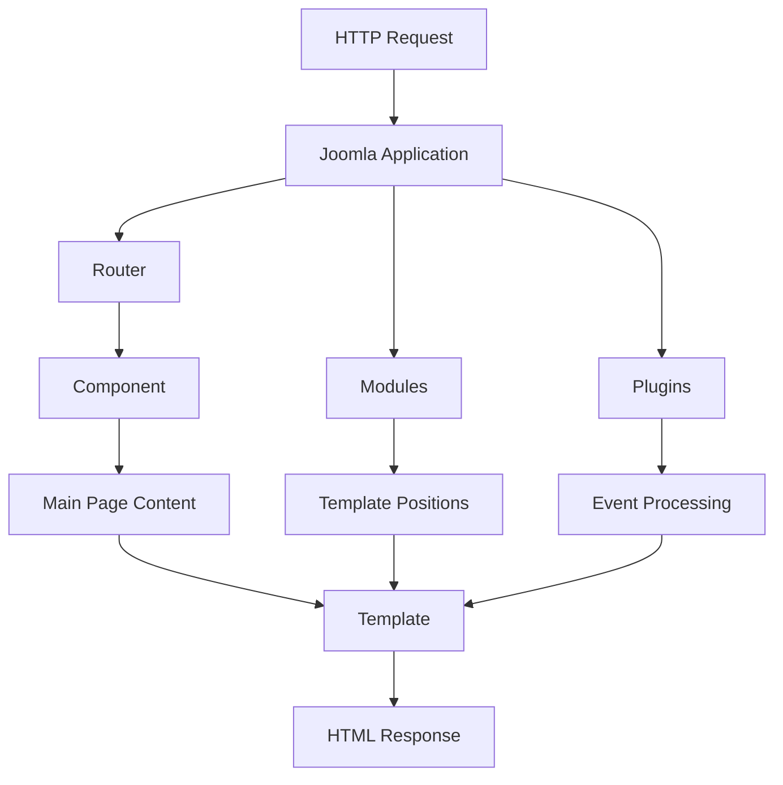
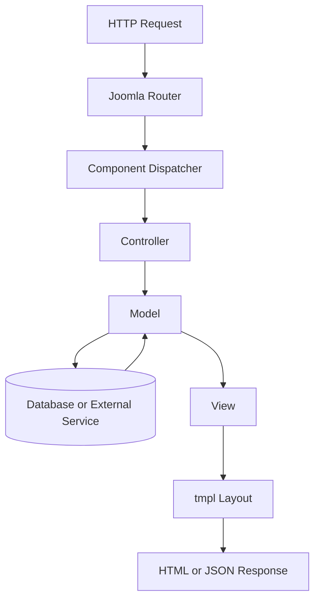
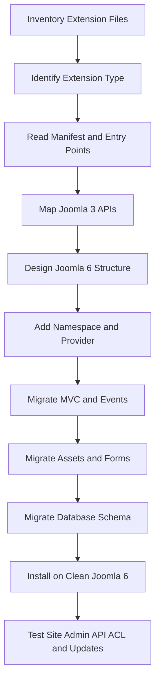

# Joomla 6 Extension Structure

A practical reference for understanding, creating, reviewing, and migrating Joomla 6 extensions.

This guide explains:

- The eight Joomla extension types.
- The difference between an installation package and installed files.
- A complete Joomla 6 component structure.
- Modern namespaces, dependency injection, MVC, forms, ACL, database migrations, language files, and web assets.
- Recommended structures for modules, plugins, templates, libraries, languages, packages, and file extensions.
- Which files are required, recommended, or optional.
- Common Joomla 3-to-Joomla 6 migration issues.

> **Target environment:** Joomla 6 and modern PHP versions. The examples use Joomla's namespaced APIs, service providers, dependency injection, MVC conventions, and Web Asset Manager.

---

<a id="table-of-contents"></a>
## Table of Contents

1. [Extension Architecture Overview](#extension-architecture-overview)
2. [The Eight Joomla Extension Types](#extension-types)
3. [Installation Package vs Installed Structure](#package-vs-installed)
4. [Naming Conventions](#naming-conventions)
5. [Complete Joomla 6 Component Structure](#component-structure)
6. [Component Manifest File](#component-manifest)
7. [Administrator Application](#administrator-application)
8. [Site Application](#site-application)
9. [API Application and Web Services](#api-application)
10. [Dependency Injection and Service Providers](#dependency-injection)
11. [Namespaces and PSR-4 Autoloading](#namespaces)
12. [MVC Request Flow](#mvc-flow)
13. [Controllers](#controllers)
14. [Models](#models)
15. [Views and Layouts](#views-layouts)
16. [Table Classes](#table-classes)
17. [Forms and Custom Fields](#forms-fields)
18. [ACL and Component Configuration](#acl-configuration)
19. [Database Installation and Migrations](#database)
20. [Media and Web Asset Manager](#media-assets)
21. [Language Files](#language-files)
22. [Installer Script](#installer-script)
23. [Update Server](#update-server)
24. [Module Structure](#module-structure)
25. [Plugin Structure](#plugin-structure)
26. [Template Structure](#template-structure)
27. [Library Structure](#library-structure)
28. [Language Extension Structure](#language-extension-structure)
29. [Package Structure](#package-structure)
30. [File Extension Structure](#file-extension-structure)
31. [Installed Paths Reference](#installed-paths)
32. [Required, Recommended, and Optional Files](#required-files)
33. [Joomla 3 to Joomla 6 Migration Notes](#migration-notes)
34. [Validation Checklist](#validation-checklist)
35. [Official References](#official-references)

---

<a id="extension-architecture-overview"></a>
## 1. Extension Architecture Overview

A Joomla extension is an installable software unit that adds functionality, presentation, integration, language support, or shared code to Joomla.

Joomla creates a page by coordinating several extension types:



The most important distinction is:

| Concept | Meaning | Example |
|---|---|---|
| Extension type | How the extension works | Component, module, plugin |
| Extension origin | Who created it | Joomla Core, third-party, custom |
| Client | Where it runs | Site, Administrator, API |
| Package structure | Files before installation | ZIP source structure |
| Installed structure | Files after installation | Files distributed into Joomla folders |

[Back to Table of Contents](#table-of-contents)

---

<a id="extension-types"></a>
## 2. The Eight Joomla Extension Types

Joomla supports eight extension types.

| Type | Common technical name | Main responsibility |
|---|---|---|
| Component | `com_example` | Main application or business feature |
| Module | `mod_example` | Small content block in a template position |
| Plugin | `plg_group_example` | Event-based processing and integration |
| Template | Template name | Site or administrator presentation |
| Language | `en-GB`, `vi-VN` | Translated interface strings |
| Library | `lib_example` | Shared reusable PHP code |
| Package | `pkg_example` | Bundle of multiple extensions |
| File | `files_example` | Install or update an arbitrary file collection |

### 2.1. Component

A component is the main application rendered in the central page area. It may include:

- Administrator management screens.
- Frontend pages.
- Database tables.
- Forms and filters.
- ACL rules.
- API endpoints.
- Routing.

Examples: `com_content`, `com_users`, `com_contact`, and custom business components.

### 2.2. Module

A module renders a smaller block in a template position such as `sidebar-right`, `topbar`, or `footer`.

Examples: menus, login forms, latest articles, banners, search forms, and custom dashboards.

### 2.3. Plugin

A plugin subscribes to Joomla events and runs when those events are dispatched.

Common plugin groups include:

- `system`
- `content`
- `user`
- `authentication`
- `extension`
- `webservices`
- `task`
- `console`
- `editors`
- `editors-xtd`
- `finder`

### 2.4. Template

A template controls the final layout and visual presentation. Joomla has separate site and administrator templates.

### 2.5. Language

A language extension installs translated Joomla interface strings.

### 2.6. Library

A library contains shared code used by several extensions. It usually has no direct page output.

### 2.7. Package

A package installs several related extensions in one operation.

### 2.8. File

A file extension installs a defined collection of files when none of the other extension types is appropriate.

[Back to Table of Contents](#table-of-contents)

---

<a id="package-vs-installed"></a>
## 3. Installation Package vs Installed Structure

A common source of confusion is that a component ZIP structure does not always match its final Joomla filesystem structure.

### Installation package

This is the source directory compressed into a ZIP file and uploaded through Joomla's installer.

```text
com_example.zip
└── com_example/
    ├── example.xml
    ├── administrator/
    ├── site/
    ├── api/
    ├── media/
    ├── language/
    └── script.php
```

### Installed structure

The installer reads the manifest and distributes files into Joomla:

```text
joomla-root/
├── administrator/components/com_example/
├── components/com_example/
├── api/components/com_example/
├── media/com_example/
├── administrator/language/en-GB/
└── language/en-GB/
```

> The manifest controls where files are copied. Folder names inside the ZIP are packaging decisions; installed paths are Joomla runtime locations.

### Two valid packaging styles

A component package may use either:

1. Joomla destination-like folders:

```text
administrator/components/com_example/
components/com_example/
```

2. Simplified source folders:

```text
administrator/
site/
api/
```

Both can work when the manifest's `folder` attributes correctly map source folders to Joomla destinations. Consistency is more important than the chosen packaging style.

[Back to Table of Contents](#table-of-contents)

---

<a id="naming-conventions"></a>
## 4. Naming Conventions

Use consistent technical names.

| Item | Recommended format | Example |
|---|---|---|
| Component element | `com_<name>` | `com_example` |
| Module element | `mod_<name>` | `mod_example` |
| Plugin package name | `plg_<group>_<name>` | `plg_system_example` |
| Plugin installed folder | `plugins/<group>/<name>` | `plugins/system/example` |
| Package | `pkg_<name>` | `pkg_example` |
| Library | `lib_<name>` | `lib_example` |
| Component manifest | `<name>.xml` or `com_<name>.xml` | `example.xml` |
| Module manifest | `mod_<name>.xml` | `mod_example.xml` |
| Plugin manifest | `<name>.xml` | `example.xml` |
| Template manifest | `templateDetails.xml` | Fixed filename |
| Language manifest | `install.xml` | Fixed convention |

### Recommended namespaces

```text
Vendor\Component\Example
Vendor\Module\Example
Vendor\Plugin\System\Example
Vendor\Library\Example
```

Namespace segments and directory names are case-sensitive on Linux.

[Back to Table of Contents](#table-of-contents)

---

<a id="component-structure"></a>
## 5. Complete Joomla 6 Component Structure

The following is a comprehensive structure. A small component does not need every optional directory.

```text
com_example/
├── example.xml                         # Installation manifest
├── script.php                          # Optional installer lifecycle script
│
├── administrator/
│   ├── access.xml                      # ACL action definitions
│   ├── config.xml                      # Global component options
│   ├── forms/
│   │   ├── item.xml                    # Edit form
│   │   └── filter_items.xml            # List filters and pagination
│   ├── services/
│   │   └── provider.php                # DI service provider / boot entry point
│   ├── sql/
│   │   ├── install.mysql.utf8mb4.sql
│   │   ├── uninstall.mysql.utf8mb4.sql
│   │   └── updates/
│   │       └── mysql/
│   │           ├── 1.0.1.sql
│   │           └── 1.1.0.sql
│   ├── src/
│   │   ├── Controller/
│   │   │   ├── DisplayController.php
│   │   │   ├── ItemController.php
│   │   │   └── ItemsController.php
│   │   ├── Extension/
│   │   │   └── ExampleComponent.php
│   │   ├── Field/
│   │   │   └── ExampleField.php
│   │   ├── Helper/
│   │   │   └── ExampleHelper.php
│   │   ├── Model/
│   │   │   ├── ItemModel.php
│   │   │   └── ItemsModel.php
│   │   ├── Rule/
│   │   │   └── ExampleRule.php
│   │   ├── Service/
│   │   │   ├── HTML/
│   │   │   │   └── AdministratorService.php
│   │   │   └── Router.php
│   │   ├── Table/
│   │   │   └── ItemTable.php
│   │   └── View/
│   │       ├── Item/
│   │       │   └── HtmlView.php
│   │       └── Items/
│   │           └── HtmlView.php
│   └── tmpl/
│       ├── item/
│       │   └── edit.php
│       └── items/
│           └── default.php
│
├── site/
│   ├── forms/
│   │   └── item.xml
│   ├── services/
│   │   └── provider.php                # Needed only for a separate site provider design
│   ├── src/
│   │   ├── Controller/
│   │   │   └── DisplayController.php
│   │   ├── Extension/
│   │   │   └── ExampleComponent.php
│   │   ├── Helper/
│   │   │   └── RouteHelper.php
│   │   ├── Model/
│   │   │   ├── ItemModel.php
│   │   │   └── ItemsModel.php
│   │   ├── Service/
│   │   │   └── Router.php
│   │   └── View/
│   │       ├── Item/
│   │       │   └── HtmlView.php
│   │       └── Items/
│   │           └── HtmlView.php
│   └── tmpl/
│       ├── item/
│       │   └── default.php
│       └── items/
│           └── default.php
│
├── api/
│   └── src/
│       ├── Controller/
│       │   └── ItemsController.php
│       └── View/
│           └── Items/
│               └── JsonapiView.php
│
├── media/
│   ├── css/
│   │   ├── admin.css
│   │   └── site.css
│   ├── images/
│   │   └── icon.svg
│   ├── js/
│   │   ├── admin.js
│   │   └── site.js
│   └── joomla.asset.json
│
└── language/
    ├── administrator/
    │   └── en-GB/
    │       ├── com_example.ini
    │       └── com_example.sys.ini
    └── site/
        └── en-GB/
            └── com_example.ini
```

### Important design note

A component normally uses one primary `services/provider.php`, conventionally installed on the administrator side, to register the component extension and factories used by the Site and Administrator applications. Do not duplicate providers unless the architecture genuinely requires separate registrations.

[Back to Table of Contents](#table-of-contents)

---

<a id="component-manifest"></a>
## 6. Component Manifest File

The manifest is the most important installation file. Joomla uses it to identify the extension and decide which files, SQL scripts, media, languages, and update servers must be installed.

```xml
<?xml version="1.0" encoding="UTF-8"?>
<extension type="component" method="upgrade">
    <name>COM_EXAMPLE</name>
    <element>com_example</element>
    <author>Example Company</author>
    <creationDate>2026-08</creationDate>
    <copyright>(C) 2026 Example Company</copyright>
    <license>GNU General Public License version 2 or later</license>
    <authorEmail>dev@example.com</authorEmail>
    <authorUrl>https://example.com</authorUrl>
    <version>1.0.0</version>
    <description>COM_EXAMPLE_XML_DESCRIPTION</description>

    <namespace path="src">Acme\Component\Example</namespace>

    <files folder="site">
        <folder>forms</folder>
        <folder>src</folder>
        <folder>tmpl</folder>
    </files>

    <administration>
        <menu img="class:component">COM_EXAMPLE</menu>

        <files folder="administrator">
            <filename>access.xml</filename>
            <filename>config.xml</filename>
            <folder>forms</folder>
            <folder>services</folder>
            <folder>sql</folder>
            <folder>src</folder>
            <folder>tmpl</folder>
        </files>
    </administration>

    <media destination="com_example" folder="media">
        <folder>css</folder>
        <folder>images</folder>
        <folder>js</folder>
        <filename>joomla.asset.json</filename>
    </media>

    <languages folder="language/site">
        <language tag="en-GB">en-GB/com_example.ini</language>
    </languages>

    <administration>
        <!-- Merge this content into the single administration element in a real manifest. -->
    </administration>

    <install>
        <sql>
            <file driver="mysql" charset="utf8mb4">
                administrator/sql/install.mysql.utf8mb4.sql
            </file>
        </sql>
    </install>

    <uninstall>
        <sql>
            <file driver="mysql" charset="utf8mb4">
                administrator/sql/uninstall.mysql.utf8mb4.sql
            </file>
        </sql>
    </uninstall>

    <update>
        <schemas>
            <schemapath type="mysql" charset="utf8mb4">
                administrator/sql/updates/mysql
            </schemapath>
        </schemas>
    </update>

    <scriptfile>script.php</scriptfile>

    <updateservers>
        <server type="extension" priority="1" name="Example Updates">
            https://example.com/updates/com_example.xml
        </server>
    </updateservers>
</extension>
```

> The example above shows all major sections for learning purposes. In a production manifest, use only one `<administration>` element and place administrator files and administrator languages inside it according to the selected packaging layout.

### Critical manifest rules

- Use `method="upgrade"` to permit installation over an existing version.
- The component element should be `com_example`.
- Every source file or directory that must be installed must be listed.
- Files not declared in the manifest are ignored by the installer.
- The namespace path must match the installed `src` directory.
- Manifest XML must be well formed.
- The version must be updated for every release and database migration.

[Back to Table of Contents](#table-of-contents)

---

<a id="administrator-application"></a>
## 7. Administrator Application

Installed path:

```text
administrator/components/com_example/
```

Typical responsibilities:

- List records.
- Create, edit, delete, publish, and unpublish records.
- Apply filters, ordering, and pagination.
- Validate data.
- Check permissions.
- Manage component configuration.
- Run database operations.

Typical backend URL:

```text
/administrator/index.php?option=com_example&view=items
```

Recommended backend structure:

```text
administrator/components/com_example/
├── access.xml
├── config.xml
├── forms/
├── services/provider.php
├── sql/
├── src/
└── tmpl/
```

[Back to Table of Contents](#table-of-contents)

---

<a id="site-application"></a>
## 8. Site Application

Installed path:

```text
components/com_example/
```

Typical responsibilities:

- Render public lists and details.
- Process frontend forms.
- Build SEF routes.
- Apply access and language filters.
- Load frontend assets.

Typical frontend URL:

```text
index.php?option=com_example&view=items
```

Recommended site structure:

```text
components/com_example/
├── forms/
├── src/
└── tmpl/
```

Frontend layouts can be overridden by a site template:

```text
templates/<template-name>/html/com_example/items/default.php
```

[Back to Table of Contents](#table-of-contents)

---

<a id="api-application"></a>
## 9. API Application and Web Services

Joomla's API application uses paths under:

```text
api/components/com_example/
```

A component API layer may contain API controllers and JSON:API views:

```text
api/components/com_example/
└── src/
    ├── Controller/
    │   └── ItemsController.php
    └── View/
        └── Items/
            └── JsonapiView.php
```

However, API route registration is commonly implemented by a separate `webservices` plugin:

```text
plugins/webservices/example/
```

A complete web service feature may therefore require both:

```text
com_example
└── API controllers and JSON:API views

plg_webservices_example
└── Registers routes for com_example
```

Do not assume that adding an `api/` directory automatically exposes endpoints. Route registration, permissions, authentication, and serializers must also be configured.

[Back to Table of Contents](#table-of-contents)

---

<a id="dependency-injection"></a>
## 10. Dependency Injection and Service Providers

Modern Joomla extensions use `services/provider.php` as a bootstrapping entry point.

Typical responsibilities:

- Register the component dispatcher factory.
- Register the MVC factory.
- Register the component extension class.
- Register router, category, HTML, or custom services.

Simplified example:

```php
<?php

defined('_JEXEC') or die;

use Joomla\CMS\Dispatcher\ComponentDispatcherFactoryInterface;
use Joomla\CMS\Extension\ComponentInterface;
use Joomla\CMS\Extension\MVCComponent;
use Joomla\CMS\Extension\Service\Provider\ComponentDispatcherFactory;
use Joomla\CMS\Extension\Service\Provider\MVCFactory;
use Joomla\DI\Container;
use Joomla\DI\ServiceProviderInterface;

return new class implements ServiceProviderInterface {
    public function register(Container $container): void
    {
        $container->registerServiceProvider(
            new ComponentDispatcherFactory('\\Acme\\Component\\Example')
        );

        $container->registerServiceProvider(
            new MVCFactory('\\Acme\\Component\\Example')
        );

        $container->set(
            ComponentInterface::class,
            static function (Container $container): ComponentInterface {
                return new MVCComponent(
                    $container->get(ComponentDispatcherFactoryInterface::class)
                );
            }
        );
    }
};
```

### Why this matters

Joomla 3 extensions often used procedural entry files and manually loaded classes. Joomla 6 expects modern autoloading and services. Copying an old entry file without redesigning its bootstrap process is usually insufficient.

[Back to Table of Contents](#table-of-contents)

---

<a id="namespaces"></a>
## 11. Namespaces and PSR-4 Autoloading

Manifest declaration:

```xml
<namespace path="src">Acme\Component\Example</namespace>
```

For components, Joomla creates two principal namespace prefixes:

```text
Acme\Component\Example\Administrator
    -> administrator/components/com_example/src

Acme\Component\Example\Site
    -> components/com_example/src
```

Examples:

```php
namespace Acme\Component\Example\Administrator\Model;
```

```php
namespace Acme\Component\Example\Site\View\Items;
```

### Namespace validation checklist

- The namespace in the manifest matches the PHP namespace.
- `path="src"` points to the class root.
- Directory and class names follow PSR-4 casing.
- The provider uses the same namespace prefix.
- Old class aliases are not treated as permanent replacements.
- After manual namespace changes, verify Joomla's generated namespace cache.

Joomla may generate namespace mappings in:

```text
administrator/cache/autoload_psr4.php
```

Normally, reinstalling the extension regenerates the mapping. Avoid manually editing the generated cache file.

[Back to Table of Contents](#table-of-contents)

---

<a id="mvc-flow"></a>
## 12. MVC Request Flow



Example request:

```text
index.php?option=com_example&view=items
```

Resolution:

```text
option=com_example
    -> boot component

view=items
    -> Items view

Controller
    -> selects and executes the task

Model
    -> loads or changes data

View
    -> prepares display data

tmpl/items/default.php
    -> renders output
```

Keep responsibilities separated:

- Controller: request and task coordination.
- Model: data access and business logic.
- View: presentation preparation.
- Layout: HTML rendering.
- Table: persistence for one database row.
- Service: reusable application logic or integrations.

[Back to Table of Contents](#table-of-contents)

---

<a id="controllers"></a>
## 13. Controllers

Typical controller classes:

```text
src/Controller/
├── DisplayController.php
├── ItemController.php
└── ItemsController.php
```

| Controller | Typical base class | Responsibility |
|---|---|---|
| `DisplayController` | `BaseController` | Select and render a view |
| `ItemController` | `FormController` | Save, edit, apply, cancel one record |
| `ItemsController` | `AdminController` | Publish, unpublish, delete, batch-process records |

Task example:

```text
index.php?option=com_example&task=item.save
```

This normally maps to:

```text
ItemController::save()
```

Controllers should:

- Validate CSRF tokens for state-changing requests.
- Check authorization.
- Read input through Joomla's Input API.
- Delegate business logic to models or services.
- Redirect with clear success or error messages.

Controllers should not contain large SQL queries or HTML templates.

[Back to Table of Contents](#table-of-contents)

---

<a id="models"></a>
## 14. Models

Typical models:

```text
src/Model/
├── ItemModel.php
└── ItemsModel.php
```

### Form model

Usually handles one record:

- Load a form.
- Load one item.
- Validate submitted data.
- Save or delete a record.
- Run pre-save and post-save logic.

Typical base class:

```php
Joomla\CMS\MVC\Model\AdminModel
```

### List model

Usually handles record collections:

- Search.
- Filters.
- Ordering.
- Pagination.
- Query construction.

Typical base class:

```php
Joomla\CMS\MVC\Model\ListModel
```

Simplified query example:

```php
protected function getListQuery()
{
    $db = $this->getDatabase();
    $query = $db->getQuery(true);

    return $query
        ->select($db->quoteName(['id', 'title', 'published']))
        ->from($db->quoteName('#__example_items'));
}
```

Use Joomla's database query API and quote identifiers and values correctly. Avoid concatenating untrusted request data into SQL.

[Back to Table of Contents](#table-of-contents)

---

<a id="views-layouts"></a>
## 15. Views and Layouts

View class:

```text
src/View/Items/HtmlView.php
```

Layout:

```text
tmpl/items/default.php
```

Simplified view:

```php
final class HtmlView extends BaseHtmlView
{
    public $items;
    public $pagination;
    public $state;

    public function display($tpl = null): void
    {
        $this->items      = $this->get('Items');
        $this->pagination = $this->get('Pagination');
        $this->state      = $this->get('State');

        parent::display($tpl);
    }
}
```

Simplified layout:

```php
<?php defined('_JEXEC') or die; ?>

<h1><?= $this->escape($this->document->getTitle()); ?></h1>

<?php foreach ($this->items as $item) : ?>
    <article>
        <h2><?= $this->escape($item->title); ?></h2>
    </article>
<?php endforeach; ?>
```

### Layout naming

```text
tmpl/<view>/<layout>.php
```

Examples:

```text
tmpl/items/default.php
tmpl/item/edit.php
tmpl/item/default.php
```

### Template overrides

```text
templates/cassiopeia/html/com_example/items/default.php
```

Overrides are not part of the component installation unless intentionally packaged elsewhere. They must be audited separately during migration.

[Back to Table of Contents](#table-of-contents)

---

<a id="table-classes"></a>
## 16. Table Classes

A Table class represents one database table row and provides persistence methods.

```text
src/Table/ItemTable.php
```

Example:

```php
final class ItemTable extends Table
{
    public function __construct(DatabaseDriver $db)
    {
        parent::__construct('#__example_items', 'id', $db);
    }
}
```

Common responsibilities:

- Bind input data.
- Validate table-level rules.
- Store a row.
- Delete a row.
- Check in and check out records.
- Generate aliases before storage.

The `#__` prefix is replaced by the site's actual database prefix.

```text
#__example_items
    -> abc_example_items
```

[Back to Table of Contents](#table-of-contents)

---

<a id="forms-fields"></a>
## 17. Forms and Custom Fields

Form XML files commonly live under:

```text
administrator/components/com_example/forms/
```

Edit form:

```xml
<form>
    <fieldset name="details">
        <field
            name="title"
            type="text"
            label="JGLOBAL_TITLE"
            required="true"
        />

        <field
            name="published"
            type="list"
            label="JSTATUS"
            default="1"
        >
            <option value="1">JPUBLISHED</option>
            <option value="0">JUNPUBLISHED</option>
        </field>
    </fieldset>
</form>
```

List filter form:

```xml
<form>
    <fields name="filter">
        <field
            name="search"
            type="text"
            label="JSEARCH_FILTER"
            hint="JSEARCH_FILTER"
        />
    </fields>

    <fields name="list">
        <field name="fullordering" type="list" default="a.id DESC" />
        <field name="limit" type="limitbox" default="20" />
    </fields>
</form>
```

Custom form field:

```text
src/Field/ExampleField.php
```

Custom validation rule:

```text
src/Rule/ExampleRule.php
```

Use custom fields only when Joomla's standard form field types cannot meet the requirement.

[Back to Table of Contents](#table-of-contents)

---

<a id="acl-configuration"></a>
## 18. ACL and Component Configuration

### `access.xml`

Defines actions that administrators can allow or deny.

```xml
<?xml version="1.0" encoding="UTF-8"?>
<access component="com_example">
    <section name="component">
        <action name="core.admin" title="JACTION_ADMIN" />
        <action name="core.manage" title="JACTION_MANAGE" />
        <action name="core.create" title="JACTION_CREATE" />
        <action name="core.delete" title="JACTION_DELETE" />
        <action name="core.edit" title="JACTION_EDIT" />
        <action name="core.edit.state" title="JACTION_EDITSTATE" />
    </section>
</access>
```

Permission check:

```php
$user->authorise('core.create', 'com_example');
```

### `config.xml`

Defines component-wide options.

```xml
<?xml version="1.0" encoding="UTF-8"?>
<config>
    <fieldset name="general" label="COM_EXAMPLE_CONFIG_GENERAL_LABEL">
        <field
            name="items_per_page"
            type="number"
            label="COM_EXAMPLE_ITEMS_PER_PAGE"
            default="20"
        />
    </fieldset>

    <fieldset name="permissions" label="JCONFIG_PERMISSIONS_LABEL">
        <field
            name="rules"
            type="rules"
            component="com_example"
        />
    </fieldset>
</config>
```

Do not rely only on hiding toolbar buttons. Permissions must also be enforced in controllers and models.

[Back to Table of Contents](#table-of-contents)

---

<a id="database"></a>
## 19. Database Installation and Migrations

Recommended structure:

```text
sql/
├── install.mysql.utf8mb4.sql
├── uninstall.mysql.utf8mb4.sql
└── updates/
    └── mysql/
        ├── 1.0.1.sql
        └── 1.1.0.sql
```

### Installation SQL

```sql
CREATE TABLE IF NOT EXISTS `#__example_items` (
    `id` INT UNSIGNED NOT NULL AUTO_INCREMENT,
    `title` VARCHAR(255) NOT NULL,
    `alias` VARCHAR(400) NOT NULL DEFAULT '',
    `published` TINYINT NOT NULL DEFAULT 1,
    `ordering` INT NOT NULL DEFAULT 0,
    `checked_out` INT UNSIGNED NULL,
    `checked_out_time` DATETIME NULL,
    `created` DATETIME NULL,
    `created_by` INT UNSIGNED NOT NULL DEFAULT 0,
    `modified` DATETIME NULL,
    `modified_by` INT UNSIGNED NOT NULL DEFAULT 0,
    `access` INT UNSIGNED NOT NULL DEFAULT 1,
    `language` CHAR(7) NOT NULL DEFAULT '*',
    PRIMARY KEY (`id`),
    KEY `idx_state` (`published`),
    KEY `idx_access` (`access`),
    KEY `idx_language` (`language`)
) ENGINE=InnoDB
  DEFAULT CHARSET=utf8mb4
  DEFAULT COLLATE=utf8mb4_unicode_ci;
```

### Uninstall SQL

```sql
DROP TABLE IF EXISTS `#__example_items`;
```

### Update SQL

File:

```text
sql/updates/mysql/1.1.0.sql
```

```sql
ALTER TABLE `#__example_items`
    ADD COLUMN `description` TEXT NULL AFTER `alias`;
```

### Migration rules

- Never edit an old migration already released to production.
- Add a new versioned SQL file.
- Keep the manifest version aligned with releases.
- Test fresh installation and upgrade installation separately.
- Back up the database before production updates.
- Use `utf8mb4`.
- Add indexes for fields used by filters, joins, and ordering.
- Include `language`, `access`, audit, and publication fields when the feature requires Joomla-native behavior.

Joomla tracks extension schema versions in `#__schemas`.

[Back to Table of Contents](#table-of-contents)

---

<a id="media-assets"></a>
## 20. Media and Web Asset Manager

Installed path:

```text
media/com_example/
```

Recommended structure:

```text
media/com_example/
├── css/
│   ├── admin.css
│   └── site.css
├── images/
├── js/
│   ├── admin.js
│   └── site.js
└── joomla.asset.json
```

Example `joomla.asset.json`:

```json
{
  "$schema": "https://developer.joomla.org/schemas/json-schema/web_assets.json",
  "name": "com_example",
  "version": "1.0.0",
  "description": "Assets for com_example",
  "license": "GPL-2.0-or-later",
  "assets": [
    {
      "name": "com_example.site",
      "type": "style",
      "uri": "com_example/site.css"
    },
    {
      "name": "com_example.site",
      "type": "script",
      "uri": "com_example/site.js",
      "dependencies": ["core"],
      "attributes": {
        "defer": true
      }
    }
  ]
}
```

Use assets:

```php
$wa = $this->getDocument()->getWebAssetManager();
$wa->useStyle('com_example.site');
$wa->useScript('com_example.site');
```

### Joomla 6 rule

Use Web Asset Manager rather than legacy direct asset-loading methods such as old `addScript()` or `addStyleSheet()` patterns.

Do not put generated cache files in the extension package or Git repository.

[Back to Table of Contents](#table-of-contents)

---

<a id="language-files"></a>
## 21. Language Files

Common files:

```text
com_example.ini
com_example.sys.ini
```

### Runtime language file

```ini
COM_EXAMPLE="Example"
COM_EXAMPLE_ITEMS="Items"
COM_EXAMPLE_ITEM_SAVED="Item saved successfully."
```

### System language file

```ini
COM_EXAMPLE="Example"
COM_EXAMPLE_XML_DESCRIPTION="Example component"
COM_EXAMPLE_MENU="Example"
```

General responsibilities:

| File | Typical use |
|---|---|
| `.ini` | Runtime labels, messages, form labels |
| `.sys.ini` | Extension Manager name, description, menu labels |

Rules:

- Save files as UTF-8.
- Keep keys uppercase and prefixed with the extension element.
- Do not hard-code visible user-facing text in PHP or layouts.
- Include both Site and Administrator language files when necessary.
- Validate syntax because malformed INI files can prevent strings from loading.

[Back to Table of Contents](#table-of-contents)

---

<a id="installer-script"></a>
## 22. Installer Script

`script.php` is optional and handles installation lifecycle operations that cannot be expressed through the manifest and SQL files alone.

Common methods:

```text
preflight()
install()
update()
uninstall()
postflight()
```

Typical uses:

- Check minimum Joomla and PHP versions.
- Remove obsolete files after an upgrade.
- Migrate data that cannot be handled by plain SQL.
- Display post-installation messages.
- Block installation on an unsupported environment.

Keep installer scripts idempotent where possible. Running an update twice should not corrupt data.

[Back to Table of Contents](#table-of-contents)

---

<a id="update-server"></a>
## 23. Update Server

The manifest may register an update server:

```xml
<updateservers>
    <server type="extension" priority="1" name="Example Updates">
        https://example.com/updates/com_example.xml
    </server>
</updateservers>
```

An update server allows Joomla to:

1. Check whether a newer extension version exists.
2. Display the update in the administrator interface.
3. Download and install the matching package.

For commercial extensions, download keys or extra query parameters may be required. Do not commit private license keys into a public repository.

[Back to Table of Contents](#table-of-contents)

---

<a id="module-structure"></a>
## 24. Module Structure

Recommended modern site module structure:

```text
mod_example/
├── mod_example.xml
├── services/
│   └── provider.php
├── src/
│   ├── Dispatcher/
│   │   └── Dispatcher.php
│   └── Helper/
│       └── ExampleHelper.php
├── tmpl/
│   └── default.php
├── language/
│   └── en-GB/
│       ├── mod_example.ini
│       └── mod_example.sys.ini
└── media/
    ├── css/
    │   └── module.css
    ├── js/
    │   └── module.js
    └── joomla.asset.json
```

Responsibilities:

| File or directory | Responsibility |
|---|---|
| `mod_example.xml` | Installation manifest and module parameters |
| `services/provider.php` | Registers module, dispatcher, and helper factories |
| `src/Dispatcher` | Prepares variables and dispatches rendering |
| `src/Helper` | Retrieves data and contains reusable module logic |
| `tmpl/default.php` | Renders module HTML |
| `language` | Module labels and descriptions |
| `media` | CSS, JavaScript, and images |

A legacy module entry file such as `mod_example.php` may still be encountered, but a modern Joomla 6 module should prefer the service-provider and dispatcher pattern.

Module override:

```text
templates/<template-name>/html/mod_example/default.php
```

[Back to Table of Contents](#table-of-contents)

---

<a id="plugin-structure"></a>
## 25. Plugin Structure

Example system plugin package:

```text
plg_system_example/
├── example.xml
├── services/
│   └── provider.php
├── src/
│   └── Extension/
│       └── Example.php
├── language/
│   └── en-GB/
│       ├── plg_system_example.ini
│       └── plg_system_example.sys.ini
└── media/
    ├── css/
    ├── js/
    └── joomla.asset.json
```

Installed path:

```text
plugins/system/example/
```

Modern subscriber example:

```php
final class Example extends CMSPlugin implements SubscriberInterface
{
    public static function getSubscribedEvents(): array
    {
        return [
            'onAfterRoute' => 'onAfterRoute',
        ];
    }

    public function onAfterRoute(): void
    {
        // Event logic.
    }
}
```

Plugin manifest root:

```xml
<extension type="plugin" group="system" method="upgrade">
```

Important rules:

- The plugin group determines its installed parent folder.
- `group="system"` means the plugin is installed under `plugins/system`; it does not prove that the plugin is Joomla Core.
- Event signatures must match the Joomla version.
- Use event objects and subscriber interfaces where supported.
- Register the plugin through `services/provider.php`.

[Back to Table of Contents](#table-of-contents)

---

<a id="template-structure"></a>
## 26. Template Structure

Recommended site template structure:

```text
tpl_example/
├── templateDetails.xml
├── index.php
├── component.php
├── error.php
├── offline.php
├── joomla.asset.json
├── html/
│   ├── com_content/
│   │   └── article/
│   │       └── default.php
│   └── mod_menu/
│       └── default.php
├── media/
│   ├── css/
│   ├── js/
│   ├── images/
│   └── scss/
├── language/
│   └── en-GB/
│       ├── tpl_example.ini
│       └── tpl_example.sys.ini
├── template_preview.png
└── template_thumbnail.png
```

Responsibilities:

| File or directory | Responsibility |
|---|---|
| `templateDetails.xml` | Manifest, positions, files, and style parameters |
| `index.php` | Main page layout |
| `component.php` | Component-only output layout |
| `error.php` | Error page |
| `offline.php` | Offline-mode page |
| `html/` | Component, module, layout, and field overrides |
| `media/` | Template source assets |
| `joomla.asset.json` | Asset definitions |
| Preview images | Template Manager previews |

`templateDetails.xml` must use that exact filename.

Administrator templates are installed under:

```text
administrator/templates/<template-name>/
```

[Back to Table of Contents](#table-of-contents)

---

<a id="library-structure"></a>
## 27. Library Structure

Example library package:

```text
lib_example/
├── lib_example.xml
├── src/
│   ├── Client.php
│   ├── Exception/
│   │   └── ExampleException.php
│   └── Service/
│       └── ExampleService.php
└── language/
    └── en-GB/
        └── lib_example.sys.ini
```

Typical installed path:

```text
libraries/example/
```

Libraries should:

- Contain reusable code rather than page-specific rendering.
- Use namespaces and PSR-4 autoloading.
- Avoid modifying Joomla Core files.
- Document which components, modules, or plugins depend on them.
- Be upgraded together with dependent extensions when API compatibility changes.

[Back to Table of Contents](#table-of-contents)

---

<a id="language-extension-structure"></a>
## 28. Language Extension Structure

Example language package:

```text
language_vi-VN/
├── install.xml
├── language/
│   └── vi-VN/
│       ├── vi-VN.ini
│       ├── vi-VN.xml
│       └── *.ini
└── administrator/
    └── language/
        └── vi-VN/
            └── *.ini
```

A language extension may include:

- Site language metadata.
- Administrator language metadata.
- Core translations.
- Installation translations.
- Extension translations.

Language packs should match the Joomla major version they target.

[Back to Table of Contents](#table-of-contents)

---

<a id="package-structure"></a>
## 29. Package Structure

A package installs several related extensions together.

```text
pkg_example/
├── pkg_example.xml
├── script.php
└── packages/
    ├── com_example.zip
    ├── mod_example.zip
    ├── plg_system_example.zip
    └── lib_example.zip
```

Manifest example:

```xml
<?xml version="1.0" encoding="UTF-8"?>
<extension type="package" method="upgrade">
    <name>PKG_EXAMPLE</name>
    <packagename>example</packagename>
    <version>1.0.0</version>

    <files folder="packages">
        <file type="component" id="com_example">com_example.zip</file>
        <file type="module" id="mod_example" client="site">mod_example.zip</file>
        <file type="plugin" id="example" group="system">plg_system_example.zip</file>
        <file type="library" id="example">lib_example.zip</file>
    </files>
</extension>
```

Use a package when child extensions form one product and should be installed or uninstalled together.

During migration, audit both the package record and each child extension.

[Back to Table of Contents](#table-of-contents)

---

<a id="file-extension-structure"></a>
## 30. File Extension Structure

Example:

```text
files_example/
├── files_example.xml
└── files/
    ├── media/
    ├── libraries/
    └── custom-destination-files/
```

A file extension is useful for:

- Shared static resources.
- Framework support files.
- Files that do not belong to one component, module, plugin, template, or library.

Use this type carefully. Arbitrary file installation is harder to understand and audit than a purpose-specific extension type.

[Back to Table of Contents](#table-of-contents)

---

<a id="installed-paths"></a>
## 31. Installed Paths Reference

```text
joomla-root/
├── administrator/
│   ├── components/com_example/
│   ├── modules/mod_example/
│   ├── templates/example/
│   └── language/en-GB/
│
├── api/
│   └── components/com_example/
│
├── components/com_example/
├── modules/mod_example/
├── plugins/<group>/<plugin-name>/
├── templates/example/
├── libraries/example/
├── language/en-GB/
└── media/
    ├── com_example/
    ├── mod_example/
    ├── plg_system_example/
    └── templates/site/example/
```

### Joomla path constants

| Constant | Typical location |
|---|---|
| `JPATH_ROOT` | Joomla root |
| `JPATH_SITE` | Site application root |
| `JPATH_ADMINISTRATOR` | Administrator application root |
| `JPATH_API` | API application root |
| `JPATH_LIBRARIES` | Libraries directory |
| `JPATH_PLUGINS` | Plugins directory |
| `JPATH_THEMES` | Active application templates directory |
| `JPATH_CACHE` | Application cache directory |

Prefer Joomla path constants over hard-coded absolute paths.

[Back to Table of Contents](#table-of-contents)

---

<a id="required-files"></a>
## 32. Required, Recommended, and Optional Files

### Component

| Item | Level | Reason |
|---|---|---|
| Manifest XML | Required | Installation metadata and file mapping |
| Namespace declaration | Strongly recommended | Modern autoloading |
| `services/provider.php` | Strongly recommended | Modern Joomla bootstrapping |
| `src/Controller` | Required for normal MVC requests | Handles tasks |
| `src/Model` | Required when data or business logic exists | Data operations |
| `src/View` | Required for rendered views | Prepares output |
| `tmpl` | Required for HTML output | Layout rendering |
| Language files | Strongly recommended | Translatable UI |
| `media/joomla.asset.json` | Recommended when assets exist | Modern asset loading |
| `access.xml` | Required when custom ACL actions exist | Authorization definitions |
| `config.xml` | Optional | Component options |
| SQL files | Required when database objects exist | Install and migration |
| `script.php` | Optional | Complex installation lifecycle |
| API application | Optional | REST API support |
| Update server | Recommended for distributed extensions | Update discovery |

### Module

| Item | Level |
|---|---|
| `mod_example.xml` | Required |
| `services/provider.php` | Recommended |
| `src/Dispatcher` | Recommended |
| `src/Helper` | Recommended when data logic exists |
| `tmpl/default.php` | Required for HTML output |
| Language files | Recommended |
| Media assets | Optional |

### Plugin

| Item | Level |
|---|---|
| `<plugin-name>.xml` | Required |
| `services/provider.php` | Recommended |
| `src/Extension/<Name>.php` | Required for modern plugin logic |
| Language files | Recommended |
| Media assets | Optional |

[Back to Table of Contents](#table-of-contents)

---

<a id="migration-notes"></a>
## 33. Joomla 3 to Joomla 6 Migration Notes

Do not copy Joomla 3 extension code into Joomla 6 and assume that Discover will make it compatible. Discover only registers files that already follow an installable extension structure; it does not rewrite obsolete code.

### Common migration problems

| Joomla 3 pattern | Joomla 6 direction |
|---|---|
| Global classes such as `JFactory` | Namespaced Joomla classes and dependency injection |
| `JObject` or `CMSObject` legacy usage | Plain objects, DTOs, Registry, or appropriate modern classes |
| `JControllerLegacy` | Namespaced MVC controllers |
| `JModelLegacy` | Namespaced MVC models |
| `JViewLegacy` | Namespaced MVC views |
| `JTable` | `Joomla\CMS\Table\Table` subclasses |
| Manual class loading | Manifest namespaces and PSR-4 |
| Procedural component entry files | Dispatcher, extension class, service provider |
| Direct script and stylesheet loading | Web Asset Manager |
| Old event signatures | Current event classes and subscriber methods |
| Deprecated database APIs | Joomla Database query API |
| Hard-coded paths | Joomla path constants |
| Template overrides copied unchanged | Revalidate against Joomla 6 output and Bootstrap markup |

### Migration workflow



### Discover readiness is not runtime readiness

An extension may appear in **System → Install → Discover** when its files are in recognizable locations. That only indicates potential registration. It does not prove:

- Joomla 6 API compatibility.
- PHP compatibility.
- Correct namespaces.
- Valid event signatures.
- Working SQL migrations.
- Working ACL.
- Working frontend or backend layouts.

[Back to Table of Contents](#table-of-contents)

---

<a id="validation-checklist"></a>
## 34. Validation Checklist

### Package and manifest

- [ ] The ZIP opens directly to the extension files, not an unnecessary extra parent directory.
- [ ] The manifest filename follows the extension-type convention.
- [ ] XML is well formed.
- [ ] Extension `type`, `element`, `client`, and plugin `group` are correct.
- [ ] `method="upgrade"` is set when updates must be supported.
- [ ] Every required file and directory is declared.
- [ ] The extension version is correct.
- [ ] Namespace and source path match.

### PHP and architecture

- [ ] PHP classes follow PSR-4 naming and casing.
- [ ] `services/provider.php` returns a valid service provider.
- [ ] Controllers check tokens and permissions.
- [ ] Models handle data and business rules.
- [ ] Views and layouts do not execute unsafe SQL.
- [ ] Removed Joomla 3 classes are not used.
- [ ] Deprecated APIs have been replaced.

### Database

- [ ] Fresh install creates all required tables.
- [ ] Upgrade SQL works from every supported previous version.
- [ ] Uninstall behavior is intentional.
- [ ] Table names use `#__`.
- [ ] Character set uses `utf8mb4`.
- [ ] Queries quote identifiers and values.
- [ ] Schema version is recorded correctly.

### User interface

- [ ] Administrator list view works.
- [ ] Create, edit, save, apply, cancel, publish, and delete work as applicable.
- [ ] Search, filter, ordering, and pagination work.
- [ ] Frontend list and detail views work.
- [ ] Template overrides are tested separately.
- [ ] Empty states and error states are clear.

### Security

- [ ] CSRF tokens are checked for state-changing actions.
- [ ] ACL is enforced in code, not only in the UI.
- [ ] Output is escaped.
- [ ] Input is filtered.
- [ ] SQL injection is prevented.
- [ ] File uploads validate type, size, filename, and destination.
- [ ] API endpoints require correct authentication and permissions.
- [ ] Secrets and license keys are not committed.

### Assets and language

- [ ] `joomla.asset.json` is valid when used.
- [ ] Assets are loaded through Web Asset Manager.
- [ ] Generated cache files are excluded from Git.
- [ ] Language keys exist for visible text.
- [ ] `.ini` and `.sys.ini` files are valid UTF-8.

### Installation and update testing

- [ ] Install on a clean Joomla 6 instance.
- [ ] Upgrade over the previous supported release.
- [ ] Reinstall or update does not duplicate data.
- [ ] Disable and enable work.
- [ ] Uninstall is tested on a disposable environment.
- [ ] Update server metadata points to the correct package.
- [ ] Joomla logs contain no warnings or deprecated API messages.
- [ ] PHP error logs contain no warnings, notices, or type errors.

[Back to Table of Contents](#table-of-contents)

---

<a id="official-references"></a>
## 35. Official References

- [Joomla Programmers Documentation: Building Extensions](https://manual.joomla.org/docs/next/building-extensions/)
- [Manifest Files](https://manual.joomla.org/docs/next/building-extensions/install-update/installation/manifest/)
- [Defining Namespace Prefixes](https://manual.joomla.org/docs/next/general-concepts/namespaces/defining-your-namespace/)
- [Component Development Tutorial](https://manual.joomla.org/docs/next/building-extensions/components/component-development-tutorial/)
- [Module Development Tutorial](https://manual.joomla.org/docs/next/building-extensions/modules/module-development-tutorial/)
- [Plugin Development](https://manual.joomla.org/docs/next/building-extensions/plugins/)
- [Web Asset Manager](https://manual.joomla.org/docs/next/general-concepts/web-asset-manager/)
- [Update Servers](https://manual.joomla.org/docs/next/building-extensions/install-update/update-server/)

> The Joomla manual may label the newest documentation as `next` or as an upcoming minor release. Always verify behavior against the exact Joomla 6 version used by the project and the source code of Joomla Core.

[Back to Table of Contents](#table-of-contents)
