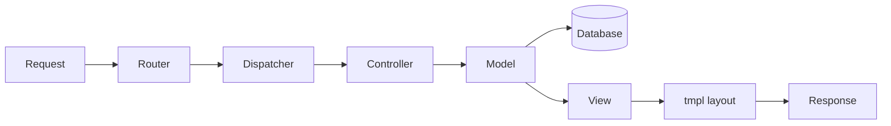
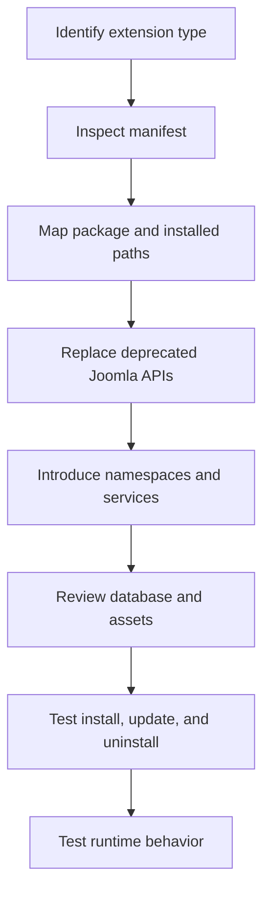

# Joomla 6 Extension Structure

A practical, type-based reference for understanding, creating, reviewing, and migrating Joomla 6 extensions.

> **Target environment:** Joomla 6 with modern PHP. The examples follow namespaces, dependency injection, MVC conventions, event subscribers, and the Web Asset Manager.

---

<a id="overview-tree"></a>
## Extension Structure Overview Tree

The following tree shows all eight Joomla extension types. Comments describe the responsibility of each type and its most important internal folders.

```text
Joomla 6 Extensions
├── 1. Component — Main application or business feature
│   ├── administrator/ — Backend management application
│   │   ├── services/ — Dependency Injection registration
│   │   ├── src/ — Namespaced PHP classes
│   │   │   ├── Controller/ — Receives tasks and coordinates actions
│   │   │   ├── Extension/ — Main component class
│   │   │   ├── Model/ — Data access and business logic
│   │   │   ├── Table/ — Database table mapping
│   │   │   ├── View/ — Prepares data for rendering
│   │   │   ├── Field/ — Custom form fields
│   │   │   ├── Rule/ — Custom validation rules
│   │   │   ├── Helper/ — Reusable supporting logic
│   │   │   └── Service/ — Router, HTML, category, or other services
│   │   ├── forms/ — Edit forms and list filters
│   │   ├── tmpl/ — Administrator layouts
│   │   ├── sql/ — Install, uninstall, and update SQL
│   │   ├── access.xml — ACL action definitions
│   │   └── config.xml — Global component options
│   ├── site/ — Frontend application
│   │   ├── src/ — Site controllers, models, views, and routing
│   │   ├── forms/ — Frontend forms
│   │   └── tmpl/ — Frontend layouts
│   ├── api/ — Optional JSON:API application
│   ├── media/ — CSS, JavaScript, images, and joomla.asset.json
│   ├── language/ — Site and administrator translations
│   ├── script.php — Optional installation lifecycle script
│   └── manifest.xml — Installation and update definition
│
├── 2. Module — Small content block rendered in a template position
│   ├── services/provider.php — Registers dispatcher and helper factory
│   ├── src/Dispatcher/ — Prepares data before rendering
│   ├── src/Helper/ — Retrieves and transforms module data
│   ├── tmpl/ — Module layouts
│   ├── media/ — Module CSS and JavaScript
│   ├── language/ — Module translations
│   └── manifest.xml — Module installation definition
│
├── 3. Plugin — Executes logic when Joomla dispatches an event
│   ├── services/provider.php — Registers the plugin instance
│   ├── src/Extension/ — Event subscriber/plugin class
│   ├── media/ — Optional CSS and JavaScript
│   ├── language/ — Plugin translations
│   └── manifest.xml — Plugin group and installation definition
│
├── 4. Template — Controls site or administrator presentation
│   ├── index.php — Main page layout
│   ├── component.php — Component-only layout
│   ├── error.php — Error page layout
│   ├── offline.php — Offline page layout
│   ├── html/ — Component and module layout overrides
│   ├── media/ — CSS, JavaScript, images, and SCSS
│   ├── language/ — Template translations
│   └── templateDetails.xml — Template manifest, positions, and options
│
├── 5. Library — Shared reusable PHP code
│   ├── src/ — Namespaced library classes
│   ├── vendor/ — Optional Composer dependencies
│   ├── language/ — Optional translations
│   └── manifest.xml — Library installation definition
│
├── 6. Language — Installs translated interface strings
│   ├── site/ — Frontend language files
│   ├── administrator/ — Backend language files
│   └── install.xml — Language package manifest
│
├── 7. Package — Installs multiple related extensions together
│   ├── packages/ — Child extension ZIP files
│   ├── script.php — Optional package lifecycle logic
│   └── pkg_example.xml — Package manifest and child list
│
└── 8. File — Installs an arbitrary collection of files
    ├── files/ — Files copied to the declared destination
    ├── script.php — Optional lifecycle logic
    └── files_example.xml — File extension manifest
```

### Key conclusion

The eight extension types **do not share the same complete structure**. They share installation concepts such as a manifest, optional language files, optional media, and sometimes namespaced PHP classes. Their runtime structures differ because each type has a different responsibility.

[Back to Table of Contents](#table-of-contents)

---

<a id="table-of-contents"></a>
## Table of Contents

- [Extension Structure Overview Tree](#overview-tree)
- [Level 1 — Shared Extension Architecture](#level-1-shared-architecture)
  - [1.1 The Eight Extension Types](#extension-types)
  - [1.2 Shared and Different Structures](#shared-vs-different)
  - [1.3 Installation Package vs Installed Structure](#package-vs-installed)
  - [1.4 Naming Conventions](#naming-conventions)
  - [1.5 Common Manifest Concepts](#common-manifest)
- [Level 2 — Application and Presentation Extensions](#level-2-application-presentation)
  - [2.1 Component](#component)
    - [2.1.1 Complete Component Tree](#component-tree)
    - [2.1.2 Component Manifest](#component-manifest)
    - [2.1.3 Administrator Application](#component-administrator)
    - [2.1.4 Site Application](#component-site)
    - [2.1.5 API Application](#component-api)
    - [2.1.6 Dependency Injection](#component-di)
    - [2.1.7 Namespace Mapping](#component-namespaces)
    - [2.1.8 MVC Request Flow](#component-mvc)
    - [2.1.9 Forms, ACL, and Configuration](#component-forms-acl)
    - [2.1.10 Database and Migrations](#component-database)
    - [2.1.11 Media and Web Assets](#component-assets)
    - [2.1.12 Language and Installer Script](#component-language-installer)
  - [2.2 Module](#module)
    - [2.2.1 Module Tree](#module-tree)
    - [2.2.2 Module Runtime Flow](#module-flow)
  - [2.3 Plugin](#plugin)
    - [2.3.1 Plugin Tree](#plugin-tree)
    - [2.3.2 Plugin Groups and Events](#plugin-events)
  - [2.4 Template](#template)
    - [2.4.1 Template Tree](#template-tree)
    - [2.4.2 Layout Overrides and Positions](#template-overrides)
- [Level 3 — Supporting Extensions](#level-3-supporting-extensions)
  - [3.1 Library](#library)
  - [3.2 Language](#language)
  - [3.3 Package](#package)
  - [3.4 File](#file-extension)
- [Level 4 — Installation, Migration, and Validation](#level-4-installation-migration)
  - [4.1 Installed Paths](#installed-paths)
  - [4.2 Required, Recommended, and Optional Files](#required-files)
  - [4.3 Joomla 3 to Joomla 6 Migration Notes](#migration-notes)
  - [4.4 Validation Checklist](#validation-checklist)
  - [4.5 Official References](#official-references)

---

<a id="level-1-shared-architecture"></a>
# Level 1 — Shared Extension Architecture

<a id="extension-types"></a>
## 1.1 The Eight Extension Types

| Type | Technical name | Primary responsibility |
|---|---|---|
| Component | `com_example` | Main application, business logic, data management, and page output |
| Module | `mod_example` | Small content block rendered in a template position |
| Plugin | `plg_group_example` | Event-based processing and integration |
| Template | Template name | Site or administrator presentation |
| Library | `lib_example` | Shared reusable PHP code |
| Language | `en-GB`, `vi-VN` | Translated interface strings |
| Package | `pkg_example` | Bundle of related extensions |
| File | `files_example` | Arbitrary file installation or update |

<a id="shared-vs-different"></a>
## 1.2 Shared and Different Structures

### Common concepts

Most extension types use some of these elements:

```text
extension/
├── manifest.xml        # Describes installation, version, files, and metadata
├── services/           # Optional DI registration
├── src/                # Optional namespaced PHP classes
├── language/           # Optional translated strings
├── media/              # Optional static assets
└── script.php          # Optional install/update/uninstall lifecycle logic
```

### Important differences

| Type | Main internal pattern |
|---|---|
| Component | Full MVC, backend, frontend, optional API, database, ACL |
| Module | Dispatcher, helper, and layout |
| Plugin | Event subscriber and plugin group |
| Template | Page layouts, positions, assets, and overrides |
| Library | Reusable namespaced classes |
| Language | Translation files only |
| Package | Child extension ZIP files |
| File | Arbitrary files copied by the installer |

<a id="package-vs-installed"></a>
## 1.3 Installation Package vs Installed Structure

The structure inside an installation ZIP does not have to match the final Joomla filesystem exactly. The manifest maps package folders to installed destinations.

```text
Installation package                 Installed Joomla paths
com_example/                         joomla-root/
├── administrator/       ────────▶   ├── administrator/components/com_example/
├── site/                ────────▶   ├── components/com_example/
├── api/                 ────────▶   ├── api/components/com_example/
├── media/               ────────▶   ├── media/com_example/
└── language/            ────────▶   ├── language/en-GB/
                                      └── administrator/language/en-GB/
```

> Always inspect the manifest before assuming where a package folder will be installed.

<a id="naming-conventions"></a>
## 1.4 Naming Conventions

| Item | Recommended format | Example |
|---|---|---|
| Component | `com_<name>` | `com_example` |
| Module | `mod_<name>` | `mod_example` |
| Plugin package | `plg_<group>_<name>` | `plg_system_example` |
| Plugin installed path | `plugins/<group>/<name>` | `plugins/system/example` |
| Library | `lib_<name>` | `lib_example` |
| Package | `pkg_<name>` | `pkg_example` |
| File extension | `files_<name>` | `files_example` |
| Template manifest | `templateDetails.xml` | Fixed filename |

Recommended namespace patterns:

```text
Vendor\Component\Example
Vendor\Module\Example
Vendor\Plugin\System\Example
Vendor\Library\Example
```

Namespace and directory case must match on case-sensitive systems such as Linux.

<a id="common-manifest"></a>
## 1.5 Common Manifest Concepts

A manifest normally defines:

- Extension type and installation method.
- Name, element, version, author, license, and description.
- Namespace and source path when applicable.
- Files and folders to install.
- Administrator and site destinations.
- Media and language files.
- SQL installation and schema update paths.
- Installer script.
- Update server.

Minimal example:

```xml
<?xml version="1.0" encoding="UTF-8"?>
<extension type="module" client="site" method="upgrade">
    <name>MOD_EXAMPLE</name>
    <version>1.0.0</version>
    <namespace path="src">Acme\Module\Example</namespace>

    <files>
        <folder plugin="example">services</folder>
        <folder>src</folder>
        <folder>tmpl</folder>
    </files>
</extension>
```

[Back to Table of Contents](#table-of-contents)

---

<a id="level-2-application-presentation"></a>
# Level 2 — Application and Presentation Extensions

<a id="component"></a>
## 2.1 Component

A component is the most complete Joomla extension type. It can provide administrator screens, frontend pages, database tables, forms, ACL, routing, and API endpoints.

<a id="component-tree"></a>
### 2.1.1 Complete Component Tree

```text
com_example/
├── example.xml                         # Component manifest
├── script.php                          # Optional installer lifecycle script
├── administrator/
│   ├── access.xml                      # ACL actions
│   ├── config.xml                      # Global component configuration
│   ├── forms/
│   │   ├── item.xml                    # Edit form
│   │   └── filter_items.xml            # List filters and pagination
│   ├── services/
│   │   └── provider.php                # DI registration and component bootstrapping
│   ├── sql/
│   │   ├── install.mysql.utf8mb4.sql   # Initial database schema
│   │   ├── uninstall.mysql.utf8mb4.sql # Optional cleanup
│   │   └── updates/mysql/              # Versioned schema migrations
│   ├── src/
│   │   ├── Controller/                 # Display, item, and list tasks
│   │   ├── Extension/                  # Main component class
│   │   ├── Field/                      # Custom form fields
│   │   ├── Helper/                     # Supporting reusable logic
│   │   ├── Model/                      # Data access and business logic
│   │   ├── Rule/                       # Custom validation rules
│   │   ├── Service/                    # Router and other services
│   │   ├── Table/                      # Database table mappings
│   │   └── View/                       # Data preparation for layouts
│   └── tmpl/                           # Administrator layouts
├── site/
│   ├── forms/                          # Frontend forms
│   ├── src/
│   │   ├── Controller/
│   │   ├── Helper/
│   │   ├── Model/
│   │   ├── Service/
│   │   └── View/
│   └── tmpl/                           # Frontend layouts
├── api/
│   └── src/
│       ├── Controller/                 # API request handling
│       └── View/                       # JSON:API output
├── media/
│   ├── css/
│   ├── images/
│   ├── js/
│   └── joomla.asset.json               # Web Asset Manager definitions
└── language/
    ├── administrator/en-GB/
    └── site/en-GB/
```

<a id="component-manifest"></a>
### 2.1.2 Component Manifest

The component manifest maps package folders to Site, Administrator, API, media, language, and SQL destinations.

Important sections include:

```xml
<extension type="component" method="upgrade">
    <name>COM_EXAMPLE</name>
    <element>com_example</element>
    <version>1.0.0</version>
    <namespace path="src">Acme\Component\Example</namespace>

    <files folder="site">
        <folder>src</folder>
        <folder>forms</folder>
        <folder>tmpl</folder>
    </files>

    <administration>
        <menu>COM_EXAMPLE</menu>
        <files folder="administrator">
            <filename>access.xml</filename>
            <filename>config.xml</filename>
            <folder>services</folder>
            <folder>src</folder>
            <folder>forms</folder>
            <folder>tmpl</folder>
            <folder>sql</folder>
        </files>
    </administration>

    <media folder="media" destination="com_example">
        <folder>css</folder>
        <folder>js</folder>
        <filename>joomla.asset.json</filename>
    </media>
</extension>
```

<a id="component-administrator"></a>
### 2.1.3 Administrator Application

Installed location:

```text
administrator/components/com_example/
```

It normally provides:

- List and edit screens.
- Toolbar actions.
- Publishing and batch operations.
- Filtering, sorting, and pagination.
- Permissions and global options.
- Database schema management.

<a id="component-site"></a>
### 2.1.4 Site Application

Installed location:

```text
components/com_example/
```

It normally provides:

- Public list and detail views.
- Frontend forms.
- Menu-item views.
- Routing and SEF URLs.
- User-facing layouts.

<a id="component-api"></a>
### 2.1.5 API Application

Installed location:

```text
api/components/com_example/
```

The API layer is optional. It may include controllers and JSON:API views. A web-services plugin is commonly used to register component routes.

<a id="component-di"></a>
### 2.1.6 Dependency Injection

`services/provider.php` registers the component and its factories in Joomla's dependency injection container.

Typical registrations include:

- Component dispatcher factory.
- MVC factory.
- Router factory.
- Category factory.
- Component extension class.

A component normally uses one primary provider installed on the administrator side. Do not duplicate providers without a real architectural need.

<a id="component-namespaces"></a>
### 2.1.7 Namespace Mapping

With this manifest declaration:

```xml
<namespace path="src">Acme\Component\Example</namespace>
```

Joomla maps application-specific namespaces conceptually as follows:

```text
Acme\Component\Example\Administrator  → administrator/components/com_example/src
Acme\Component\Example\Site           → components/com_example/src
Acme\Component\Example\Api            → api/components/com_example/src
```

<a id="component-mvc"></a>
### 2.1.8 MVC Request Flow



| Layer | Responsibility |
|---|---|
| Controller | Receives the task, checks permission, and coordinates execution |
| Model | Loads, validates, transforms, and stores data |
| Table | Maps one record to a database table |
| View | Retrieves prepared model data and exposes it to the layout |
| Layout | Renders HTML or another output format |

<a id="component-forms-acl"></a>
### 2.1.9 Forms, ACL, and Configuration

```text
administrator/
├── forms/item.xml          # Edit fields
├── forms/filter_items.xml  # Search, filters, ordering, pagination
├── access.xml              # Available permissions
└── config.xml              # Global options and permission UI
```

Common ACL actions:

```text
core.admin
core.manage
core.create
core.delete
core.edit
core.edit.state
core.edit.own
```

<a id="component-database"></a>
### 2.1.10 Database and Migrations

```text
administrator/sql/
├── install.mysql.utf8mb4.sql
├── uninstall.mysql.utf8mb4.sql
└── updates/mysql/
    ├── 1.0.1.sql
    └── 1.1.0.sql
```

Use `#__` instead of a hard-coded table prefix:

```sql
CREATE TABLE IF NOT EXISTS `#__example_items` (
    `id` INT UNSIGNED NOT NULL AUTO_INCREMENT,
    `title` VARCHAR(255) NOT NULL,
    `state` TINYINT NOT NULL DEFAULT 1,
    PRIMARY KEY (`id`)
) ENGINE=InnoDB DEFAULT CHARSET=utf8mb4;
```

Joomla records extension schema versions in `#__schemas`. Every released schema change should have a versioned SQL file.

<a id="component-assets"></a>
### 2.1.11 Media and Web Assets

Installed location:

```text
media/com_example/
├── css/
├── js/
├── images/
└── joomla.asset.json
```

Load assets through the Web Asset Manager:

```php
$wa = $this->getDocument()->getWebAssetManager();
$wa->useStyle('com_example.site');
$wa->useScript('com_example.site');
```

Avoid hard-coded `<script>` and `<link>` tags when an asset definition is appropriate.

<a id="component-language-installer"></a>
### 2.1.12 Language and Installer Script

Runtime strings normally use `.ini` files, while `.sys.ini` files are commonly used for installer, menu, and extension-manager labels.

```text
language/
├── administrator/en-GB/
│   ├── com_example.ini
│   └── com_example.sys.ini
└── site/en-GB/
    └── com_example.ini
```

Optional `script.php` lifecycle methods include:

```text
preflight()
install()
update()
uninstall()
postflight()
```

Use them for compatibility checks, data transformations, obsolete-file cleanup, and post-install operations.

[Back to Table of Contents](#table-of-contents)

---

<a id="module"></a>
## 2.2 Module

A module renders a small block at a template position. It is simpler than a component and normally does not use a complete MVC stack.

<a id="module-tree"></a>
### 2.2.1 Module Tree

```text
mod_example/
├── mod_example.xml                 # Manifest and module parameters
├── services/
│   └── provider.php                # Registers dispatcher and helper factory
├── src/
│   ├── Dispatcher/
│   │   └── Dispatcher.php          # Prepares module display data
│   └── Helper/
│       └── ExampleHelper.php       # Retrieves or transforms data
├── tmpl/
│   ├── default.php                 # Default layout
│   └── alternative.php             # Optional alternative layout
├── media/
│   ├── css/
│   └── js/
└── language/en-GB/
    ├── mod_example.ini
    └── mod_example.sys.ini
```

<a id="module-flow"></a>
### 2.2.2 Module Runtime Flow

```text
Joomla module renderer
        ↓
services/provider.php
        ↓
Dispatcher
        ↓
Helper or service
        ↓
tmpl/default.php
        ↓
HTML in a template position
```

A module manifest normally declares the `site` or `administrator` client and contains configuration fields for module parameters.

[Back to Table of Contents](#table-of-contents)

---

<a id="plugin"></a>
## 2.3 Plugin

A plugin reacts to Joomla events. It belongs to a plugin group such as `system`, `content`, `user`, `authentication`, `webservices`, `task`, or `console`.

<a id="plugin-tree"></a>
### 2.3.1 Plugin Tree

```text
plg_system_example/
├── example.xml                     # Manifest; declares group="system"
├── services/
│   └── provider.php                # Creates and registers the plugin
├── src/
│   └── Extension/
│       └── Example.php             # Event subscriber/plugin class
├── media/
│   ├── css/
│   └── js/
└── language/en-GB/
    ├── plg_system_example.ini
    └── plg_system_example.sys.ini
```

<a id="plugin-events"></a>
### 2.3.2 Plugin Groups and Events

Example event subscriber:

```php
final class Example extends CMSPlugin implements SubscriberInterface
{
    public static function getSubscribedEvents(): array
    {
        return [
            'onAfterRoute' => 'afterRoute',
            'onContentPrepare' => 'prepareContent',
        ];
    }
}
```

The plugin group defines where Joomla loads the plugin, but it does not prove whether the plugin is Joomla Core, third-party, or custom.

[Back to Table of Contents](#table-of-contents)

---

<a id="template"></a>
## 2.4 Template

A template controls page presentation. Joomla has separate Site and Administrator template clients.

<a id="template-tree"></a>
### 2.4.1 Template Tree

```text
tpl_example/
├── templateDetails.xml             # Manifest, positions, files, and options
├── index.php                       # Main page layout
├── component.php                   # Component-only output
├── error.php                       # Error page
├── offline.php                     # Offline page
├── html/                           # Layout overrides
│   ├── com_content/article/default.php
│   └── mod_menu/default.php
├── media/
│   ├── css/
│   ├── js/
│   ├── images/
│   ├── scss/
│   └── joomla.asset.json
├── language/en-GB/
│   ├── tpl_example.ini
│   └── tpl_example.sys.ini
└── template_preview.png
```

<a id="template-overrides"></a>
### 2.4.2 Layout Overrides and Positions

Module positions are declared in `templateDetails.xml`:

```xml
<positions>
    <position>topbar</position>
    <position>sidebar-right</position>
    <position>footer</position>
</positions>
```

Overrides are stored under:

```text
templates/example/html/<extension>/<view-or-layout>/
```

An override is not a separate extension, but it must be reviewed during migration because old Joomla markup and APIs may no longer be compatible.

[Back to Table of Contents](#table-of-contents)

---

<a id="level-3-supporting-extensions"></a>
# Level 3 — Supporting Extensions

<a id="library"></a>
## 3.1 Library

A library installs reusable PHP code shared by components, modules, or plugins.

```text
lib_example/
├── example.xml                 # Library manifest
├── src/
│   ├── Api/
│   ├── Service/
│   ├── ValueObject/
│   └── Helper/
├── vendor/                     # Optional Composer dependencies
└── language/en-GB/             # Optional translations
```

A library usually has no menu, page output, MVC views, or template positions.

<a id="language"></a>
## 3.2 Language

A language extension installs translated interface strings.

```text
language-package/
├── install.xml
├── site/
│   └── vi-VN/
│       ├── vi-VN.ini
│       └── vi-VN.xml
└── administrator/
    └── vi-VN/
        ├── vi-VN.ini
        └── vi-VN.xml
```

It contains no business logic or MVC application.

<a id="package"></a>
## 3.3 Package

A package installs several related extension ZIP files in one operation.

```text
pkg_example/
├── pkg_example.xml
├── script.php
└── packages/
    ├── com_example.zip
    ├── mod_example.zip
    ├── plg_system_example.zip
    └── lib_example.zip
```

Example child declarations:

```xml
<files folder="packages">
    <file type="component" id="com_example">com_example.zip</file>
    <file type="module" id="mod_example" client="site">mod_example.zip</file>
    <file type="plugin" id="example" group="system">plg_system_example.zip</file>
</files>
```

A package coordinates installation; the child extensions provide the runtime functionality.

<a id="file-extension"></a>
## 3.4 File

A file extension installs an arbitrary collection of files when another extension type is not suitable.

```text
files_example/
├── files_example.xml
├── script.php
└── files/
    ├── example.php
    ├── css/
    └── js/
```

Use file extensions carefully because arbitrary file placement can make ownership, update behavior, and cleanup harder to understand.

[Back to Table of Contents](#table-of-contents)

---

<a id="level-4-installation-migration"></a>
# Level 4 — Installation, Migration, and Validation

<a id="installed-paths"></a>
## 4.1 Installed Paths

| Extension type | Common installed location |
|---|---|
| Site component | `components/com_example/` |
| Administrator component | `administrator/components/com_example/` |
| API component | `api/components/com_example/` |
| Site module | `modules/mod_example/` |
| Administrator module | `administrator/modules/mod_example/` |
| Plugin | `plugins/<group>/<name>/` |
| Site template | `templates/example/` |
| Administrator template | `administrator/templates/example/` |
| Library | `libraries/example/` |
| Media | `media/<extension>/` |
| Site language | `language/<tag>/` |
| Administrator language | `administrator/language/<tag>/` |

<a id="required-files"></a>
## 4.2 Required, Recommended, and Optional Files

| Item | Status | Notes |
|---|---|---|
| Valid manifest | Required | Every installable extension requires one |
| Declared extension files | Required | Every referenced path must exist |
| Correct type/client/group | Required | Must match the extension responsibility |
| Namespaced `src/` | Recommended for PHP extensions | Required by modern architecture when namespace loading is used |
| `services/provider.php` | Recommended or required by architecture | Common for modern component, module, and plugin registration |
| Language files | Recommended | Avoid hard-coded UI strings |
| Media folder | Optional | Needed only for extension assets |
| `joomla.asset.json` | Recommended when assets exist | Enables Web Asset Manager registration |
| SQL files | Optional | Usually required only when the extension owns database tables |
| `access.xml` and `config.xml` | Optional | Common for components with ACL or options |
| `script.php` | Optional | Use only for lifecycle logic not handled declaratively |
| Update server | Recommended for maintained releases | Enables managed updates |

<a id="migration-notes"></a>
## 4.3 Joomla 3 to Joomla 6 Migration Notes

| Joomla 3 pattern | Joomla 6 direction |
|---|---|
| Global or legacy class names | Namespaced Joomla classes |
| Direct component entry files containing all logic | Service provider, dispatcher, MVC classes |
| `JModelLegacy`, `JControllerLegacy`, `JViewLegacy` | Namespaced MVC base classes |
| `JFactory` static access | Application services and dependency injection where possible |
| Direct CSS/JS insertion | Web Asset Manager |
| Plugin methods without explicit event mapping | Event subscriber pattern where supported |
| Mixed SQL and view logic | Separate models, tables, views, and services |
| Legacy router code | Modern component router service |
| Copied extension folders only | Proper manifest installation or verified Discover workflow |

Migration flow:



<a id="validation-checklist"></a>
## 4.4 Validation Checklist

### Package and manifest

- [ ] Extension type is correct.
- [ ] Component element, module client, or plugin group is correct.
- [ ] Every declared file and folder exists.
- [ ] Manifest version matches the release.
- [ ] Namespace paths match class locations and case.
- [ ] Installation ZIP opens with the manifest at the expected level.

### Runtime architecture

- [ ] Service provider loads without errors.
- [ ] Controllers, models, views, tables, dispatchers, or subscribers follow the correct extension type.
- [ ] No Joomla 3 legacy classes remain without a deliberate compatibility layer.
- [ ] Permissions are checked before write operations.
- [ ] Input is filtered and output is escaped.

### Database

- [ ] Install SQL works on an empty database.
- [ ] Update SQL files are ordered by version.
- [ ] `#__` is used for table prefixes.
- [ ] Schema version is correctly recorded.
- [ ] Uninstall behavior is intentional and documented.

### Assets and language

- [ ] CSS and JavaScript are stored under the extension media destination.
- [ ] Asset names in `joomla.asset.json` match PHP usage.
- [ ] Language keys exist for Site and Administrator contexts.
- [ ] `.sys.ini` contains installer and menu labels when needed.

### Installation lifecycle

- [ ] Fresh installation succeeds.
- [ ] Upgrade from the previous supported version succeeds.
- [ ] Reinstallation with `method="upgrade"` does not lose data.
- [ ] Discover works only when all required installed files and a valid manifest are present.
- [ ] Uninstall removes only files and data owned by the extension.

### Functional testing

- [ ] Administrator list, edit, save, publish, and delete actions work.
- [ ] Frontend list, detail, form, routing, and pagination work.
- [ ] Modules render in assigned positions.
- [ ] Plugins execute only for intended events.
- [ ] Template positions and overrides render correctly.
- [ ] API endpoints work when the extension provides them.

<a id="official-references"></a>
## 4.5 Official References

Use the current Joomla Programmers Documentation as the primary source for:

- Building extensions.
- Manifest files.
- Component MVC.
- Module development.
- Plugin development and events.
- Dependency injection.
- Namespaces.
- Web Asset Manager.
- Packages and update servers.

Documentation root:

```text
https://manual.joomla.org/
```

[Back to Table of Contents](#table-of-contents)
