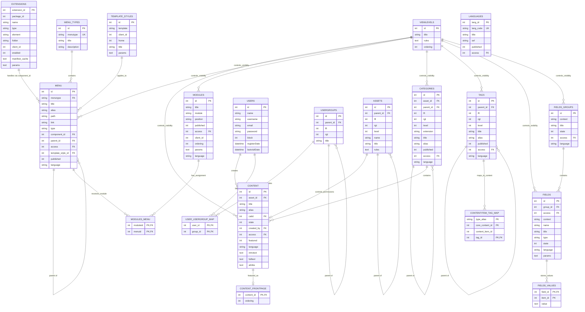

# Joomla 3 Database Structure

A practical guide to understanding, auditing, documenting, and migrating a Joomla 3 database.

> **Baseline:** Joomla 3.10.x. The exact tables and columns may differ by Joomla patch version and by installed third-party or custom extensions.
>
> **Important:** Joomla 3 does not always declare physical MySQL foreign-key constraints. Many relationships in this document are logical relationships enforced by Joomla application code.

## Table of Contents

- [1. Detailed Database Guide](#1-detailed-database-guide)
  - [1.1 Prefix and configuration](#11-prefix-and-configuration)
  - [1.2 Overview structure](#12-overview-structure)
  - [1.3 Content and categories](#13-content-and-categories)
  - [1.4 Menu and routing](#14-menu-and-routing)
  - [1.5 Modules and menu assignment](#15-modules-and-menu-assignment)
  - [1.6 Extensions](#16-extensions)
  - [1.7 Users, access, and ACL](#17-users-access-and-acl)
  - [1.8 Tags and Custom Fields](#18-tags-and-custom-fields)
  - [1.9 Template styles and languages](#19-template-styles-and-languages)
  - [1.10 How a page is assembled](#110-how-a-page-is-assembled)
  - [1.11 Custom and third-party tables](#111-custom-and-third-party-tables)
  - [1.12 Audit SQL](#112-audit-sql)
  - [1.13 Migration and upgrade checklist](#113-migration-and-upgrade-checklist)
- [2. Joomla 3 ERD](#2-joomla-3-erd)
  - [2.1 Core logical ERD](#21-core-logical-erd)
  - [2.2 How to read the ERD](#22-how-to-read-the-erd)

---

## 1. Detailed Database Guide

Joomla's database does not only store articles. It also stores much of the configuration that determines how the website runs:

- Content, categories, tags, and Custom Fields.
- Menus, routes, and page context (`Itemid`).
- Module instances and page assignments.
- Installed extensions, plugins, and their configuration.
- Users, groups, viewing levels, and ACL rules.
- Template styles and language configuration.
- Search indexes, redirects, update metadata, and version history.
- Business data created by third-party and custom extensions.

The project should therefore be understood as:

```text
Source code
    ↕
Joomla core tables
    ↕
Third-party/custom extension tables
    ↕
External services and databases
```

### 1.1 Prefix and configuration

Joomla documentation and SQL scripts use `#__` as a table-prefix placeholder. The actual prefix is defined in `configuration.php`:

```php
public $dbprefix = 'abc_';
```

Therefore:

```text
#__content → abc_content
#__menu    → abc_menu
```

When executing SQL directly in phpMyAdmin, Adminer, MySQL Workbench, or the MySQL CLI, replace `#__` with the actual prefix. Do not copy database passwords or other secrets from `configuration.php` into a report.

### 1.2 Overview structure

```text
Joomla 3 Database
│
├── Content Management
│   ├── #__content                  // Articles
│   ├── #__categories               // Hierarchical categories
│   ├── #__content_frontpage        // Featured Article ordering
│   ├── #__tags                     // Hierarchical tags
│   ├── #__contentitem_tag_map      // Content-to-tag mapping
│   ├── #__fields                   // Custom Field definitions
│   ├── #__fields_groups            // Custom Field groups
│   └── #__fields_values            // Custom Field values
│
├── Menu and Routing
│   ├── #__menu_types               // Menu containers
│   ├── #__menu                     // Menu items, routes, and Itemid
│   ├── #__redirect_links           // Redirect records
│   └── #__associations             // Multilingual associations
│
├── Modules
│   ├── #__modules                  // Configured module instances
│   └── #__modules_menu             // Module-to-menu assignments
│
├── Extensions
│   ├── #__extensions               // Installed extension registry
│   ├── #__schemas                  // Installed schema versions
│   ├── #__updates                  // Discovered extension updates
│   ├── #__update_sites             // Update server definitions
│   ├── #__update_sites_extensions  // Extension-to-update-site mapping
│   └── #__postinstall_messages     // Post-installation messages
│
├── Presentation
│   └── #__template_styles          // Template style instances
│
├── Users and ACL
│   ├── #__users                    // User accounts
│   ├── #__usergroups               // Hierarchical user groups
│   ├── #__user_usergroup_map       // User-to-group mapping
│   ├── #__viewlevels               // Viewing Access Levels
│   ├── #__assets                   // ACL resource hierarchy and rules
│   ├── #__user_profiles            // Additional user profile data
│   ├── #__user_keys                // Authentication-related keys
│   └── #__session                  // Active sessions
│
├── Search and History
│   ├── #__finder_links             // Smart Search indexed items
│   ├── #__finder_terms             // Smart Search terms
│   ├── #__finder_taxonomy          // Smart Search taxonomy
│   ├── #__finder_filters           // Saved Smart Search filters
│   ├── #__ucm_history              // Content version history
│   ├── #__ucm_content              // Unified Content Model data
│   ├── #__ucm_base                 // UCM mapping
│   └── #__content_types            // Content type definitions
│
└── Extension Business Data
    ├── #__contact_details          // Contacts
    ├── #__banners                  // Banners
    ├── #__newsfeeds                // News feeds
    ├── #__custom_*                 // Project-specific tables
    └── #__vendor_*                 // Third-party extension tables
```

### 1.3 Content and categories

#### `#__content`

This is the main Article table.

| Column | Purpose |
|---|---|
| `id` | Article primary key |
| `asset_id` | Logical relation to the ACL asset |
| `title`, `alias` | Display title and URL alias |
| `introtext`, `fulltext` | Article body |
| `state` | Published state |
| `catid` | Related category |
| `created_by` | Author user ID |
| `created`, `modified` | Audit timestamps |
| `publish_up`, `publish_down` | Publishing window |
| `images`, `urls`, `attribs`, `metadata` | JSON-encoded configuration |
| `language` | Content language code or `*` |
| `access` | Viewing Access Level |
| `featured` | Featured status |

Common article states:

| Value | Meaning |
|---:|---|
| `1` | Published |
| `0` | Unpublished |
| `2` | Archived |
| `-2` | Trashed |

`state = 1` alone does not guarantee that an article is visible. Also check:

- Publishing start and end times.
- Article and category access levels.
- Article and category languages.
- Category published state.
- Menu/component configuration.
- Plugin behavior and template overrides.

#### `#__categories`

This table stores categories for multiple components, not only Articles. The `extension` column identifies the owner:

```text
com_content  → Article categories
com_contact  → Contact categories
```

Important columns:

| Column | Purpose |
|---|---|
| `id` | Category primary key |
| `asset_id` | Related ACL asset |
| `parent_id` | Parent category |
| `lft`, `rgt`, `level` | Nested Set hierarchy |
| `path` | Hierarchical category path |
| `extension` | Owning component |
| `title`, `alias` | Category identity |
| `published` | Published state |
| `access` | Viewing Access Level |
| `params` | JSON configuration |
| `language` | Content language |

Do not manually update `lft` and `rgt` unless you fully understand Joomla's Nested Set implementation. An incorrect update can corrupt the tree.

Key logical relationships:

```text
#__categories.id ← #__content.catid
#__users.id      ← #__content.created_by
#__viewlevels.id ← #__content.access
#__assets.id     ← #__content.asset_id
```

### 1.4 Menu and routing

#### `#__menu_types`

Stores menu containers such as:

```text
mainmenu
footermenu
hiddenmenu
```

#### `#__menu`

Stores the actual menu items. The menu-item ID is also the Joomla request context called `Itemid`.

| Column | Purpose |
|---|---|
| `id` | Menu item ID and `Itemid` |
| `menutype` | Related menu container |
| `title`, `alias`, `path` | Display and route identity |
| `link` | Internal component URL |
| `type` | Menu item type |
| `component_id` | Related component in `#__extensions` |
| `parent_id`, `lft`, `rgt`, `level` | Menu hierarchy |
| `published` | Published state |
| `access` | Viewing Access Level |
| `params` | JSON menu configuration |
| `home` | Default homepage flag |
| `language` | Language |
| `template_style_id` | Optional page-specific template style |

Example:

```text
id:           123
title:        Cars
alias:        cars
link:         index.php?option=com_vehicle&view=vehicles
component_id: 10500
```

The SEF frontend URL may be:

```text
/cars
```

To understand a URL, inspect `link`, `component_id`, `params`, `language`, and `Itemid`; the alias alone is insufficient.

### 1.5 Modules and menu assignment

#### `#__modules`

Each record is a configured **module instance**, not merely a module extension.

For example, one `mod_custom` extension can produce many instances:

```text
mod_custom
├── Homepage Promotion
├── Footer Address
└── Contact Information
```

Important columns include `id`, `title`, `content`, `position`, `module`, `published`, `access`, `ordering`, `params`, `publish_up`, `publish_down`, `language`, and `client_id`.

#### `#__modules_menu`

This mapping table determines where a module instance appears:

```text
#__modules.id
    ↕
#__modules_menu.moduleid

#__menu.id
    ↕
#__modules_menu.menuid
```

Common assignment semantics:

| `menuid` | Meaning |
|---:|---|
| `0` | Display on all menu items |
| Positive ID | Include the matching menu item |
| Negative ID | Exclude the matching menu item |

These values must be interpreted together with Joomla's module assignment logic. A report that lists `#__modules` but ignores `#__modules_menu` cannot determine which pages display each module.

### 1.6 Extensions

`#__extensions` is the central installed-extension registry.

| Column | Purpose |
|---|---|
| `extension_id` | Extension primary key |
| `package_id` | Parent package when applicable |
| `name` | Extension name |
| `type` | `component`, `module`, `plugin`, `template`, etc. |
| `element` | Technical element name |
| `folder` | Plugin group |
| `client_id` | Site or Administrator client |
| `enabled` | Enabled/disabled state |
| `protected` | Protected extension flag |
| `manifest_cache` | Manifest metadata encoded as JSON |
| `params` | Extension configuration |
| `ordering` | Execution order, especially important for plugins |

Examples:

```text
type=component, element=com_content
type=module,    element=mod_custom, client_id=0
type=plugin,    folder=system, element=cache
```

Extension ownership must be verified using several sources:

```text
Database registration
↔ Manifest XML
↔ Source directory
↔ Update site
↔ Vendor/internal documentation
↔ Actual runtime usage
```

A row in `#__extensions` does not prove the source files are complete or compatible with the target Joomla/PHP version.

### 1.7 Users, access, and ACL

The main user relationship is:

```text
#__users
    ↕
#__user_usergroup_map
    ↕
#__usergroups
```

A user can belong to multiple groups.

#### Viewing Access Levels

`#__viewlevels` determines who can **see** an item. Its `rules` column normally contains a JSON array of user-group IDs.

Tables such as `#__content`, `#__categories`, `#__menu`, and `#__modules` logically relate their `access` column to `#__viewlevels.id`.

#### ACL assets

`#__assets` determines who can **perform actions** such as create, edit, delete, or change state. It is a hierarchical resource tree:

```text
root.1
└── com_content
    └── com_content.category.10
        └── com_content.article.25
```

Permissions may inherit through:

```text
Global → Component → Category → Article
```

Do not confuse the two concepts:

| Mechanism | Question answered |
|---|---|
| `access` → `#__viewlevels` | Who can view this item? |
| `asset_id`/asset name → `#__assets.rules` | Who can perform actions on it? |

Reports must not expose password hashes, authentication keys, session IDs, API credentials, or unnecessary personal data.

### 1.8 Tags and Custom Fields

#### Tags

```text
Content item
    ↕
#__contentitem_tag_map
    ↕
#__tags
```

`#__contentitem_tag_map` is polymorphic. `type_alias` identifies the type of the mapped item:

```text
com_content.article
com_contact.contact
```

#### Custom Fields

```text
#__fields_groups
    ↓
#__fields
    ↓
#__fields_values
```

`#__fields` stores the field definition and context. `#__fields_values` stores:

```text
field_id
item_id
value
```

`item_id` must be interpreted with the field's `context`; by itself it does not identify whether the item is an Article, Contact, or custom-extension record.

### 1.9 Template styles and languages

#### `#__template_styles`

A template can have multiple configured styles. A menu item may select one using:

```text
#__template_styles.id ← #__menu.template_style_id
```

Two pages can therefore use the same template source but have different style parameters, colors, logos, layout settings, or widths.

#### `#__languages`

Stores configured content languages. Multilingual records usually use a language code or `*` for all languages. `#__associations` connects equivalent items across languages.

When auditing multilingual content, do not join records only by alias. Check the language, context, association key, menu setup, and enabled language plugins.

### 1.10 How a page is assembled

For a URL such as `/cars`, a simplified database flow is:

```text
URL /cars
→ #__menu
   ├── link → option=com_vehicle&view=vehicles
   ├── component_id → #__extensions
   ├── access → #__viewlevels
   └── template_style_id → #__template_styles
→ component source code
→ #__vehicle_* business tables or external API
→ #__modules_menu
→ #__modules
→ #__assets / #__viewlevels
→ template output
```

For each important page or feature, document:

| Area | What to identify |
|---|---|
| Route | URL, menu ID, alias, internal `link`, component |
| Content | Core/custom tables and main record IDs |
| Presentation | Template style, overrides, module positions |
| Modules | Instance IDs and menu assignments |
| Plugins | Enabled plugins that modify routing/content/output |
| Access | View level, relevant ACL assets |
| Integration | API, SSO, payment, email, or external database |

### 1.11 Custom and third-party tables

A non-core table must not automatically be classified as custom or safe to delete.

Use this verification sequence:

1. Export the full table list with `SHOW TABLES`.
2. Confirm the exact Joomla version.
3. Compare with a clean schema for that Joomla version.
4. Group non-core tables by business/vendor prefix.
5. Search each table name in the source code.
6. Inspect extension manifest XML and `administrator/components/*/sql`.
7. Inspect `#__extensions`, update sites, and package metadata.
8. Check whether source files are missing while data remains.
9. Record the evidence and classification.

Recommended classifications:

| Classification | Meaning |
|---|---|
| Core | Included in the clean schema for the exact Joomla version |
| Third-party | Created and owned by a vendor extension |
| Custom | Created by project-specific development |
| Orphan | Likely left after an extension was removed |
| Unknown | Insufficient evidence |
| External | Belongs to another system or database |

Do not delete an `Orphan` table before data ownership, retention, dependencies, and migration requirements are confirmed.

### 1.12 Audit SQL

Replace `#__` with the actual prefix when running these queries directly.

#### Menu items and components

```sql
SELECT
    m.id,
    m.menutype,
    m.title,
    m.alias,
    m.path,
    m.link,
    m.published,
    m.access,
    m.language,
    e.element AS component
FROM #__menu AS m
LEFT JOIN #__extensions AS e
    ON e.extension_id = m.component_id
WHERE m.client_id = 0
ORDER BY m.menutype, m.lft;
```

#### Module instances and assignments

```sql
SELECT
    m.id AS module_id,
    m.title AS module_title,
    m.module,
    m.position,
    m.published,
    mm.menuid,
    menu.title AS menu_title,
    menu.path
FROM #__modules AS m
LEFT JOIN #__modules_menu AS mm
    ON mm.moduleid = m.id
LEFT JOIN #__menu AS menu
    ON menu.id = ABS(mm.menuid)
WHERE m.client_id = 0
ORDER BY m.position, m.ordering, m.id;
```

#### Enabled plugins in execution order

```sql
SELECT
    extension_id,
    folder AS plugin_group,
    element,
    ordering,
    manifest_cache
FROM #__extensions
WHERE type = 'plugin'
  AND enabled = 1
ORDER BY folder, ordering;
```

#### Article count by category

```sql
SELECT
    c.id,
    c.title,
    COUNT(a.id) AS article_count
FROM #__categories AS c
LEFT JOIN #__content AS a
    ON a.catid = c.id
WHERE c.extension = 'com_content'
GROUP BY c.id, c.title
ORDER BY article_count DESC;
```

#### Table size inventory

```sql
SELECT
    table_name,
    table_rows,
    data_length,
    index_length,
    data_free
FROM information_schema.tables
WHERE table_schema = DATABASE()
ORDER BY data_length + index_length DESC;
```

#### Extension schema versions

```sql
SELECT
    e.extension_id,
    e.type,
    e.element,
    e.folder,
    s.version_id
FROM #__extensions AS e
LEFT JOIN #__schemas AS s
    ON s.extension_id = e.extension_id
ORDER BY e.type, e.folder, e.element;
```

### 1.13 Migration and upgrade checklist

- [ ] Record Joomla, PHP, MySQL/MariaDB, and database collation versions.
- [ ] Back up files and database; verify that restoration works.
- [ ] Record the actual table prefix without exposing credentials.
- [ ] Inventory every table, row count, size, engine, and collation.
- [ ] Compare tables and columns with the exact clean Joomla schema.
- [ ] Classify tables as Core, Third-party, Custom, Orphan, Unknown, or External.
- [ ] Map each important URL to menu, component, tables, modules, template style, and access.
- [ ] Export installed extensions and schema versions.
- [ ] Check manifest SQL install, update, and uninstall scripts.
- [ ] Inspect JSON fields such as `params`, `attribs`, `metadata`, and `manifest_cache`.
- [ ] Identify personal, authentication, payment, and other sensitive data.
- [ ] Find views, triggers, procedures, functions, and scheduled events.
- [ ] Check for broken logical relations and orphaned records.
- [ ] Avoid manual edits to Nested Set columns (`lft`, `rgt`) during discovery.
- [ ] Define migration action, transformation, validation, rollback, and retention per table.
- [ ] Test migration on a copy and reconcile row counts and key business totals.

Recommended minimum report columns:

| Table | Classification | Owner | Purpose | Related Feature | Main Relations | Volume | Migration Action | Risk |
|---|---|---|---|---|---|---:|---|---|
| `#__content` | Core | `com_content` | Articles | News | Category, user, asset | 2,500 | Migrate | Medium |
| `#__vehicle_models` | Custom | `com_vehicle` | Vehicle catalogue | New Cars | Category, variants | 150 | Redesign/migrate | High |
| `#__akeeba_*` | Third-party | Akeeba | Backup/configuration | Backup | Extension-specific | — | Review vendor version | Medium |
| `#__old_campaign` | Unknown | Unknown | Unverified | Unknown | Unknown | 320 | Investigate | High |

---

## 2. Joomla 3 ERD

### 2.1 Core logical ERD

The following Mermaid diagram focuses on the Joomla 3 tables most useful for project discovery, feature mapping, upgrade analysis, and migration planning.



### 2.2 How to read the ERD

The most important relationship chains are:

```text
URL
→ MENU
→ EXTENSIONS
→ Component source code
→ Core/custom business tables
```

```text
MENU
→ MODULES_MENU
→ MODULES
```

```text
CONTENT
→ CATEGORIES
→ USERS
→ VIEWLEVELS
→ ASSETS
```

```text
USERS
→ USER_USERGROUP_MAP
→ USERGROUPS
```

```text
Content item
→ CONTENTITEM_TAG_MAP
→ TAGS
```

```text
Content item
→ FIELDS_VALUES
→ FIELDS
→ FIELDS_GROUPS
```

Important interpretation notes:

1. `FIELDS_VALUES.item_id` is polymorphic. Combine it with `FIELDS.context` to identify the owner.
2. `CONTENTITEM_TAG_MAP` is polymorphic. Use `type_alias` to identify the content type.
3. `MENU.component_id` logically points to the registered component in `EXTENSIONS`.
4. Negative `MODULES_MENU.menuid` values represent exclusions; use the absolute value when identifying the menu item.
5. `VIEWLEVELS` controls visibility, while `ASSETS` controls action permissions.
6. Category, menu, tag, asset, and user-group hierarchies use parent/Nested Set data.
7. Add custom and third-party tables to a project-specific ERD only after their ownership and keys have been verified from source code, manifests, and real data.

## Conclusion

To understand a Joomla 3 database for a revamp or upgrade, focus on these five mappings:

```text
Article → Category → User → Visibility/ACL
URL → Menu → Component
Menu → Module assignment → Module instance
User → Group → View level/ACL asset
Extension → Source code → Extension-owned tables
```

When these mappings are complete for every important feature, the team can determine:

- Which data creates each page and feature.
- Which configuration must be preserved.
- Which tables belong to Core, vendors, or custom development.
- Which data needs migration, redesign, archive, or deletion review.
- Where compatibility and upgrade risks are concentrated.
