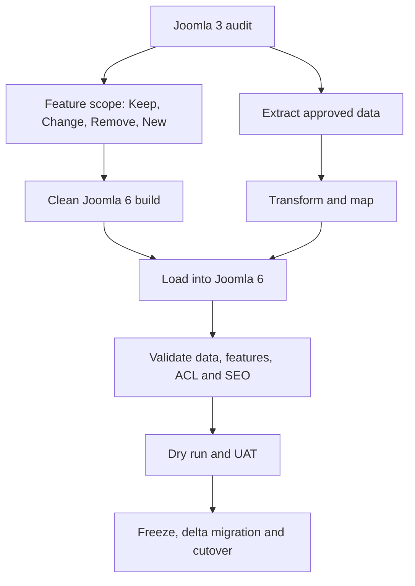

# Proposal 2: Rebuild Joomla 6 and Migrate from Joomla 3

## 1. Executive Summary

Build a clean Joomla 6 website, rebuild or replace required features, and migrate validated data from Joomla 3 through an Extract–Transform–Load process.

```text
Joomla 3 as source
→ Audit and mapping
→ Clean Joomla 6 implementation
→ ETL data migration
→ Validation and UAT
→ Production cutover
```

This is a direct move to Joomla 6 in terms of the final platform, but it is **not** a direct in-place upgrade. The Joomla 3 source and database must not be overwritten with Joomla 6 files.

This proposal is recommended when the project includes a major revamp, extensive legacy/custom code, abandoned extensions, or a need to remove technical debt.

## 2. Objectives

- Deliver a clean Joomla 6 architecture.
- Retain only approved features and data.
- Replace unsupported extensions and legacy code.
- Rebuild the template and custom functionality using Joomla 6 APIs.
- Preserve critical URLs, SEO signals, content, users, ACL, and integrations.
- Keep the existing Joomla 3 site available as rollback during cutover.

## 3. Suitable When

- The website is undergoing a significant visual or functional revamp.
- Joomla 3 extensions have no reliable Joomla 6 upgrade path.
- The site contains extensive Core modifications or legacy custom code.
- The team wants to remove unused data and features.
- A clean architecture is more valuable than retaining the old implementation.
- Parallel old/new environments and controlled cutover are possible.

## 4. Not Suitable When

- The site is almost entirely Joomla Core and easily upgradeable.
- Data relationships are undocumented and too complex for ETL within the available budget.
- The business cannot support feature revalidation or UAT.
- The team lacks access to source code, database, media, and business owners.
- Exact preservation of opaque third-party extension state is mandatory.

## 5. Migration Architecture



## 6. Phase 0 — Discovery and Decision

### Feature scope

Map every current feature:

```text
URL
→ Menu item
→ Component
→ View/Layout
→ Template override
→ Modules
→ Plugins
→ Database/API
```

For each feature, assign:

- `Keep`: preserve behavior.
- `Change`: redesign behavior or UX.
- `Remove`: exclude from Joomla 6.
- `New`: implement as a new requirement.

Checklist:

- [ ] Inventory frontend and administrator features.
- [ ] Assign business owner and priority P1/P2/P3.
- [ ] Document acceptance criteria.
- [ ] Identify hidden workflows, scheduled jobs, APIs, and email notifications.
- [ ] Confirm the minimum viable scope for go-live.

### Extension decisions

- [ ] Inventory all Core, third-party, custom, unknown, abandoned, and orphan extensions.
- [ ] Choose `Install Joomla 6 version`, `Replace`, `Rewrite`, or `Remove`.
- [ ] Confirm licences and vendor support.
- [ ] Do not copy Joomla 3 extension code directly into Joomla 6.
- [ ] Document extension-owned tables and data formats.

### Data decisions

- [ ] Classify Core, third-party, custom, and orphan tables.
- [ ] Assign an owner and migration action to every retained data domain.
- [ ] Identify personal, sensitive, expired, archived, and disposable data.
- [ ] Define retention and anonymization requirements.
- [ ] Record source counts, keys, relations, charset, collation, and JSON fields.

## 7. Phase 1 — Joomla 6 Solution Design

- [ ] Install a clean, approved Joomla 6 patch version.
- [ ] Define environments, repository, branching, CI/CD, configuration, and secret management.
- [ ] Define template architecture and frontend asset strategy.
- [ ] Use Joomla 6 namespaces, MVC, services, events, routing, and Web Asset Manager.
- [ ] Design custom components, modules, plugins, CLI commands, and scheduled tasks.
- [ ] Design authentication, authorization, view levels, and ACL.
- [ ] Define logging, monitoring, caching, mail, media, CDN, and integration behavior.
- [ ] Define security, accessibility, browser, performance, and SEO requirements.
- [ ] Review architecture before implementation.

## 8. Phase 2 — Rebuild Features

### Core and third-party features

- [ ] Configure Joomla 6 Core features from clean configuration.
- [ ] Install only approved Joomla 6-compatible extensions.
- [ ] Recreate menus, module positions, module assignments, fields, tags, and workflows.
- [ ] Configure language, search, redirects, mail, media, and cache.
- [ ] Verify third-party extension configuration and licensing.

### Custom implementation

- [ ] Rewrite custom components using Joomla 6 conventions.
- [ ] Rewrite custom modules and plugins.
- [ ] Replace legacy event signatures and global classes.
- [ ] Use exception-based error handling.
- [ ] Remove direct dependency on Joomla 3 Core table structure where possible.
- [ ] Rebuild template overrides against Joomla 6 layouts.
- [ ] Refactor old jQuery-dependent code where unnecessary.
- [ ] Add automated tests for critical custom business rules.
- [ ] Document configuration and extension ownership.

## 9. Phase 3 — ETL Data Migration

Do not import a complete Joomla 3 database dump into Joomla 6.

```text
Extract → Clean → Transform → Map IDs → Load → Validate
```

### Data domains

- [ ] Categories and articles.
- [ ] Featured content.
- [ ] Tags and Custom Fields.
- [ ] Menu items and aliases.
- [ ] Module content and assignments.
- [ ] Users, groups, view levels, and ACL.
- [ ] Languages and multilingual associations.
- [ ] Contacts, banners, redirects, and other retained Core data.
- [ ] Media, attachments, and generated files.
- [ ] Custom component records.
- [ ] Metadata, canonical data, and redirect mapping.

### ETL controls

- [ ] Make migration scripts repeatable and version-controlled.
- [ ] Preserve a source-to-target ID mapping table.
- [ ] Define transformations for timestamps, users, aliases, JSON, charset, and null values.
- [ ] Rebuild relationships using mapped target IDs.
- [ ] Avoid directly copying Nested Set `lft`/`rgt` values without a verified strategy.
- [ ] Use Joomla APIs or controlled imports when they ensure valid assets and associations.
- [ ] Log rejected, transformed, skipped, and duplicate records.
- [ ] Make every migration run traceable by run ID and timestamp.
- [ ] Provide validation and safe cleanup for repeatable dry runs.
- [ ] Protect passwords, tokens, session data, and personally identifiable information.

## 10. Data Validation

Create a reconciliation report for each domain:

| Domain | Source count | Eligible | Imported | Skipped | Rejected | Validation result |
|---|---:|---:|---:|---:|---:|---|
| Articles | TBD | TBD | TBD | TBD | TBD | Pending |
| Users | TBD | TBD | TBD | TBD | TBD | Pending |
| Custom records | TBD | TBD | TBD | TBD | TBD | Pending |

Checks:

- [ ] Source count equals imported + intentionally skipped + rejected.
- [ ] Representative records match content, author, dates, state, language, and metadata.
- [ ] Parent-child relationships are valid.
- [ ] Menu links and module assignments point to target IDs.
- [ ] Users have correct groups and view access.
- [ ] ACL assets and permissions behave as expected.
- [ ] Media paths and sample checksums are valid.
- [ ] No unexpected orphan records exist.
- [ ] Rejected records have an owner and resolution.

## 11. URL and SEO Migration

- [ ] Crawl and store the Joomla 3 URL inventory.
- [ ] Define one target URL or explicit retirement decision for every important source URL.
- [ ] Preserve aliases and routing when practical.
- [ ] Create a version-controlled 301 redirect map.
- [ ] Preserve title, description, canonical, robots, Open Graph, and structured data.
- [ ] Generate and validate sitemap and robots rules.
- [ ] Ensure Staging remains non-indexable.
- [ ] Compare source and target crawls.
- [ ] Monitor 404, redirect chains, and organic landing pages after go-live.

## 12. Testing Requirements

### Functional

- [ ] Test every P1/P2 acceptance criterion.
- [ ] Test homepage, listing, detail, pagination, sorting, filtering, and search.
- [ ] Test forms, validation, submission, mail, and uploads.
- [ ] Test authentication, authorization, ACL, and administrator CRUD.
- [ ] Test multilingual associations.
- [ ] Test APIs, webhooks, cron, CLI, caching, and error handling.

### Non-functional

- [ ] Responsive and cross-browser testing.
- [ ] Accessibility testing.
- [ ] Security headers, file permissions, secrets, and dependency scanning.
- [ ] Performance, Core Web Vitals, and critical-page load testing.
- [ ] Monitoring, audit logs, error logs, and alerting.
- [ ] Backup and disaster-recovery testing.

## 13. Rehearsal and Cutover

### Dry runs

- [ ] Run at least one full migration rehearsal from a recent Production clone.
- [ ] Measure extraction, transformation, loading, validation, and rollback time.
- [ ] Record defects and rerun after fixes.
- [ ] Complete business UAT on migrated data.
- [ ] Approve the final cutover runbook.

### Production cutover

- [ ] Announce the maintenance window.
- [ ] Create and restore-test the final Joomla 3 backup.
- [ ] Freeze Joomla 3 content or define a delta-migration process.
- [ ] Run the final extract and delta migration.
- [ ] Execute validation queries and P1 smoke tests.
- [ ] Switch DNS, load balancer, or reverse-proxy traffic to Joomla 6.
- [ ] Verify forms, email, authentication, APIs, analytics, and monitoring.
- [ ] Keep Joomla 3 read-only and available for rollback for the approved period.
- [ ] Roll back traffic if agreed thresholds are exceeded.

## 14. Rollback Strategy

Because the old and new sites are separate, rollback primarily means routing traffic back to the frozen Joomla 3 site.

- Preserve the Joomla 3 application, database, media, DNS, and runtime configuration.
- Define how writes created on Joomla 6 during the rollback window will be reconciled.
- Set explicit rollback thresholds, decision owner, and maximum decision time.
- Do not delete or mutate the source system until Joomla 6 is accepted and the retention period ends.

## 15. Main Risks and Controls

| Risk | Impact | Control |
|---|---|---|
| Missing undocumented feature | Business workflow loss | Feature crawl, admin audit, owner sign-off |
| Incorrect ID mapping | Broken relations and ACL | Mapping tables, repeatable ETL, reconciliation |
| Lost SEO equity | Traffic loss | URL inventory, redirect map, crawl comparison |
| Scope expansion | Budget and timeline overrun | Keep/Change/Remove/New scope and change control |
| Different extension behavior | Functional mismatch | PoC and acceptance tests |
| Data changed during migration | Inconsistent final state | Freeze or tested delta migration |
| Rollback write conflict | Lost new transactions | Read-only window and reconciliation plan |
| Underestimated custom rewrite | Delivery delay | Early technical spikes for P1 components |

## 16. Deliverables

- Current-state feature, extension, URL, and database reports.
- Keep/Change/Remove/New scope matrix.
- Joomla 6 target architecture.
- Extension replacement/rewrite decisions.
- Version-controlled ETL scripts and ID mappings.
- Data reconciliation report.
- SEO redirect map and crawl comparison.
- Functional, non-functional, and UAT evidence.
- Cutover, rollback, monitoring, and operating runbooks.

## 17. Definition of Done

- [ ] Joomla 6 Production meets all approved P1/P2 acceptance criteria.
- [ ] Every retained data domain passes reconciliation.
- [ ] Users, groups, view levels, and ACL are validated.
- [ ] URLs and SEO controls are approved.
- [ ] No unsupported or unknown extension is deployed.
- [ ] Custom code follows the Joomla 6 target architecture.
- [ ] Performance, security, accessibility, and monitoring requirements pass.
- [ ] Cutover and rollback have been rehearsed.
- [ ] Technical and operating documentation is complete.
- [ ] Business and technical owners sign off.

## 18. Recommendation

Choose this proposal when the current project is already planned as a revamp or when the audit identifies extensive custom code, obsolete extensions, Core modifications, and technical debt. Before committing to the full project, build one end-to-end proof of concept for a P1 feature, including its UI, extension logic, data migration, ACL, and URL behavior. Use the measured effort to validate the final estimate.
