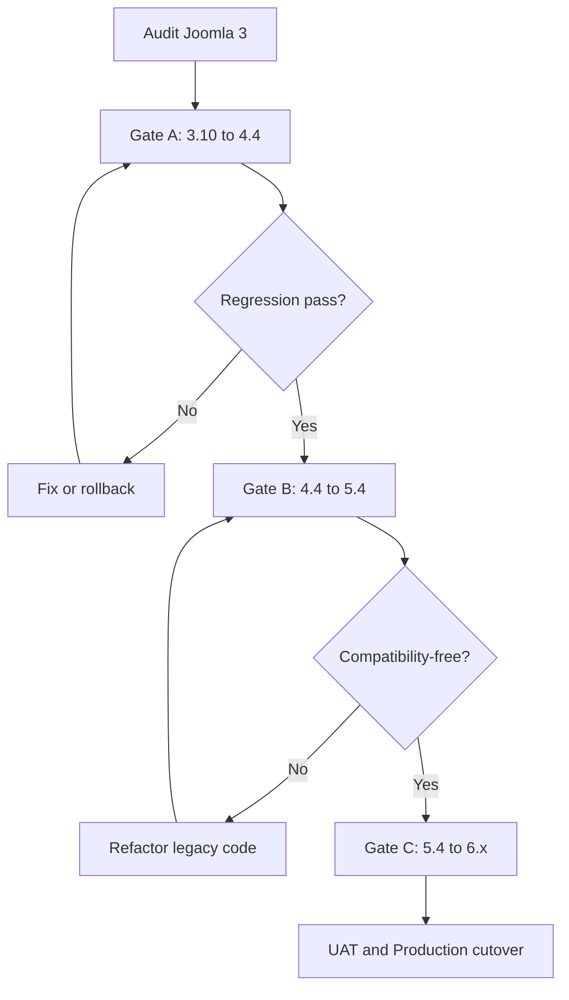

# Proposal 1: Sequential Upgrade Joomla 3 to Joomla 6

## 1. Executive Summary

Upgrade the existing website through every officially supported major-version gate:

```text
Joomla 3.10.x → Joomla 4.4.x → Joomla 5.4.x → Joomla 6.x
```

This approach keeps the existing Joomla installation and lets Joomla apply the Core database migrations in sequence. It is recommended when the website is close to Joomla Core, has manageable custom code, and must preserve existing configuration, menu, ACL, and extension data.

> Do not run this process directly on Production. Complete every gate on a cloned Staging environment and keep a tested rollback package.

## 2. Objectives

- Preserve existing content, users, menu, modules, ACL, metadata, and URLs.
- Use supported Joomla update paths.
- Identify and remove legacy dependencies at controlled gates.
- Minimize manual Core-data transformation.
- Reach Joomla 6 with no uncontrolled Core modification or unsupported extension.

## 3. Suitable When

- Most features use Joomla Core.
- Third-party extensions provide compatible releases for Joomla 4, 5, and 6.
- Custom extensions and template overrides are limited or maintainable.
- Existing database relationships and configuration are complex and valuable.
- A full redesign is not required.

## 4. Not Suitable When

- The Joomla 3 site contains many abandoned extensions.
- Core files have been heavily modified.
- Most business features are implemented by legacy custom components.
- The template and frontend are being completely redesigned.
- Existing data is inconsistent and should not all be retained.

## 5. Upgrade Workflow



## 6. Phase 0 — Discovery and Audit

### Environment

- [ ] Record the exact Joomla 3 patch version.
- [ ] Record PHP, database, web server, and required PHP extensions.
- [ ] Inventory cron jobs, CLI commands, SMTP, cache, sessions, CDN, and integrations.
- [ ] Confirm DEV, Staging/UAT, and Production environments.
- [ ] Document deployment and rollback processes.

### Extensions and custom code

- [ ] Export every component, module, plugin, template, language, library, package, and file extension.
- [ ] Classify each item as Core, third-party, custom, unknown, abandoned, or orphan.
- [ ] Record compatibility for Joomla 4, 5, and 6.
- [ ] Find direct Core modifications by comparing with a clean Joomla 3 package.
- [ ] Audit legacy APIs such as `JFactory`, `JRequest`, `JError`, and Legacy MVC classes.
- [ ] Audit plugin event signatures, routing, database calls, and asset loading.
- [ ] List all template overrides and JavaScript/jQuery dependencies.

### Features and data

- [ ] Map each feature using `URL → Menu → Component → View → Module → Plugin → Database/API`.
- [ ] Assign business priority P1, P2, or P3.
- [ ] Classify Core, third-party, custom, and orphan database tables.
- [ ] Validate menu, category, asset, and user-group Nested Sets.
- [ ] Record data counts and validation queries.
- [ ] Preserve SEO URLs, metadata, canonical rules, and redirects.

## 7. Gate A — Joomla 3.10.x to Joomla 4.4.x

This is normally the highest-risk gate because Joomla 3 legacy APIs and templates require the most remediation.

- [ ] Update Joomla 3 to its final supported `3.10.x` baseline.
- [ ] Run Joomla Pre-Update Check.
- [ ] Upgrade extensions to bridge versions supporting Joomla 3 and 4.
- [ ] Remove or replace incompatible and abandoned extensions.
- [ ] Refactor incompatible custom code.
- [ ] Replace or rebuild the Joomla 3 template.
- [ ] Create and restore-test a full source, database, and media backup.
- [ ] Clone the site to Staging.
- [ ] Run the Joomla 4 update.
- [ ] Inspect update, PHP, web server, and Joomla logs.
- [ ] Validate the database schema and extension status.
- [ ] Test frontend, administrator, CLI, cron, mail, authentication, and APIs.
- [ ] Run P1/P2 regression and data-count validation.
- [ ] Obtain technical and business sign-off before continuing.

## 8. Gate B — Joomla 4.4.x to Joomla 5.4.x

- [ ] Stabilize the website on the latest approved Joomla `4.4.x` patch.
- [ ] Upgrade all extensions to Joomla 5-compatible versions.
- [ ] Review custom namespaces, dependency injection, PSR packages, and Composer dependencies.
- [ ] Review Web Asset Manager usage and plugin event signatures.
- [ ] Run the Pre-Update Check.
- [ ] Create and restore-test a backup.
- [ ] Upgrade Staging to Joomla `5.4.x`.
- [ ] Record all code relying on the Backward Compatibility plugin.
- [ ] Refactor dependencies that must not be carried into Joomla 6.
- [ ] Run full regression, security, performance, SEO, and data validation.
- [ ] Obtain gate sign-off.

## 9. Gate C — Joomla 5.4.x to Joomla 6.x

- [ ] Update all third-party and custom extensions for Joomla 6.
- [ ] Review Joomla 5.4-to-6 breaking changes and known issues.
- [ ] Disable the Joomla 5 Backward Compatibility plugin while still on Joomla 5.4.
- [ ] Fix every failure caused by disabling compatibility.
- [ ] Confirm all P1/P2 features work without the Joomla 5 compatibility bridge.
- [ ] Run the Pre-Update Check.
- [ ] Create and restore-test a final pre-upgrade backup.
- [ ] Upgrade Staging to the approved Joomla 6 patch version.
- [ ] Validate database schema, extensions, template, overrides, integrations, and logs.
- [ ] Complete regression and UAT.
- [ ] Approve the Production release.

## 10. Testing Requirements

### Functional

- [ ] Homepage, listing, detail, pagination, sort, filter, and search.
- [ ] Desktop/mobile menu and module assignments.
- [ ] Forms, validation, submission, email, and file upload.
- [ ] Login, logout, password reset, roles, view levels, and ACL.
- [ ] Administrator CRUD workflows.
- [ ] Multilingual content and associations.
- [ ] APIs, webhooks, cron, and CLI commands.
- [ ] Cache and custom error pages.

### Data and SEO

- [ ] Compare article, category, menu, module, user, and custom-record counts.
- [ ] Compare representative content and ACL samples.
- [ ] Verify media and attachments.
- [ ] Verify URLs, redirects, canonical tags, metadata, sitemap, and robots rules.
- [ ] Confirm no unexpected high-volume 404 responses.

### Non-functional

- [ ] Responsive and cross-browser tests.
- [ ] Accessibility checks.
- [ ] Security headers, permissions, and dependency scan.
- [ ] Performance and Core Web Vitals.
- [ ] Error logging and monitoring.

## 11. Rollback Strategy

At every gate, retain:

- Full source, database, configuration, and media backups.
- A tested restoration procedure and measured restore time.
- The previous stable environment or deployable release.
- Explicit rollback thresholds and a decision owner.
- A change/content freeze and final-data synchronization plan for Production.

Never partially roll back only source code after a Core database migration.

## 12. Main Risks and Controls

| Risk | Impact | Control |
|---|---|---|
| Incompatible extension | Fatal errors or missing features | Compatibility matrix and Staging PoC |
| Legacy custom code | Broken frontend/admin workflow | Static audit and refactor per gate |
| Old template overrides | Incorrect layout or PHP errors | Rebuild/compare each override |
| Schema inconsistency | Failed update or corrupt relationships | Schema check and validation queries |
| URL changes | SEO and traffic loss | URL inventory, redirect map, crawl comparison |
| Compatibility-plugin dependency | Joomla 6 blocker | Disable and remediate on Joomla 5.4 |
| Long downtime | Business disruption | Rehearsal, timing measurements, rollback runbook |

## 13. Deliverables

- Current-environment report.
- Extension compatibility matrix.
- Feature and URL mapping.
- Custom-code and Core-modification audit.
- Database classification and validation report.
- Test cases and regression evidence for each gate.
- Upgrade and rollback runbooks.
- UAT and Production sign-off records.

## 14. Definition of Done

- [ ] Production runs the approved Joomla 6 patch version.
- [ ] No unknown extension or uncontrolled Core modification remains.
- [ ] All retained extensions have a supported owner and version.
- [ ] The site does not depend on the Joomla 5 compatibility bridge.
- [ ] P1/P2 feature, data, SEO, security, and performance tests pass.
- [ ] Backup restoration and rollback are verified.
- [ ] Technical and operating documentation is updated.

## 15. Recommendation

Choose this proposal when the audit shows that the current website is mostly Joomla Core with upgradeable extensions and moderate custom code. Run a Gate A proof of concept first; its result provides the strongest evidence for the total effort and whether the sequential strategy remains viable.
