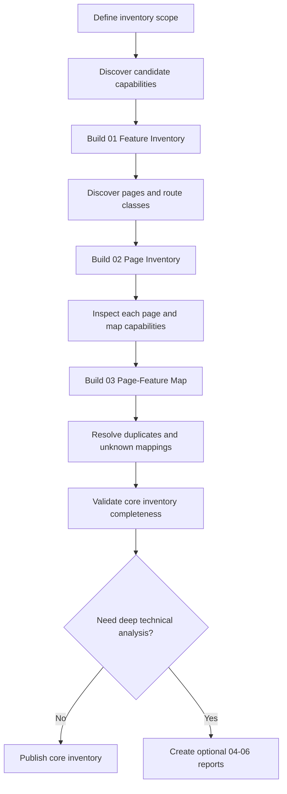

# Joomla Feature Inventory Report

This directory defines a reusable reporting model for identifying and documenting the complete feature set of a single Joomla website or project.

> **Scope:** This is not a comparison report. It describes one Joomla project at a time. The core objective is to answer three questions: **What features exist? What pages exist? Which pages use which features?**

<a id="table-of-contents"></a>
## Table of Contents

1. [Purpose](#purpose)
2. [Core Reporting Model](#core-reporting-model)
3. [Required Core Reports](#required-core-reports)
4. [Optional Deep Reports](#optional-deep-reports)
5. [Feature Definition Rules](#feature-definition-rules)
6. [Page Definition Rules](#page-definition-rules)
7. [Page-to-Feature Mapping Rules](#page-feature-mapping-rules)
8. [Inventory Workflow](#inventory-workflow)
9. [Recommended Directory Structure](#directory-structure)
10. [Minimum Completion Criteria](#minimum-completion-criteria)

---

<a id="purpose"></a>
## 1. Purpose

The report is designed to create a practical inventory of a Joomla project's behavior without requiring a deep technical audit for every feature.

The minimum useful output is:

```text
Feature Inventory
      ↓
Page Inventory
      ↓
Page ↔ Feature Mapping
```

This produces a traceable answer to:

```text
Feature
→ where it is used
→ which page or route exposes it
```

The core reports are intentionally sufficient for project understanding, testing scope, migration planning, regression planning, and feature-level debugging entry points.

Technical dependency analysis, runtime evidence, and audit coverage calculations are available as optional reports when deeper investigation is required.

[Back to Table of Contents](#table-of-contents)

---

<a id="core-reporting-model"></a>
## 2. Core Reporting Model

The reporting model is split into two levels.

### Level 1 — Required core inventory

```text
01-feature-inventory.csv
02-page-inventory.csv
03-page-feature-map.csv
```

These three files are the default deliverables and should be detailed enough to stand on their own.

### Level 2 — Optional deep analysis

```text
04-feature-dependency-map.csv
05-feature-evidence.csv
06-feature-coverage.csv
```

Create these only when the project requires deeper technical analysis, audit evidence, dependency tracing, or measurable discovery coverage.

The optional reports must not be required to understand the basic feature-to-page inventory.

[Back to Table of Contents](#table-of-contents)

---

<a id="required-core-reports"></a>
## 3. Required Core Reports

### 3.1 `01-feature-inventory.csv`

This is the canonical list of features provided by the Joomla project.

A feature should describe a capability, not merely an implementation name.

Examples:

```text
Main Navigation
Homepage Hero Slider
Article Listing
Article Detail
Vehicle Search
Shopping Cart
Newsletter Signup
Contact Form
User Login
Site Search
```

Recommended fields:

| Field | Purpose |
|---|---|
| `feature_id` | Stable feature identifier, for example `F001` |
| `feature_name` | Human-readable capability name |
| `category` | Navigation, content, commerce, forms, user, media, integration, etc. |
| `surface` | Frontend, administrator, system, or integration |
| `feature_type` | Visual, interaction, workflow, background, integration, administration, etc. |
| `description` | What the feature does |
| `business_purpose` | Why the project needs the feature |
| `user_actor` | Visitor, authenticated user, editor, administrator, system, external service |
| `entry_point` | URL, menu item, action, event, CLI command, cron, webhook, etc. |
| `primary_implementation` | Main Joomla component, module, plugin, template, or custom code |
| `status` | Active, conditional, disabled, legacy, unknown |
| `access` | Public, authenticated, ACL-restricted, administrator, system |
| `visibility_condition` | Important condition controlling feature availability |
| `language_scope` | Language restriction when relevant |
| `route_or_trigger` | Primary route, route pattern, or non-page trigger |
| `related_page_count` | Number of mapped pages when known |
| `discovery_source` | Menu, module, source, runtime, administrator UI, integration, etc. |
| `notes` | Additional project-specific context |

The inventory should not duplicate one capability merely because it appears on several pages.

[Back to Table of Contents](#table-of-contents)

### 3.2 `02-page-inventory.csv`

This is the canonical list of pages and route classes exposed by the project.

Do not treat `#__menu` as the complete page list. Joomla components can generate detail pages, search results, filters, pagination states, authenticated pages, and other routes without dedicated menu items.

Recommended fields:

| Field | Purpose |
|---|---|
| `page_id` | Stable page identifier, for example `P001` |
| `page_name` | Human-readable page or route-class name |
| `surface` | Frontend or administrator |
| `page_type` | Home, listing, detail, search, form, checkout, dashboard, etc. |
| `url` | Representative or canonical URL |
| `route_pattern` | Pattern for dynamic routes, for example `/vehicles/{alias}` |
| `menu_id` | Joomla menu item ID when applicable |
| `menu_title` | Joomla menu item title when applicable |
| `component` | Main component handling the page |
| `view` | Component view when known |
| `layout` | Selected layout when known |
| `access` | Public, authenticated, ACL-restricted, administrator |
| `language` | Language context |
| `dynamic` | Whether many entity URLs share the same page behavior |
| `requires_auth` | Whether authentication is required |
| `parent_page_id` | Parent page/route class when useful |
| `discovery_source` | Menu, crawler, component route, administrator UI, manual discovery, etc. |
| `status` | Active, conditional, disabled, legacy, unknown |
| `notes` | Important context or exceptions |

For high-volume dynamic pages, prefer one route-class row plus representative URLs instead of thousands of nearly identical records.

[Back to Table of Contents](#table-of-contents)

### 3.3 `03-page-feature-map.csv`

This file is the normalized many-to-many relationship between the two core inventories.

It answers:

> Which feature is used on which page, and under what condition?

Recommended fields:

| Field | Purpose |
|---|---|
| `map_id` | Stable relationship identifier |
| `page_id` | Reference to `02-page-inventory.csv` |
| `feature_id` | Reference to `01-feature-inventory.csv` |
| `usage_type` | Primary, supporting, global, contextual, interactive, embedded, etc. |
| `visibility` | Always, conditional, authenticated-only, role-based, language-specific, etc. |
| `condition` | Concrete visibility or activation condition |
| `position_or_region` | Header, hero, main, sidebar, footer, modal, background, etc. |
| `trigger` | Page load, click, submit, filter, event, cron, webhook, etc. |
| `interaction_type` | Display, navigation, form, search, filter, transaction, background action, etc. |
| `is_primary` | Whether the feature represents the page's primary capability |
| `discovery_source` | How the relationship was discovered |
| `notes` | Mapping-specific context |

Example:

```text
P001 → F001 Main Navigation → global → header → page_load
P001 → F002 Homepage Hero Slider → primary → hero → page_load
P010 → F014 Vehicle Search → primary → main → user_action
P010 → F020 Newsletter Signup → supporting → footer → submit
```

This file is the main bridge between feature-level and page-level testing.

[Back to Table of Contents](#table-of-contents)

---

<a id="optional-deep-reports"></a>
## 4. Optional Deep Reports

The following reports are optional and should be created only when the project needs deeper analysis.

| Report | Use it when... |
|---|---|
| `04-feature-dependency-map.csv` | You need to trace components, modules, plugins, layouts, tables, assets, APIs, configuration, or other technical dependencies behind a feature |
| `05-feature-evidence.csv` | You need explicit proof that a feature or mapping exists in configuration, source code, or runtime behavior |
| `06-feature-coverage.csv` | You need measurable audit/discovery coverage and visibility into unknown or unreviewed areas |

These reports are useful for technical audits, difficult debugging, migration risk analysis, security review, handover, or high-confidence completeness checks.

They are not required for the default feature inventory workflow.

[Back to Table of Contents](#table-of-contents)

---

<a id="feature-definition-rules"></a>
## 5. Feature Definition Rules

Use the following rules when creating `01-feature-inventory.csv`.

1. Name the capability, not the extension.
2. Create separate features when the business purpose is different, even if the same extension implements them.
3. Do not create duplicate features just because the same capability appears on multiple pages.
4. Record global features once, then map them to all relevant page classes in `03-page-feature-map.csv`.
5. Treat visual, interactive, background, administrator, and integration capabilities as valid features when they are in scope.
6. Mark uncertain capabilities as `unknown` rather than presenting assumptions as facts.

Example:

```text
mod_menu instance 42 → Main Navigation
mod_menu instance 51 → Footer Navigation
mod_menu instance 67 → Account Navigation
```

These are three features because they serve different purposes, even though all three use `mod_menu`.

[Back to Table of Contents](#table-of-contents)

---

<a id="page-definition-rules"></a>
## 6. Page Definition Rules

Use the following rules when creating `02-page-inventory.csv`.

1. Start from published menu items, but do not stop there.
2. Add crawler-discovered internal routes.
3. Add component-generated detail pages and important stateful routes.
4. Represent large dynamic URL families with route patterns.
5. Separate pages when the page behavior or primary capability is meaningfully different.
6. Do not create separate page rows for trivial URL variations that do not change behavior.
7. Include authenticated, administrator, multilingual, or conditional routes only when they are inside the defined inventory scope.

Example:

```text
/vehicles              → Vehicle Listing
/vehicles/civic        → Vehicle Detail
/vehicles/city         → Vehicle Detail
/vehicles/crv          → Vehicle Detail
```

Recommended inventory representation:

```text
P002 Vehicle Listing → /vehicles
P003 Vehicle Detail  → /vehicles/{alias}
```

Representative runtime URLs can be recorded in `notes` or supporting tooling.

[Back to Table of Contents](#table-of-contents)

---

<a id="page-feature-mapping-rules"></a>
## 7. Page-to-Feature Mapping Rules

Use `03-page-feature-map.csv` only for relationships between already-defined pages and features.

Recommended rules:

- one row represents one `page_id + feature_id` relationship;
- global features may have many mapping rows;
- page-specific features normally have fewer mappings;
- conditional behavior must record its condition;
- the page's main capability should use `is_primary=yes`;
- supporting UI should use a suitable `usage_type`, such as `global` or `supporting`;
- do not duplicate technical dependency information here unless it is necessary to explain the relationship.

Example mapping:

| page_id | feature_id | usage_type | visibility | position_or_region | trigger | is_primary |
|---|---|---|---|---|---|---|
| P001 | F001 | global | always | header | page_load | no |
| P001 | F002 | primary | always | hero | page_load | yes |
| P002 | F014 | primary | always | main | page_load | yes |
| P002 | F015 | interactive | always | main | user_action | no |

[Back to Table of Contents](#table-of-contents)

---

<a id="inventory-workflow"></a>
## 8. Inventory Workflow

The detailed execution workflow is documented in [`WORKFLOW.md`](./WORKFLOW.md).

At a high level:



Templates for every report are available under [`templates/`](./templates/).

[Back to Table of Contents](#table-of-contents)

---

<a id="directory-structure"></a>
## 9. Recommended Directory Structure

```text
report/features/
├── README.md
├── WORKFLOW.md
├── 01-feature-inventory.csv
├── 02-page-inventory.csv
├── 03-page-feature-map.csv
├── 04-feature-dependency-map.csv        # optional
├── 05-feature-evidence.csv              # optional
├── 06-feature-coverage.csv              # optional
└── templates/
    ├── 01-feature-inventory-template.csv
    ├── 02-page-inventory-template.csv
    ├── 03-page-feature-map-template.csv
    ├── 04-feature-dependency-map-template.csv
    ├── 05-feature-evidence-template.csv
    └── 06-feature-coverage-template.csv
```

The actual project may contain only `README.md`, `WORKFLOW.md`, and the three core report files if optional deep analysis is unnecessary.

[Back to Table of Contents](#table-of-contents)

---

<a id="minimum-completion-criteria"></a>
## 10. Minimum Completion Criteria

The core inventory can be considered usable when all of the following are true:

- [ ] Every confirmed feature has a unique `feature_id`.
- [ ] Every relevant page or route class has a unique `page_id`.
- [ ] Published menu-driven pages are represented.
- [ ] Important dynamic page classes are represented.
- [ ] Every active in-scope feature is mapped to at least one page or documented as a non-page feature.
- [ ] Every in-scope page has its primary feature identified.
- [ ] Global features are mapped consistently across applicable page classes.
- [ ] Conditional mappings record their activation or visibility condition.
- [ ] Duplicate feature definitions have been normalized.
- [ ] Unknown features or pages are explicitly marked instead of silently omitted.

For the default workflow, completion means:

```text
01-feature-inventory.csv   → complete enough to list project capabilities
02-page-inventory.csv      → complete enough to list project page/route classes
03-page-feature-map.csv    → complete enough to connect features to their usage locations
```

Use the optional reports only when stronger technical traceability or measurable audit confidence is required.

[Back to Table of Contents](#table-of-contents)
