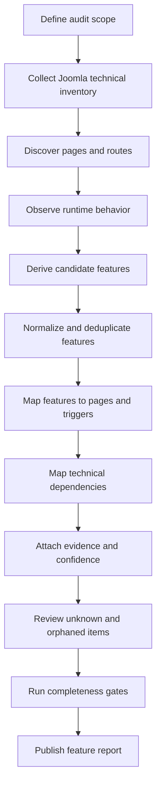

# Joomla Feature Inventory Report

This document defines a practical workflow for discovering, documenting, and validating the complete feature set of a Joomla website or project.

> **Scope:** This is a single-project feature inventory. It does not compare Joomla versions, environments, releases, or websites. Its purpose is to answer: **What features exist, where are they used, how are they implemented, what data and assets do they depend on, and what evidence proves they exist?**

<a id="table-of-contents"></a>
## Table of Contents

1. [Purpose](#purpose)
2. [What Counts as a Feature?](#feature-definition)
3. [Feature vs. Joomla Implementation](#feature-vs-implementation)
4. [Recommended Feature Taxonomy](#feature-taxonomy)
5. [Feature Discovery Sources](#discovery-sources)
6. [Page and Route Inventory](#page-inventory)
7. [Feature Inventory](#feature-inventory)
8. [Page-to-Feature Matrix](#page-feature-matrix)
9. [Feature Dependency Map](#dependency-map)
10. [Feature Evidence Model](#evidence-model)
11. [Feature Signature](#feature-signature)
12. [Discovery Workflow](#discovery-workflow)
13. [Database Discovery](#database-discovery)
14. [Source-Code Discovery](#source-discovery)
15. [Runtime Discovery](#runtime-discovery)
16. [How to Handle Dynamic and Conditional Features](#dynamic-features)
17. [Completeness and Coverage Gates](#coverage-gates)
18. [Recommended Report Files](#report-files)
19. [Example Feature Record](#example-feature)
20. [Final Validation Checklist](#validation-checklist)

---

<a id="purpose"></a>
## 1. Purpose

A Joomla project is not fully described by its installed extensions or database tables. A real feature may be assembled from several Joomla mechanisms at the same time:

```text
Feature
→ Route or trigger
→ Component / module / plugin
→ View and layout
→ Template override
→ Database data
→ Media and static assets
→ JavaScript / CSS
→ External integration
→ Runtime behavior
```

The goal of a feature inventory is to create a stable, evidence-backed catalog of the capabilities provided by the project.

A complete report should allow a developer to answer questions such as:

- What business and user-facing features exist?
- Which pages use each feature?
- Which Joomla extension implements each feature?
- Which component view, module instance, plugin, layout, or template override participates in the feature?
- Which database tables contain its data or configuration?
- Which CSS, JavaScript, images, or other assets are required?
- Which external APIs or services are required?
- Is the feature public, authenticated, administrator-only, scheduled, or conditionally visible?
- What evidence proves the feature is present?
- Has every relevant page, extension, override, module, interaction, and integration been reviewed?

The report is therefore useful for:

- project understanding;
- technical handover;
- maintenance planning;
- refactoring;
- migration preparation;
- regression-test planning;
- security review;
- dependency analysis;
- decommissioning unused functionality.

[Back to Table of Contents](#table-of-contents)

---

<a id="feature-definition"></a>
## 2. What Counts as a Feature?

A **feature** is a capability that provides observable business, user, administrator, integration, or operational behavior.

Good feature names describe **what the project does**, not the Joomla extension name that happens to implement it.

Examples:

| Feature | Typical capability |
|---|---|
| Main Navigation | Lets visitors navigate primary website sections |
| Article Listing | Displays a collection of articles |
| Article Detail | Displays one article |
| Vehicle Search | Lets visitors search vehicles by criteria |
| Product Cart | Stores products selected for purchase |
| Newsletter Signup | Collects newsletter subscriptions |
| Contact Form | Sends visitor enquiries |
| User Login | Authenticates users |
| Image Slider | Displays rotating promotional media |
| Breadcrumb | Shows the current navigation hierarchy |
| Site Search | Searches indexed website content |
| Sitemap Generation | Generates a machine- or user-readable sitemap |
| Scheduled Email | Sends messages through a scheduled process |
| Payment Processing | Sends transaction data to a payment provider |

The following items are normally **not** feature names by themselves:

```text
com_content
mod_menu
plg_system_example
#__content
/templates/site/html/com_content
media/com_example/app.js
```

Those are implementations or dependencies.

[Back to Table of Contents](#table-of-contents)

---

<a id="feature-vs-implementation"></a>
## 3. Feature vs. Joomla Implementation

A feature and its implementation must be recorded separately.

Example:

```text
Feature: Homepage Hero Slider

Implementation
├── Module type: mod_example_slider
├── Module instance: ID 123
├── Position: hero
├── Menu assignment: Home
├── Layout: default
├── Template override: templates/site/html/mod_example_slider/default.php
├── Database: #__example_slider
├── JavaScript: media/mod_example_slider/js/slider.js
├── CSS: media/mod_example_slider/css/slider.css
└── Media: images/banners/*
```

This distinction matters because:

- one feature can depend on several extensions;
- one extension can implement several features;
- one module type can have many module instances with different business purposes;
- the same component view can behave differently because of menu parameters or layout overrides;
- a feature can exist without a dedicated Joomla extension, for example when it is implemented in a template or custom JavaScript;
- a feature can be triggered by a plugin, cron job, CLI command, webhook, or external API rather than a visible page.

Use this rule throughout the report:

```text
Feature = capability
Implementation = Joomla mechanism that provides the capability
```

[Back to Table of Contents](#table-of-contents)

---

<a id="feature-taxonomy"></a>
## 4. Recommended Feature Taxonomy

Use a taxonomy so features are grouped consistently.

```text
FEATURES
│
├── NAVIGATION
│   ├── Main Menu
│   ├── Secondary Menu
│   ├── Footer Menu
│   ├── Breadcrumb
│   └── Pagination
│
├── CONTENT
│   ├── Article Listing
│   ├── Article Detail
│   ├── Featured Content
│   ├── Category Navigation
│   └── Tags
│
├── SEARCH_AND_DISCOVERY
│   ├── Site Search
│   ├── Filters
│   ├── Sorting
│   └── Recommendations
│
├── BUSINESS_DOMAIN
│   ├── Product / Vehicle / Property Listing
│   ├── Detail View
│   ├── Search
│   ├── Filter
│   └── Business-specific Actions
│
├── COMMERCE
│   ├── Product Catalog
│   ├── Cart
│   ├── Checkout
│   ├── Payment
│   └── Order History
│
├── FORMS
│   ├── Contact Form
│   ├── Registration Form
│   ├── Lead Form
│   ├── Newsletter Signup
│   └── Custom Forms
│
├── USER_AND_ACCESS
│   ├── Login
│   ├── Logout
│   ├── Registration
│   ├── Password Reset
│   ├── Profile
│   └── Access-controlled Content
│
├── MEDIA
│   ├── Slider
│   ├── Gallery
│   ├── Video
│   ├── Document Download
│   └── Lightbox
│
├── GLOBAL_UI
│   ├── Header
│   ├── Footer
│   ├── Cookie Notice
│   ├── Modal / Popup
│   ├── Social Links
│   └── Responsive Navigation
│
├── ADMINISTRATION
│   ├── Content Management
│   ├── User Management
│   ├── Configuration
│   ├── Import / Export
│   └── Reporting
│
├── INTEGRATION
│   ├── Analytics
│   ├── Maps
│   ├── CRM
│   ├── SMTP
│   ├── Payment Gateway
│   ├── Webhooks
│   └── External APIs
│
├── SECURITY_AND_COMPLIANCE
│   ├── CAPTCHA
│   ├── Consent
│   ├── Access Control
│   ├── Security Filtering
│   └── Audit Logging
│
└── OPERATIONAL
    ├── Scheduled Tasks
    ├── Background Jobs
    ├── Cache
    ├── Search Indexing
    ├── Backup
    └── Monitoring
```

The taxonomy is a classification aid, not a restriction. Add project-specific categories when the domain requires them.

Each feature should also record its **surface**:

| Surface | Meaning |
|---|---|
| `frontend` | Public or authenticated site application |
| `administrator` | Joomla administrator application |
| `system` | Background, CLI, scheduled, or event-driven behavior |
| `integration` | Behavior primarily involving an external service |

[Back to Table of Contents](#table-of-contents)

---

<a id="discovery-sources"></a>
## 5. Feature Discovery Sources

No single source can produce a complete Joomla feature inventory. Discovery should combine the database, source code, configuration, and runtime website.

| Source | What it reveals |
|---|---|
| `#__menu` | Menu-driven routes, component context, aliases, access, language, menu parameters |
| `#__extensions` | Installed components, modules, plugins, templates, libraries, packages, and other extension types |
| `#__modules` | Module instances, positions, publication state, parameters, access, language |
| `#__modules_menu` | Page assignments for module instances |
| Extension-specific tables | Business data and extension configuration |
| `/components` | Frontend component implementations |
| `/administrator/components` | Administrator component implementations |
| `/modules` | Frontend module implementations |
| `/plugins` | Event-driven behavior |
| `/templates` | Templates, positions, overrides, custom UI behavior |
| `/layouts` | Shared layouts |
| `/media` | Extension CSS, JavaScript, images, and other assets |
| `/images` | Project media referenced by features |
| `configuration.php` | Global Joomla configuration and environment dependencies |
| Web server / deployment config | Redirects, headers, rewrites, cron jobs, PHP and server behavior |
| Runtime crawl | Real URLs, DOM, hidden links, dynamic pages, HTTP behavior |
| Browser network activity | APIs, AJAX, assets, third-party services |
| Browser console | Runtime JavaScript errors and warnings |
| Administrator UI | Published state, assignments, extension settings, ACL, workflows |

The report should distinguish between **discovered evidence** and **inferred relationships**. Do not mark a feature as confirmed only because a similarly named extension is installed.

[Back to Table of Contents](#table-of-contents)

---

<a id="page-inventory"></a>
## 6. Page and Route Inventory

A complete feature report needs a page inventory because features must be mapped to where they are used.

Do not assume that `#__menu` contains every page. Joomla components frequently generate dynamic URLs that have no dedicated menu item.

The page inventory should combine:

```text
Published menu items
+ Runtime crawler results
+ Component-generated detail routes
+ Search / filter / pagination routes
+ Authenticated routes
+ Administrator routes when in scope
+ Known non-HTML endpoints when relevant
```

Recommended fields:

| Field | Purpose |
|---|---|
| `page_id` | Stable internal identifier, for example `P001` |
| `page_name` | Human-readable page name |
| `surface` | `frontend` or `administrator` |
| `page_type` | Home, listing, detail, search, form, dashboard, etc. |
| `url` | Observed or canonical URL |
| `route_pattern` | Pattern for dynamic routes when many URLs share one behavior |
| `menu_id` | Joomla menu item ID when applicable |
| `component` | Main component, for example `com_content` |
| `view` | Component view |
| `layout` | Selected layout |
| `access` | Access requirement |
| `language` | Language context |
| `dynamic` | Whether the route is generated from entity data |
| `evidence` | Source that confirms the page exists |
| `notes` | Important context or exceptions |

For large sites, do not create thousands of manually maintained rows when many entity URLs use the same implementation. Record both the route pattern and representative runtime URLs.

Example:

| page_id | page_name | page_type | url | route_pattern | component | view |
|---|---|---|---|---|---|---|
| P001 | Home | home | `/` | `/` | `com_content` | `featured` |
| P002 | Vehicle Listing | listing | `/vehicles` | `/vehicles` | `com_vehicle` | `vehicles` |
| P003 | Vehicle Detail | detail | `/vehicles/civic` | `/vehicles/{alias}` | `com_vehicle` | `vehicle` |

[Back to Table of Contents](#table-of-contents)

---

<a id="feature-inventory"></a>
## 7. Feature Inventory

The feature inventory is the canonical list of capabilities discovered in the project.

Recommended fields:

| Field | Purpose |
|---|---|
| `feature_id` | Stable identifier, for example `F001` |
| `feature_name` | Business or user-oriented feature name |
| `category` | Feature taxonomy category |
| `surface` | Frontend, administrator, system, integration |
| `description` | What the feature does |
| `business_purpose` | Why the feature exists |
| `user_actor` | Visitor, authenticated user, editor, administrator, system, external service |
| `entry_point` | URL, menu item, button, event, CLI command, cron, webhook, etc. |
| `primary_implementation` | Main component, module, plugin, template, or custom code |
| `status` | Active, conditional, disabled, unknown, legacy |
| `access` | Public, authenticated, ACL-restricted, administrator, system |
| `language_scope` | Language restrictions when applicable |
| `pages_used` | Page IDs or route classes using the feature |
| `data_sources` | Joomla tables, custom tables, files, or APIs |
| `external_dependencies` | External services or providers |
| `evidence_status` | Confirmed, probable, unknown |
| `evidence_refs` | References supporting the record |
| `notes` | Exceptions and operational details |

Avoid duplicate records caused by implementation details. For example, five `mod_menu` module instances may represent three distinct features: Main Navigation, Footer Navigation, and Account Navigation.

[Back to Table of Contents](#table-of-contents)

---

<a id="page-feature-matrix"></a>
## 8. Page-to-Feature Matrix

The page-to-feature matrix answers:

> Which features are expected or observed on which pages?

Example:

| Page | Main Navigation | Breadcrumb | Hero Slider | Vehicle Search | Newsletter | Cart |
|---|---:|---:|---:|---:|---:|---:|
| Home | ✓ |  | ✓ |  | ✓ | ✓ |
| Vehicle Listing | ✓ | ✓ |  | ✓ | ✓ | ✓ |
| Vehicle Detail | ✓ | ✓ |  |  | ✓ | ✓ |
| News Listing | ✓ | ✓ |  |  | ✓ | ✓ |
| Contact | ✓ | ✓ |  |  |  |  |

For machine-readable reports, prefer one row per relationship instead of a very wide table:

| page_id | feature_id | relationship | condition | evidence |
|---|---|---|---|---|
| P001 | F001 | visible | always | runtime + module assignment |
| P001 | F002 | visible | always | runtime + DOM |
| P002 | F007 | interactive | query/filter form | runtime + source |

This normalized format scales better and can later generate a visual matrix automatically.

[Back to Table of Contents](#table-of-contents)

---

<a id="dependency-map"></a>
## 9. Feature Dependency Map

Every confirmed feature should be connected to its technical dependencies.

Recommended dependency types:

```text
Feature
├── Route / Menu Item
├── Component
├── View
├── Layout
├── Template Override
├── Module Type
├── Module Instance
├── Module Position
├── Plugin
├── Database Table
├── Configuration
├── Media File
├── CSS
├── JavaScript
├── AJAX / API Endpoint
├── External Service
├── ACL / Access Level
├── Language
└── Scheduled / Background Trigger
```

Recommended fields:

| Field | Purpose |
|---|---|
| `feature_id` | Feature identifier |
| `dependency_type` | Component, module, table, asset, API, etc. |
| `dependency_name` | Technical identifier |
| `dependency_id` | Joomla/database ID when relevant |
| `path_or_reference` | File path, table name, URL, or configuration key |
| `required` | Whether the dependency is mandatory for the feature |
| `condition` | Condition under which the dependency is used |
| `evidence` | How the dependency relationship was confirmed |
| `notes` | Additional context |

Example:

| feature_id | dependency_type | dependency_name | path_or_reference | required |
|---|---|---|---|---:|
| F002 | module | `mod_example_slider` | module instance 123 | yes |
| F002 | layout | `default` | `modules/mod_example_slider/tmpl/default.php` | yes |
| F002 | override | `default` | `templates/site/html/mod_example_slider/default.php` | no |
| F002 | database | slider data | `#__example_slider` | yes |
| F002 | JavaScript | slider runtime | `media/mod_example_slider/js/slider.js` | yes |

[Back to Table of Contents](#table-of-contents)

---

<a id="evidence-model"></a>
## 10. Feature Evidence Model

A useful feature report should separate three kinds of evidence.

### 10.1 Configuration evidence

Configuration says the feature **should be available**.

Examples:

- published menu item;
- published module;
- module-to-menu assignment;
- enabled plugin;
- component configuration;
- ACL assignment;
- scheduled-task configuration.

### 10.2 Implementation evidence

Implementation says the code and dependencies **exist**.

Examples:

- component view;
- module implementation;
- plugin event handler;
- layout file;
- template override;
- database table;
- JavaScript or CSS asset;
- API client;
- CLI command.

### 10.3 Runtime evidence

Runtime evidence proves the feature **actually executes or renders**.

Examples:

- feature DOM element exists;
- internal link is observed;
- form can be opened;
- module markup renders;
- AJAX request is made;
- external API call is observed;
- scheduled task logs execution;
- administrator page is accessible to the correct actor.

Recommended evidence status:

| Status | Meaning |
|---|---|
| `CONFIRMED` | Supported by direct runtime evidence or by multiple consistent technical sources |
| `PROBABLE` | Strong implementation/configuration evidence but no runtime confirmation |
| `UNKNOWN` | Evidence is insufficient or contradictory |
| `INACTIVE` | Implementation exists but the feature is intentionally disabled or unpublished |

A feature inventory should avoid presenting `PROBABLE` or `UNKNOWN` items as confirmed functionality.

[Back to Table of Contents](#table-of-contents)

---

<a id="feature-signature"></a>
## 11. Feature Signature

A **feature signature** is a compact technical identity used to recognize a feature consistently across pages and tools.

Example:

```text
Feature ID: F005
Feature: Vehicle Listing

Route
  component = com_vehicle
  view      = vehicles

Data
  #__vehicles
  #__vehicle_categories

Layout
  com_vehicle/vehicles/default

DOM
  .vehicle-list

Interactions
  .vehicle-filter-form
  pagination

Assets
  vehicle.css
  vehicle.js
```

A signature can contain:

- component/view/layout;
- module type and instance;
- known DOM selectors;
- URL pattern;
- database tables;
- form action;
- JavaScript module;
- AJAX endpoint;
- plugin event;
- external host;
- template override path.

Signatures are especially useful for automated crawlers and Playwright-based inventory tools because they provide deterministic evidence for feature presence.

[Back to Table of Contents](#table-of-contents)

---

<a id="discovery-workflow"></a>
## 12. Discovery Workflow

The recommended workflow is feature-first but evidence-driven.



### Step 1 — Define the audit scope

Record what the report covers:

- frontend only or entire project;
- administrator application;
- authenticated user features;
- multilingual behavior;
- external integrations;
- scheduled and CLI behavior;
- deployment-specific features;
- disabled or legacy functionality.

Also record the environment used for runtime discovery.

### Step 2 — Collect the Joomla technical inventory

Inventory:

- extensions;
- menu items;
- module instances;
- module assignments;
- templates;
- template overrides;
- plugins;
- layouts;
- custom database tables;
- assets;
- configuration;
- external endpoints;
- scheduled tasks and CLI commands when in scope.

This step creates implementation candidates. It does not yet define business features.

### Step 3 — Discover pages and routes

Build the page inventory from menu configuration, runtime crawling, component-generated URLs, authenticated routes, and administrator routes when applicable.

Group high-volume dynamic URLs by route pattern while retaining representative examples.

### Step 4 — Observe runtime behavior

For each page or route class, record:

- visible sections;
- navigation;
- forms;
- filters;
- buttons;
- search;
- pagination;
- modal behavior;
- user actions;
- network requests;
- third-party integrations;
- conditional blocks.

Runtime inspection finds features that are difficult to infer from the database or extension list alone.

### Step 5 — Derive candidate features

Convert technical observations into capability names.

Example:

```text
Observed
- mod_menu instance 42
- position = navigation
- visible on all public pages

Candidate feature
- Main Navigation
```

### Step 6 — Normalize and deduplicate features

Merge duplicate candidate records that describe the same capability.

Do not merge features only because they use the same extension. For example:

```text
mod_menu instance 42 → Main Navigation
mod_menu instance 51 → Footer Navigation
mod_menu instance 67 → Account Navigation
```

These are separate features because they serve different purposes.

### Step 7 — Map features to pages and triggers

For visual features, map each feature to the pages where it appears.

For non-page features, map the trigger instead:

- plugin event;
- scheduled task;
- CLI command;
- webhook;
- API endpoint;
- administrator action.

### Step 8 — Map technical dependencies

Connect each feature to its component, module, plugin, layout, table, asset, configuration, integration, and runtime dependencies.

### Step 9 — Attach evidence and confidence

Every feature should have evidence references and an evidence status.

Avoid undocumented assumptions.

### Step 10 — Resolve unknown and orphaned items

Review anything that is installed, published, rendered, or referenced but not yet associated with a feature.

Examples:

- enabled plugin with unknown behavior;
- published module with no feature mapping;
- template override with no known page;
- custom table with unknown owner;
- external JavaScript host with unknown purpose;
- crawler-discovered page with no feature classification.

Each item must either be mapped, documented as technical-only, documented as legacy/inactive, or remain explicitly `UNKNOWN`.

### Step 11 — Run completeness gates

Use the gates in [Completeness and Coverage Gates](#coverage-gates).

### Step 12 — Publish the report

Publish the canonical feature inventory together with the page mapping, dependency mapping, and unresolved findings.

[Back to Table of Contents](#table-of-contents)

---

<a id="database-discovery"></a>
## 13. Database Discovery

Database discovery identifies configuration and implementation candidates. It does not prove that a feature is currently visible or working.

### 13.1 Installed extensions

```sql
SELECT
    extension_id,
    name,
    type,
    element,
    folder,
    client_id,
    enabled,
    package_id
FROM #__extensions
ORDER BY type, element, folder;
```

Review at least:

- components;
- modules;
- plugins;
- templates;
- libraries;
- packages;
- file extensions;
- language extensions when they influence project behavior.

### 13.2 Menu-driven page candidates

```sql
SELECT
    id,
    menutype,
    title,
    alias,
    path,
    link,
    type,
    component_id,
    parent_id,
    level,
    published,
    access,
    language,
    template_style_id,
    params
FROM #__menu
ORDER BY menutype, lft;
```

Menu items are important for routing and page context, but they are not a complete page inventory.

### 13.3 Module instances

```sql
SELECT
    id,
    title,
    module,
    position,
    published,
    access,
    language,
    showtitle,
    ordering,
    params
FROM #__modules
ORDER BY position, ordering, id;
```

A module type is not necessarily one feature. Inspect module instances individually because the same type may be used for different business purposes.

### 13.4 Module-to-menu assignment

```sql
SELECT
    moduleid,
    menuid
FROM #__modules_menu
ORDER BY moduleid, menuid;
```

Use this relationship to determine the page context in which module-based features are configured to appear.

### 13.5 Extension-specific data

For each confirmed feature owner, identify:

- configuration tables;
- content tables;
- mapping tables;
- history/log tables;
- cache/index tables;
- temporary tables;
- external identifiers;
- media references.

Do not assume every table matching an extension prefix is required by every feature of that extension.

[Back to Table of Contents](#table-of-contents)

---

<a id="source-discovery"></a>
## 14. Source-Code Discovery

Source-code discovery establishes which implementation paths exist and how the project renders or executes them.

Review at least:

```text
/components
/administrator/components
/modules
/administrator/modules
/plugins
/templates
/layouts
/media
/images
/cli
```

Depending on the Joomla version and project structure, also review project-specific library, helper, service, command, and task locations.

### Components

For each relevant component, identify:

- frontend and administrator entry points;
- views;
- layouts;
- controllers or task handlers;
- models and data access;
- forms;
- routers;
- AJAX/API endpoints;
- CLI or scheduled behavior when present.

### Modules

Identify:

- module type;
- module layouts;
- alternate layouts;
- helper/service code;
- loaded assets;
- template overrides;
- conditions driven by module parameters.

### Plugins

Identify:

- plugin group;
- enabled state;
- subscribed events;
- actions performed by event handlers;
- pages or processes affected;
- data modified;
- external services called.

Plugins can implement important features without producing visible standalone pages.

### Templates and overrides

Inspect:

```text
/templates/<template>/html/
```

Map each override to the component, module, or layout it replaces.

Also identify:

- template positions;
- custom template JavaScript;
- custom CSS;
- hard-coded content;
- custom layouts;
- embedded third-party widgets;
- template-level feature logic.

### Assets

Map relevant CSS, JavaScript, images, fonts, and documents to features when those assets are required for behavior or presentation.

[Back to Table of Contents](#table-of-contents)

---

<a id="runtime-discovery"></a>
## 15. Runtime Discovery

Runtime discovery is required because configuration and source code cannot reliably tell whether a feature is actually used.

A browser automation tool such as Playwright can collect:

- discovered internal URLs;
- page title and canonical URL;
- DOM snapshots;
- visible module regions;
- forms and controls;
- links and buttons;
- JavaScript console output;
- network requests;
- failed resources;
- AJAX endpoints;
- external hosts;
- screenshots;
- cookies and storage usage when relevant.

Runtime feature detection should use stable signatures instead of visual text alone whenever possible.

Example:

```text
If URL matches /vehicles/*
and DOM contains .vehicle-detail
and component context is com_vehicle
→ Vehicle Detail feature is confirmed
```

Runtime crawling should not be treated as complete by itself. It can miss:

- authenticated pages;
- ACL-protected features;
- language-specific routes;
- conditionally visible modules;
- time-based features;
- admin-only behavior;
- scheduled jobs;
- webhook-triggered processes;
- forms or actions that require specific state;
- pages that are not linked from the crawl seed.

[Back to Table of Contents](#table-of-contents)

---

<a id="dynamic-features"></a>
## 16. How to Handle Dynamic and Conditional Features

A feature may not appear on every request even when its implementation is valid.

Record conditions explicitly.

Typical conditions include:

| Condition | Example |
|---|---|
| Menu assignment | Module appears only on selected menu items |
| Authentication | Account menu appears only after login |
| ACL | Administrative action available only to a specific group |
| Language | Module visible only in one language |
| Device / viewport | Responsive navigation changes at a breakpoint |
| Query state | Filter controls change when parameters are supplied |
| Entity state | Button appears only for published or available items |
| Time | Campaign banner appears only inside a date range |
| Session / cookie | Popup appears only for new visitors |
| Configuration | Feature enabled only when an extension option is active |
| External state | Payment or API capability depends on provider configuration |

For each conditional feature, record:

```text
feature_id
condition_type
condition_expression
expected_actor_or_state
page_or_trigger
runtime_evidence
```

Do not create separate feature records for every state unless the states represent genuinely different capabilities.

[Back to Table of Contents](#table-of-contents)

---

<a id="coverage-gates"></a>
## 17. Completeness and Coverage Gates

A feature inventory should not be considered complete merely because the visible homepage has been reviewed.

Use measurable coverage gates.

### Extension coverage

- Every installed and enabled frontend component has been reviewed.
- Every installed and enabled administrator component is reviewed when administrator scope is included.
- Every published module instance is mapped to a feature, documented as technical-only, or documented as unknown.
- Every enabled plugin is mapped to behavior, documented as infrastructure-only, or documented as unknown.
- Every active template is reviewed.

### Page coverage

- Every published menu item is accounted for.
- Every crawler-discovered internal route is assigned to a page or route class.
- Dynamic detail routes are represented by route patterns and runtime samples.
- Search, filter, pagination, form, and action states are represented where they change functionality.
- Authenticated and ACL-restricted routes are reviewed when in scope.

### Layout and override coverage

- Every active template override is mapped to its owner and known feature/page usage.
- Alternate layouts referenced by menu, module, or component configuration are reviewed.
- Custom template feature logic is documented.

### Data coverage

- Every confirmed feature has known data/configuration sources.
- Custom tables have an owner or documented unknown status.
- Important media/file references are associated with the features that consume them.

### Runtime coverage

- Every public page class has at least one runtime sample.
- Every interactive feature has a known trigger.
- External network dependencies are inventoried.
- Runtime-only features discovered by crawling are mapped back to the inventory.

### Unknown-item gate

The ideal release condition is:

```text
Unreviewed published modules        = 0
Unreviewed enabled plugins          = 0
Unmapped active overrides           = 0
Unclassified discovered page types = 0
Unowned custom tables               = 0
Unknown external integrations       = 0
```

If zero is not achievable, each remaining item must be explicitly recorded as `UNKNOWN` with an owner, reason, and next investigation step.

[Back to Table of Contents](#table-of-contents)

---

<a id="report-files"></a>
## 18. Recommended Report Files

For a reusable project audit, separate the canonical datasets rather than placing all information in one large document.

```text
report/features/
├── README.md
├── 01-feature-inventory.csv
├── 02-page-inventory.csv
├── 03-page-feature-map.csv
├── 04-feature-dependency-map.csv
├── 05-feature-evidence.csv
└── 06-feature-coverage.csv
```

### `01-feature-inventory.csv`

Canonical list of project capabilities.

### `02-page-inventory.csv`

Canonical list of pages, route classes, and entry points.

### `03-page-feature-map.csv`

Normalized many-to-many relationship between pages and features.

### `04-feature-dependency-map.csv`

Technical dependencies used by each feature.

### `05-feature-evidence.csv`

Evidence records proving configuration, implementation, and runtime behavior.

Recommended fields:

```text
evidence_id
feature_id
evidence_type
source
reference
observed_value
status
notes
```

### `06-feature-coverage.csv`

Coverage summary for the audit.

Recommended dimensions:

```text
extensions
menus
modules
plugins
overrides
pages
page_types
features
integrations
custom_tables
unknown_items
```

These files describe one Joomla project. They are not version-comparison datasets.

[Back to Table of Contents](#table-of-contents)

---

<a id="example-feature"></a>
## 19. Example Feature Record

Example feature:

```text
Feature ID: F014
Feature Name: Vehicle Search
Category: BUSINESS_DOMAIN
Surface: frontend
Actor: visitor
Status: active

Purpose
Allow visitors to find vehicles using make, model, price, or other filters.

Entry Points
- /vehicles
- Search/filter form on Vehicle Listing

Implementation
- Component: com_vehicle
- View: vehicles
- Layout: default
- Controller/task: search/filter handling
- Template override: templates/site/html/com_vehicle/vehicles/default.php

Data
- #__vehicles
- #__vehicle_categories
- project-specific lookup tables

Assets
- vehicle.css
- vehicle.js

Interactions
- Filter form
- Sorting
- Pagination
- Reset filters

Runtime Signature
- URL /vehicles
- DOM .vehicle-search-form
- DOM .vehicle-list

Pages Used
- P002 Vehicle Listing

Conditions
- Public
- Results depend on filter query parameters

Evidence
- menu configuration
- component source
- runtime DOM
- network behavior

Evidence Status
CONFIRMED
```

The record describes the capability independently from the extension inventory while preserving enough technical information to locate and maintain the implementation.

[Back to Table of Contents](#table-of-contents)

---

<a id="validation-checklist"></a>
## 20. Final Validation Checklist

Before treating the feature report as complete:

- [ ] Audit scope is explicitly defined.
- [ ] Feature names describe capabilities rather than extension names.
- [ ] Every feature has a stable `feature_id`.
- [ ] Every relevant page or route class has a stable `page_id`.
- [ ] Menu items have been reviewed.
- [ ] Installed/enabled components have been reviewed.
- [ ] Published module instances have been reviewed individually.
- [ ] Module-to-menu assignments have been inspected.
- [ ] Enabled plugins have been reviewed for behavior.
- [ ] Active templates and template overrides have been reviewed.
- [ ] Custom layouts and custom template logic have been reviewed.
- [ ] Custom and extension-specific database tables have known owners or explicit unknown status.
- [ ] Relevant CSS, JavaScript, media, and file dependencies are mapped.
- [ ] External APIs and third-party services are inventoried.
- [ ] Runtime crawling has been performed for public page classes.
- [ ] Authenticated, ACL, multilingual, conditional, and scheduled features are covered when in scope.
- [ ] Dynamic pages are represented by route patterns and runtime samples.
- [ ] Every feature is mapped to pages, triggers, or both.
- [ ] Every feature has implementation dependencies.
- [ ] Every feature has evidence and an evidence status.
- [ ] Unknown or orphaned items are explicitly documented.
- [ ] Completeness gates have been evaluated.
- [ ] The final report contains no undocumented assumptions presented as confirmed facts.

A completed feature report should provide a traceable chain:

```text
Capability
→ Page or Trigger
→ Joomla Implementation
→ Data / Configuration
→ Assets / Integrations
→ Runtime Evidence
```

That chain is the core definition of a complete Joomla project feature inventory.

[Back to Table of Contents](#table-of-contents)
