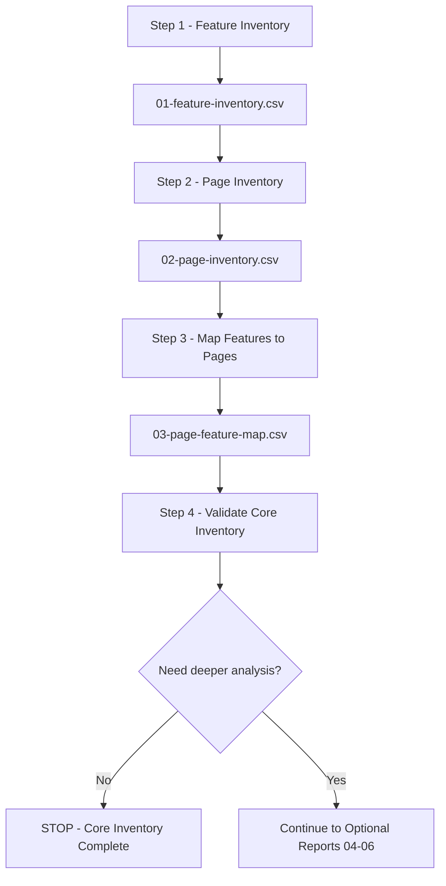

# Joomla Feature Inventory Workflow

This workflow defines the minimum process for building a feature inventory for one Joomla website or project.

> **Core outputs:** `01-feature-inventory.csv` → `02-page-inventory.csv` → `03-page-feature-map.csv`.
>
> **Optional outputs:** `04-feature-dependency-map.csv`, `05-feature-evidence.csv`, and `06-feature-coverage.csv` are created only when deeper analysis is requested.

<a id="table-of-contents"></a>
## Table of Contents

1. [Goal](#goal)
2. [Workflow](#workflow)
3. [Step 1 — Feature Inventory](#step-1)
4. [Step 2 — Page Inventory](#step-2)
5. [Step 3 — Page-to-Feature Mapping](#step-3)
6. [Step 4 — Validate Core Inventory](#step-4)
7. [Optional Decision Gate](#optional-gate)
8. [Optional Reports](#optional-reports)

---

<a id="goal"></a>
## 1. Goal

The core inventory must answer three questions:

1. What features exist in the project?
2. What pages or route classes exist?
3. Which pages use each feature?

The default deliverable is therefore:

```text
01-feature-inventory.csv
02-page-inventory.csv
03-page-feature-map.csv
```

The workflow intentionally stops after these reports unless deeper technical analysis is required.

[Back to Table of Contents](#table-of-contents)

---

<a id="workflow"></a>
## 2. Workflow



Database inspection, source-code inspection, Joomla administrator review, crawling, and browser/runtime inspection are **discovery methods used inside the steps**. They are not separate workflow steps.

[Back to Table of Contents](#table-of-contents)

---

<a id="step-1"></a>
## 3. Step 1 — Feature Inventory

### Goal

Identify what the website or project can do.

### Input

Use the available project sources, for example:

```text
Joomla database
Joomla source code
Administrator UI
Frontend runtime
Menus
Modules
Plugins
Templates
External integrations
Existing project documentation
```

Typical Joomla discovery points include:

```text
#__extensions
#__menu
#__modules
#__modules_menu
/components
/administrator/components
/modules
/plugins
/templates
```

### Action

Discover candidate capabilities and normalize them into feature names.

Name the **capability**, not only the Joomla implementation.

Good examples:

```text
Main Navigation
Article Listing
Article Detail
Vehicle Search
Contact Form
Shopping Cart
Newsletter Signup
```

Avoid using implementation names as the final feature name:

```text
com_content
mod_menu
plg_system_example
#__custom_table
```

Example:

```text
mod_menu instance 42
position = navigation
published globally

↓

Feature = Main Navigation
```

If several technical items provide the same capability, keep one feature unless they represent different business behavior.

### Output

```text
01-feature-inventory.csv
```

Use:

```text
templates/01-feature-inventory-template.csv
```

Each feature should at least identify:

```text
feature_id
feature_name
category
surface
description
user_actor
primary_implementation
status
access
discovery_source
notes
```

### Done when

- feature IDs are unique;
- known active feature candidates have been reviewed;
- duplicate capabilities are normalized;
- feature names describe capabilities rather than implementation names;
- uncertain items are recorded as `UNKNOWN` or `CONDITIONAL` instead of being silently removed.

[Back to Table of Contents](#table-of-contents)

---

<a id="step-2"></a>
## 4. Step 2 — Page Inventory

### Goal

Identify the pages or route classes where features can appear or be used.

### Input

Start with Joomla menu configuration, then extend it with runtime and component-generated routes.

Typical sources:

```text
#__menu
runtime crawl
component routes
dynamic detail pages
search results
filter states
pagination
forms
authenticated routes
administrator routes when in scope
```

Do not assume `#__menu` contains every page in the website.

### Action

Inventory pages by **page type or route class**.

For repeated dynamic pages, do not create thousands of rows when they use the same implementation and behavior.

Example:

```text
/vehicles/civic
/vehicles/city
/vehicles/crv
```

can be represented as:

```text
page_id       = P003
page_name     = Vehicle Detail
route_pattern = /vehicles/{alias}
dynamic       = YES
```

Keep representative URLs where useful.

### Output

```text
02-page-inventory.csv
```

Use:

```text
templates/02-page-inventory-template.csv
```

Each page should at least identify:

```text
page_id
page_name
surface
page_type
url
route_pattern
menu_id
component
view
layout
access
language
dynamic
discovery_source
status
notes
```

### Done when

- page IDs are unique;
- published in-scope menu pages are represented;
- important runtime-discovered routes are represented;
- dynamic URL families are normalized into route classes where appropriate;
- unknown pages are recorded instead of being ignored.

[Back to Table of Contents](#table-of-contents)

---

<a id="step-3"></a>
## 5. Step 3 — Page-to-Feature Mapping

### Goal

Identify which features are used on each page or route class.

### Input

Use:

```text
01-feature-inventory.csv
02-page-inventory.csv
runtime page inspection
Joomla module/menu assignments
component behavior
known page conditions
```

### Action

For each `page_id`, list the features that are available on that page.

Example:

```text
P002 Vehicle Listing

├── Main Navigation
├── Breadcrumb
├── Vehicle Listing
├── Vehicle Search
├── Vehicle Filter
├── Pagination
└── Footer Navigation
```

Create one row for each `page_id + feature_id` relationship.

Example:

```text
P002 + F001 → Main Navigation
P002 + F014 → Vehicle Search
P002 + F015 → Vehicle Filter
```

Record conditions only when they affect whether or how the feature is available.

Examples:

```text
always
guest_only
authenticated_only
acl_restricted
language_specific
query_parameter_present
only_when_cart_has_items
```

### Output

```text
03-page-feature-map.csv
```

Use:

```text
templates/03-page-feature-map-template.csv
```

Each mapping should at least identify:

```text
map_id
page_id
feature_id
usage_type
visibility
position
trigger
condition
is_primary
discovery_source
notes
```

### Done when

- every in-scope page has at least one mapped feature;
- every active page-based feature maps to at least one page;
- every mapped `page_id` exists in `02-page-inventory.csv`;
- every mapped `feature_id` exists in `01-feature-inventory.csv`;
- conditional mappings record the relevant condition.

[Back to Table of Contents](#table-of-contents)

---

<a id="step-4"></a>
## 6. Step 4 — Validate Core Inventory

### Goal

Confirm that the three core reports are complete enough for normal feature inventory use and internally consistent.

### Input

```text
01-feature-inventory.csv
02-page-inventory.csv
03-page-feature-map.csv
```

### Action

Validate the inventory in both directions.

#### Feature → Page

For every page-based feature, answer:

```text
Where is this feature used?
```

#### Page → Feature

For every page, answer:

```text
What features are used on this page?
```

Also validate references:

```text
03.page_id    → must exist in 02.page_id
03.feature_id → must exist in 01.feature_id
```

### Output

A validated core inventory consisting of:

```text
01-feature-inventory.csv
02-page-inventory.csv
03-page-feature-map.csv
```

### Done when

```text
Broken page references             = 0
Broken feature references          = 0
Duplicate feature IDs              = 0
Duplicate page IDs                 = 0
Duplicate normalized mappings      = 0
In-scope pages without features    = 0
Page-based features without pages  = 0
Unknown items                      = explicitly documented
```

This step validates the **inventory structure**. It does not require dependency tracing or formal audit evidence.

[Back to Table of Contents](#table-of-contents)

---

<a id="optional-gate"></a>
## 7. Optional Decision Gate

After Step 4 is complete, **stop and ask before continuing**.

Ask exactly:

> **Do you want to continue with optional deep analysis reports (`04-06`)? Yes / No**

### If No

```text
STOP
↓
Core Feature Inventory Complete
```

Do not create any optional report.

### If Yes

Continue only with the optional report or reports required by the task.

```text
04-feature-dependency-map.csv
05-feature-evidence.csv
06-feature-coverage.csv
```

The core inventory remains complete even when the answer is `No`.

[Back to Table of Contents](#table-of-contents)

---

<a id="optional-reports"></a>
## 8. Optional Reports

### `04-feature-dependency-map.csv`

Use when technical dependencies need to be traced.

Answers:

> What does this feature technically depend on?

Typical use cases:

- deep debugging;
- migration analysis;
- extension replacement;
- impact analysis;
- technical handover.

### `05-feature-evidence.csv`

Use when explicit evidence is required.

Answers:

> What proves that this feature or mapping exists?

Typical use cases:

- formal verification;
- audit;
- unclear feature ownership;
- confidence grading.

### `06-feature-coverage.csv`

Use when measurable audit coverage is required.

Answers:

> How complete is the feature discovery process?

Typical use cases:

- large-project audits;
- formal acceptance;
- measurable completeness;
- high-confidence coverage reporting.

Optional reports extend the core inventory. They are not required for the normal feature inventory workflow.

[Back to Table of Contents](#table-of-contents)
