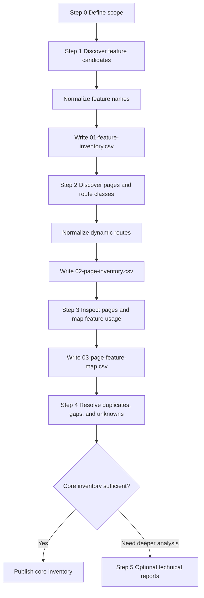

# Joomla Feature Inventory Workflow

This workflow describes how to build the three required feature inventory reports for a single Joomla website or project.

> **Primary output:** `01-feature-inventory.csv` → `02-page-inventory.csv` → `03-page-feature-map.csv`.
>
> **Optional output:** dependency, evidence, and coverage reports are created only when deeper analysis is required.

<a id="table-of-contents"></a>
## Table of Contents

1. [Workflow Goal](#workflow-goal)
2. [Inputs](#inputs)
3. [Outputs](#outputs)
4. [Execution Flow](#execution-flow)
5. [Step 0 — Define Inventory Scope](#step-0)
6. [Step 1 — Build Feature Inventory](#step-1)
7. [Step 2 — Build Page Inventory](#step-2)
8. [Step 3 — Build Page-to-Feature Map](#step-3)
9. [Step 4 — Normalize and Validate Core Inventory](#step-4)
10. [Optional Step 5 — Deep Technical Reports](#step-5)
11. [Discovery Source Matrix](#discovery-source-matrix)
12. [Final Core Inventory Gate](#final-gate)

---

<a id="workflow-goal"></a>
## 1. Workflow Goal

The workflow must produce a usable answer to three questions:

1. What features exist in the project?
2. What pages or route classes exist in the project?
3. Which pages use which features?

The core workflow intentionally stops before full dependency tracing unless deeper analysis is requested.

```text
Project
  ↓
Feature discovery
  ↓
01-feature-inventory.csv
  ↓
Page discovery
  ↓
02-page-inventory.csv
  ↓
Feature usage discovery
  ↓
03-page-feature-map.csv
```

[Back to Table of Contents](#table-of-contents)

---

<a id="inputs"></a>
## 2. Inputs

Use as many of the following sources as are available:

- Joomla database;
- Joomla source code;
- administrator UI;
- frontend website;
- menu configuration;
- module configuration;
- template and override structure;
- installed extension list;
- crawler output;
- Playwright/browser inspection;
- project documentation;
- known business requirements.

No single source is sufficient for a complete inventory.

[Back to Table of Contents](#table-of-contents)

---

<a id="outputs"></a>
## 3. Outputs

### Required

```text
01-feature-inventory.csv
02-page-inventory.csv
03-page-feature-map.csv
```

### Optional

```text
04-feature-dependency-map.csv
05-feature-evidence.csv
06-feature-coverage.csv
```

Use the templates under [`templates/`](./templates/).

[Back to Table of Contents](#table-of-contents)

---

<a id="execution-flow"></a>
## 4. Execution Flow



[Back to Table of Contents](#table-of-contents)

---

<a id="step-0"></a>
## 5. Step 0 — Define Inventory Scope

Before discovery, define what the inventory includes.

Record:

| Scope item | Example |
|---|---|
| Website surface | Frontend only / Frontend + Administrator |
| User states | Guest / Authenticated / Specific ACL groups |
| Languages | All / Selected languages |
| Dynamic routes | Included / Representative route classes only |
| Background behavior | Included / Excluded |
| Integrations | Included / Excluded |
| Disabled or legacy features | Include as inactive / Exclude |
| Runtime environment | Local / Staging / Production-like |

### Step 0 gate

Do not start counting coverage until the scope is explicit. A feature can only be considered missing relative to a defined scope.

[Back to Table of Contents](#table-of-contents)

---

<a id="step-1"></a>
## 6. Step 1 — Build Feature Inventory

**Output:** `01-feature-inventory.csv`

### 6.1 Discover candidate features

Review the following sources:

```text
#__extensions
#__menu
#__modules
#__modules_menu
/components
/administrator/components
/modules
/plugins
/templates
runtime pages
administrator UI
external integrations
```

Use technical items as discovery signals, not as feature names.

Example:

```text
Technical discovery
- mod_menu instance 42
- position = navigation
- published globally

Normalized feature
- Main Navigation
```

### 6.2 Name features by capability

Good:

```text
Main Navigation
Vehicle Search
Contact Form
Shopping Cart
Newsletter Signup
```

Avoid using implementation-only names as the final feature name:

```text
com_content
mod_menu
plg_system_example
#__custom_table
```

### 6.3 Normalize duplicates

Ask whether two candidates provide the same capability.

Merge when:

- the user-facing or business purpose is the same;
- the difference is only page placement;
- the difference is only one of several instances supporting the same feature.

Keep separate when:

- business purpose differs;
- actor differs materially;
- behavior differs materially;
- the capability can be independently enabled, tested, or removed.

### 6.4 Fill the feature template

Use:

```text
templates/01-feature-inventory-template.csv
```

Minimum required fields for a usable row:

```text
feature_id
feature_name
category
surface
description
user_actor
primary_implementation
status
access
discovery_source
```

### Step 1 gate

Before moving on:

- [ ] Feature IDs are unique.
- [ ] Feature names describe capabilities.
- [ ] Duplicate candidates are normalized.
- [ ] Active candidate features are not silently omitted.
- [ ] Uncertain candidates are marked `unknown` or `conditional`.

[Back to Table of Contents](#table-of-contents)

---

<a id="step-2"></a>
## 7. Step 2 — Build Page Inventory

**Output:** `02-page-inventory.csv`

### 7.1 Start with menu-driven pages

Inspect published menu items and record their routing context.

Useful fields include:

```text
id
title
alias
path
link
component_id
parent_id
access
language
template_style_id
params
```

### 7.2 Add runtime-discovered routes

Use crawling or manual navigation to find pages that are not represented by dedicated menu items.

Typical examples:

- article detail;
- product or vehicle detail;
- category detail;
- search results;
- filter states;
- pagination;
- form success/error states;
- account pages;
- administrator pages when in scope.

### 7.3 Normalize dynamic routes

Do not create one row per entity when the implementation and behavior are the same.

Example:

```text
/vehicles/civic
/vehicles/city
/vehicles/crv
```

Normalize to:

```text
page_id       = P003
page_name     = Vehicle Detail
route_pattern = /vehicles/{alias}
dynamic       = yes
```

### 7.4 Fill the page template

Use:

```text
templates/02-page-inventory-template.csv
```

Minimum required fields for a usable row:

```text
page_id
page_name
surface
page_type
url or route_pattern
component
access
dynamic
discovery_source
status
```

### Step 2 gate

Before moving on:

- [ ] Page IDs are unique.
- [ ] Published menu pages are represented.
- [ ] Important dynamic route classes are represented.
- [ ] Large dynamic URL families are normalized.
- [ ] Authenticated/admin/language routes are included when in scope.
- [ ] Unknown pages are not silently discarded.

[Back to Table of Contents](#table-of-contents)

---

<a id="step-3"></a>
## 8. Step 3 — Build Page-to-Feature Map

**Output:** `03-page-feature-map.csv`

This step connects the two canonical inventories.

### 8.1 Inspect each page class

For every `page_id`, identify:

- primary page capability;
- global navigation;
- header/footer capabilities;
- supporting modules;
- forms;
- search/filter behavior;
- media widgets;
- interactive controls;
- contextual features;
- role/condition-specific features.

### 8.2 Create one row per relationship

Example:

```text
P001 + F001 → Main Navigation on Home
P001 + F002 → Homepage Hero Slider on Home
P002 + F001 → Main Navigation on Vehicle Listing
P002 + F014 → Vehicle Search on Vehicle Listing
```

Do not use a wide matrix as the canonical CSV. One row per relationship is easier to filter, query, automate, and maintain.

### 8.3 Record conditions

Examples:

```text
always
guest_only
authenticated_only
ACL:Registered
language=en-GB
query_parameter_present
only_when_cart_has_items
```

### 8.4 Fill the mapping template

Use:

```text
templates/03-page-feature-map-template.csv
```

Minimum required fields for a usable row:

```text
map_id
page_id
feature_id
usage_type
visibility
trigger
is_primary
discovery_source
```

### Step 3 gate

Before moving on:

- [ ] Every in-scope page has a primary feature.
- [ ] Every active page-based feature maps to at least one page.
- [ ] Global features are mapped consistently.
- [ ] Conditional relationships record their conditions.
- [ ] Every `page_id` exists in `02-page-inventory.csv`.
- [ ] Every `feature_id` exists in `01-feature-inventory.csv`.

[Back to Table of Contents](#table-of-contents)

---

<a id="step-4"></a>
## 9. Step 4 — Normalize and Validate Core Inventory

Run cross-file validation before publishing.

### 9.1 Referential checks

```text
03.page_id    → must exist in 02.page_id
03.feature_id → must exist in 01.feature_id
```

### 9.2 Feature checks

Review:

- duplicate feature names;
- features with no page mapping;
- page-based features with no route/entry point;
- features marked active but never observed or assigned;
- features that are actually technical dependencies rather than capabilities.

A feature with no page mapping is allowed only when it is intentionally non-page-based, such as a scheduled job, webhook, background process, or administrator-only operation outside the selected page scope.

### 9.3 Page checks

Review:

- pages with no primary feature;
- duplicate route classes;
- menu pages not represented;
- runtime routes not classified;
- dynamic detail routes accidentally expanded into unnecessary thousands of rows.

### 9.4 Mapping checks

Review:

- duplicate `page_id + feature_id` rows;
- global features missing from applicable pages;
- conditional mappings without conditions;
- mappings that duplicate dependency details instead of describing usage.

### Step 4 gate

Core inventory is ready when:

```text
Unclassified in-scope features      = 0 or explicitly UNKNOWN
Unclassified in-scope page classes  = 0 or explicitly UNKNOWN
Broken page_id references           = 0
Broken feature_id references        = 0
Pages without a primary feature     = 0, unless intentionally technical
Duplicate normalized relationships  = 0
```

[Back to Table of Contents](#table-of-contents)

---

<a id="step-5"></a>
## 10. Optional Step 5 — Deep Technical Reports

Create optional reports only when required by the task.

### `04-feature-dependency-map.csv`

Use when you need to understand what technical parts a feature depends on.

Typical use cases:

- difficult debugging;
- migration planning;
- extension replacement;
- impact analysis;
- technical handover.

### `05-feature-evidence.csv`

Use when you need explicit proof supporting a feature record or mapping.

Typical use cases:

- audit;
- disputed or unclear functionality;
- confidence grading;
- formal verification.

### `06-feature-coverage.csv`

Use when you need measurable discovery/audit coverage.

Typical use cases:

- high-confidence completeness claims;
- large projects;
- formal migration acceptance;
- audit reporting.

Optional reports extend the core inventory. They do not replace it.

[Back to Table of Contents](#table-of-contents)

---

<a id="discovery-source-matrix"></a>
## 11. Discovery Source Matrix

| Source | Feature inventory | Page inventory | Page-feature mapping |
|---|---:|---:|---:|
| `#__extensions` | High | Low | Low |
| `#__menu` | Medium | High | Medium |
| `#__modules` | High | Low | Medium |
| `#__modules_menu` | Medium | Medium | High |
| Component source | High | High | Medium |
| Module source | High | Low | Medium |
| Plugin source | High | Low | Low |
| Template overrides | Medium | Low | High |
| Administrator UI | High | High | High |
| Runtime crawl | High | High | High |
| DOM/browser inspection | High | Medium | High |
| Network inspection | Medium | Low | Medium |
| Existing documentation | Medium | Medium | Medium |

Use multiple sources when available. Do not claim completeness from one source alone.

[Back to Table of Contents](#table-of-contents)

---

<a id="final-gate"></a>
## 12. Final Core Inventory Gate

The default deliverable should be usable without opening any optional report.

A reviewer should be able to start from any feature and answer:

```text
What is this feature?
→ 01-feature-inventory.csv

Where can I find it?
→ 03-page-feature-map.csv

What is that page/route?
→ 02-page-inventory.csv
```

And from any page:

```text
What is this page?
→ 02-page-inventory.csv

What features does it contain?
→ 03-page-feature-map.csv

What does each feature do?
→ 01-feature-inventory.csv
```

If those questions can be answered consistently, the core inventory is fit for normal project understanding and feature-based testing.

Use `04-06` only when the next task requires deeper technical traceability.

[Back to Table of Contents](#table-of-contents)
