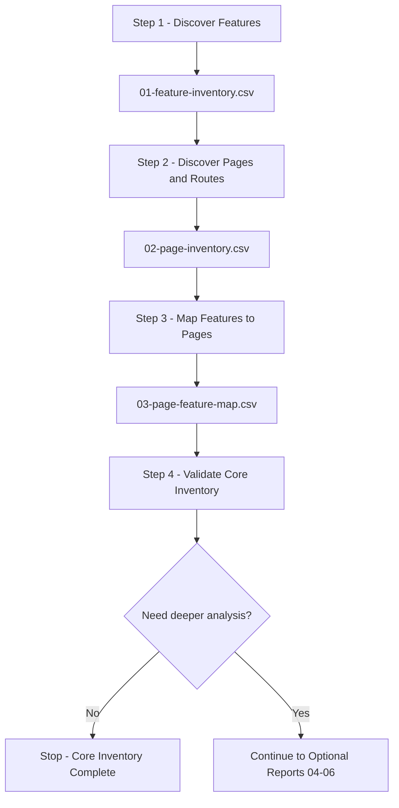

# Joomla Feature Inventory Workflow

This workflow defines the minimum process required to inventory the features of a single Joomla website or project.

> **Core goal:** identify the project features, identify the pages/routes, and map each feature to the pages where it is used.
>
> **Core outputs:** `01-feature-inventory.csv` → `02-page-inventory.csv` → `03-page-feature-map.csv`.
>
> **Optional outputs:** `04-06` are created only after the core inventory is complete and only when deeper analysis is requested.

<a id="table-of-contents"></a>
## Table of Contents

1. [Goal](#goal)
2. [Core Workflow](#core-workflow)
3. [Step 1 — Feature Inventory](#step-1)
4. [Step 2 — Page Inventory](#step-2)
5. [Step 3 — Page-to-Feature Mapping](#step-3)
6. [Step 4 — Validate Core Inventory](#step-4)
7. [Optional Decision Gate](#optional-gate)
8. [Optional Deep Reports](#optional-reports)
9. [Final Result](#final-result)

---

<a id="goal"></a>
## 1. Goal

The workflow must answer three questions:

1. What features exist in the Joomla project?
2. What pages or route classes exist?
3. Which pages use each feature?

The minimum report set is:

```text
01-feature-inventory.csv
02-page-inventory.csv
03-page-feature-map.csv
```

These three reports are the default deliverable.

The following reports are optional:

```text
04-feature-dependency-map.csv
05-feature-evidence.csv
06-feature-coverage.csv
```

[Back to Table of Contents](#table-of-contents)

---

<a id="core-workflow"></a>
## 2. Core Workflow



Discovery methods such as database inspection, source-code inspection, Joomla administrator review, crawling, and browser/runtime inspection are techniques used **inside** these steps. They are not separate workflow steps.

[Back to Table of Contents](#table-of-contents)

---

<a id="step-1"></a>
## 3. Step 1 — Feature Inventory

**Goal:** identify what the website or project can do.

**Output:** `01-feature-inventory.csv`

Use:

```text
templates/01-feature-inventory-template.csv
```

### Discovery sources

Review relevant sources such as:

```text
#__extensions
#__menu
#__modules
#__modules_menu
/components
/administrator/components
/modules
/plugins
/templates
administrator UI
runtime website
external integrations
```

A technical implementation is a discovery signal, not automatically a feature.

Example:

```text
mod_menu instance
        ↓
Main Navigation
```

```text
com_vehicle + search form
        ↓
Vehicle Search
```

### Feature naming rule

Name the capability, not the Joomla implementation.

Good:

```text
Main Navigation
Vehicle Search
Article Detail
Contact Form
Shopping Cart
Newsletter Signup
```

Avoid:

```text
com_content
mod_menu
plg_system_example
#__custom_table
```

### Minimum template fields

```text
feature_id
feature_name
category
surface
description
user_actor
primary_implementation
status
access
discovery_source
notes
```

### Step 1 complete when

- every known active feature candidate has been reviewed;
- feature IDs are unique;
- duplicate capabilities are merged;
- feature names describe capabilities;
- uncertain items are explicitly marked `UNKNOWN` or `CONDITIONAL` rather than silently removed.

[Back to Table of Contents](#table-of-contents)

---

<a id="step-2"></a>
## 4. Step 2 — Page Inventory

**Goal:** identify where features can appear or be used.

**Output:** `02-page-inventory.csv`

Use:

```text
templates/02-page-inventory-template.csv
```

### Discovery sources

Start with Joomla menu items, then add pages/routes discovered from runtime and component behavior.

```text
#__menu
+
runtime crawl
+
component-generated routes
+
dynamic detail routes
+
search / filter / pagination routes
+
authenticated or administrator routes when in scope
```

Do not assume `#__menu` represents every page.

### Dynamic route rule

When many URLs have the same behavior, inventory the **route class** instead of every entity URL.

Example:

```text
/vehicles/civic
/vehicles/city
/vehicles/crv
```

can become:

```text
page_id       = P003
page_name     = Vehicle Detail
route_pattern = /vehicles/{alias}
dynamic       = YES
```

### Minimum template fields

```text
page_id
page_name
surface
page_type
url
route_pattern
menu_id
component
view
layout
access
language
dynamic
discovery_source
status
notes
```

### Step 2 complete when

- published in-scope menu pages are represented;
- important runtime-discovered route classes are represented;
- dynamic route families are normalized;
- page IDs are unique;
- unknown pages are explicitly recorded rather than ignored.

[Back to Table of Contents](#table-of-contents)

---

<a id="step-3"></a>
## 5. Step 3 — Page-to-Feature Mapping

**Goal:** connect each feature to the pages where it is used.

**Output:** `03-page-feature-map.csv`

Use:

```text
templates/03-page-feature-map-template.csv
```

For each page or route class, inspect the available capabilities.

Example:

```text
P002 Vehicle Listing

Features
├── Main Navigation
├── Breadcrumb
├── Vehicle Listing
├── Vehicle Search
├── Vehicle Filter
├── Pagination
└── Footer Navigation
```

Create one mapping row per relationship:

```text
P002 + F001 → Main Navigation
P002 + F014 → Vehicle Search
P002 + F015 → Vehicle Filter
```

### Minimum template fields

```text
map_id
page_id
feature_id
usage_type
visibility
position
trigger
condition
is_primary
discovery_source
notes
```

### Useful values

`usage_type`:

```text
primary
global
supporting
interactive
navigation
conditional
```

`visibility`:

```text
always
conditional
guest_only
authenticated_only
acl_restricted
language_specific
device_specific
unknown
```

`trigger`:

```text
page_load
user_click
form_submit
query_parameter
ajax
login
system_event
external_event
```

### Step 3 complete when

- every in-scope page has at least one mapped feature;
- every active page-based feature maps to at least one page;
- all `page_id` values exist in `02-page-inventory.csv`;
- all `feature_id` values exist in `01-feature-inventory.csv`;
- conditional feature usage records the condition.

[Back to Table of Contents](#table-of-contents)

---

<a id="step-4"></a>
## 6. Step 4 — Validate Core Inventory

**Goal:** confirm that the three core reports are internally consistent and usable.

Validate in both directions.

### Feature → Page

For every feature, answer:

```text
Where is this feature used?
```

Example:

```text
F001 Main Navigation
├── P001 Home
├── P002 Vehicle Listing
├── P003 Vehicle Detail
└── P004 Contact
```

### Page → Feature

For every page, answer:

```text
What features exist on this page?
```

Example:

```text
P002 Vehicle Listing
├── Main Navigation
├── Breadcrumb
├── Vehicle Listing
├── Vehicle Search
├── Vehicle Filter
└── Pagination
```

### Core validation checks

```text
03.page_id    → exists in 02.page_id
03.feature_id → exists in 01.feature_id
```

The core inventory is ready when:

```text
Broken page references              = 0
Broken feature references           = 0
Duplicate feature IDs               = 0
Duplicate page IDs                  = 0
Duplicate normalized mappings       = 0
In-scope pages without features     = 0
Page-based features without pages   = 0
Unknown items                       = explicitly documented
```

This validates the inventory structure. It does not require deep technical dependency analysis.

[Back to Table of Contents](#table-of-contents)

---

<a id="optional-gate"></a>
## 7. Optional Decision Gate

After Step 4 passes, **stop the workflow and ask the user before continuing**.

Use this exact decision question:

> **Do you want to continue with optional deep analysis reports (`04-06`)? Yes / No**

Decision behavior:

```text
NO
↓
Stop workflow
↓
Core inventory is complete

YES
↓
Continue to optional reports
```

Do not automatically create `04`, `05`, or `06` as part of the normal inventory workflow.

The core inventory remains valid even when the answer is `No`.

[Back to Table of Contents](#table-of-contents)

---

<a id="optional-reports"></a>
## 8. Optional Deep Reports

Run these only after the user answers **Yes** at the optional decision gate.

### `04-feature-dependency-map.csv`

Answers:

> What technical dependencies does each feature use?

Use for:

- deep debugging;
- migration analysis;
- extension replacement;
- impact analysis;
- technical handover.

### `05-feature-evidence.csv`

Answers:

> What evidence proves that a feature or relationship exists?

Use for:

- audit;
- formal verification;
- uncertain feature ownership;
- confidence grading.

### `06-feature-coverage.csv`

Answers:

> How complete is the discovery process?

Use for:

- measurable coverage;
- large-project audits;
- formal acceptance;
- high-confidence completeness claims.

These reports extend the core inventory; they do not replace it.

[Back to Table of Contents](#table-of-contents)

---

<a id="final-result"></a>
## 9. Final Result

The default workflow is intentionally small:

```text
STEP 1
Discover Features
      ↓
01-feature-inventory.csv

STEP 2
Discover Pages / Routes
      ↓
02-page-inventory.csv

STEP 3
Map Features → Pages
      ↓
03-page-feature-map.csv

STEP 4
Validate Completeness
      ↓
CORE INVENTORY READY
      ↓
Do you want optional deep analysis?
      │
   YES│NO
      │ └────────────→ STOP
      ↓
04 / 05 / 06
```

The core contract is:

```text
Feature
   ↓
Page / Route
   ↓
Usage / Visibility / Trigger
```

If the three core reports can consistently answer **what features exist, what pages exist, and where each feature is used**, the normal Joomla feature inventory is complete.

[Back to Table of Contents](#table-of-contents)
