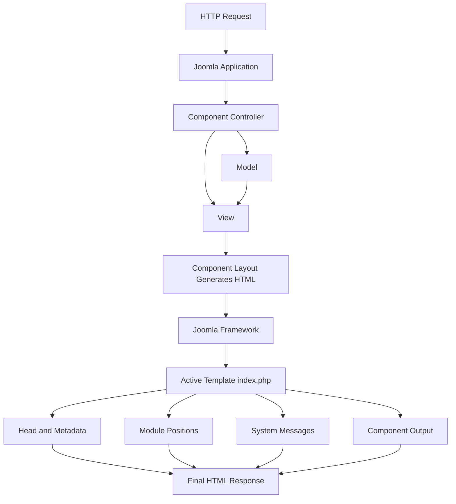

# Joomla Template Overview and Rendering

## Table of Contents

- [1. What Is a Joomla Template?](#1-what-is-a-joomla-template)
- [2. Template Responsibilities](#2-template-responsibilities)
- [3. Template and MVC](#3-template-and-mvc)
- [4. Joomla Rendering Flow](#4-joomla-rendering-flow)
- [5. `jdoc:include` Elements](#5-jdocinclude-elements)
- [6. Template vs Override](#6-template-vs-override)
- [7. Key Rules](#7-key-rules)
- [8. Official Resources](#8-official-resources)

---

## 1. What Is a Joomla Template?

A Joomla template is the presentation layer of a Joomla website.

It controls:

- The page structure.
- Module positions.
- CSS and JavaScript assets.
- Responsive behavior.
- The final HTML wrapper around component and module output.
- Template-specific parameters such as colors, logos, and layout settings.

A template does not replace Joomla's component MVC architecture. A component prepares the main application content, while the template arranges that content into the complete page.

---

## 2. Template Responsibilities

A site template usually handles:

- The document structure: `html`, `head`, and `body`.
- Header, navigation, sidebar, content, and footer regions.
- Module positions such as `top`, `sidebar`, and `footer`.
- Loading stylesheets and scripts.
- Rendering system messages.
- Rendering the active component.
- Providing component and module overrides.
- Defining template parameters.

A template should not contain unrelated business logic, database queries, or application workflows.

---

## 3. Template and MVC

A Joomla component commonly follows this flow:

1. The controller handles the request.
2. The model loads or updates data.
3. The view prepares data for display.
4. The component layout file generates the component HTML.
5. Joomla passes the output to the active template.
6. The template combines the component, modules, messages, styles, and scripts.

The component layout is often called a `tmpl` file. It runs in the view context and is designed to be overridden by a template.

---

## 4. Joomla Rendering Flow



The template is executed after the component has generated its main output.

---

## 5. `jdoc:include` Elements

Joomla templates use `<jdoc:include />` elements as placeholders for dynamic output.

### Main Component

```php
<jdoc:include type="component" />
```

This inserts the output from the active component.

### Module Position

```php
<jdoc:include type="modules" name="sidebar" style="none" />
```

This renders all modules assigned to the `sidebar` position.

### System Messages

```php
<jdoc:include type="message" />
```

This renders success, warning, and error messages.

### Head and Assets

A Joomla 4+ template commonly contains:

```php
<jdoc:include type="metas" />
<jdoc:include type="styles" />
<jdoc:include type="scripts" />
```

Some templates also include:

```php
<jdoc:include type="head" />
```

Use the structure expected by the Joomla version and template architecture you are targeting.

---

## 6. Template vs Override

A template controls the outer page layout.

An override changes the HTML generated by a specific part of Joomla.

| Change | Correct Location |
|---|---|
| Whole-page layout | Template `index.php` |
| Component article HTML | Component override in `html/com_content/...` |
| Module HTML | Module override in `html/mod_example/...` |
| Module wrapper | Custom module chrome |
| Reusable Joomla layout | `html/layouts/...` |
| Small translated text | Language override |

Example:

```text
Component creates article HTML
        ↓
Template override may replace article HTML
        ↓
Template index.php places the article in the page
```

---

## 7. Key Rules

- Do not edit Joomla core files.
- Keep business logic outside the template when possible.
- Escape untrusted text before output.
- Preserve Joomla form tokens and validation behavior in overrides.
- Use Web Asset Manager in Joomla 4 and later.
- Track templates and overrides in Git.
- Confirm the target Joomla major version before copying core layouts.

---

## 8. Official Resources

- [Joomla Programmer Documentation](https://manual.joomla.org/)
- [Joomla Documentation](https://docs.joomla.org/)
- [Joomla CMS Repository](https://github.com/joomla/joomla-cms)

---

[Back to Joomla Templates](README.md)
