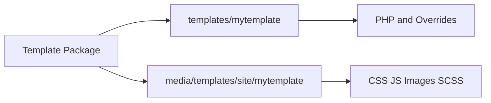

# Joomla Template Structure and Important Files

## Table of Contents

- [1. Typical Structure](#1-typical-structure)
- [2. Modern Joomla Asset Structure](#2-modern-joomla-asset-structure)
- [3. Important Files](#3-important-files)
- [4. Important Directories](#4-important-directories)
- [5. `templateDetails.xml`](#5-templatedetailsxml)
- [6. Template Parameters](#6-template-parameters)
- [7. Optional and Advanced Folders](#7-optional-and-advanced-folders)
- [8. Common Mistakes](#8-common-mistakes)
- [9. Official Resources](#9-official-resources)

---

## 1. Typical Structure

A practical Joomla template may use the following structure:

```text
templates/mytemplate/
├── index.php
├── component.php
├── error.php
├── templateDetails.xml
├── html/
│   ├── com_content/
│   │   └── article/
│   │       └── default.php
│   ├── mod_login/
│   │   ├── default.php
│   │   └── default_logout.php
│   ├── layouts/
│   │   └── joomla/
│   └── modules.php
├── language/
│   └── en-GB/
│       ├── en-GB.tpl_mytemplate.ini
│       └── en-GB.tpl_mytemplate.sys.ini
└── src/
    ├── Field/
    └── Helper/
```

Not every file or directory is required. The exact structure depends on the Joomla version and project requirements.

---

## 2. Modern Joomla Asset Structure

In Joomla 4 and later, PHP files may remain in the template folder while public assets are installed into the media area.

```text
media/templates/site/mytemplate/
├── css/
│   ├── template.css
│   └── user.css
├── js/
│   └── template.js
├── images/
│   └── logo.svg
├── scss/
│   └── template.scss
└── joomla.asset.json
```

This separates executable template code from public web assets.



---

## 3. Important Files

| File | Purpose |
|---|---|
| `index.php` | Main page layout and module-position rendering |
| `templateDetails.xml` | Installation manifest, files, positions, languages, assets, and parameters |
| `component.php` | Reduced component-only layout used by some print, popup, or focused views |
| `error.php` | Custom error page, including 404 and 500 handling |
| `joomla.asset.json` | Named CSS and JavaScript assets for Web Asset Manager |
| `template_preview.png` | Large preview image in template management |
| `template_thumbnail.png` | Small template thumbnail |

### `index.php`

The main template file commonly contains:

- Document structure.
- Module positions.
- System messages.
- Component output.
- Asset registration.
- Body classes and accessibility structure.

### `component.php`

A minimal example:

```php
<?php
defined('_JEXEC') or die;
?>
<!DOCTYPE html>
<html lang="<?php echo $this->language; ?>">
<head>
    <jdoc:include type="head" />
</head>
<body>
    <jdoc:include type="component" />
</body>
</html>
```

### `error.php`

This file should display a safe error message without leaking sensitive internal details.

---

## 4. Important Directories

### `html/`

Contains template overrides for:

- Components.
- Modules.
- Plugins with renderable layouts.
- Reusable Joomla layouts.
- Custom module chrome.

### `html/layouts/`

Contains reusable layout overrides.

Example:

```text
templates/mytemplate/html/layouts/joomla/content/info_block.php
```

### `language/`

Contains template language files.

```text
language/en-GB/en-GB.tpl_mytemplate.ini
language/en-GB/en-GB.tpl_mytemplate.sys.ini
```

The normal `.ini` file contains user-facing strings. The `.sys.ini` file is commonly used for extension-management text and the template description.

### `src/`

May contain namespaced PHP classes such as:

- Custom form fields.
- Helpers.
- Services.

The namespace is declared in `templateDetails.xml`.

---

## 5. `templateDetails.xml`

The manifest tells Joomla how to install and manage the template.

```xml
<?xml version="1.0" encoding="UTF-8"?>
<extension type="template" client="site" method="upgrade">
    <name>tpl_mytemplate</name>
    <version>1.0.0</version>
    <description>TPL_MYTEMPLATE_XML_DESCRIPTION</description>

    <files>
        <filename>index.php</filename>
        <filename>component.php</filename>
        <filename>error.php</filename>
        <filename>templateDetails.xml</filename>
        <folder>html</folder>
        <folder>language</folder>
        <folder>src</folder>
    </files>

    <media destination="templates/site/mytemplate" folder="media">
        <folder>css</folder>
        <folder>js</folder>
        <folder>images</folder>
        <filename>joomla.asset.json</filename>
    </media>

    <positions>
        <position>top</position>
        <position>sidebar</position>
        <position>footer</position>
    </positions>

    <languages folder="language">
        <language tag="en-GB">en-GB/en-GB.tpl_mytemplate.ini</language>
        <language tag="en-GB">en-GB/en-GB.tpl_mytemplate.sys.ini</language>
    </languages>
</extension>
```

The manifest paths must match the files inside the installation package.

---

## 6. Template Parameters

Template parameters are usually declared in the manifest rather than in a separate `params.php` file.

```xml
<config>
    <fields name="params">
        <fieldset name="basic">
            <field
                name="brandColor"
                type="text"
                label="Brand Color"
                default="#0d6efd"
            />
        </fieldset>
    </fields>
</config>
```

Read a parameter in the template:

```php
<?php
$brandColor = $this->params->get('brandColor', '#0d6efd');
```

---

## 7. Optional and Advanced Folders

| Directory | Use |
|---|---|
| `scss/` | Source styles compiled into CSS |
| `build/` | Build scripts, linting, and development tooling |
| `src/` | Namespaced template classes |
| `tmpl/` | Project-specific partials if the team chooses this convention |

Important distinction:

> `tmpl/` is a standard extension layout directory for components and modules, but it is not a required site-template directory.

A template may use its own `tmpl/` directory as an internal convention, but Joomla does not require it.

---

## 8. Common Mistakes

- Forgetting to list a file or folder in `templateDetails.xml`.
- Declaring a module position in `index.php` but not in the manifest.
- Placing Joomla 4+ media in the wrong destination.
- Treating SCSS as browser-ready CSS.
- Assuming every optional directory is required.
- Adding business logic to template files.
- Committing generated temporary files without a clear build policy.

---

## 9. Official Resources

- [Template Manifest Files](https://manual.joomla.org/docs/building-extensions/install-update/installation/manifest/)
- [Joomla Programmer Documentation](https://manual.joomla.org/)
- [Joomla CMS Repository](https://github.com/joomla/joomla-cms)

---

[Back to Joomla Templates](README.md)
