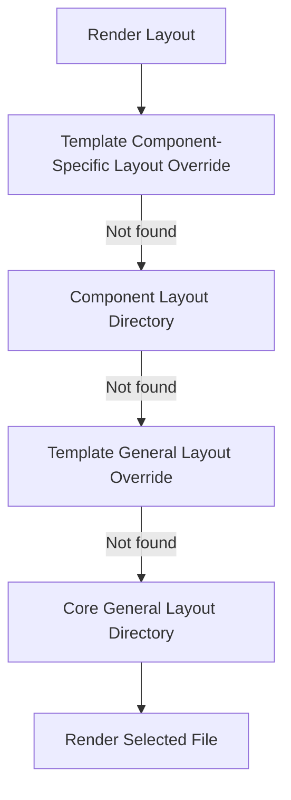

# Joomla Template Overrides and Loading Order

## Table of Contents

- [1. What Is a Template Override?](#1-what-is-a-template-override)
- [2. Component Overrides](#2-component-overrides)
- [3. Module Overrides](#3-module-overrides)
- [4. Plugin Overrides](#4-plugin-overrides)
- [5. Reusable Layout Overrides](#5-reusable-layout-overrides)
- [6. Alternative Layouts](#6-alternative-layouts)
- [7. Layout Resolution Order](#7-layout-resolution-order)
- [8. `FileLayout` for Advanced Cases](#8-filelayout-for-advanced-cases)
- [9. Security and Maintenance](#9-security-and-maintenance)
- [10. Official Resources](#10-official-resources)

---

## 1. What Is a Template Override?

A template override replaces the output layout of a Joomla component, module, plugin, or reusable layout without editing the extension's original file.

Overrides are stored under:

```text
templates/yourtemplate/html/
```

This protects custom output from being overwritten during Joomla or extension updates.

---

## 2. Component Overrides

### Core Paths

The core source path changed between Joomla 3 and Joomla 4+.

| Version | Typical Core Path |
|---|---|
| Joomla 3 | `components/com_example/views/view/tmpl/default.php` |
| Joomla 4+ | `components/com_example/tmpl/view/default.php` |

The template override path remains similar:

```text
templates/yourtemplate/html/com_example/view/default.php
```

### Example: Article Override

```text
templates/yourtemplate/html/com_content/article/default.php
```

```php
<?php
defined('_JEXEC') or die;

$item = $this->item;
?>
<article class="article-override">
    <?php if (!empty($item->title)) : ?>
        <h1><?php echo $this->escape($item->title); ?></h1>
    <?php endif; ?>

    <div class="article-override__body">
        <?php echo $item->text; ?>
    </div>
</article>
```

Only output trusted editor HTML without escaping. Escape normal text values.

---

## 3. Module Overrides

A module layout commonly starts in:

```text
modules/mod_example/tmpl/default.php
```

Copy it to:

```text
templates/yourtemplate/html/mod_example/default.php
```

Example for the login module:

```text
templates/yourtemplate/html/mod_login/default.php
```

```php
<?php
defined('_JEXEC') or die;
?>
<div class="login-box">
    <?php if (!empty($module->title)) : ?>
        <h3><?php echo htmlspecialchars($module->title, ENT_QUOTES, 'UTF-8'); ?></h3>
    <?php endif; ?>

    <?php echo $module->content ?? ''; ?>
</div>
```

When copying a core module layout, preserve required hidden fields, tokens, routes, validation, and accessibility attributes.

---

## 4. Plugin Overrides

Plugin output can be overridden only when the plugin renders through a layout or template file.

A plugin that only reacts to events and injects logic may not expose an overrideable layout.

Possible strategies:

- Override the plugin's renderable layout.
- Override the component layout where plugin output is inserted.
- Use `FileLayout` with a custom include path when developing your own plugin.
- Modify the plugin only when no presentation-layer override exists.

Do not assume every plugin supports a template override.

---

## 5. Reusable Layout Overrides

Joomla uses reusable layouts for repeated UI fragments.

Render a layout in Joomla 4+:

```php
<?php
use Joomla\CMS\Layout\LayoutHelper;

echo LayoutHelper::render(
    'joomla.content.info_block',
    ['item' => $this->item]
);
```

The layout ID:

```text
joomla.content.info_block
```

maps to:

```text
joomla/content/info_block.php
```

Override it at:

```text
templates/yourtemplate/html/layouts/joomla/content/info_block.php
```

---

## 6. Alternative Layouts

An override named `default.php` replaces the default output.

An alternative layout uses another filename:

```text
templates/yourtemplate/html/com_content/article/magazine.php
```

When Joomla exposes a layout selector, you can select `magazine` from the menu item, module, or extension configuration.

Use alternative layouts when both the default and custom presentation must remain available.

---

## 7. Layout Resolution Order

For component and general reusable layouts, Joomla searches paths from most specific to least specific.



A simplified order is:

1. Template override for a component layout.
2. Component layout directory.
3. Template override for a general Joomla layout.
4. Joomla core layout directory.

### Important Module and Plugin Difference

Module and plugin layout folders are not always added automatically to `LayoutHelper` search paths.

When building custom extensions, provide the correct `basePath` or configure `FileLayout` include paths explicitly.

---

## 8. `FileLayout` for Advanced Cases

Use `FileLayout` when a module, plugin, or library needs a controlled layout search path.

```php
<?php
use Joomla\CMS\Factory;
use Joomla\CMS\Layout\FileLayout;

defined('_JEXEC') or die;

$app = Factory::getApplication();
$template = $app->getTemplate(true)->template;

$layout = new FileLayout(
    'badge.default',
    JPATH_PLUGINS . '/content/myplugin/layouts'
);

$layout->addIncludePath(
    JPATH_THEMES
    . '/'
    . $template
    . '/html/layouts/plg_content/myplugin'
);

echo $layout->render([
    'label' => 'Featured',
]);
```

Template override path:

```text
templates/yourtemplate/html/layouts/plg_content/myplugin/badge/default.php
```

This approach gives template developers a clean customization path without editing the plugin.

---

## 9. Security and Maintenance

- Escape text output with `$this->escape()` or `htmlspecialchars()`.
- Do not remove CSRF tokens from overridden forms.
- Preserve hidden inputs required by Joomla.
- Compare overrides with updated core files after upgrades.
- Keep each override focused on presentation.
- Add comments explaining intentional differences from the core layout.
- Use Git to review changes and detect stale overrides.

### Override Review Checklist

- [ ] The original source file and Joomla version are documented.
- [ ] Required routes and form tokens remain present.
- [ ] Text output is escaped correctly.
- [ ] HTML editor content is handled intentionally.
- [ ] The override works with an empty data set.
- [ ] The override is responsive and accessible.
- [ ] The override has been compared with the latest core layout.

---

## 10. Official Resources

- [Joomla Layouts](https://manual.joomla.org/docs/general-concepts/layouts/)
- [Joomla Programmer Documentation](https://manual.joomla.org/)
- [Joomla Documentation](https://docs.joomla.org/)

---

[Back to Joomla Templates](README.md)
