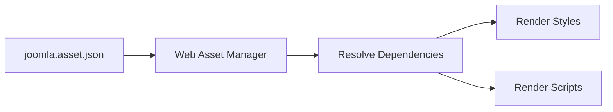

# Joomla Template Assets, Languages, and Module Chrome

## Table of Contents

- [1. Asset Organization](#1-asset-organization)
- [2. Web Asset Manager](#2-web-asset-manager)
- [3. `joomla.asset.json`](#3-joomlaassetjson)
- [4. Loading Assets in a Template](#4-loading-assets-in-a-template)
- [5. SCSS and Build Tools](#5-scss-and-build-tools)
- [6. Template Language Files](#6-template-language-files)
- [7. Language Overrides](#7-language-overrides)
- [8. Module Chrome](#8-module-chrome)
- [9. Accessibility and Performance](#9-accessibility-and-performance)
- [10. Official Resources](#10-official-resources)

---

## 1. Asset Organization

Joomla 3 templates often keep assets directly in the template directory:

```text
templates/mytemplate/
├── css/
├── js/
└── images/
```

Joomla 4 and later commonly separate PHP files from public assets:

```text
media/templates/site/mytemplate/
├── css/
├── js/
├── images/
├── scss/
└── joomla.asset.json
```

This modern structure works well with Joomla's Web Asset Manager.

---

## 2. Web Asset Manager

Web Asset Manager registers named CSS and JavaScript assets and manages:

- Dependencies.
- Loading order.
- Versions.
- Script attributes such as `defer`.
- Reusable asset definitions.
- Asset overrides.

Avoid adding scripts and styles in random template locations when using Joomla 4 or later.



---

## 3. `joomla.asset.json`

Example:

```json
{
  "$schema": "https://developer.joomla.org/schemas/json-schema/web_assets.json",
  "name": "tpl_mytemplate",
  "version": "1.0.0",
  "assets": [
    {
      "name": "tpl.mytemplate.styles",
      "type": "style",
      "uri": "templates/site/mytemplate/css/template.css"
    },
    {
      "name": "tpl.mytemplate.script",
      "type": "script",
      "uri": "templates/site/mytemplate/js/template.js",
      "attributes": {
        "defer": true
      },
      "dependencies": [
        "core"
      ]
    }
  ]
}
```

Use stable, descriptive asset names. Dependencies should represent real runtime requirements.

---

## 4. Loading Assets in a Template

Joomla 4+ example:

```php
<?php
defined('_JEXEC') or die;

use Joomla\CMS\Factory;

$app = Factory::getApplication();
$document = $app->getDocument();
$wa = $document->getWebAssetManager();

$wa->useStyle('tpl.mytemplate.styles')
    ->useScript('tpl.mytemplate.script');
```

The document then renders registered assets through template placeholders:

```php
<jdoc:include type="styles" />
<jdoc:include type="scripts" />
```

For Joomla 3, legacy templates commonly use APIs such as `JHtml::_('stylesheet', ...)` or document methods. When migrating, replace scattered asset loading with named Web Asset Manager assets.

---

## 5. SCSS and Build Tools

SCSS is source code and must be compiled into CSS.

```text
scss/template.scss
        ↓ compile
css/template.css
```

Example commands:

```bash
npm install
npm run build:css
npm run build:js
```

A source repository may contain a `build/` directory, but the installable template package does not always need development tooling.

Keep the policy clear:

- Commit source SCSS when the project maintains it.
- Commit compiled CSS when the production site needs it.
- Exclude caches and temporary build artifacts.
- Document the exact build command.

---

## 6. Template Language Files

Template language files commonly use:

```text
language/en-GB/en-GB.tpl_mytemplate.ini
language/en-GB/en-GB.tpl_mytemplate.sys.ini
```

Normal language file:

```ini
TPL_MYTEMPLATE_FOOTER="Footer"
TPL_MYTEMPLATE_READ_MORE="Read more"
```

System language file:

```ini
TPL_MYTEMPLATE="My Template"
TPL_MYTEMPLATE_XML_DESCRIPTION="Custom Joomla site template."
```

Usage in Joomla 4+:

```php
<?php
use Joomla\CMS\Language\Text;

echo Text::_('TPL_MYTEMPLATE_READ_MORE');
```

Usage in Joomla 3 commonly appears as:

```php
<?php
echo JText::_('TPL_MYTEMPLATE_READ_MORE');
```

---

## 7. Language Overrides

Use Joomla Language Overrides when you only need to replace a text string without editing extension or template language files.

Typical backend path:

```text
System → Language Overrides
```

Example override:

```ini
COM_EXAMPLE_READ_MORE="View details"
```

Use language overrides for small wording changes. Use template language files for strings owned by your custom template.

---

## 8. Module Chrome

Module chrome controls the HTML wrapper around module output.

Create:

```text
templates/mytemplate/html/modules.php
```

Example:

```php
<?php
defined('_JEXEC') or die;

function modChrome_card($module, &$params, &$attribs)
{
    if (trim($module->content) === '') {
        return;
    }
    ?>
    <section class="module-card">
        <?php if ($module->showtitle) : ?>
            <h2 class="module-card__title">
                <?php echo htmlspecialchars(
                    $module->title,
                    ENT_QUOTES,
                    'UTF-8'
                ); ?>
            </h2>
        <?php endif; ?>

        <div class="module-card__content">
            <?php echo $module->content; ?>
        </div>
    </section>
    <?php
}
```

Use it in `index.php`:

```php
<jdoc:include type="modules" name="sidebar" style="card" />
```

### Joomla 3 Migration Warning

Legacy module styles such as `xhtml`, `rounded`, and `horz` may not behave the same in Joomla 4+.

During migration:

- Inventory every `style="..."` value.
- Replace removed legacy chrome.
- Create explicit custom chrome when necessary.
- Test empty modules and hidden titles.

---

## 9. Accessibility and Performance

### Accessibility

- Use semantic landmarks: `header`, `nav`, `main`, `aside`, and `footer`.
- Maintain a logical heading order.
- Keep visible keyboard focus states.
- Add labels to all form controls.
- Preserve accessibility attributes from Joomla core layouts.
- Test with keyboard-only navigation.

### Performance

- Use named assets and dependencies.
- Avoid duplicate CSS and JavaScript.
- Use `defer` where appropriate.
- Minify production assets when the project supports it.
- Avoid large blocking scripts in the document head.
- Load only assets needed by the page.

---

## 10. Official Resources

- [Web Asset Manager](https://manual.joomla.org/docs/general-concepts/web-asset-manager/)
- [Joomla Programmer Documentation](https://manual.joomla.org/)
- [Joomla Documentation](https://docs.joomla.org/)

---

[Back to Joomla Templates](README.md)
