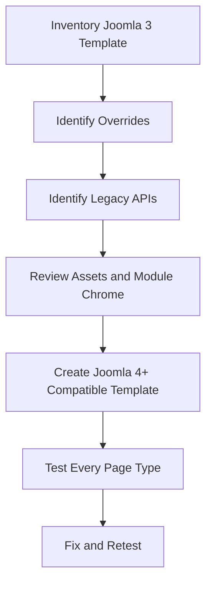

# Joomla 3 to Joomla 4+ Template Migration

## Table of Contents

- [1. Migration Overview](#1-migration-overview)
- [2. Main Breaking Areas](#2-main-breaking-areas)
- [3. Path Differences](#3-path-differences)
- [4. Class and API Changes](#4-class-and-api-changes)
- [5. Asset Migration](#5-asset-migration)
- [6. Module Chrome Migration](#6-module-chrome-migration)
- [7. Override Review Process](#7-override-review-process)
- [8. Child Templates](#8-child-templates)
- [9. Migration Checklist](#9-migration-checklist)
- [10. Testing Strategy](#10-testing-strategy)
- [11. Official Resources](#11-official-resources)

---

## 1. Migration Overview

A Joomla 3 template should not be assumed to work unchanged on Joomla 4, 5, or 6.

The highest-risk areas are:

- Core layout paths.
- Legacy PHP classes.
- Bootstrap and frontend markup.
- CSS and JavaScript loading.
- Removed module chrome styles.
- Stale component and module overrides.
- Third-party template-framework compatibility.

Treat the template as a separate migration workstream rather than a small final styling task.



---

## 2. Main Breaking Areas

| Area | Joomla 3 | Joomla 4+ |
|---|---|---|
| Component core layout | `views/view/tmpl/` | commonly `tmpl/view/` |
| Override destination | `templates/.../html/` | mostly unchanged |
| PHP classes | Legacy aliases are common | Namespaced classes are preferred |
| Assets | Often loaded directly | Web Asset Manager is preferred |
| Frontend template | Protostar and Beez3 | Cassiopeia family in modern Joomla |
| Module chrome | Several legacy styles | Layout-based and custom chrome |
| Child templates | Not a standard workflow | Supported in modern Joomla |

The stable override destination does not mean the copied layout is still compatible. Variables, helper calls, routes, markup, and form fields may have changed.

---

## 3. Path Differences

### Joomla 3 Core Component Layout

```text
components/com_content/views/article/tmpl/default.php
```

### Joomla 4+ Core Component Layout

```text
components/com_content/tmpl/article/default.php
```

### Template Override Path

```text
templates/yourtemplate/html/com_content/article/default.php
```

Migration process:

1. Find the Joomla 3 source file used by the override.
2. Find the equivalent layout in the target Joomla version.
3. Compare both core files.
4. Reapply only the custom presentation changes.
5. Do not copy the entire Joomla 3 file blindly.

---

## 4. Class and API Changes

Legacy code may use:

```php
JFactory
JText
JHtml
JLayoutHelper
```

Modern Joomla code generally prefers namespaced classes:

```php
use Joomla\CMS\Factory;
use Joomla\CMS\HTML\HTMLHelper;
use Joomla\CMS\Language\Text;
use Joomla\CMS\Layout\LayoutHelper;
```

Example conversion:

```php
<?php
// Joomla 3 style
$app = JFactory::getApplication();
echo JText::_('TPL_EXAMPLE_TITLE');
```

```php
<?php
// Joomla 4+ style
use Joomla\CMS\Factory;
use Joomla\CMS\Language\Text;

$app = Factory::getApplication();
echo Text::_('TPL_EXAMPLE_TITLE');
```

Compatibility aliases may exist temporarily, but migration code should follow the target Joomla version's supported APIs.

---

## 5. Asset Migration

### Legacy Pattern

Joomla 3 templates may load assets directly:

```php
<?php
JHtml::_ (
    'stylesheet',
    'templates/' . $this->template . '/css/template.css',
    ['version' => 'auto']
);
```

### Modern Pattern

Register named assets in `joomla.asset.json` and enable them through Web Asset Manager.

```php
<?php
use Joomla\CMS\Factory;

$wa = Factory::getApplication()
    ->getDocument()
    ->getWebAssetManager();

$wa->useStyle('tpl.mytemplate.styles')
    ->useScript('tpl.mytemplate.script');
```

Migration tasks:

- Inventory every stylesheet and script.
- Remove duplicate loads.
- Identify dependencies.
- Replace inline scripts where practical.
- Add `defer` only when safe.
- Move assets to the manifest-defined media location.
- Confirm paths after packaging and installation.

---

## 6. Module Chrome Migration

A Joomla 3 template may rely on styles such as:

```text
xhtml
rounded
horz
```

These legacy styles may no longer exist or may render differently.

Search `index.php` and other template files for:

```php
style="xhtml"
style="rounded"
style="horz"
```

Replace them with:

- `style="none"` when no wrapper is needed.
- A supported modern chrome.
- A custom `modChrome_*` function in `html/modules.php`.
- A reusable layout-based wrapper.

Test title visibility, empty content, class suffixes, and nested modules.

---

## 7. Override Review Process

For every override, record:

| Field | Example |
|---|---|
| Override path | `html/com_content/article/default.php` |
| Joomla 3 source | `components/com_content/views/article/tmpl/default.php` |
| Target source | `components/com_content/tmpl/article/default.php` |
| Custom purpose | Custom article header and metadata |
| Risk | Form token or helper changes |
| Status | Rewrite required |

### Recommended Method

1. Start with the target Joomla core layout.
2. Reapply the smallest required custom changes.
3. Keep required helpers and hidden fields.
4. Escape text output.
5. Test the default and edge cases.
6. Document the target core version.

This is safer than trying to patch an old Joomla 3 override until it stops throwing errors.

---

## 8. Child Templates

Modern Joomla supports child templates.

A child template can inherit files and layouts from a parent template while overriding only selected parts.

Manifest concept:

```xml
<parent>cassiopeia</parent>
```

Use a child template when:

- The project is close to a supported core template.
- Only selected layouts and styles need customization.
- You want safer parent-template updates.

Do not use a child template as a place for unrelated application logic.

---

## 9. Migration Checklist

### Inventory

- [ ] Record the active site and administrator templates.
- [ ] Record every template style and menu assignment.
- [ ] List component overrides.
- [ ] List module overrides.
- [ ] List custom module chrome.
- [ ] List plugin and reusable layout overrides.
- [ ] List CSS, JavaScript, images, fonts, and build tools.

### Compatibility

- [ ] Replace unsupported legacy APIs.
- [ ] Rebuild overrides from target-version core files.
- [ ] Replace legacy module chrome.
- [ ] Migrate assets to Web Asset Manager.
- [ ] Review Bootstrap and HTML-class changes.
- [ ] Verify template manifest compatibility.

### Quality

- [ ] Test responsive layouts.
- [ ] Test keyboard navigation.
- [ ] Test all module positions.
- [ ] Test error pages.
- [ ] Test login, search, contact, and other forms.
- [ ] Check PHP warnings and browser-console errors.

---

## 10. Testing Strategy

Test representative page types instead of checking only the homepage.

Minimum test set:

- Homepage.
- Single article.
- Category blog.
- Search results.
- Login and logout.
- Contact form.
- Error 404 page.
- Pages with and without sidebar modules.
- Mobile and desktop widths.
- Logged-in and guest states.

For each page, verify:

- Layout structure.
- Module positions.
- Component output.
- CSS and JavaScript.
- Forms and tokens.
- Accessibility.
- Empty states.
- Error handling.

---

## 11. Official Resources

- [Joomla Programmer Documentation](https://manual.joomla.org/)
- [Joomla Documentation](https://docs.joomla.org/)
- [Joomla CMS Repository](https://github.com/joomla/joomla-cms)

---

[Back to Joomla Templates](README.md)
