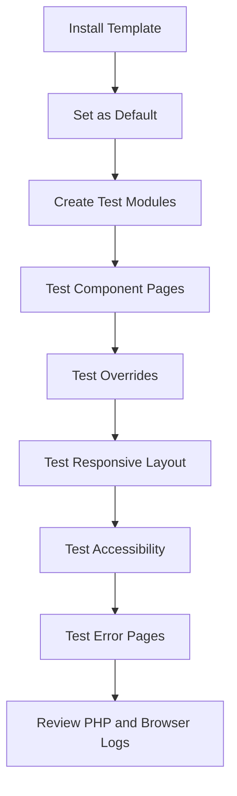

# Build, Test, Package, and Install a Joomla Template

## Table of Contents

- [1. Goal](#1-goal)
- [2. Create the Template Skeleton](#2-create-the-template-skeleton)
- [3. Create `templateDetails.xml`](#3-create-templatedetailsxml)
- [4. Create `index.php`](#4-create-indexphp)
- [5. Add Assets](#5-add-assets)
- [6. Add an Override](#6-add-an-override)
- [7. Add Custom Module Chrome](#7-add-custom-module-chrome)
- [8. Create `error.php`](#8-create-errorphp)
- [9. Test the Template](#9-test-the-template)
- [10. Package the Template](#10-package-the-template)
- [11. Install and Activate](#11-install-and-activate)
- [12. Final Checklist](#12-final-checklist)
- [13. Official Resources](#13-official-resources)

---

## 1. Goal

This guide creates a basic Joomla site template with:

- Three module positions.
- Web Asset Manager assets.
- A component override.
- Custom module chrome.
- A custom error page.
- An installable ZIP package.

The examples target modern Joomla. Adapt paths and APIs when supporting Joomla 3.

---

## 2. Create the Template Skeleton

```bash
mkdir -p mytemplate/html/com_content/article
mkdir -p mytemplate/html
mkdir -p mytemplate/language/en-GB
mkdir -p mytemplate/media/css
mkdir -p mytemplate/media/js
mkdir -p mytemplate/media/images
```

Expected source structure:

```text
mytemplate/
├── index.php
├── component.php
├── error.php
├── templateDetails.xml
├── html/
│   ├── com_content/
│   │   └── article/
│   │       └── default.php
│   └── modules.php
├── language/
│   └── en-GB/
│       ├── en-GB.tpl_mytemplate.ini
│       └── en-GB.tpl_mytemplate.sys.ini
└── media/
    ├── css/
    │   └── template.css
    ├── js/
    │   └── template.js
    ├── images/
    └── joomla.asset.json
```

---

## 3. Create `templateDetails.xml`

```xml
<?xml version="1.0" encoding="UTF-8"?>
<extension type="template" client="site" method="upgrade">
    <name>tpl_mytemplate</name>
    <version>1.0.0</version>
    <creationDate>2026-07-30</creationDate>
    <author>Your Name</author>
    <description>TPL_MYTEMPLATE_XML_DESCRIPTION</description>
    <namespace>YourCompany\Templates\Mytemplate</namespace>

    <files>
        <filename>index.php</filename>
        <filename>component.php</filename>
        <filename>error.php</filename>
        <filename>templateDetails.xml</filename>
        <folder>html</folder>
        <folder>language</folder>
    </files>

    <media destination="templates/site/mytemplate" folder="media">
        <folder>css</folder>
        <folder>js</folder>
        <folder>images</folder>
        <filename>joomla.asset.json</filename>
    </media>

    <positions>
        <position>top</position>
        <position>sidebar</position>
        <position>footer</position>
    </positions>

    <languages folder="language">
        <language tag="en-GB">en-GB/en-GB.tpl_mytemplate.ini</language>
        <language tag="en-GB">en-GB/en-GB.tpl_mytemplate.sys.ini</language>
    </languages>

    <config>
        <fields name="params">
            <fieldset name="basic">
                <field
                    name="brandColor"
                    type="text"
                    label="Brand Color"
                    default="#0d6efd"
                />
            </fieldset>
        </fields>
    </config>
</extension>
```

The manifest paths must match the package contents exactly.

---

## 4. Create `index.php`

```php
<?php
defined('_JEXEC') or die;

use Joomla\CMS\Factory;

$app = Factory::getApplication();
$document = $app->getDocument();
$wa = $document->getWebAssetManager();

$wa->useStyle('tpl.mytemplate.styles')
    ->useScript('tpl.mytemplate.script');
?>
<!DOCTYPE html>
<html lang="<?php echo $this->language; ?>" dir="<?php echo $this->direction; ?>">
<head>
    <jdoc:include type="metas" />
    <jdoc:include type="styles" />
    <jdoc:include type="scripts" />
</head>
<body>
    <header class="site-header">
        <jdoc:include type="modules" name="top" style="none" />
    </header>

    <main class="site-main">
        <?php if ($this->countModules('sidebar')) : ?>
            <aside class="site-sidebar">
                <jdoc:include type="modules" name="sidebar" style="card" />
            </aside>
        <?php endif; ?>

        <section class="site-content">
            <jdoc:include type="message" />
            <jdoc:include type="component" />
        </section>
    </main>

    <footer class="site-footer">
        <jdoc:include type="modules" name="footer" style="none" />
    </footer>
</body>
</html>
```

---

## 5. Add Assets

### `media/joomla.asset.json`

```json
{
  "$schema": "https://developer.joomla.org/schemas/json-schema/web_assets.json",
  "name": "tpl_mytemplate",
  "version": "1.0.0",
  "assets": [
    {
      "name": "tpl.mytemplate.styles",
      "type": "style",
      "uri": "templates/site/mytemplate/css/template.css"
    },
    {
      "name": "tpl.mytemplate.script",
      "type": "script",
      "uri": "templates/site/mytemplate/js/template.js",
      "attributes": {
        "defer": true
      },
      "dependencies": [
        "core"
      ]
    }
  ]
}
```

### `media/css/template.css`

```css
:root {
  --brand-color: #0d6efd;
}

body {
  margin: 0;
  font-family: system-ui, sans-serif;
}

.site-main {
  display: grid;
  grid-template-columns: minmax(220px, 280px) 1fr;
  gap: 1rem;
  padding: 1rem;
}

@media (max-width: 900px) {
  .site-main {
    grid-template-columns: 1fr;
  }
}
```

### `media/js/template.js`

```js
document.addEventListener('DOMContentLoaded', () => {
  document.documentElement.classList.add('js-ready');
});
```

---

## 6. Add an Override

Create:

```text
html/com_content/article/default.php
```

```php
<?php
defined('_JEXEC') or die;

$item = $this->item;
?>
<article class="article-single">
    <header class="article-single__header">
        <h1><?php echo $this->escape($item->title); ?></h1>
    </header>

    <div class="article-single__body">
        <?php echo $item->text; ?>
    </div>
</article>
```

Before replacing a real core layout, copy the target Joomla version's current file and preserve required helper calls and metadata.

---

## 7. Add Custom Module Chrome

Create:

```text
html/modules.php
```

```php
<?php
defined('_JEXEC') or die;

function modChrome_card($module, &$params, &$attribs)
{
    if (trim($module->content) === '') {
        return;
    }
    ?>
    <section class="module-card">
        <?php if ($module->showtitle) : ?>
            <h2 class="module-card__title">
                <?php echo htmlspecialchars(
                    $module->title,
                    ENT_QUOTES,
                    'UTF-8'
                ); ?>
            </h2>
        <?php endif; ?>

        <div class="module-card__body">
            <?php echo $module->content; ?>
        </div>
    </section>
    <?php
}
```

The `sidebar` position in `index.php` already uses:

```php
style="card"
```

---

## 8. Create `error.php`

```php
<?php
defined('_JEXEC') or die;

$errorCode = (int) $this->error->getCode();
?>
<!DOCTYPE html>
<html lang="<?php echo $this->language; ?>">
<head>
    <jdoc:include type="head" />
</head>
<body class="error-page">
    <main>
        <h1>Error <?php echo $errorCode; ?></h1>

        <?php if ($this->countModules('error-' . $errorCode)) : ?>
            <jdoc:include
                type="modules"
                name="error-<?php echo $errorCode; ?>"
                style="none"
            />
        <?php else : ?>
            <p>The requested page could not be displayed.</p>
        <?php endif; ?>
    </main>
</body>
</html>
```

Do not display stack traces, filesystem paths, database details, or sensitive exception data to users.

---

## 9. Test the Template



### Functional Test Checklist

- [ ] Template appears in Template Manager.
- [ ] Template style can be selected and assigned.
- [ ] `top`, `sidebar`, and `footer` positions render.
- [ ] Empty module positions do not leave broken wrappers.
- [ ] Component output renders correctly.
- [ ] Article override is active.
- [ ] Module chrome wraps modules correctly.
- [ ] CSS and JavaScript load without 404 errors.
- [ ] Error 404 uses `error.php`.

### Quality Test Checklist

- [ ] Desktop and mobile layouts work.
- [ ] Keyboard navigation works.
- [ ] Form labels remain connected to inputs.
- [ ] Heading order is logical.
- [ ] Text output is escaped.
- [ ] Browser console has no unexpected errors.
- [ ] PHP logs have no warnings or deprecations.

---

## 10. Package the Template

From the parent directory:

```bash
zip -r tpl_mytemplate-1.0.0.zip mytemplate/
```

Before packaging:

- Remove caches and temporary files.
- Confirm every manifest path exists.
- Confirm no required file is missing from `<files>` or `<media>`.
- Confirm the ZIP contains the expected template root.
- Confirm production CSS and JavaScript are built.

---

## 11. Install and Activate

In the Joomla administrator:

1. Open **System**.
2. Open **Install Extensions**.
3. Upload the template ZIP.
4. Open **Site Template Styles**.
5. Select the new template style.
6. Set it as default or assign it to selected menu items.
7. Create test modules for every declared position.

After installation, verify the deployed paths:

```text
templates/mytemplate/
media/templates/site/mytemplate/
```

---

## 12. Final Checklist

- [ ] `templateDetails.xml` is valid.
- [ ] Assets are registered through Web Asset Manager.
- [ ] Module positions match the manifest.
- [ ] Overrides are based on the target Joomla version.
- [ ] Forms preserve Joomla tokens and hidden inputs.
- [ ] Language strings are not hard-coded unnecessarily.
- [ ] The template is responsive and accessible.
- [ ] The source and package are stored in Git.
- [ ] Installation has been tested on a clean Joomla instance.

---

## 13. Official Resources

- [Joomla Programmer Documentation](https://manual.joomla.org/)
- [Web Asset Manager](https://manual.joomla.org/docs/general-concepts/web-asset-manager/)
- [Joomla CMS Repository](https://github.com/joomla/joomla-cms)

---

[Back to Joomla Templates](README.md)
