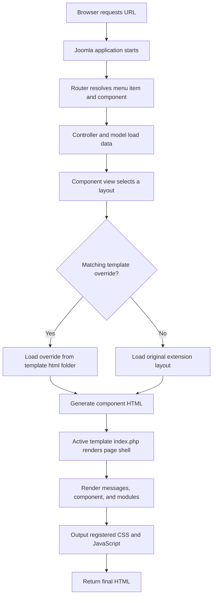
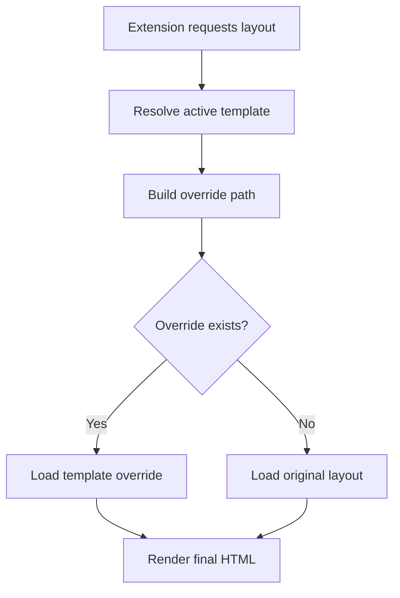
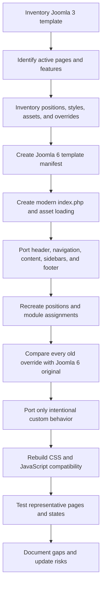

# Lesson 7: Joomla Template Features, Overrides, and Backend Setup

> A practical guide to classifying Joomla template features, creating overrides, configuring template styles and module positions, and preparing a Joomla 3 template for Joomla 6.

## Table of Contents

- [1. Learning Goals](#1-learning-goals)
- [2. Correct Classification](#2-correct-classification)
- [3. Template Rendering Flow](#3-template-rendering-flow)
- [4. Template Feature Inventory](#4-template-feature-inventory)
- [5. Override Types](#5-override-types)
- [6. Override Resolution](#6-override-resolution)
- [7. Single Article Classification](#7-single-article-classification)
- [8. Create a Single Article Override](#8-create-a-single-article-override)
- [9. Alternative Layouts](#9-alternative-layouts)
- [10. Module Overrides](#10-module-overrides)
- [11. Plugin and Reusable Layout Overrides](#11-plugin-and-reusable-layout-overrides)
- [12. Module Chrome](#12-module-chrome)
- [13. Module Positions](#13-module-positions)
- [14. Template Styles and Menu Assignment](#14-template-styles-and-menu-assignment)
- [15. Backend Setup Guide](#15-backend-setup-guide)
- [16. Joomla 3 to Joomla 6 Differences](#16-joomla-3-to-joomla-6-differences)
- [17. Migration Workflow](#17-migration-workflow)
- [18. Testing Checklist](#18-testing-checklist)
- [19. Common Mistakes](#19-common-mistakes)
- [20. Quick Reference](#20-quick-reference)
- [21. Official References](#21-official-references)

---

## 1. Learning Goals

After completing this lesson, you should be able to:

- Classify templates, template styles, component views, layouts, and overrides correctly.
- Explain how Joomla selects and renders a template layout.
- Identify frontend features owned by templates, components, modules, and plugins.
- Create component and module overrides without modifying core files.
- Configure module positions and template styles from Joomla Administrator.
- Compare Joomla 3 template conventions with the modern Joomla 6 direction.
- Build a safe override migration and testing workflow.

---

## 2. Correct Classification

The complete topic is best classified as:

> **Joomla Template Rendering, Template Features, Overrides, and Backend Configuration**

These concepts are related, but they are not interchangeable.

| Concept | Classification | Meaning |
|---|---|---|
| Template | Presentation extension | Controls the page shell, module positions, CSS, JavaScript, and output customization |
| Template style | Configuration instance | Stores template parameters, default state, and menu assignments |
| Template feature | User-visible capability | Header, navigation, sidebar, footer, responsive layout, or error page |
| Component view | Extension output screen | A page generated by a component, such as a Single Article page |
| Layout | PHP rendering file | Converts prepared data into HTML |
| Template override | Output replacement mechanism | Replaces an extension layout without editing the original file |
| Alternative layout | Selectable custom layout | Adds another presentation that can be selected in configuration |
| Module position | Named template placeholder | A location where Joomla renders assigned modules |
| Module chrome | Module wrapper | Controls the HTML surrounding module content |
| Web asset | CSS or JavaScript resource | Registered and loaded through the Web Asset Manager |

### Important distinction

A **Single Article** page is not a template type.

```text
Component: com_content
View: article
Menu Item Type: Articles → Single Article
Output type: Component view
Customization method: Component template override
```

---

## 3. Template Rendering Flow

A Joomla template does not replace the component MVC flow. The component prepares and renders the main content, and the template places that output inside the complete page.



### Simplified `index.php`

```php
<?php

defined('_JEXEC') or die;

$wa = $this->getWebAssetManager();

$wa->useStyle('template.site');
$wa->useScript('template.site');
?>
<!doctype html>
<html lang="<?php echo $this->language; ?>" dir="<?php echo $this->direction; ?>">
<head>
    <jdoc:include type="metas" />
    <jdoc:include type="styles" />
    <jdoc:include type="scripts" />
</head>
<body>
    <header>
        <jdoc:include type="modules" name="top" style="none" />
    </header>

    <jdoc:include type="message" />

    <main>
        <jdoc:include type="component" />
    </main>

    <footer>
        <jdoc:include type="modules" name="footer" style="none" />
    </footer>
</body>
</html>
```

### Main `jdoc:include` types

| Include | Purpose |
|---|---|
| `metas` | Outputs registered document metadata |
| `styles` | Outputs registered stylesheets |
| `scripts` | Outputs registered scripts |
| `message` | Displays Joomla system messages |
| `component` | Displays the main component output |
| `modules` | Displays modules assigned to a named position |

---

## 4. Template Feature Inventory

A feature inventory describes what users can see and use. It is different from a file inventory.

### Global page features

| Feature group | Typical features | Main implementation area |
|---|---|---|
| Document shell | HTML document, language, direction, viewport | `index.php` |
| Header | Logo, utility links, search, language selector | Template markup and module positions |
| Navigation | Main menu, dropdown, mobile menu, active state | `mod_menu` and its override |
| Breadcrumbs | Current navigation path | Breadcrumbs module |
| Main content | Current component output | `jdoc:include type="component"` |
| Sidebars | Related links, banners, menus, article modules | Module positions |
| Footer | Footer menu, copyright, social links | Modules and template markup |
| Messages | Success, warning, and error notices | `jdoc:include type="message"` |
| Error page | 403, 404, and 500 presentation | `error.php` |
| Responsive behavior | Mobile, tablet, and desktop layout | CSS and JavaScript |
| Accessibility | Landmarks, labels, focus, keyboard support | Markup, overrides, CSS, and JS |

### Common `com_content` views

| Feature | Component | View or layout | Typical menu item type |
|---|---|---|---|
| Single Article | `com_content` | `article` | Articles → Single Article |
| Category Blog | `com_content` | `category` blog layout | Articles → Category Blog |
| Category List | `com_content` | `category` default/list | Articles → Category List |
| Featured Articles | `com_content` | `featured` | Articles → Featured Articles |
| Archived Articles | `com_content` | `archive` | Articles → Archived Articles |

### Single Article feature examples

A Single Article page may contain:

- article and page titles;
- author, category, tags, and dates;
- intro and full article images;
- article body;
- custom fields;
- print and edit actions;
- previous and next navigation;
- plugin-generated content;
- related modules and breadcrumbs;
- structured data and responsive markup.

Most of these are controlled by component options, menu options, article options, plugins, and the active layout.

---

## 5. Override Types

Joomla template customization commonly includes four override groups plus module chrome.

### 5.1 Component override

Overrides a component view layout.

```text
templates/corporate/html/com_content/article/default.php
```

Typical targets:

- Single Article;
- Category Blog;
- contact pages;
- search results;
- login or profile component pages;
- custom component views.

### 5.2 Module override

Overrides a module layout.

```text
templates/corporate/html/mod_menu/default.php
```

Typical targets:

- menu markup;
- login forms;
- breadcrumbs;
- article cards;
- search forms.

### 5.3 Plugin override

Overrides output layouts exposed by supported plugins. Not every plugin provides an overridable layout.

### 5.4 Reusable layout override

Overrides a reusable Joomla layout.

```text
templates/corporate/html/layouts/joomla/content/info_block.php
```

These layouts may be shared by several pages, so test every affected context.

### 5.5 Module chrome

Controls the wrapper around module output.

```text
templates/corporate/html/modules.php
```

---

## 6. Override Resolution

The practical resolution rule is:

```text
1. Joomla resolves the active template.
2. The extension requests a layout.
3. Joomla checks the matching template override path.
4. If the override exists, Joomla loads it.
5. Otherwise, Joomla loads the original layout.
```



### Component path example

Requested layout:

```text
com_content → article → default
```

Override path:

```text
templates/<active-template>/html/com_content/article/default.php
```

Common source paths:

```text
Joomla 3:
components/com_content/views/article/tmpl/default.php

Modern Joomla:
components/com_content/tmpl/article/default.php
```

The override destination remains under the active template's `html` folder.

### Update warning

Overrides are not automatically merged when Joomla or an extension changes the original layout. After updates, compare the override with the current original file and check for:

- new variables;
- security fixes;
- accessibility improvements;
- changed plugin events;
- new layout helper calls;
- changed HTML or CSS classes.

---

## 7. Single Article Classification

```text
Feature: Single Article Page
Extension type: Component
Component: com_content
View: article
Default layout: default
Menu item type: Articles → Single Article
Override type: Component template override
Override path: templates/<template>/html/com_content/article/default.php
```

### Configuration hierarchy

```text
Global com_content options
        ↓
Menu item options
        ↓
Individual article options
        ↓
Plugins and custom fields
        ↓
Selected layout or override
        ↓
Template CSS and JavaScript
```

A more specific setting can override a global value when Joomla supports inheritance for that option.

---

## 8. Create a Single Article Override

### Backend method

1. Log in to Joomla Administrator.
2. Open **System**.
3. Under **Templates**, choose **Site Templates**.
4. Select the active template.
5. Open **Create Overrides**.
6. Expand **Components**.
7. Select `com_content`.
8. Select the `article` view.
9. Joomla copies the available layout files into the template's `html` folder.
10. Open the **Editor** tab.
11. Open `html/com_content/article/`.
12. Modify only the required files.
13. Save and test a real Single Article menu item.

Expected override path:

```text
templates/<active-template>/html/com_content/article/default.php
```

### Source-control method

1. Locate the original layout from the exact installed Joomla version.
2. Copy the required layout and required partials.
3. Create the matching template override folder.
4. Keep the expected filename.
5. Apply only intentional presentation changes.
6. Commit the override to Git.

### Minimal educational example

> This example is intentionally small. Do not replace a production layout with it unless losing standard article features is acceptable.

```php
<?php

defined('_JEXEC') or die;

$item = $this->item;
?>

<article class="single-article">
    <?php if (!empty($item->title)) : ?>
        <header class="single-article__header">
            <h1 class="single-article__title">
                <?php echo $this->escape($item->title); ?>
            </h1>
        </header>
    <?php endif; ?>

    <div class="single-article__body">
        <?php echo $item->text; ?>
    </div>
</article>
```

### Production rule

Create the override from the current Joomla version, preserve core feature logic, and change the smallest possible area.

---

## 9. Alternative Layouts

An alternative layout adds a selectable presentation instead of replacing the default layout everywhere.

```text
Default override:
default.php

Alternative layout:
magazine.php
```

Example:

```text
templates/corporate/html/com_content/article/magazine.php
```

| Requirement | Recommended approach |
|---|---|
| Change all Single Article pages | Override `default.php` |
| Use a special design on selected pages | Create an alternative layout |
| Use the same markup with different colors | Use template styles or CSS classes |
| Change data loading or business rules | Build or change an extension, not only an override |

An alternative layout appears only where the extension exposes a layout selection field.

---

## 10. Module Overrides

### Example: menu module

```text
Original:
modules/mod_menu/tmpl/default.php

Override:
templates/corporate/html/mod_menu/default.php
```

### Create from backend

1. Open **System → Site Templates**.
2. Select the active template.
3. Open **Create Overrides**.
4. Expand **Modules**.
5. Select `mod_menu`.
6. Joomla creates `html/mod_menu/`.
7. Modify the required files.
8. Test active, parent, child, alias, separator, and dropdown items.

### Select a module layout

1. Open **Content → Site Modules**.
2. Open the module instance.
3. Open **Advanced**.
4. Select the required **Layout**, when supported.
5. Save and test.

---

## 11. Plugin and Reusable Layout Overrides

Plugin overrides are available only when a plugin exposes supported layout files.

Create candidates through:

```text
System → Site Templates → <template> → Create Overrides → Plugins
```

Reusable layouts normally live under:

```text
templates/<template>/html/layouts/
```

Before modifying a reusable layout:

- find every place that calls it;
- identify all affected page types;
- test empty and permission-restricted states;
- verify responsive and accessible output;
- test both site and administrator contexts when relevant.

---

## 12. Module Chrome

A module has two presentation layers:

```text
Module layout: renders internal module content
Module chrome: wraps the module with title and container markup
```

### Render a chrome style

```php
<jdoc:include type="modules" name="sidebar-right" style="card" />
```

### Create custom chrome

File:

```text
templates/corporate/html/modules.php
```

```php
<?php

defined('_JEXEC') or die;

function modChrome_card($module, &$params, &$attribs)
{
    if (empty($module->content)) {
        return;
    }
    ?>
    <section class="module-card <?php echo htmlspecialchars($params->get('moduleclass_sfx', ''), ENT_QUOTES, 'UTF-8'); ?>">
        <?php if ((bool) $module->showtitle) : ?>
            <h2 class="module-card__title">
                <?php echo htmlspecialchars($module->title, ENT_QUOTES, 'UTF-8'); ?>
            </h2>
        <?php endif; ?>

        <div class="module-card__content">
            <?php echo $module->content; ?>
        </div>
    </section>
    <?php
}
```

### Module override versus chrome

| Concern | Module override | Module chrome |
|---|---|---|
| Internal module markup | Yes | No |
| Wrapper around output | Not the main purpose | Yes |
| Applied through module layout field | Often | No |
| Applied through `jdoc:include style` | No | Yes |

---

## 13. Module Positions

A module position is a named placeholder declared by the template.

### Declare positions

In `templateDetails.xml`:

```xml
<positions>
    <position>top</position>
    <position>menu</position>
    <position>breadcrumb</position>
    <position>sidebar-left</position>
    <position>sidebar-right</position>
    <position>footer</position>
    <position>debug</position>
</positions>
```

### Render a position

```php
<?php if ($this->countModules('sidebar-right')) : ?>
    <aside class="layout-sidebar">
        <jdoc:include type="modules" name="sidebar-right" style="card" />
    </aside>
<?php endif; ?>
```

Declaring a position in XML only exposes it in the backend. The position is not visible until `index.php` or another template file renders it.

### Assign a module

1. Open **Content → Site Modules**.
2. Create or open a module.
3. Select a position.
4. Set **Status** to **Published**.
5. Configure **Access** and **Language**.
6. Open **Menu Assignment**.
7. Select the pages where the module should appear.
8. Save and test.

### Preview positions

1. Open **System → Site Templates**.
2. Select **Options**.
3. Enable **Preview Module Positions**.
4. Open the frontend with `?tp=1`.
5. Disable the option again after testing, especially on production.

---

## 14. Template Styles and Menu Assignment

A template is the installed code package. A template style is a saved configuration instance of that package.

```text
Template:
PHP + XML + overrides + CSS + JavaScript + assets

Template style:
Parameters + style name + default state + menu assignments
```

One template can have several styles:

```text
Corporate - Default
Corporate - Homepage
Corporate - Landing Page
Corporate - Campaign
```

### Set the default style

1. Open **System → Site Template Styles**.
2. Select the required style.
3. Click **Default** or select the star.
4. Verify that it is the active default style.

### Duplicate and assign a style

1. Select an existing style.
2. Click **Duplicate**.
3. Rename the duplicate.
4. Change its parameters.
5. Open **Menu Assignment**.
6. Assign it to selected menu items.
7. Save and verify each assigned page.

Menu assignment is connected to menu items, not directly to arbitrary URLs.

---

## 15. Backend Setup Guide

### Template styles

```text
System → Site Template Styles
```

Use this screen to:

- set the default style;
- duplicate styles;
- edit parameters;
- assign styles to menu items.

### Template source and overrides

```text
System → Site Templates → select template
```

Use this area to inspect files and create overrides. For a Git-controlled project, prefer editing locally and pushing reviewed changes.

### Configure a Single Article page

1. Open **Content → Articles**.
2. Create or select an article.
3. Configure category, content, images, tags, fields, access, language, and metadata.
4. Open the target menu.
5. Create a menu item.
6. Choose **Articles → Single Article**.
7. Select the article.
8. Configure display options.
9. Save and open the frontend page.

### Configure a Category Blog

1. Create and publish articles in a category.
2. Create a menu item.
3. Select **Articles → Category Blog**.
4. Choose the category.
5. Configure leading articles, columns, links, ordering, and pagination.
6. Save and test all breakpoints.

### Configure a Custom module

1. Open **Content → Site Modules**.
2. Select **New → Custom**.
3. Enter the title and content.
4. Select a module position.
5. Set status, access, and language.
6. Configure menu assignment.
7. Save and verify the position.

### Clear stale output

When changes do not appear, check:

- browser cache;
- Joomla cache;
- page cache plugin;
- optimization extension cache;
- CDN cache;
- PHP OPcache in development.

Generated cache files should not be committed to Git.

---

## 16. Joomla 3 to Joomla 6 Differences

Joomla 6 follows the modern architecture introduced through Joomla 4 and Joomla 5. Do not copy a Joomla 3 template into Joomla 6 without review.

| Area | Joomla 3 | Joomla 6 direction |
|---|---|---|
| Site template | Protostar or Beez3 commonly used | Use a Joomla 6-compatible template; Cassiopeia is the modern core reference |
| Administrator template | Isis or Hathor | Use the current supported administrator template |
| Component source layout | `components/com_x/views/view/tmpl/` | Usually `components/com_x/tmpl/view/` |
| Override destination | `templates/tpl/html/com_x/view/` | Same general destination pattern |
| PHP APIs | Many legacy `J*` aliases | Namespaced Joomla classes |
| JavaScript | MooTools, old jQuery, legacy Bootstrap patterns | Modern Joomla APIs and supported JavaScript |
| Assets | Direct style/script loading common | Web Asset Manager and asset registry |
| Asset location | Often inside template `css/` and `js/` | Commonly installed through a media destination |
| Module chrome | Legacy chrome names common | Review current chrome and JLayout behavior |
| Accessibility | Older markup may be limited | Preserve modern accessible core improvements |

### High-risk migration areas

- removed PHP methods and legacy aliases;
- MooTools dependencies;
- Bootstrap-specific markup;
- outdated jQuery plugins;
- copied core layouts with obsolete variables;
- custom module chrome;
- CSS that depends on old core classes;
- hardcoded menu, module, article, or category IDs;
- missing Web Asset Manager registration;
- old language loading patterns.

---

## 17. Migration Workflow

Do not copy the full Joomla 3 template and repair it randomly. Create a clean Joomla 6-compatible shell and port only the features still required.



### Per-override procedure

1. Record the Joomla 3 override path.
2. Identify the extension, view, and layout.
3. Confirm the feature is still used.
4. Generate a fresh override from Joomla 6.
5. Compare the Joomla 3 original, old customization, and Joomla 6 original.
6. Identify intentional custom differences.
7. Reapply only those differences to the fresh Joomla 6 layout.
8. Replace old APIs and markup.
9. Test all states.
10. Record the migration decision.

### Inventory example

| ID | Feature | Extension | Layout | Used? | Action | Risk |
|---|---|---|---|---:|---|---|
| OVR-001 | Single Article | `com_content` | `article/default` | Yes | Rebuild from Joomla 6 original | High |
| OVR-002 | Category Blog | `com_content` | `category/blog` | Yes | Port custom card markup | High |
| OVR-003 | Main Menu | `mod_menu` | `default` | Yes | Rebuild dropdown markup | High |
| OVR-004 | Login | `mod_login` | `default` | No | Remove after validation | Low |

---

## 18. Testing Checklist

### Installation and styles

- [ ] The template installs without manifest errors.
- [ ] A template style is created.
- [ ] The style can be set as default.
- [ ] Template parameters save correctly.
- [ ] Menu assignments activate the expected style.

### Main rendering

- [ ] Metadata, CSS, and JavaScript load correctly.
- [ ] System messages display.
- [ ] Component output displays.
- [ ] Header, menu, sidebars, and footer render.
- [ ] Empty positions do not create broken gaps.

### Single Article

- [ ] Title and article body are complete.
- [ ] Images, author, category, tags, and dates follow settings.
- [ ] Custom fields and plugin content remain available.
- [ ] Edit controls follow permissions.
- [ ] Previous and next navigation works.
- [ ] No warnings or deprecated APIs appear.
- [ ] Heading hierarchy and mobile layout are valid.

### Modules and navigation

- [ ] Positions render in the expected locations.
- [ ] Modules follow menu, language, and access assignments.
- [ ] Multiple modules maintain the expected order.
- [ ] Menu active, parent, child, and mobile states work.
- [ ] Keyboard focus is visible and usable.

### Assets and special pages

- [ ] CSS and JavaScript load once.
- [ ] Dependencies load in the correct order.
- [ ] No asset 404 errors exist.
- [ ] No blocking console errors exist.
- [ ] 403, 404, offline, and component-only pages work where required.

### Maintenance

- [ ] Core and vendor files were not modified.
- [ ] Plain text output is escaped.
- [ ] Intentional HTML output is reviewed.
- [ ] Overrides are based on the installed Joomla version.
- [ ] Overrides are tracked in Git.
- [ ] Update comparison responsibility is documented.

---

## 19. Common Mistakes

### Calling Single Article a template

Correct classification:

```text
Single Article = com_content component view
Custom Single Article HTML = component template override
```

### Editing core layouts

Do not edit:

```text
components/com_content/tmpl/article/default.php
```

Customize here:

```text
templates/corporate/html/com_content/article/default.php
```

### Declaring a position without rendering it

Adding a position to XML is not enough. The template must also contain:

```php
<jdoc:include type="modules" name="promo" style="none" />
```

### Copying Joomla 3 overrides directly

Generate a fresh Joomla 6 override and port only intentional differences.

### Putting business logic in layouts

Layouts should focus on presentation. Put data access and reusable business behavior in components, modules, plugins, helpers, or services.

### Forgetting menu assignment

A published module may not appear because of:

- the wrong menu assignment;
- language filtering;
- access level;
- an unused position;
- a different active template style.

### Assuming overrides stay compatible forever

Review overrides after every Joomla or extension update.

---

## 20. Quick Reference

### Important paths

```text
Site template:
/templates/<template>/

Administrator template:
/administrator/templates/<template>/

Component override:
/templates/<template>/html/com_name/view/layout.php

Module override:
/templates/<template>/html/mod_name/layout.php

Reusable layout override:
/templates/<template>/html/layouts/<layout-path>.php

Module chrome:
/templates/<template>/html/modules.php
```

### Backend paths

```text
Template styles:
System → Site Template Styles

Template source and overrides:
System → Site Templates → select template

Single Article menu item:
Menus → <menu> → New → Articles → Single Article

Site modules:
Content → Site Modules

Administrator modules:
Content → Administrator Modules

Global article options:
Content → Articles → Options

Template installation:
System → Install → Extensions
```

### Decision guide

| Goal | Use |
|---|---|
| Change the full page shell | `index.php` |
| Change all Single Article markup | `com_content/article/default.php` override |
| Add a selectable article design | Alternative article layout |
| Change menu internal HTML | `mod_menu` override |
| Change the wrapper around modules | Module chrome |
| Place content in header/sidebar/footer | Module positions and module assignment |
| Create multiple visual configurations | Template styles |
| Load CSS and JS with dependencies | Web Asset Manager |
| Change data or business behavior | Component, module, plugin, or service |

---

## 21. Official References

- [Joomla Programmer Documentation: Template Details File](https://manual.joomla.org/docs/next/building-extensions/templates/template-details-file/)
- [Joomla Documentation: Template Overrides](https://docs.joomla.org/J4.x:Template_Overrides)
- [Joomla Documentation: Templates Customise](https://docs.joomla.org/Help4.x:Templates:_Customise)
- [Joomla Documentation: Template Styles](https://docs.joomla.org/Help4.x:Templates:_Styles/en)
- [Joomla Documentation: Module Positions](https://docs.joomla.org/J4.x:Module_Positions)
- [Joomla Programmer Documentation: Web Asset Manager](https://manual.joomla.org/docs/5.4/general-concepts/web-asset-manager/)

> Documentation examples may use Joomla 4 or current manual branches, but the architecture is the modern basis for Joomla 6-compatible templates. Always generate overrides from the exact Joomla version installed in the project.

---

[← Back to Joomla Templates](README.md)
