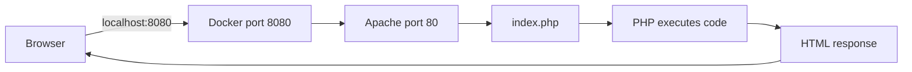

# Installing PHP

## Table of Contents

- [Installation Options](#installation-options)
- [Official Downloads](#official-downloads)
- [Windows](#windows)
- [macOS](#macos)
- [Ubuntu and Debian](#ubuntu-and-debian)
- [Docker](#docker)
- [Verify the Installation](#verify-the-installation)
- [Run Your First Program](#run-your-first-program)
- [Common Problems](#common-problems)
- [Learning Checklist](#learning-checklist)

---

## Installation Options

| Option | Best for |
| --- | --- |
| PHP standalone | Learning PHP syntax and CLI commands |
| XAMPP | Beginners who want Apache, PHP, and MariaDB together |
| Docker | Reproducible development environments |
| Homebrew | macOS users |
| APT | Ubuntu and Debian users |

---

## Official Downloads

- [Download PHP](https://www.php.net/downloads.php)
- [PHP installation documentation](https://www.php.net/manual/en/install.php)
- [PHP for Windows](https://windows.php.net/download/)

Linux and macOS users normally install PHP through a package manager. Windows users can use the official ZIP package, XAMPP, or Docker.

---

## Windows

### Option A: Manual Installation

1. Download an x64 ZIP package from [PHP for Windows](https://windows.php.net/download/).
2. Extract it to:

```text
C:\php
```

3. Add `C:\php` to the Windows `PATH` environment variable.
4. Open a new terminal.
5. Check PHP:

```bash
php -v
```

### Thread Safe and Non Thread Safe

| Package | Typical usage |
| --- | --- |
| Thread Safe | PHP loaded directly as an Apache module |
| Non Thread Safe | FastCGI, IIS, Nginx, PHP-FPM, or command-line usage |

For learning PHP from the command line, either package can execute scripts. Your web-server configuration determines the correct production package.

### Option B: XAMPP

Download [XAMPP](https://www.apachefriends.org/download.html).

XAMPP includes:

- Apache
- PHP
- MariaDB
- phpMyAdmin

The default web directory is usually:

```text
C:\xampp\htdocs
```

Create:

```text
C:\xampp\htdocs\php-learning\index.php
```

Start Apache from the XAMPP Control Panel and open:

```text
http://localhost/php-learning/
```

---

## macOS

Install [Homebrew](https://brew.sh/), then run:

```bash
brew install php
```

Check the installed version:

```bash
php -v
```

Start PHP as a service when needed:

```bash
brew services start php
```

Update PHP later:

```bash
brew update
brew upgrade php
```

See the [official macOS installation documentation](https://www.php.net/manual/en/install.macosx.php).

---

## Ubuntu and Debian

Update package information:

```bash
sudo apt update
```

Install PHP CLI:

```bash
sudo apt install php-cli
```

Check the version:

```bash
php -v
```

To use PHP with Apache:

```bash
sudo apt install apache2 php libapache2-mod-php
sudo systemctl restart apache2
```

The default Apache web directory is usually:

```text
/var/www/html
```

---

## Docker

Download [Docker Desktop](https://www.docker.com/products/docker-desktop/).

Create this project structure:

```text
php-getting-started/
├── docker-compose.yml
└── public/
    └── index.php
```

Create `docker-compose.yml`:

```yaml
services:
  php:
    image: php:8.4-apache
    ports:
      - "8080:80"
    volumes:
      - ./public:/var/www/html
```

Create `public/index.php`:

```php
<?php

echo 'PHP is running in Docker!';
```

Start the container:

```bash
docker compose up -d
```

Open:

```text
http://localhost:8080
```

Stop the container:

```bash
docker compose down
```



---

## Verify the Installation

Check the PHP version:

```bash
php -v
```

Find the PHP executable on Windows:

```bash
where php
```

Find it on macOS or Linux:

```bash
which php
```

Show the loaded configuration:

```bash
php --ini
```

List installed extensions:

```bash
php -m
```

Create `phpinfo.php` for local browser testing:

```php
<?php

phpinfo();
```

> Do not leave a `phpinfo()` page publicly accessible in production because it exposes server configuration details.

---

## Run Your First Program

Create `hello.php`:

```php
<?php

echo 'Hello from PHP!';
```

Run it:

```bash
php hello.php
```

Start PHP's built-in server:

```bash
php -S localhost:8000
```

Open:

```text
http://localhost:8000
```

> The built-in server is suitable for learning and local development, not production hosting.

---

## Common Problems

### `php` Is Not Recognized

PHP is not installed or its directory is missing from `PATH`. Add the PHP directory and reopen the terminal.

### PHP Code Appears as Plain Text

The file is being opened directly or served without PHP support. Use PHP CLI, the built-in server, Apache, Nginx with PHP-FPM, XAMPP, or Docker.

### Wrong File Extension

Ensure the file is named:

```text
index.php
```

and not:

```text
index.php.txt
```

---

## Learning Checklist

- [ ] I selected a PHP installation method.
- [ ] I can run `php -v`.
- [ ] I can find the loaded `php.ini` file.
- [ ] I can list installed PHP extensions.
- [ ] I can run a PHP file from the command line.
- [ ] I can start the PHP development server.
- [ ] I know how to stop my Docker environment when using Docker.
