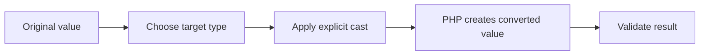

# PHP Type Casting

## Table of Contents

- [1. What Is Type Casting?](#1-what-is-type-casting)
- [2. Cast to Integer](#2-cast-to-integer)
- [3. Cast to Float](#3-cast-to-float)
- [4. Cast to String](#4-cast-to-string)
- [5. Cast to Boolean](#5-cast-to-boolean)
- [6. Cast to Array and Object](#6-cast-to-array-and-object)
- [7. `settype()`](#7-settype)
- [8. Validation Before Casting](#8-validation-before-casting)
- [9. Practice](#9-practice)

---

## 1. What Is Type Casting?

Type casting explicitly converts a value from one type to another.

Common casts:

```text
(int)
(float)
(string)
(bool)
(array)
(object)
```



Casting does not automatically prove that the original input was valid. Validate external input first.

---

## 2. Cast to Integer

```php
<?php

$price = 19.99;
$integerPrice = (int) $price;

var_dump($integerPrice); // int(19)
```

Casting a float to an integer removes the decimal part. It does not round:

```php
<?php

var_dump((int) 19.99);  // 19
var_dump((int) -19.99); // -19
```

Numeric string to integer:

```php
<?php

$quantity = '25';
$integerQuantity = (int) $quantity;

var_dump($integerQuantity);
```

---

## 3. Cast to Float

```php
<?php

$quantity = 10;
$floatQuantity = (float) $quantity;

var_dump($floatQuantity); // float(10)
```

Numeric string to float:

```php
<?php

$price = '19.99';
$floatPrice = (float) $price;

var_dump($floatPrice);
```

---

## 4. Cast to String

```php
<?php

$userId = 1001;
$userIdText = (string) $userId;

var_dump($userIdText); // string(4) "1001"
```

Boolean conversion:

```php
<?php

var_dump((string) true);  // "1"
var_dump((string) false); // ""
```

Arrays cannot be meaningfully converted to a normal display string. Use `json_encode()`, `implode()`, or explicit formatting instead.

---

## 5. Cast to Boolean

```php
<?php

var_dump((bool) 1);       // true
var_dump((bool) 0);       // false
var_dump((bool) 'PHP');   // true
var_dump((bool) '');      // false
var_dump((bool) []);      // false
var_dump((bool) [1, 2]);  // true
```

Common false-like values include:

- `false`
- `0`
- `0.0`
- `''`
- `'0'`
- `[]`
- `null`

Be careful with form strings:

```php
<?php

$value = 'false';

var_dump((bool) $value); // true because the string is not empty
```

Use boolean validation when appropriate:

```php
<?php

$value = 'false';
$result = filter_var($value, FILTER_VALIDATE_BOOLEAN);

var_dump($result); // false
```

---

## 6. Cast to Array and Object

### Cast to array

```php
<?php

$name = 'Alan';
$values = (array) $name;

var_dump($values);
```

Result:

```text
array(1) {
  [0]=>
  string(4) "Alan"
}
```

### Cast array to object

```php
<?php

$userData = [
    'name' => 'Alan',
    'age' => 26,
];

$user = (object) $userData;

echo $user->name;
```

Use a real class when the object has business behavior or requires a stable structure.

---

## 7. `settype()`

`settype()` changes the original variable:

```php
<?php

$value = '100';

settype($value, 'integer');

var_dump($value); // int(100)
```

A cast creates a converted result without changing the original value:

```php
<?php

$value = '100';
$number = (int) $value;

var_dump($value);  // string
var_dump($number); // integer
```

| Method | Changes original variable? | Example |
|---|---:|---|
| Cast | No | `$number = (int) $value` |
| `settype()` | Yes | `settype($value, 'integer')` |

---

## 8. Validation Before Casting

Avoid turning invalid input into a misleading value:

```php
<?php

$quantityInput = 'hello';
$quantity = (int) $quantityInput;

var_dump($quantity); // 0
```

Validate first:

```php
<?php

$quantityInput = '10';

if (filter_var($quantityInput, FILTER_VALIDATE_INT) === false) {
    throw new InvalidArgumentException('Quantity must be an integer.');
}

$quantity = (int) $quantityInput;
```

### Casting summary

| Cast | Example | Result |
|---|---|---|
| `(int)` | `(int) 19.9` | `19` |
| `(float)` | `(float) '10.5'` | `10.5` |
| `(string)` | `(string) 100` | `'100'` |
| `(bool)` | `(bool) 1` | `true` |
| `(array)` | `(array) 'PHP'` | `['PHP']` |
| `(object)` | `(object) ['id' => 1]` | Object with `id` |

---

## 9. Practice

```php
<?php

$quantityInput = '5';
$priceInput = '19.99';
$isActiveInput = 'true';

$quantity = (int) $quantityInput;
$price = (float) $priceInput;
$isActive = filter_var($isActiveInput, FILTER_VALIDATE_BOOLEAN);

var_dump($quantity, $price, $isActive);
```

## Learning Checklist

- [ ] I can cast values to common PHP types.
- [ ] I understand that casting is not validation.
- [ ] I know that integer casting does not round.
- [ ] I understand truthy and false-like values.
- [ ] I know the difference between casting and `settype()`.

## Official Resources

- [PHP Type Juggling](https://www.php.net/manual/en/language.types.type-juggling.php)
- [PHP `settype()`](https://www.php.net/manual/en/function.settype.php)
- [PHP Filter Functions](https://www.php.net/manual/en/book.filter.php)
- [W3Schools PHP Casting](https://www.w3schools.com/php/php_casting.asp)
