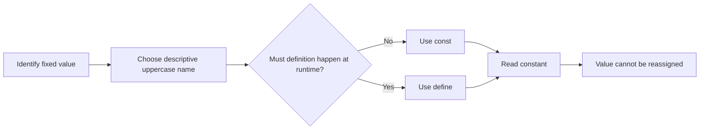

# PHP Constants

## Table of Contents

- [1. What Is a Constant?](#1-what-is-a-constant)
- [2. Define Constants with `const`](#2-define-constants-with-const)
- [3. Define Constants with `define()`](#3-define-constants-with-define)
- [4. `const` vs `define()`](#4-const-vs-define)
- [5. Array Constants](#5-array-constants)
- [6. Class Constants](#6-class-constants)
- [7. Checking and Reading Constants](#7-checking-and-reading-constants)
- [8. Constants vs Variables](#8-constants-vs-variables)
- [9. Practice](#9-practice)

---

## 1. What Is a Constant?

A constant is a named value that cannot be reassigned after it is defined.

Constants:

- Do not start with `$`.
- Are normally written in `UPPER_SNAKE_CASE`.
- Are usually globally accessible.
- Store values that should not change during execution.

Typical uses:

- Application names.
- Version identifiers.
- Tax rates.
- Directory paths.
- Maximum limits.
- Status identifiers.



---

## 2. Define Constants with `const`

```php
<?php

const APP_NAME = 'PHP Learning';
const TAX_RATE = 0.1;

echo APP_NAME;
echo TAX_RATE;
```

`const` is the normal choice when a constant can be declared directly in source code.

A constant cannot be reassigned:

```php
<?php

const TAX_RATE = 0.1;

// TAX_RATE = 0.2; // Invalid
```

---

## 3. Define Constants with `define()`

```php
<?php

define('APP_VERSION', '1.0.0');

echo APP_VERSION;
```

`define()` creates a constant at runtime and can be used conditionally:

```php
<?php

$environment = 'development';

if ($environment === 'development') {
    define('DEBUG_MODE', true);
}

if (defined('DEBUG_MODE')) {
    var_dump(DEBUG_MODE);
}
```

---

## 4. `const` vs `define()`

| Feature | `const` | `define()` |
|---|---:|---:|
| Declared directly in source code | Yes | Yes |
| Runtime or conditional definition | No | Yes |
| Class constants | Yes | No |
| Common default choice | Yes | Sometimes |
| Uses a function call | No | Yes |

Prefer `const` for normal fixed values. Use `define()` when runtime definition is genuinely required.

---

## 5. Array Constants

PHP constants can contain arrays:

```php
<?php

const SUPPORTED_LANGUAGES = [
    'en',
    'vi',
    'ja',
];

echo SUPPORTED_LANGUAGES[0];
```

With `define()`:

```php
<?php

define('ALLOWED_ROLES', [
    'admin',
    'editor',
    'user',
]);

echo ALLOWED_ROLES[1];
```

Use an enum or class constants when values represent a strongly related domain set.

---

## 6. Class Constants

Class constants group values that belong to a class or domain concept:

```php
<?php

class OrderStatus
{
    public const PENDING = 'pending';
    public const PAID = 'paid';
    public const CANCELLED = 'cancelled';
}

echo OrderStatus::PAID;
```

Visibility can be declared:

```php
<?php

class Configuration
{
    public const API_VERSION = 'v1';
    protected const RETRY_LIMIT = 3;
    private const INTERNAL_KEY = 'internal';
}
```

For a closed list of states in modern PHP, consider an enum:

```php
<?php

enum OrderStatus: string
{
    case Pending = 'pending';
    case Paid = 'paid';
    case Cancelled = 'cancelled';
}
```

---

## 7. Checking and Reading Constants

Use `defined()` to check whether a constant exists:

```php
<?php

const APP_NAME = 'PHP Learning';

var_dump(defined('APP_NAME'));        // true
var_dump(defined('UNKNOWN_CONSTANT')); // false
```

Use `constant()` to read a constant dynamically:

```php
<?php

const APP_NAME = 'PHP Learning';

$constantName = 'APP_NAME';

echo constant($constantName);
```

Avoid dynamic constant names unless the design clearly requires them.

---

## 8. Constants vs Variables

| Variable | Constant |
|---|---|
| Starts with `$` | No `$` |
| Can be reassigned | Cannot be reassigned |
| Usually uses camelCase | Usually uses UPPER_SNAKE_CASE |
| Stores changing data | Stores fixed values |
| Follows variable scope rules | Usually globally accessible |

Use a variable when the value must change:

```php
<?php

$taxRate = 0.1;
$taxRate = 0.2;
```

Use a constant when changing the value would be a programming mistake:

```php
<?php

const MAX_UPLOAD_SIZE = 10_000_000;
```

### Configuration warning

Do not hard-code secrets such as passwords, private API keys, or production credentials in committed constants. Read secrets from secure environment configuration instead.

---

## 9. Practice

Create constants for a tax rate and currency, then calculate a product total:

```php
<?php

const TAX_RATE = 0.1;
const CURRENCY = 'USD';

$price = 25.50;
$quantity = 3;
$subtotal = $price * $quantity;
$total = $subtotal + ($subtotal * TAX_RATE);

echo number_format($total, 2) . ' ' . CURRENCY;
```

## Learning Checklist

- [ ] I understand the difference between constants and variables.
- [ ] I can define constants with `const` and `define()`.
- [ ] I know when runtime definition is appropriate.
- [ ] I can create array and class constants.
- [ ] I can check constants with `defined()`.
- [ ] I know not to store secrets in committed constants.

## Official Resources

- [PHP Constants](https://www.php.net/manual/en/language.constants.php)
- [PHP Constant Syntax](https://www.php.net/manual/en/language.constants.syntax.php)
- [PHP Class Constants](https://www.php.net/manual/en/language.oop5.constants.php)
- [W3Schools PHP Constants](https://www.w3schools.com/php/php_constants.asp)
