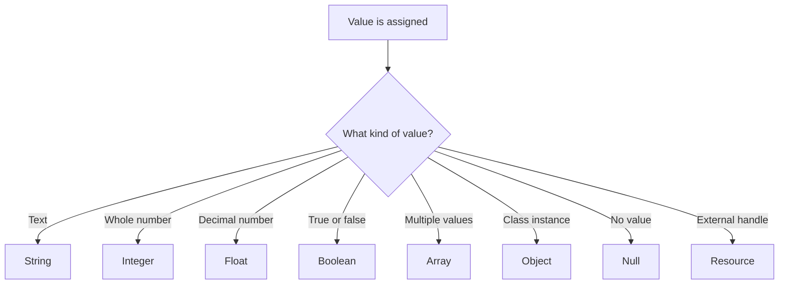

# PHP Data Types

## Table of Contents

- [1. Overview](#1-overview)
- [2. Inspecting Types](#2-inspecting-types)
- [3. Scalar Types](#3-scalar-types)
- [4. Compound Types](#4-compound-types)
- [5. Special Types](#5-special-types)
- [6. Type Declarations](#6-type-declarations)
- [7. Common Mistakes](#7-common-mistakes)
- [8. Practice](#8-practice)

---

## 1. Overview

A data type describes the kind of value stored in a variable.

Common PHP types include:

- `string`
- `int`
- `float`
- `bool`
- `array`
- `object`
- `null`
- `resource`
- `callable`
- `iterable`
- `mixed`

PHP determines a variable's type from its current value:

```php
<?php

$value = 10;      // int
$value = 'Hello'; // string
$value = true;    // bool
```



---

## 2. Inspecting Types

Use `var_dump()` to inspect both type and value:

```php
<?php

$name = 'Alan';
$age = 26;
$price = 19.99;
$isActive = true;

var_dump($name);
var_dump($age);
var_dump($price);
var_dump($isActive);
```

Use `gettype()` to return the type name:

```php
<?php

$value = 100;

echo gettype($value);
```

Use specific checking functions when validating values:

```php
<?php

$value = 100;

var_dump(is_int($value));
var_dump(is_string($value));
var_dump(is_float($value));
var_dump(is_bool($value));
```

---

## 3. Scalar Types

### String

A string stores text:

```php
<?php

$name = 'Alan';
$message = "Welcome to PHP";
```

Double quotes can interpolate variables, while single quotes normally treat content literally.

### Integer

An integer is a whole number:

```php
<?php

$age = 26;
$quantity = 5;
$temperature = -10;
```

### Float

A float stores a decimal number:

```php
<?php

$price = 19.99;
$taxRate = 0.1;
```

### Boolean

A boolean is either `true` or `false`:

```php
<?php

$isActive = true;
$isDeleted = false;
```

Booleans are commonly used in conditions:

```php
<?php

$isLoggedIn = true;

if ($isLoggedIn) {
    echo 'Welcome back!';
}
```

---

## 4. Compound Types

### Array

An array stores multiple values:

```php
<?php

$colors = ['red', 'green', 'blue'];

$user = [
    'name' => 'Alan',
    'age' => 26,
    'active' => true,
];
```

### Object

An object is an instance of a class:

```php
<?php

class User
{
    public string $name;
}

$user = new User();
$user->name = 'Alan';

echo $user->name;
```

### Callable

A callable is a value that PHP can execute as a function:

```php
<?php

$greet = static function (string $name): string {
    return "Hello, $name";
};

echo $greet('Alan');
```

### Iterable

`iterable` accepts arrays and objects that implement `Traversable`:

```php
<?php

function displayItems(iterable $items): void
{
    foreach ($items as $item) {
        echo $item . PHP_EOL;
    }
}
```

---

## 5. Special Types

### Null

`null` means no value is available:

```php
<?php

$selectedUser = null;

if ($selectedUser === null) {
    echo 'No user selected.';
}
```

### Resource

A resource represents an external handle such as an open file or stream:

```php
<?php

$file = fopen(__FILE__, 'r');

var_dump($file);

fclose($file);
```

### Mixed

`mixed` means a value may be one of several types:

```php
<?php

function debugValue(mixed $value): void
{
    var_dump($value);
}
```

Use a more specific type whenever possible.

---

## 6. Type Declarations

PHP supports parameter, return, and property types:

```php
<?php

declare(strict_types=1);

function calculateTotal(float $price, int $quantity): float
{
    return $price * $quantity;
}
```

Nullable type:

```php
<?php

function findUser(int $id): ?array
{
    return $id === 1 ? ['id' => 1, 'name' => 'Alan'] : null;
}
```

Union type:

```php
<?php

function normalizeId(int|string $id): string
{
    return (string) $id;
}
```

---

## 7. Common Mistakes

- Assuming a variable keeps its original type after reassignment.
- Comparing values without considering type.
- Using `mixed` when a specific type is known.
- Treating numeric strings as validated numbers.
- Forgetting that `null` is different from an empty string or zero.

Strict comparison checks value and type:

```php
<?php

var_dump(10 === '10'); // false
var_dump(10 == '10');  // true
```

Prefer strict comparison unless type conversion is intentional.

---

## 8. Practice

```php
<?php

$name = 'Alan';
$age = 26;
$price = 19.99;
$isActive = true;
$skills = ['PHP', 'Joomla'];
$selectedItem = null;

var_dump($name, $age, $price, $isActive, $skills, $selectedItem);
```

## Learning Checklist

- [ ] I can identify common PHP data types.
- [ ] I can inspect values with `var_dump()`.
- [ ] I understand scalar, compound, and special types.
- [ ] I can use parameter and return types.
- [ ] I understand strict comparison.

## Official Resources

- [PHP Types](https://www.php.net/manual/en/language.types.php)
- [PHP Type Declarations](https://www.php.net/manual/en/language.types.declarations.php)
- [W3Schools PHP Data Types](https://www.w3schools.com/php/php_datatypes.asp)
