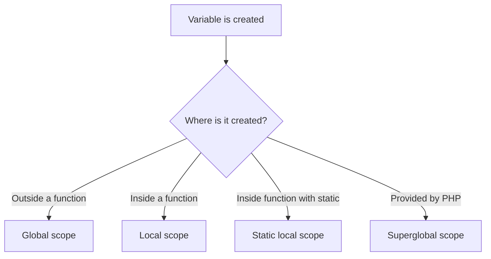

# PHP Variable Scope

## Table of Contents

- [1. What Is Scope?](#1-what-is-scope)
- [2. Global Scope](#2-global-scope)
- [3. Local Scope](#3-local-scope)
- [4. The `global` Keyword](#4-the-global-keyword)
- [5. The `$GLOBALS` Array](#5-the-globals-array)
- [6. Static Local Variables](#6-static-local-variables)
- [7. Superglobals](#7-superglobals)
- [8. Best Practices](#8-best-practices)
- [9. Practice](#9-practice)

---

## 1. What Is Scope?

Variable scope defines where a variable can be accessed.

The main PHP scopes are:

- Global scope.
- Local scope.
- Static local scope.
- Superglobal scope.



---

## 2. Global Scope

A variable created outside a function has global scope.

```php
<?php

$message = 'Hello from global scope';

echo $message;
```

A global variable is not automatically available inside a function:

```php
<?php

$message = 'Hello';

function showMessage(): void
{
    echo $message; // Undefined variable
}
```

---

## 3. Local Scope

A variable created inside a function is local to that function.

```php
<?php

function showMessage(): void
{
    $message = 'Hello from local scope';

    echo $message;
}

showMessage();
```

The variable cannot be used outside the function:

```php
<?php

function createValue(): void
{
    $value = 10;
}

createValue();

// echo $value; // Undefined variable
```

Each function has its own local scope:

```php
<?php

function firstFunction(): void
{
    $value = 10;
    echo $value;
}

function secondFunction(): void
{
    $value = 20;
    echo $value;
}
```

---

## 4. The `global` Keyword

The `global` keyword imports a global variable into a function.

```php
<?php

$taxRate = 0.1;

function calculateTax(float $price): float
{
    global $taxRate;

    return $price * $taxRate;
}

echo calculateTax(100);
```

This works, but global state makes code harder to test and maintain.

Prefer passing values as arguments:

```php
<?php

function calculateTax(float $price, float $taxRate): float
{
    return $price * $taxRate;
}

echo calculateTax(100, 0.1);
```

---

## 5. The `$GLOBALS` Array

`$GLOBALS` is a built-in associative array containing global variables.

```php
<?php

$price = 100;
$taxRate = 0.1;

function calculateTotal(): float
{
    $tax = $GLOBALS['price'] * $GLOBALS['taxRate'];

    return $GLOBALS['price'] + $tax;
}

echo calculateTotal();
```

Prefer function parameters in normal application code.

---

## 6. Static Local Variables

A normal local variable is recreated every time a function runs:

```php
<?php

function countCalls(): void
{
    $count = 0;
    $count++;

    echo $count . PHP_EOL;
}

countCalls();
countCalls();
countCalls();
```

Output:

```text
1
1
1
```

A static local variable keeps its value between function calls:

```php
<?php

function countCalls(): void
{
    static $count = 0;

    $count++;

    echo $count . PHP_EOL;
}

countCalls();
countCalls();
countCalls();
```

Output:

```text
1
2
3
```

---

## 7. Superglobals

Superglobals are built-in variables available in nearly every scope.

Common examples:

- `$GLOBALS`
- `$_SERVER`
- `$_GET`
- `$_POST`
- `$_FILES`
- `$_COOKIE`
- `$_SESSION`
- `$_REQUEST`
- `$_ENV`

Example:

```php
<?php

function showRequestMethod(): void
{
    echo $_SERVER['REQUEST_METHOD'];
}
```

Do not trust request data directly. Validate and escape it before use.

---

## 8. Best Practices

- Prefer function arguments and return values.
- Avoid unnecessary global variables.
- Keep variables in the smallest useful scope.
- Use static variables only when persistent function-local state is intentional.
- Validate data read from superglobals.

## Scope Summary

| Scope | Created where? | Available where? |
|---|---|---|
| Global | Outside a function | Outside functions |
| Local | Inside a function | Inside that function |
| Static local | Inside a function with `static` | Inside that function; value persists |
| Superglobal | Provided by PHP | Nearly everywhere |

---

## 9. Practice

```php
<?php

$message = 'Global message';

function showMessage(): void
{
    $message = 'Local message';

    echo $message . PHP_EOL;
}

showMessage();
echo $message;
```

## Learning Checklist

- [ ] I understand global and local scope.
- [ ] I know how static local variables work.
- [ ] I understand why global state should be limited.
- [ ] I can identify PHP superglobals.

## Official Resources

- [PHP Variable Scope](https://www.php.net/manual/en/language.variables.scope.php)
- [PHP Superglobals](https://www.php.net/manual/en/language.variables.superglobals.php)
- [W3Schools PHP Variable Scope](https://www.w3schools.com/php/php_variables_scope.asp)
