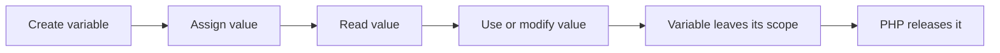

# PHP Variables

## Table of Contents

- [1. What Is a Variable?](#1-what-is-a-variable)
- [2. Basic Syntax](#2-basic-syntax)
- [3. Naming Rules](#3-naming-rules)
- [4. Assigning and Updating Values](#4-assigning-and-updating-values)
- [5. Variables in Strings](#5-variables-in-strings)
- [6. Inspecting Variables](#6-inspecting-variables)
- [7. Common Mistakes](#7-common-mistakes)
- [8. Practice](#8-practice)
- [9. Official Resources](#9-official-resources)

---

## 1. What Is a Variable?

A variable is a named container used to store a value while a PHP program runs.

PHP variables:

- Start with `$`.
- Are created when a value is assigned.
- Can store different data types.
- Are case-sensitive.

```php
<?php

$name = 'Alan';
$age = 26;
$isDeveloper = true;
```

## Variable Lifecycle



---

## 2. Basic Syntax

```php
<?php

$variableName = value;
```

Examples:

```php
<?php

$firstName = 'Alan';
$quantity = 5;
$price = 19.99;
$isActive = true;
```

PHP determines the variable type from the assigned value.

---

## 3. Naming Rules

A valid variable name:

- Must start with `$`.
- Must start with a letter or underscore after `$`.
- Cannot start with a number.
- Can contain letters, numbers, and underscores.
- Is case-sensitive.

Valid names:

```php
<?php

$name = 'Alan';
$userName = 'Alan';
$user_name = 'Alan';
$_status = 'active';
$product2 = 'Laptop';
```

Invalid names:

```php
<?php

$2product = 'Laptop';
$user-name = 'Alan';
```

Use descriptive camelCase names in normal PHP code:

```php
<?php

$firstName = 'Alan';
$totalPrice = 150.50;
$isActive = true;
```

### Case Sensitivity

```php
<?php

$name = 'Alan';

echo $name; // Alan
echo $Name; // Undefined variable
```

---

## 4. Assigning and Updating Values

```php
<?php

$score = 10;
echo $score;

$score = 20;
echo $score;
```

A variable can receive a new value after it is created.

PHP also allows one value to be assigned to multiple variables:

```php
<?php

$first = $second = $third = 100;
```

Separate assignments are usually easier to read:

```php
<?php

$first = 100;
$second = 100;
$third = 100;
```

---

## 5. Variables in Strings

### Double-quoted strings

Variables are interpolated inside double quotes:

```php
<?php

$name = 'Alan';

echo "Hello, $name!";
```

Output:

```text
Hello, Alan!
```

### Concatenation

Use the dot operator with single quotes:

```php
<?php

$name = 'Alan';

echo 'Hello, ' . $name . '!';
```

For complex values, braces improve clarity:

```php
<?php

$user = ['name' => 'Alan'];

echo "Hello, {$user['name']}!";
```

---

## 6. Inspecting Variables

Use `var_dump()` to inspect both value and type:

```php
<?php

$name = 'Alan';
$age = 26;

var_dump($name);
var_dump($age);
```

Example output:

```text
string(4) "Alan"
int(26)
```

Use `gettype()` when only the type name is needed:

```php
<?php

$value = 100;

echo gettype($value);
```

---

## 7. Common Mistakes

### Forgetting `$`

Incorrect:

```php
<?php

name = 'Alan';
```

Correct:

```php
<?php

$name = 'Alan';
```

### Using inconsistent case

Incorrect:

```php
<?php

$userName = 'Alan';

echo $username;
```

Correct:

```php
<?php

$userName = 'Alan';

echo $userName;
```

### Using unclear names

Avoid:

```php
<?php

$x = 150.50;
```

Prefer:

```php
<?php

$totalPrice = 150.50;
```

---

## 8. Practice

Create variables for a user's name, age, job, and active status. Display each value and inspect its type.

```php
<?php

$name = 'Alan';
$age = 26;
$job = 'Developer';
$isActive = true;

var_dump($name);
var_dump($age);
var_dump($job);
var_dump($isActive);
```

## Learning Checklist

- [ ] I can create and update variables.
- [ ] I understand PHP variable naming rules.
- [ ] I know that variable names are case-sensitive.
- [ ] I can use variables in strings.
- [ ] I can inspect variables with `var_dump()`.

---

## 9. Official Resources

- [PHP Variables](https://www.php.net/manual/en/language.variables.php)
- [PHP Variable Basics](https://www.php.net/manual/en/language.variables.basics.php)
- [W3Schools PHP Variables](https://www.w3schools.com/php/php_variables.asp)
