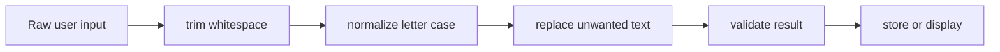

# Modifying PHP Strings

String functions normally return a new string. They do not modify the original variable unless the result is assigned back.

## `strtoupper()` — Convert to Uppercase

```php
<?php

$text = 'hello php';
$result = strtoupper($text);

echo $result;
```

Output:

```text
HELLO PHP
```

For UTF-8 text:

```php
<?php

$text = 'xin chào';

echo mb_strtoupper($text, 'UTF-8');
```

## `strtolower()` — Convert to Lowercase

```php
<?php

$text = 'HELLO PHP';

echo strtolower($text);
```

UTF-8 version:

```php
<?php

$text = 'TIẾNG VIỆT';

echo mb_strtolower($text, 'UTF-8');
```

## `ucfirst()` and `ucwords()`

```php
<?php

echo ucfirst('hello php');
echo ucwords('php string processing');
```

Outputs:

```text
Hello php
Php String Processing
```

## `trim()`, `ltrim()`, and `rtrim()`

```php
<?php

$text = '   Hello PHP   ';

echo trim($text);
echo ltrim($text);
echo rtrim($text);
```

Trim custom characters:

```php
<?php

$text = '---PHP---';

echo trim($text, '-');
```

Output:

```text
PHP
```

## `str_replace()` — Replace Text

```php
<?php

$text = 'Hello World';
$result = str_replace('World', 'PHP', $text);

echo $result;
```

Replace multiple values:

```php
<?php

$text = 'red green blue';
$result = str_replace(
    ['red', 'blue'],
    ['orange', 'purple'],
    $text
);

echo $result;
```

Case-insensitive replacement:

```php
<?php

$text = 'PHP php Php';

echo str_ireplace('php', 'Java', $text);
```

## `str_repeat()` — Repeat Text

```php
<?php

echo str_repeat('-', 20);
```

## `str_pad()` — Pad a String

```php
<?php

$orderId = '42';

echo str_pad($orderId, 6, '0', STR_PAD_LEFT);
```

Output:

```text
000042
```

Other options:

```php
STR_PAD_LEFT
STR_PAD_RIGHT
STR_PAD_BOTH
```

## `strrev()` — Reverse a String

```php
<?php

echo strrev('Hello');
```

Output:

```text
olleH
```

`strrev()` is not Unicode-aware and may produce incorrect results for multibyte characters.

## String Normalization Flow



Example:

```php
<?php

$input = '   PHP DEVELOPER   ';
$normalized = trim($input);
$normalized = strtolower($normalized);
$normalized = ucwords($normalized);

echo $normalized;
```

Output:

```text
Php Developer
```

## Common Mistake

Incorrect:

```php
<?php

$text = 'hello';
strtoupper($text);

echo $text;
```

Correct:

```php
<?php

$text = 'hello';
$text = strtoupper($text);

echo $text;
```

---

## Official Resources

* [PHP string functions](https://www.php.net/manual/en/ref.strings.php)
* [str_replace()](https://www.php.net/manual/en/function.str-replace.php)

## Learning Checklist

* [ ] I can trim, normalize, replace, pad, and repeat text.
* [ ] I remember to assign returned string values.
