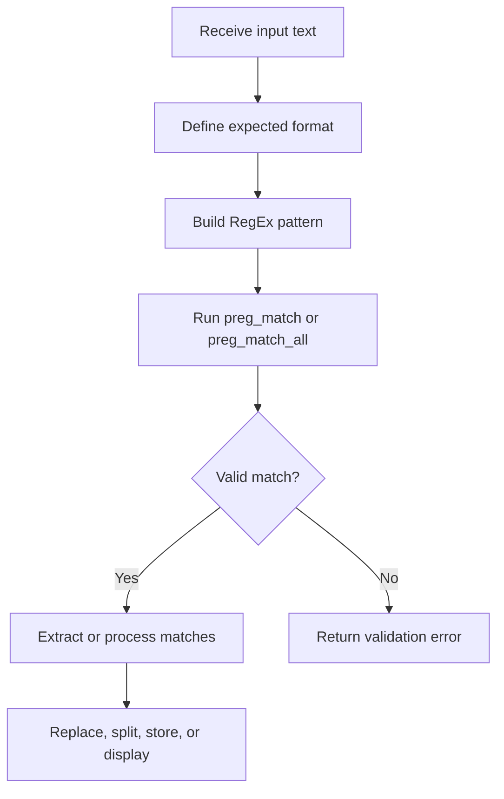

# PHP Regular Expressions

A regular expression, or RegEx, is a pattern used to search, validate, split, extract, or replace text.

PHP uses Perl-compatible regular expressions through functions beginning with `preg_`:

* `preg_match()`
* `preg_match_all()`
* `preg_replace()`
* `preg_split()`
* `preg_quote()`

No additional package is normally required.

## RegEx Structure

Example:

```php
/^[a-z]+$/i
```

Meaning:

* `/` — pattern delimiter.
* `^` — start of string.
* `[a-z]` — lowercase letter range.
* `+` — one or more characters.
* `$` — end of string.
* `i` — case-insensitive modifier.

## Common Pattern Symbols

| Pattern | Meaning |
| --- | --- |
| `.` | Any character except a new line |
| `^` | Start of string |
| `$` | End of string |
| `\d` | Digit |
| `\D` | Non-digit |
| `\w` | Letter, digit, or underscore |
| `\W` | Non-word character |
| `\s` | Whitespace |
| `\S` | Non-whitespace |
| `[abc]` | One of `a`, `b`, or `c` |
| `[^abc]` | Any character except `a`, `b`, or `c` |
| `[a-z]` | Character range |
| `*` | Zero or more |
| `+` | One or more |
| `?` | Zero or one |
| `{3}` | Exactly three |
| `{2,5}` | Between two and five |
| `()` | Capturing group |
| `|` | OR |

## `preg_match()` — Find One Match

```php
<?php

$text = 'I am learning PHP';
$result = preg_match('/PHP/', $text);

var_dump($result);
```

Return values:

* `1` — a match was found.
* `0` — no match was found.
* `false` — an error occurred.

Case-insensitive search:

```php
<?php

$text = 'I am learning php';

if (preg_match('/PHP/i', $text) === 1) {
    echo 'Match found.';
}
```

## Capture Matched Text

```php
<?php

$text = 'Order number: 12345';

preg_match('/\d+/', $text, $matches);

print_r($matches);
```

## Capturing Groups

```php
<?php

$date = '2026-07-30';
$pattern = '/^(\d{4})-(\d{2})-(\d{2})$/';

if (preg_match($pattern, $date, $matches) === 1) {
    echo 'Year: ' . $matches[1] . PHP_EOL;
    echo 'Month: ' . $matches[2] . PHP_EOL;
    echo 'Day: ' . $matches[3] . PHP_EOL;
}
```

Named capturing groups are easier to read:

```php
<?php

$pattern = '/^(?<year>\d{4})-(?<month>\d{2})-(?<day>\d{2})$/';

if (preg_match($pattern, '2026-07-30', $matches) === 1) {
    echo $matches['year'];
    echo $matches['month'];
    echo $matches['day'];
}
```

## `preg_match_all()` — Find All Matches

```php
<?php

$text = 'Order 100, order 200, order 300';

preg_match_all('/\d+/', $text, $matches);

print_r($matches[0]);
```

## `preg_replace()` — Replace Pattern Matches

```php
<?php

$text = 'My phone number is 0123456789';
$result = preg_replace('/\d/', '*', $text);

echo $result;
```

Normalize repeated whitespace:

```php
<?php

$text = 'PHP     is    useful';
$result = preg_replace('/\s+/', ' ', $text);

echo trim($result);
```

## `preg_split()` — Split by a Pattern

```php
<?php

$text = 'PHP,Java;JavaScript Python';
$languages = preg_split('/[,;\s]+/', $text);

print_r($languages);
```

Use `explode()` for one fixed separator. Use `preg_split()` when several separator patterns are possible.

## Validate a Username

Requirements:

* Between 3 and 20 characters.
* Letters, numbers, and underscores only.
* Starts with a letter.

```php
<?php

$username = 'alan_2026';
$pattern = '/^[a-z][a-z0-9_]{2,19}$/i';

if (preg_match($pattern, $username) === 1) {
    echo 'Valid username.';
} else {
    echo 'Invalid username.';
}
```

## Validate a Slug

```php
<?php

$slug = 'php-string-processing';
$pattern = '/^[a-z0-9]+(?:-[a-z0-9]+)*$/';

if (preg_match($pattern, $slug) === 1) {
    echo 'Valid slug.';
}
```

## Create a Slug

```php
<?php

$title = '  PHP String Processing Tutorial  ';

$slug = strtolower(trim($title));
$slug = preg_replace('/[^a-z0-9]+/', '-', $slug);
$slug = trim($slug, '-');

echo $slug;
```

Output:

```text
php-string-processing-tutorial
```

Accented Unicode text may require transliteration or a dedicated slug library.

## Validate Email Correctly

Do not build a large custom RegEx for ordinary email validation.

```php
<?php

$email = 'alan@example.com';

if (filter_var($email, FILTER_VALIDATE_EMAIL) !== false) {
    echo 'Valid email.';
}
```

A valid format does not prove that the address exists.

## Escape User Text in a Pattern

Use `preg_quote()` when user input becomes part of a RegEx pattern.

```php
<?php

$search = 'price: $10.00';
$text = 'The price: $10.00 is correct.';
$pattern = '/' . preg_quote($search, '/') . '/';

if (preg_match($pattern, $text) === 1) {
    echo 'Text found.';
}
```

## RegEx Processing Flow



## When to Use RegEx

| Task | Preferred function |
| --- | --- |
| Check whether text exists | `str_contains()` |
| Check prefix | `str_starts_with()` |
| Check suffix | `str_ends_with()` |
| Replace fixed text | `str_replace()` |
| Split by one fixed separator | `explode()` |
| Validate email | `filter_var()` |
| Match a complex pattern | `preg_match()` |

Use RegEx only when a simpler string function is not enough.

## Practical Example

```php
<?php

$input = '  Alan Developer  ';

$username = trim($input);
$username = strtolower($username);
$username = preg_replace('/\s+/', '_', $username);
$username = preg_replace('/[^a-z0-9_]/', '', $username);

$pattern = '/^[a-z][a-z0-9_]{2,19}$/';

if (preg_match($pattern, $username) !== 1) {
    throw new InvalidArgumentException('The username is invalid.');
}

echo $username;
```

Output:

```text
alan_developer
```

---

## Official Resources

* [PCRE](https://www.php.net/manual/en/book.pcre.php)
* [Pattern syntax](https://www.php.net/manual/en/reference.pcre.pattern.syntax.php)
* [preg_match()](https://www.php.net/manual/en/function.preg-match.php)
* [preg_replace()](https://www.php.net/manual/en/function.preg-replace.php)
* [preg_split()](https://www.php.net/manual/en/function.preg-split.php)
* [preg_quote()](https://www.php.net/manual/en/function.preg-quote.php)

## Learning Checklist

* [ ] I can use `preg_match()`, `preg_match_all()`, `preg_replace()`, and `preg_split()`.
* [ ] I understand capturing groups and named groups.
* [ ] I use `preg_quote()` for dynamic literal text.
* [ ] I choose normal string functions when RegEx is unnecessary.
