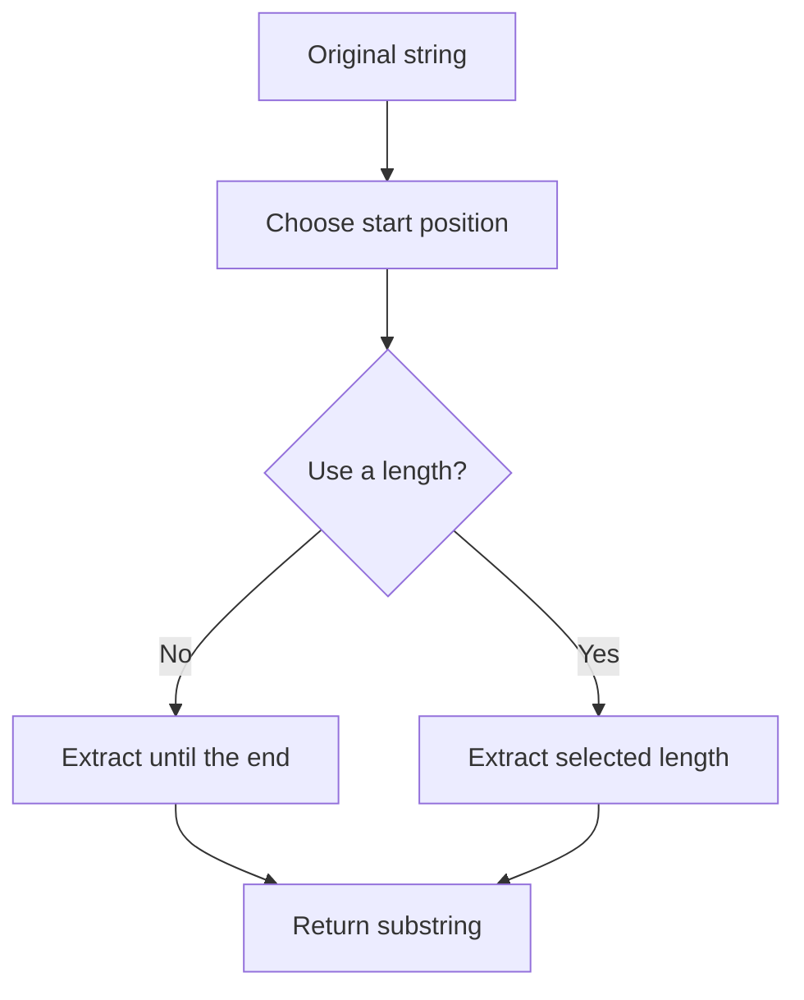

# Slicing PHP Strings

String slicing means extracting part of a string.

## `substr()` — Extract Part of a String

Syntax:

```php
substr(string $string, int $offset, ?int $length = null): string
```

Basic example:

```php
<?php

$text = 'Hello PHP';

echo substr($text, 0, 5);
```

Output:

```text
Hello
```

Positions start from `0`:

```text
H e l l o   P H P
0 1 2 3 4 5 6 7 8
```

## Extract from a Starting Position

```php
<?php

$text = 'Hello PHP';

echo substr($text, 6);
```

Output:

```text
PHP
```

## Negative Offset

A negative offset starts from the end.

```php
<?php

$text = 'Hello PHP';

echo substr($text, -3);
```

Output:

```text
PHP
```

## Negative Length

A negative length stops before the end.

```php
<?php

$text = 'Hello PHP';

echo substr($text, 0, -4);
```

Output:

```text
Hello
```

## UTF-8 Slicing

Use `mb_substr()` for multibyte text:

```php
<?php

$text = 'Xin chào PHP';

echo mb_substr($text, 0, 8, 'UTF-8');
```

## Extract Text Before or After a Separator

Using `explode()`:

```php
<?php

$email = 'alan@example.com';
[$username, $domain] = explode('@', $email, 2);

echo $username;
echo $domain;
```

Using `strstr()`:

```php
<?php

$email = 'alan@example.com';

echo strstr($email, '@');
echo strstr($email, '@', true);
```

## Slicing Flow



## Practice: Mask a Phone Number

```php
<?php

$phone = '0123456789';
$visiblePart = substr($phone, -4);
$hiddenPart = str_repeat('*', strlen($phone) - 4);

echo $hiddenPart . $visiblePart;
```

Output:

```text
******6789
```

---

## Official Resources

* [substr()](https://www.php.net/manual/en/function.substr.php)
* [mb_substr()](https://www.php.net/manual/en/function.mb-substr.php)

## Learning Checklist

* [ ] I can extract text with positive and negative offsets.
* [ ] I use `mb_substr()` for multibyte text.
