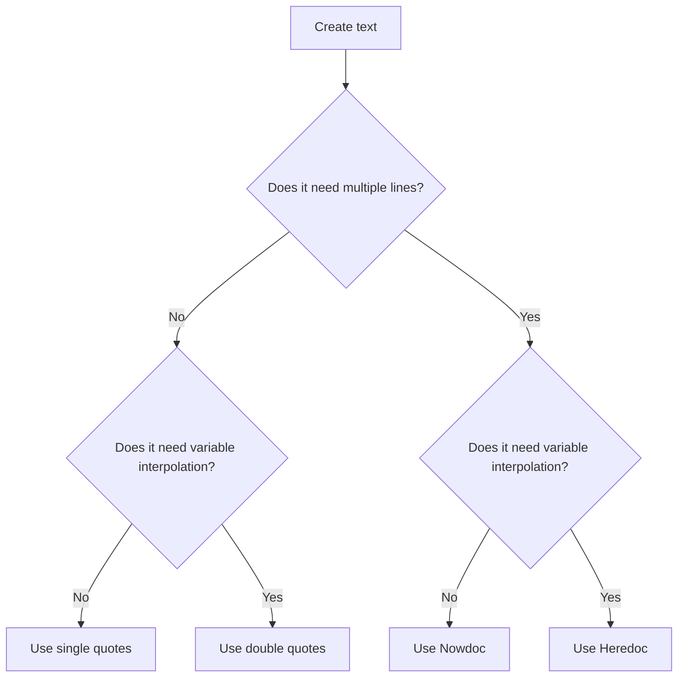

# PHP Strings

A string is a sequence of characters used to store text.

Examples:

```php
<?php

$name = 'Alan';
$message = "Welcome to PHP";
$email = 'alan@example.com';
```

PHP supports several ways to create strings:

* Single-quoted strings.
* Double-quoted strings.
* Heredoc strings.
* Nowdoc strings.

---

## 1.1 Single-Quoted Strings

Single quotes treat most text literally.

```php
<?php

$name = 'Alan';

echo 'Hello, $name';
```

Output:

```text
Hello, $name
```

The variable is not replaced with its value.

Use concatenation when needed:

```php
<?php

$name = 'Alan';

echo 'Hello, ' . $name;
```

Output:

```text
Hello, Alan
```

Single-quoted strings only recognize these common escape sequences:

```php
\\
\'
```

Example:

```php
<?php

echo 'Alan\'s PHP course';
echo '\\var\\www\\html';
```

---

## 1.2 Double-Quoted Strings

Double quotes support:

* Variable interpolation.
* Escape sequences.
* Special characters such as new lines and tabs.

```php
<?php

$name = 'Alan';

echo "Hello, $name";
```

Output:

```text
Hello, Alan
```

Use braces when the variable boundary is unclear:

```php
<?php

$product = 'book';

echo "The {$product}s are available.";
```

Output:

```text
The books are available.
```

---

## 1.3 Heredoc

Heredoc is useful for multiline text with variable interpolation.

```php
<?php

$name = 'Alan';
$job = 'Developer';

$message = <<<TEXT
Name: $name
Job: $job
Welcome to the PHP course.
TEXT;

echo $message;
```

Heredoc behaves similarly to a double-quoted string.

---

## 1.4 Nowdoc

Nowdoc is useful for multiline literal text.

```php
<?php

$name = 'Alan';

$message = <<<'TEXT'
Hello, $name.
This text is not interpolated.
TEXT;

echo $message;
```

Nowdoc behaves similarly to a single-quoted string.

---

## String Type Selection



---

## 1.5 String Length

Use `strlen()` to count the number of bytes in a string.

```php
<?php

$text = 'Hello';

echo strlen($text);
```

Output:

```text
5
```

For UTF-8 text containing Vietnamese or other multibyte characters, use `mb_strlen()`:

```php
<?php

$text = 'Xin chào';

echo mb_strlen($text, 'UTF-8');
```

The `mb_*` functions require the `mbstring` extension.

Check whether it is enabled:

```bash
php -m
```

Look for:

```text
mbstring
```

Official installation documentation:

* https://www.php.net/manual/en/mbstring.installation.php

Docker installation example:

```dockerfile
FROM php:8.4-apache

RUN docker-php-ext-install mbstring
```

Ubuntu or Debian example:

```bash
sudo apt install php-mbstring
```

---

## Official Resources

* [PHP string type](https://www.php.net/manual/en/language.types.string.php)
* [mbstring](https://www.php.net/manual/en/book.mbstring.php)

## Learning Checklist

* [ ] I can choose between single quotes, double quotes, Heredoc, and Nowdoc.
* [ ] I know when to use UTF-8-aware `mb_*` functions.
