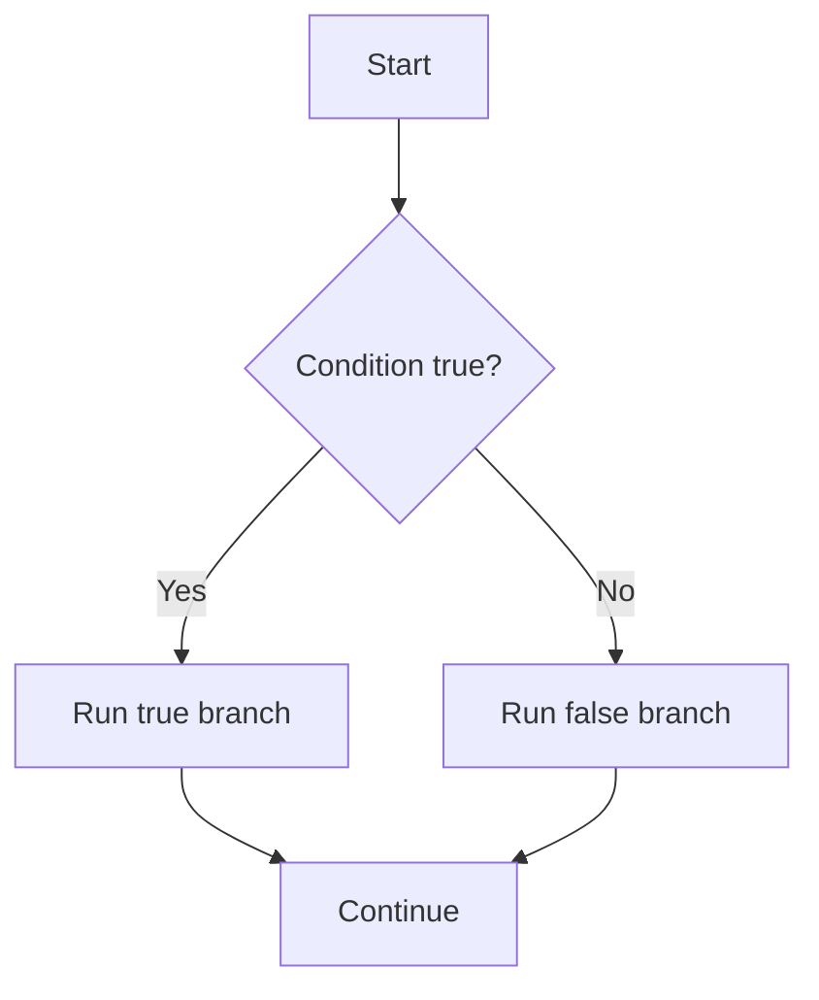
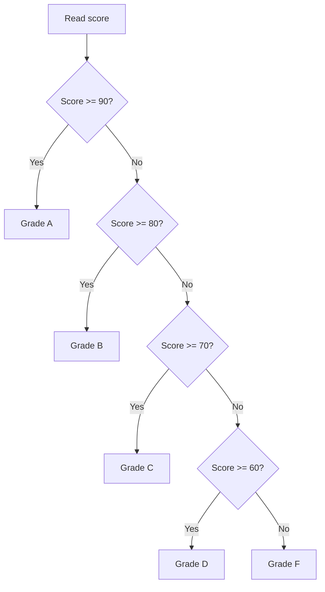

# PHP If / Elseif / Else

## Table of Contents

- [Overview](#overview)
- [Basic If](#basic-if)
- [If and Else](#if-and-else)
- [If, Elseif, and Else](#if-elseif-and-else)
- [Multiple Conditions](#multiple-conditions)
- [Alternative Template Syntax](#alternative-template-syntax)
- [Condition Order](#condition-order)
- [Common Mistakes](#common-mistakes)
- [Best Practices](#best-practices)
- [Practice](#practice)
- [Official Resources](#official-resources)

## Overview

Conditional statements determine which code PHP executes.



## Basic If

An `if` block runs only when its condition is true.

```php
<?php

$temperature = 35;

if ($temperature > 30) {
    echo 'It is hot.';
}
```

## If and Else

Use `else` for the remaining case.

```php
<?php

$isLoggedIn = false;

if ($isLoggedIn) {
    echo 'Welcome back.';
} else {
    echo 'Please log in.';
}
```

## If, Elseif, and Else

Use `elseif` to test additional conditions.

```php
<?php

$score = 78;

if ($score >= 90) {
    echo 'Grade A';
} elseif ($score >= 80) {
    echo 'Grade B';
} elseif ($score >= 70) {
    echo 'Grade C';
} elseif ($score >= 60) {
    echo 'Grade D';
} else {
    echo 'Grade F';
}
```

PHP checks from top to bottom and stops at the first matching branch.



## Multiple Conditions

Combine conditions with logical operators.

```php
<?php

$age = 22;
$hasPermission = true;

if ($age >= 18 && $hasPermission) {
    echo 'Access granted.';
} else {
    echo 'Access denied.';
}
```

```php
<?php

$isAdmin = false;
$isEditor = true;

if ($isAdmin || $isEditor) {
    echo 'Content management allowed.';
}
```

## Alternative Template Syntax

The alternative syntax is useful when mixing PHP and HTML.

```php
<?php if ($isLoggedIn): ?>
    <p>Welcome back!</p>
<?php elseif ($isBlocked): ?>
    <p>Your account is blocked.</p>
<?php else: ?>
    <p>Please log in.</p>
<?php endif; ?>
```

## Condition Order

Place more specific or higher-priority conditions first.

Incorrect:

```php
<?php

$score = 95;

if ($score >= 60) {
    echo 'Passed';
} elseif ($score >= 90) {
    echo 'Excellent';
}
```

The second branch is unreachable.

Correct:

```php
<?php

if ($score >= 90) {
    echo 'Excellent';
} elseif ($score >= 60) {
    echo 'Passed';
}
```

## Common Mistakes

### Assignment instead of comparison

```php
if ($status = 'active') {
    echo 'Active';
}
```

Use strict comparison:

```php
if ($status === 'active') {
    echo 'Active';
}
```

### Loose comparison

Prefer `===` and `!==` unless type conversion is intentional.

### Duplicate or unreachable branches

Review condition order and ensure earlier conditions do not consume later cases.

### Very long conditions

Name meaningful subconditions:

```php
<?php

$canManageContent = $isAdmin || $isEditor;
$canAccessAccount = $isLoggedIn && $isActive && !$isBlocked;

if ($canManageContent && $canAccessAccount) {
    echo 'Access granted.';
}
```

## Best Practices

- Prefer strict comparisons.
- Keep each condition focused.
- Put the most specific condition first.
- Use descriptive Boolean variable names.
- Use guard clauses when nesting becomes deep.
- Use alternative syntax in HTML templates.

## Practice

### Positive, negative, or zero

```php
<?php

$number = -5;

if ($number > 0) {
    echo 'Positive';
} elseif ($number < 0) {
    echo 'Negative';
} else {
    echo 'Zero';
}
```

### Login validation

```php
<?php

function validateLogin(string $username, string $password): string
{
    if ($username === '') {
        return 'Username is required.';
    }

    if ($password === '') {
        return 'Password is required.';
    }

    if (strlen($password) < 8) {
        return 'Password must contain at least 8 characters.';
    }

    return 'Login input is valid.';
}
```

## Official Resources

- [PHP if](https://www.php.net/manual/en/control-structures.if.php)
- [PHP else](https://www.php.net/manual/en/control-structures.else.php)
- [PHP elseif](https://www.php.net/manual/en/control-structures.elseif.php)
