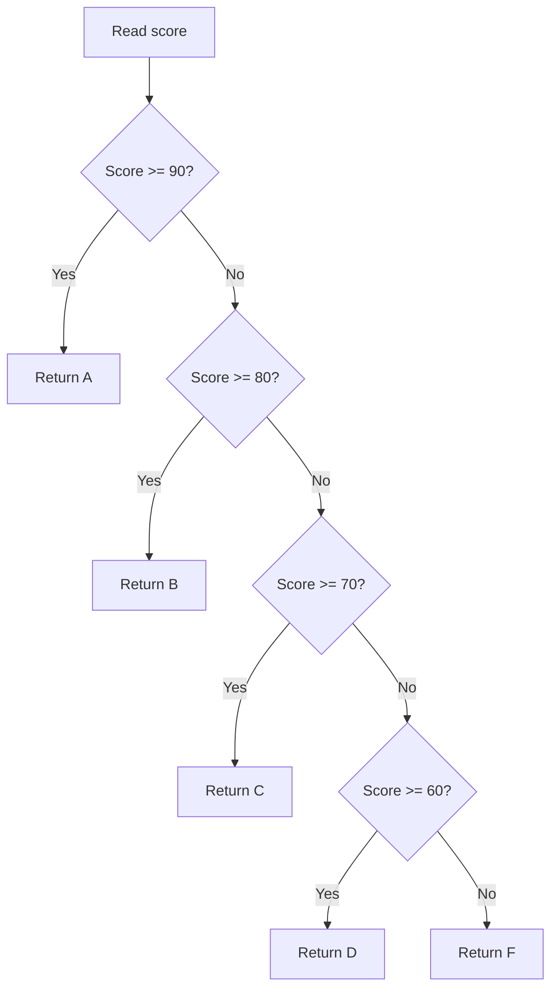

# PHP Match

## Table of Contents

- [Overview](#overview)
- [Basic Syntax](#basic-syntax)
- [Strict Comparison](#strict-comparison)
- [Multiple Values](#multiple-values)
- [Match with Conditions](#match-with-conditions)
- [UnhandledMatchError](#unhandledmatcherror)
- [Match vs Switch](#match-vs-switch)
- [Practical Example](#practical-example)
- [Common Mistakes](#common-mistakes)
- [Practice](#practice)
- [Official Resources](#official-resources)

## Overview

The `match` expression was introduced in PHP 8.0. It compares one value against multiple alternatives and returns a value.

## Basic Syntax

```php
<?php

$role = 'editor';

$message = match ($role) {
    'admin' => 'Full access',
    'editor' => 'Content access',
    'viewer' => 'Read-only access',
    default => 'Unknown role',
};

echo $message;
```

`match`:

- Returns a value.
- Uses strict comparison (`===`).
- Does not require `break`.
- Does not fall through.
- Can group multiple values.

## Strict Comparison

```php
<?php

$value = '1';

$result = match ($value) {
    1 => 'Integer one',
    '1' => 'String one',
    default => 'Other',
};

echo $result; // String one
```

## Multiple Values

```php
<?php

$day = 'Saturday';

$type = match ($day) {
    'Saturday', 'Sunday' => 'Weekend',
    'Monday', 'Tuesday', 'Wednesday', 'Thursday', 'Friday' => 'Weekday',
    default => 'Invalid day',
};
```

## Match with Conditions

Use `match (true)` when each branch contains a Boolean condition.

```php
<?php

$score = 85;

$grade = match (true) {
    $score >= 90 => 'A',
    $score >= 80 => 'B',
    $score >= 70 => 'C',
    $score >= 60 => 'D',
    default => 'F',
};
```

PHP checks the branches from top to bottom.



## UnhandledMatchError

Without a matching branch or `default`, PHP throws `UnhandledMatchError`.

```php
<?php

$status = 'archived';

$message = match ($status) {
    'active' => 'Active',
    'inactive' => 'Inactive',
};
```

Use `default` when unknown values are possible.

## Match vs Switch

| Feature | `switch` | `match` |
|---|---|---|
| PHP version | Older PHP versions | PHP 8.0+ |
| Type | Statement | Expression |
| Returns a value | Not directly | Yes |
| Comparison | Loose | Strict |
| Requires `break` | Usually | No |
| Fall-through | Possible | No |
| Multiple values | Multiple cases | Comma-separated |

Use `match` for concise value mapping. Use `switch` for legacy compatibility or intentional fall-through.

## Practical Example

```php
<?php

function getHttpMessage(int $statusCode): string
{
    return match ($statusCode) {
        200 => 'OK',
        201 => 'Created',
        400 => 'Bad Request',
        401 => 'Unauthorized',
        403 => 'Forbidden',
        404 => 'Not Found',
        500 => 'Internal Server Error',
        default => 'Unknown status code',
    };
}
```

Discount example:

```php
<?php

$membershipLevel = 'gold';

$discountRate = match ($membershipLevel) {
    'gold' => 0.15,
    'silver' => 0.10,
    'bronze' => 0.05,
    default => 0.0,
};
```

## Common Mistakes

- Forgetting `default` when unknown values are valid.
- Assuming `match` uses loose comparison.
- Putting range conditions in a normal value-based match instead of `match (true)`.
- Using `match` for large side-effect-heavy branches.
- Ordering broad conditions before specific conditions in `match (true)`.

## Practice

### User permission

```php
<?php

$role = 'editor';

$permission = match ($role) {
    'admin' => 'Full access',
    'editor' => 'Content access',
    'viewer' => 'Read-only access',
    default => 'No access',
};
```

### Shipping cost

```php
<?php

$orderAmount = 75;

$shippingCost = match (true) {
    $orderAmount >= 100 => 0,
    $orderAmount >= 50 => 5,
    default => 10,
};
```

## Official Resources

- [PHP match](https://www.php.net/manual/en/control-structures.match.php)
