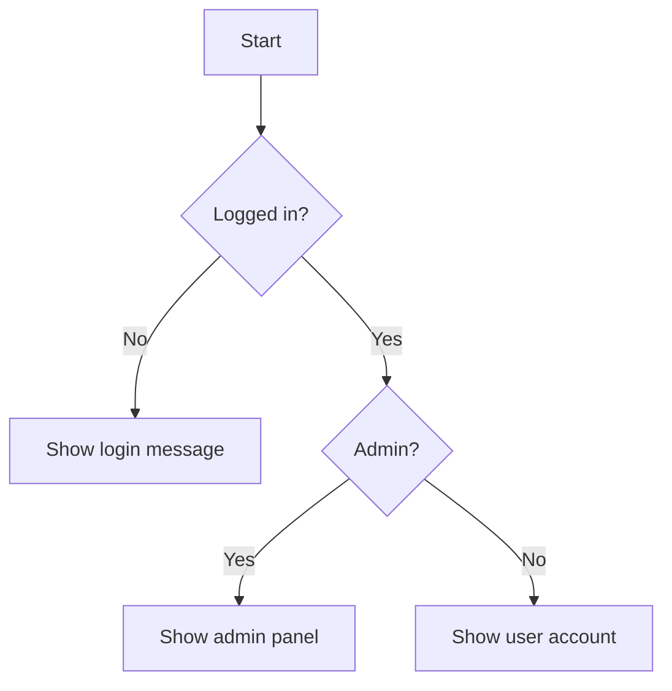
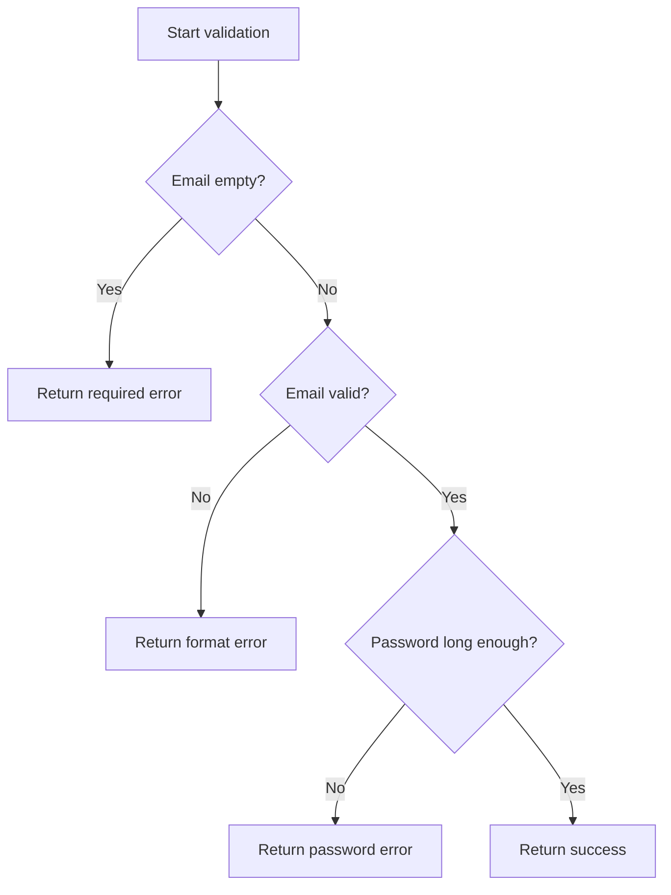

# PHP Nested If

## Table of Contents

- [Overview](#overview)
- [Basic Nested If](#basic-nested-if)
- [Nested Validation](#nested-validation)
- [Guard Clauses](#guard-clauses)
- [Reducing Deep Nesting](#reducing-deep-nesting)
- [Common Mistakes](#common-mistakes)
- [Practice](#practice)
- [Official Resources](#official-resources)

## Overview

A nested `if` is an `if` statement inside another condition. It is useful when the second decision only matters after the first condition passes.

```php
<?php

$isLoggedIn = true;
$isAdmin = true;

if ($isLoggedIn) {
    if ($isAdmin) {
        echo 'Welcome to the admin panel.';
    } else {
        echo 'Welcome to your account.';
    }
} else {
    echo 'Please log in.';
}
```



## Basic Nested If

Nested conditions express dependent decisions.

```php
<?php

$orderIsPaid = true;
$stockAvailable = true;

if ($orderIsPaid) {
    if ($stockAvailable) {
        echo 'Prepare shipment.';
    } else {
        echo 'Wait for stock.';
    }
} else {
    echo 'Wait for payment.';
}
```

## Nested Validation

```php
<?php

$email = 'alan@example.com';
$password = 'secret123';

if ($email !== '') {
    if (filter_var($email, FILTER_VALIDATE_EMAIL)) {
        if (strlen($password) >= 8) {
            echo 'Input is valid.';
        } else {
            echo 'Password must contain at least 8 characters.';
        }
    } else {
        echo 'Email format is invalid.';
    }
} else {
    echo 'Email is required.';
}
```

This works, but the nesting becomes harder to scan as more rules are added.

## Guard Clauses

A guard clause exits early when a requirement is not satisfied.

```php
<?php

function validateRegistration(string $email, string $password): string
{
    if ($email === '') {
        return 'Email is required.';
    }

    if (!filter_var($email, FILTER_VALIDATE_EMAIL)) {
        return 'Email format is invalid.';
    }

    if (strlen($password) < 8) {
        return 'Password must contain at least 8 characters.';
    }

    return 'Input is valid.';
}
```



## Reducing Deep Nesting

### Combine related conditions

```php
<?php

if ($isLoggedIn && $isAdmin) {
    echo 'Admin access granted.';
}
```

Use this only when the conditions belong to the same decision.

### Extract logic into a function

```php
<?php

function canManageContent(array $user): bool
{
    return ($user['active'] ?? false)
        && in_array($user['role'] ?? '', ['admin', 'editor'], true);
}
```

### Return early

```php
<?php

function processOrder(?array $order): string
{
    if ($order === null) {
        return 'Order not found.';
    }

    if (($order['status'] ?? null) !== 'paid') {
        return 'Order is not paid.';
    }

    return 'Order processed.';
}
```

## Common Mistakes

- Nesting many levels instead of using guard clauses.
- Repeating the same condition in several branches.
- Combining unrelated rules into one unreadable expression.
- Forgetting that a child condition runs only when its parent branch is entered.
- Returning inconsistent data types from different branches.

## Practice

Create an access check with these rules:

- User must exist.
- User must be active.
- User must have the `admin` role.

```php
<?php

function checkAdminAccess(?array $user): string
{
    if ($user === null) {
        return 'User not found.';
    }

    if (($user['active'] ?? false) !== true) {
        return 'Inactive account.';
    }

    if (($user['role'] ?? '') !== 'admin') {
        return 'Permission denied.';
    }

    return 'Access granted.';
}
```

## Official Resources

- [PHP if](https://www.php.net/manual/en/control-structures.if.php)
- [PHP functions](https://www.php.net/manual/en/language.functions.php)
