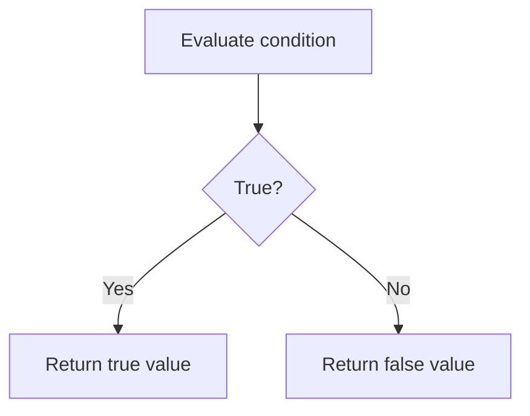

# PHP Shorthand If

## Table of Contents

- [Overview](#overview)
- [Ternary Operator](#ternary-operator)
- [Short Ternary Operator](#short-ternary-operator)
- [Null Coalescing Operator](#null-coalescing-operator)
- [Ternary vs Null Coalescing](#ternary-vs-null-coalescing)
- [Common Mistakes](#common-mistakes)
- [Best Practices](#best-practices)
- [Practice](#practice)
- [Official Resources](#official-resources)

## Overview

Shorthand conditions are useful for small expressions that choose or return a value. Use a full `if` statement when the logic becomes complex.

## Ternary Operator

Syntax:

```php
condition ? value_when_true : value_when_false;
```

Example:

```php
<?php

$age = 20;

$message = $age >= 18
    ? 'Adult'
    : 'Minor';

echo $message;
```

Equivalent full form:

```php
<?php

if ($age >= 18) {
    $message = 'Adult';
} else {
    $message = 'Minor';
}
```

Direct output:

```php
<?php

$isOnline = true;

echo $isOnline ? 'Online' : 'Offline';
```



## Short Ternary Operator

The short ternary syntax is:

```php
$value ?: $defaultValue;
```

```php
<?php

$username = '';
$displayName = $username ?: 'Guest';

echo $displayName; // Guest
```

It uses the fallback for any falsy value, including:

- `false`
- `0`
- `0.0`
- `''`
- `'0'`
- `[]`
- `null`

## Null Coalescing Operator

`??` uses a fallback only when the value is undefined or `null`.

```php
<?php

$displayName = $username ?? 'Guest';
```

It is especially useful with array keys and request data:

```php
<?php

$page = $_GET['page'] ?? 1;
```

Values can be chained:

```php
<?php

$name = $profileName
    ?? $accountName
    ?? 'Guest';
```

## Ternary vs Null Coalescing

```php
<?php

$username = '';

echo $username ?: 'Guest'; // Guest
echo $username ?? 'Guest'; // Empty string
```

| Operator | Uses fallback when |
|---|---|
| `?:` | Value is falsy |
| `??` | Value is undefined or null |
| `? :` | Explicit condition is false |

## Common Mistakes

### Nested ternary expressions

Avoid:

```php
$result = $score >= 90
    ? 'A'
    : ($score >= 80 ? 'B' : ($score >= 70 ? 'C' : 'F'));
```

Use `if / elseif / else` or `match (true)` for multiple ranges.

### Confusing empty with null

An empty string is not null. Choose `?:` or `??` based on the real requirement.

### Hiding side effects

Do not use ternary expressions to execute several unrelated operations. They should normally return a value.

## Best Practices

- Use ternary for a simple two-value decision.
- Use `??` for missing or null values.
- Avoid nested ternary expressions.
- Split long expressions across lines.
- Use a normal `if` when readability decreases.

## Practice

### Even or odd

```php
<?php

$number = 12;

$result = $number % 2 === 0
    ? 'Even'
    : 'Odd';

echo $result;
```

### Shipping label

```php
<?php

$orderAmount = 120;
$shippingLabel = $orderAmount >= 100
    ? 'Free shipping'
    : 'Shipping fee required';
```

### Request fallback

```php
<?php

$search = $_GET['search'] ?? '';
```

## Official Resources

- [PHP comparison operators and ternary](https://www.php.net/manual/en/language.operators.comparison.php)
- [PHP null coalescing operator](https://www.php.net/manual/en/language.operators.comparison.php#language.operators.comparison.coalesce)
