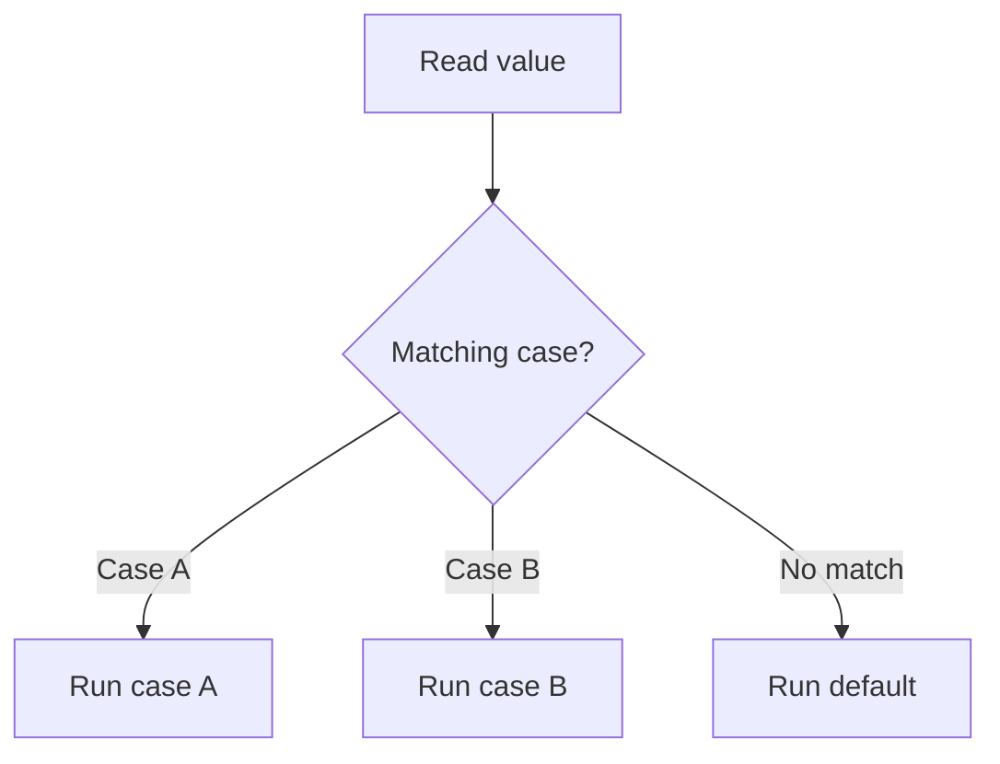

# PHP Switch

## Table of Contents

- [Overview](#overview)
- [Basic Syntax](#basic-syntax)
- [Break and Fall-Through](#break-and-fall-through)
- [Grouping Cases](#grouping-cases)
- [Returning Values](#returning-values)
- [Switch vs If](#switch-vs-if)
- [Common Mistakes](#common-mistakes)
- [Practice](#practice)
- [Official Resources](#official-resources)

## Overview

A `switch` statement compares one value against multiple `case` values.

```php
<?php

$role = 'editor';

switch ($role) {
    case 'admin':
        echo 'Full access';
        break;

    case 'editor':
        echo 'Content access';
        break;

    case 'viewer':
        echo 'Read-only access';
        break;

    default:
        echo 'Unknown role';
}
```

## Basic Syntax

PHP evaluates the expression once, checks each case, and runs the matching branch.



## Break and Fall-Through

`break` stops execution from continuing into later cases.

```php
<?php

$status = 'pending';

switch ($status) {
    case 'pending':
        echo 'Pending';

    case 'processing':
        echo 'Processing';
        break;
}
```

Output:

```text
PendingProcessing
```

This is called fall-through.

## Grouping Cases

Multiple cases can intentionally share one block.

```php
<?php

$day = 'Saturday';

switch ($day) {
    case 'Saturday':
    case 'Sunday':
        echo 'Weekend';
        break;

    default:
        echo 'Weekday';
}
```

## Returning Values

A function can return from each case instead of assigning and breaking.

```php
<?php

function getRoleLabel(string $role): string
{
    switch ($role) {
        case 'admin':
            return 'Administrator';

        case 'editor':
            return 'Content Editor';

        case 'viewer':
            return 'Viewer';

        default:
            return 'Unknown';
    }
}
```

## Switch vs If

Use `switch` when comparing one expression against several fixed values.

Use `if / elseif` when:

- Conditions use ranges.
- Different variables are involved.
- Each branch has a different Boolean expression.

```php
<?php

$score = 85;

if ($score >= 90) {
    echo 'A';
} elseif ($score >= 80) {
    echo 'B';
}
```

For PHP 8+, consider `match` when mapping one value to another because it uses strict comparison and does not require `break`.

## Common Mistakes

### Forgetting break

```php
switch ($status) {
    case 'active':
        echo 'Active';
        break;

    case 'inactive':
        echo 'Inactive';
        break;
}
```

### Missing default

Add `default` when unknown input is possible.

### Using switch for ranges

`switch` is best for fixed case values. Prefer `if / elseif` or `match (true)` for numeric ranges.

### Depending on loose comparison

`switch` uses loose comparison. Be careful when values may have different types.

## Practice

```php
<?php

$statusCode = 404;

switch ($statusCode) {
    case 200:
        echo 'OK';
        break;

    case 404:
        echo 'Not Found';
        break;

    case 500:
        echo 'Server Error';
        break;

    default:
        echo 'Unknown status';
}
```

## Official Resources

- [PHP switch](https://www.php.net/manual/en/control-structures.switch.php)
