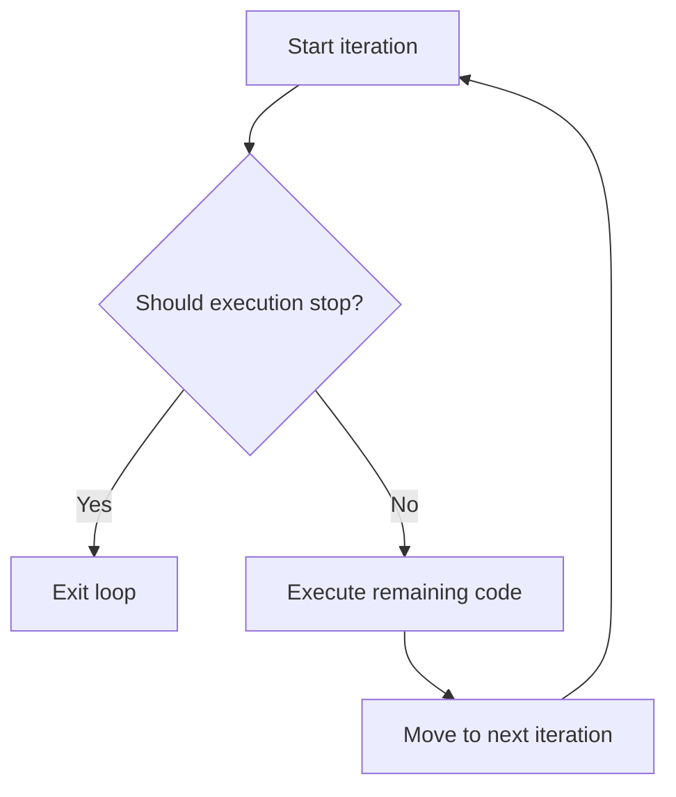
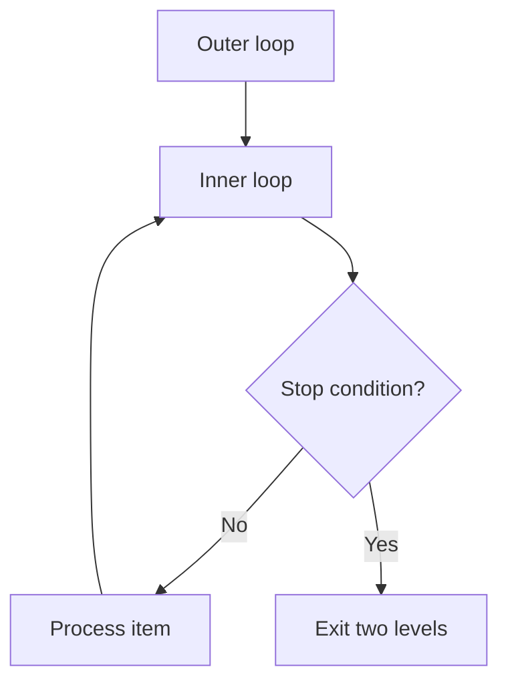

# PHP Break Statement

## Table of Contents

- [Overview](#overview)
- [Basic Usage](#basic-usage)
- [Break in Different Loops](#break-in-different-loops)
- [Break Levels](#break-levels)
- [Practical Examples](#practical-examples)
- [Break vs Continue](#break-vs-continue)
- [Common Mistakes](#common-mistakes)
- [Best Practices](#best-practices)
- [Practice Exercises](#practice-exercises)
- [Official Documentation](#official-documentation)

---

## Overview

The `break` statement immediately stops the current loop or `switch` statement.



Use `break` when the required result has already been found or when continuing would be unnecessary or unsafe.

---

## Basic Usage

```php
<?php

for ($number = 1; $number <= 10; $number++) {
    if ($number === 5) {
        break;
    }

    echo $number . PHP_EOL;
}
```

Output:

```text
1
2
3
4
```

When `$number` becomes `5`, the loop ends immediately.

---

## Break in Different Loops

### In a While Loop

```php
<?php

$number = 1;

while (true) {
    echo $number . PHP_EOL;

    if ($number >= 5) {
        break;
    }

    $number++;
}
```

### In a Foreach Loop

```php
<?php

$users = ['Anna', 'John', 'Alan', 'Mary'];
$target = 'Alan';
$found = false;

foreach ($users as $user) {
    if ($user === $target) {
        $found = true;
        break;
    }
}

echo $found ? 'User found.' : 'User not found.';
```

### In a Switch Statement

```php
<?php

$status = 'active';

switch ($status) {
    case 'active':
        echo 'Active';
        break;

    case 'inactive':
        echo 'Inactive';
        break;

    default:
        echo 'Unknown';
}
```

In `switch`, `break` prevents execution from falling through into later cases.

---

## Break Levels

PHP allows `break` to accept a positive integer indicating how many nested structures to exit.

### Break Two Levels

```php
<?php

for ($row = 1; $row <= 3; $row++) {
    for ($column = 1; $column <= 3; $column++) {
        if ($row === 2 && $column === 2) {
            break 2;
        }

        echo "Row {$row}, Column {$column}" . PHP_EOL;
    }
}
```

Output:

```text
Row 1, Column 1
Row 1, Column 2
Row 1, Column 3
Row 2, Column 1
```

`break 2` exits both the inner and outer loops.



Use numeric levels carefully because they can make control flow harder to understand.

---

## Practical Examples

### Find the First Expensive Product

```php
<?php

$products = [
    ['name' => 'Mouse', 'price' => 25],
    ['name' => 'Keyboard', 'price' => 50],
    ['name' => 'Monitor', 'price' => 200],
    ['name' => 'Laptop', 'price' => 1_000],
];

$expensiveProduct = null;

foreach ($products as $product) {
    if ($product['price'] >= 100) {
        $expensiveProduct = $product;
        break;
    }
}

if ($expensiveProduct !== null) {
    echo 'Found: ' . $expensiveProduct['name'];
}
```

### Stop After Maximum Attempts

```php
<?php

$attempt = 0;
$maximumAttempts = 3;

while (true) {
    $attempt++;

    echo "Attempt {$attempt}" . PHP_EOL;

    $success = $attempt === 2;

    if ($success || $attempt >= $maximumAttempts) {
        break;
    }
}
```

### Stop Processing Invalid Input

```php
<?php

$values = [10, 20, -1, 30];
$total = 0;

foreach ($values as $value) {
    if ($value < 0) {
        break;
    }

    $total += $value;
}

echo $total; // 30
```

---

## Break vs Continue

| Statement | Behavior |
|---|---|
| `break` | Ends the entire current loop |
| `continue` | Skips only the current iteration |

```php
<?php

for ($number = 1; $number <= 5; $number++) {
    if ($number === 2) {
        continue;
    }

    if ($number === 4) {
        break;
    }

    echo $number . PHP_EOL;
}
```

Output:

```text
1
3
```

---

## Common Mistakes

### Breaking Too Early

```php
foreach ($items as $item) {
    break;

    echo $item; // Never runs
}
```

Make sure the stop condition is placed correctly.

### Forgetting Break in Switch

Without `break`, execution may continue into the next `case`.

```php
switch ($status) {
    case 'active':
        echo 'Active';
        break;
}
```

### Using a Numeric Level That Is Hard to Follow

`break 2` and higher levels are valid, but a small helper function or early `return` may be clearer.

### Using Break Instead of Returning a Result

Inside a function, returning immediately may better express the intention:

```php
<?php

function findUser(array $users, int $targetId): ?array
{
    foreach ($users as $user) {
        if ($user['id'] === $targetId) {
            return $user;
        }
    }

    return null;
}
```

---

## Best Practices

- Stop once the required result is found.
- Keep the break condition close to the top of the loop.
- Use `break` to avoid unnecessary iterations.
- Prefer early `return` inside functions when it is clearer.
- Use numbered break levels sparingly.
- Add a reliable exit to intentional infinite loops.
- Document intentional `switch` fall-through when no `break` is used.

---

## Practice Exercises

### Exercise 1: Find the First Number Greater Than 50

```php
<?php

$numbers = [10, 30, 55, 80];
$matchedNumber = null;

foreach ($numbers as $number) {
    if ($number > 50) {
        $matchedNumber = $number;
        break;
    }
}

echo $matchedNumber; // 55
```

### Exercise 2: Stop at Five

```php
<?php

for ($number = 1; $number <= 10; $number++) {
    if ($number === 5) {
        break;
    }

    echo $number . PHP_EOL;
}
```

### Exercise 3: Exit Nested Loops

Create a two-dimensional search and use `break 2` after finding the target value.

---

## Quick Reference

```php
break;   // Exit one level
break 2; // Exit two nested levels
```

---

## Official Documentation

- [PHP break](https://www.php.net/manual/en/control-structures.break.php)
- [PHP continue](https://www.php.net/manual/en/control-structures.continue.php)
- [PHP switch](https://www.php.net/manual/en/control-structures.switch.php)
- [PHP control structures](https://www.php.net/manual/en/language.control-structures.php)

No additional package is required.