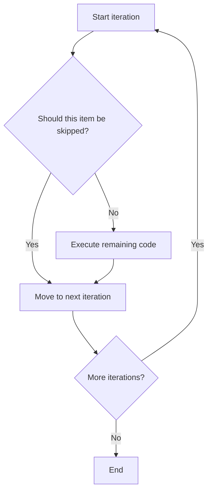

# PHP Continue Statement

## Table of Contents

- [Overview](#overview)
- [Basic Usage](#basic-usage)
- [Continue in Different Loops](#continue-in-different-loops)
- [Continue Levels](#continue-levels)
- [Practical Examples](#practical-examples)
- [Break vs Continue](#break-vs-continue)
- [Common Mistakes](#common-mistakes)
- [Best Practices](#best-practices)
- [Practice Exercises](#practice-exercises)
- [Official Documentation](#official-documentation)

---

## Overview

The `continue` statement skips the rest of the current loop iteration and moves to the next iteration.



Use it to ignore invalid, inactive, unavailable, or irrelevant items without deeply nesting the main logic.

---

## Basic Usage

```php
<?php

for ($number = 1; $number <= 5; $number++) {
    if ($number === 3) {
        continue;
    }

    echo $number . PHP_EOL;
}
```

Output:

```text
1
2
4
5
```

The iteration for `3` is skipped, but the loop continues.

---

## Continue in Different Loops

### In a Foreach Loop

```php
<?php

$users = [
    ['name' => 'Alan', 'active' => true],
    ['name' => 'John', 'active' => false],
    ['name' => 'Anna', 'active' => true],
];

foreach ($users as $user) {
    if (!$user['active']) {
        continue;
    }

    echo $user['name'] . PHP_EOL;
}
```

Output:

```text
Alan
Anna
```

### In a While Loop

When using `continue` in a `while` loop, update loop state before skipping.

```php
<?php

$number = 0;

while ($number < 5) {
    $number++;

    if ($number === 3) {
        continue;
    }

    echo $number . PHP_EOL;
}
```

If the update happens after `continue`, the loop may become infinite.

### In a For Loop

```php
<?php

for ($number = 1; $number <= 10; $number++) {
    if ($number % 2 !== 0) {
        continue;
    }

    echo $number . PHP_EOL;
}
```

This prints only even numbers.

---

## Continue Levels

PHP allows `continue` to accept a positive integer indicating which enclosing loop should continue.

### Continue Two Levels

```php
<?php

for ($row = 1; $row <= 3; $row++) {
    for ($column = 1; $column <= 3; $column++) {
        if ($row === 2 && $column === 2) {
            continue 2;
        }

        echo "Row {$row}, Column {$column}" . PHP_EOL;
    }
}
```

Output:

```text
Row 1, Column 1
Row 1, Column 2
Row 1, Column 3
Row 2, Column 1
Row 3, Column 1
Row 3, Column 2
Row 3, Column 3
```

When row `2`, column `2` is reached, PHP skips the rest of the inner loop and continues with the next outer-loop iteration.

Use numbered levels carefully because they are harder to read than simple control flow.

---

## Practical Examples

### Skip Invalid Values

```php
<?php

$numbers = [10, 0, 5, -2, 20];

foreach ($numbers as $number) {
    if ($number <= 0) {
        continue;
    }

    echo 100 / $number . PHP_EOL;
}
```

This prevents division by zero and ignores negative values.

### Filter Valid Emails

```php
<?php

$emails = [
    'alan@example.com',
    '',
    'invalid-email',
    'anna@example.com',
];

$validEmails = [];

foreach ($emails as $email) {
    if ($email === '') {
        continue;
    }

    if (filter_var($email, FILTER_VALIDATE_EMAIL) === false) {
        continue;
    }

    $validEmails[] = $email;
}

print_r($validEmails);
```

### Reduce Nested Conditions

Nested version:

```php
<?php

foreach ($users as $user) {
    if ($user['active']) {
        if (!$user['blocked']) {
            echo $user['name'];
        }
    }
}
```

Clearer version:

```php
<?php

foreach ($users as $user) {
    if (!$user['active']) {
        continue;
    }

    if ($user['blocked']) {
        continue;
    }

    echo $user['name'];
}
```

This guard-style approach keeps the main processing path less indented.

---

## Break vs Continue

| Statement | Behavior |
|---|---|
| `break` | Ends the entire current loop |
| `continue` | Skips only the current iteration |

```php
<?php

for ($number = 1; $number <= 5; $number++) {
    if ($number === 2) {
        continue;
    }

    if ($number === 4) {
        break;
    }

    echo $number . PHP_EOL;
}
```

Output:

```text
1
3
```

---

## Common Mistakes

### Creating an Infinite While Loop

Incorrect:

```php
<?php

$number = 1;

while ($number <= 5) {
    if ($number === 3) {
        continue;
    }

    $number++;
}
```

When `$number` reaches `3`, it never changes.

Correct:

```php
<?php

$number = 1;

while ($number <= 5) {
    if ($number === 3) {
        $number++;
        continue;
    }

    $number++;
}
```

An even clearer version updates at the start of each iteration.

### Using Continue When Break Is Required

Use `continue` when only one item should be skipped. Use `break` when no further items should be processed.

### Hiding Too Much Logic

Many `continue` statements can make a loop difficult to trace. Group related validation rules or extract them into a named function when necessary.

### Using Numbered Levels Without Need

`continue 2` is valid but can surprise readers. Prefer simpler loop structures when possible.

---

## Best Practices

- Use `continue` near the top of a loop as a guard clause.
- Update `while` loop state before a possible `continue`.
- Use clear skip conditions.
- Prefer multiple simple guards over deeply nested conditions.
- Avoid too many numbered `continue` levels.
- Validate collection structure before reading array keys.
- Keep the main processing path easy to identify.

---

## Practice Exercises

### Exercise 1: Print Even Numbers

```php
<?php

for ($number = 1; $number <= 20; $number++) {
    if ($number % 2 !== 0) {
        continue;
    }

    echo $number . PHP_EOL;
}
```

### Exercise 2: Skip Unavailable Products

```php
<?php

$products = [
    ['name' => 'Keyboard', 'available' => true],
    ['name' => 'Mouse', 'available' => false],
    ['name' => 'Monitor', 'available' => true],
];

foreach ($products as $product) {
    if (!$product['available']) {
        continue;
    }

    echo $product['name'] . PHP_EOL;
}
```

### Exercise 3: Skip Missing Fields

```php
<?php

$users = [
    ['name' => 'Alan', 'email' => 'alan@example.com'],
    ['name' => 'John'],
];

foreach ($users as $user) {
    if (!isset($user['email'])) {
        continue;
    }

    echo $user['email'] . PHP_EOL;
}
```

---

## Quick Reference

```php
continue;   // Skip current iteration
continue 2; // Continue an outer loop
```

---

## Official Documentation

- [PHP continue](https://www.php.net/manual/en/control-structures.continue.php)
- [PHP break](https://www.php.net/manual/en/control-structures.break.php)
- [PHP foreach](https://www.php.net/manual/en/control-structures.foreach.php)
- [PHP control structures](https://www.php.net/manual/en/language.control-structures.php)

No additional package is required.