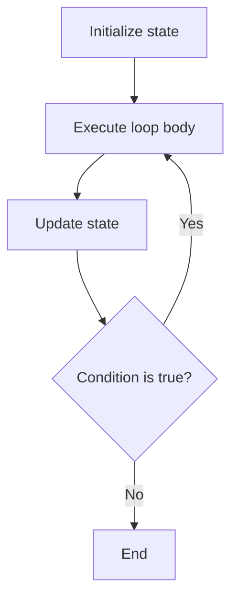

# PHP Do While Loop

## Table of Contents

- [Overview](#overview)
- [Syntax](#syntax)
- [Basic Example](#basic-example)
- [While vs Do While](#while-vs-do-while)
- [Practical Examples](#practical-examples)
- [Common Mistakes](#common-mistakes)
- [Best Practices](#best-practices)
- [Practice Exercises](#practice-exercises)
- [Official Documentation](#official-documentation)

---

## Overview

A `do...while` loop executes its body first and checks the condition afterward.

This means the loop always runs at least once.



---

## Syntax

```php
do {
    // Code to repeat
} while (condition);
```

The semicolon after the `while` condition is required.

---

## Basic Example

```php
<?php

$number = 1;

do {
    echo $number . PHP_EOL;
    $number++;
} while ($number <= 5);
```

Output:

```text
1
2
3
4
5
```

---

## While vs Do While

A `while` loop checks first and may run zero times:

```php
<?php

$number = 10;

while ($number <= 5) {
    echo $number;
}
```

Nothing is printed.

A `do...while` loop executes first:

```php
<?php

$number = 10;

do {
    echo $number; // 10
} while ($number <= 5);
```

| Loop | Condition checked | Minimum executions |
|---|---|---:|
| `while` | Before the body | 0 |
| `do...while` | After the body | 1 |

---

## Practical Examples

### Validation Attempts

```php
<?php

$attempt = 0;
$isValid = false;

do {
    $attempt++;

    echo "Validation attempt: {$attempt}" . PHP_EOL;

    // Simulated result
    $isValid = $attempt >= 2;
} while (!$isValid && $attempt < 3);

echo 'Validation finished.';
```

### Display a Menu at Least Once

```php
<?php

$choice = 'exit';

do {
    echo '1. View profile' . PHP_EOL;
    echo '2. Edit profile' . PHP_EOL;
    echo '3. Exit' . PHP_EOL;

    // Simulated input
    $choice = 'exit';
} while ($choice !== 'exit');
```

### Retry a Task

```php
<?php

$attempt = 0;
$maximumAttempts = 3;
$success = false;

do {
    $attempt++;

    echo "Attempt {$attempt}" . PHP_EOL;

    $success = $attempt === 2;
} while (!$success && $attempt < $maximumAttempts);
```

Use a maximum attempt count so the loop cannot continue forever.

---

## Common Mistakes

### Missing the Final Semicolon

Incorrect:

```php
do {
    echo 'Hello';
} while (false)
```

Correct:

```php
do {
    echo 'Hello';
} while (false);
```

### Assuming the Condition Runs First

A `do...while` loop always executes once. Do not use it when the body must never run for an initially invalid condition.

### Creating an Infinite Loop

Incorrect:

```php
$number = 1;

do {
    echo $number;
} while ($number <= 5);
```

Correct:

```php
$number = 1;

do {
    echo $number;
    $number++;
} while ($number <= 5);
```

---

## Best Practices

- Use `do...while` only when one execution is required.
- Keep the condition easy to understand.
- Update loop state before checking the condition again.
- Add attempt limits to retry workflows.
- Prefer `while` when zero executions must be possible.
- Use braces and clear variable names consistently.

---

## Practice Exercises

### Exercise 1: Print 1 to 5

```php
<?php

$number = 1;

do {
    echo $number . PHP_EOL;
    $number++;
} while ($number <= 5);
```

### Exercise 2: Count Down

```php
<?php

$number = 5;

do {
    echo $number . PHP_EOL;
    $number--;
} while ($number >= 1);
```

### Exercise 3: Run Once with a False Condition

```php
<?php

$isEnabled = false;

do {
    echo 'This runs once.';
} while ($isEnabled);
```

---

## Quick Reference

```php
do {
    // Runs at least once
} while ($condition);
```

Use `do...while` when the operation must happen before its result can be checked.

---

## Official Documentation

- [PHP do...while](https://www.php.net/manual/en/control-structures.do.while.php)
- [PHP while](https://www.php.net/manual/en/control-structures.while.php)
- [PHP control structures](https://www.php.net/manual/en/language.control-structures.php)

No additional package is required.