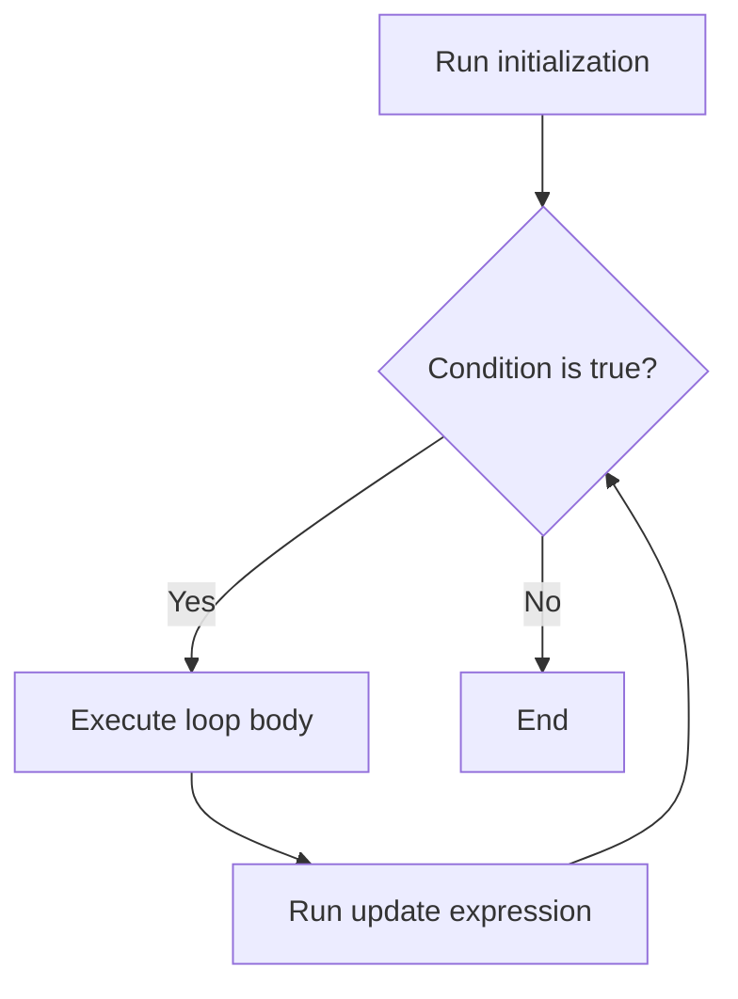
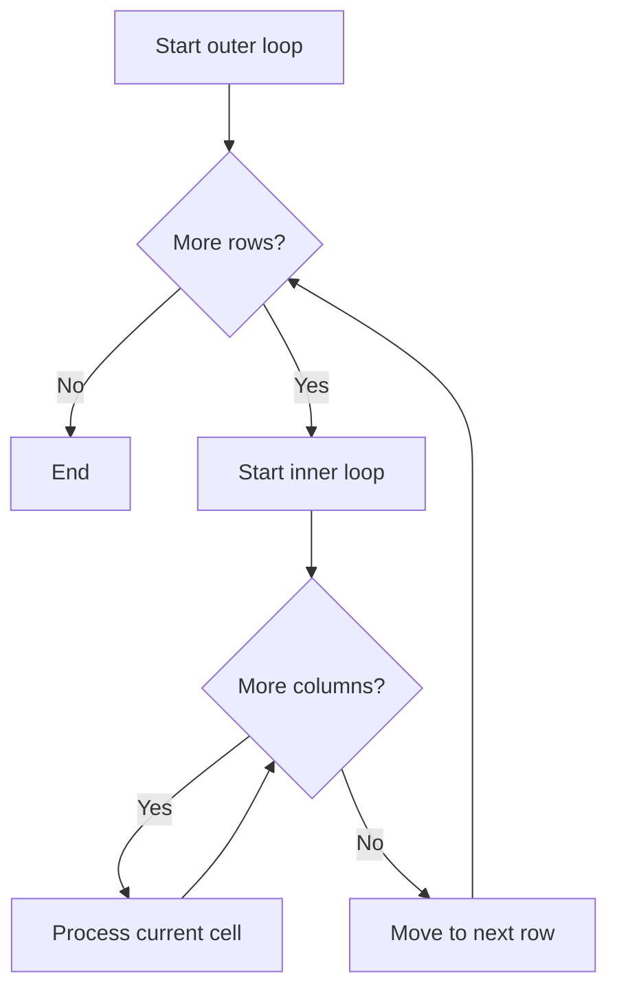

# PHP For Loop

## Table of Contents

- [Overview](#overview)
- [Syntax](#syntax)
- [Basic Examples](#basic-examples)
- [Array Iteration](#array-iteration)
- [Nested For Loops](#nested-for-loops)
- [Practical Examples](#practical-examples)
- [Common Mistakes](#common-mistakes)
- [Best Practices](#best-practices)
- [Practice Exercises](#practice-exercises)
- [Official Documentation](#official-documentation)

---

## Overview

A `for` loop is useful when the number of iterations is known or controlled by a numeric counter.



---

## Syntax

```php
for (initialization; condition; update) {
    // Code to repeat
}
```

The three expressions are:

1. **Initialization** — runs once before the loop.
2. **Condition** — checked before every iteration.
3. **Update** — runs after every iteration.

---

## Basic Examples

### Count Up

```php
<?php

for ($number = 1; $number <= 5; $number++) {
    echo $number . PHP_EOL;
}
```

### Count Down

```php
<?php

for ($number = 5; $number >= 1; $number--) {
    echo $number . PHP_EOL;
}
```

### Use a Custom Step

```php
<?php

for ($number = 0; $number <= 10; $number += 2) {
    echo $number . PHP_EOL;
}
```

Output:

```text
0
2
4
6
8
10
```

---

## Array Iteration

```php
<?php

$colors = ['Red', 'Green', 'Blue'];
$colorCount = count($colors);

for ($index = 0; $index < $colorCount; $index++) {
    echo $colors[$index] . PHP_EOL;
}
```

Store `count()` before the loop when the array does not change.

For normal collection processing, `foreach` is usually clearer. Use `for` when the index itself matters.

---

## Nested For Loops

A nested loop is a loop inside another loop.

```php
<?php

for ($row = 1; $row <= 3; $row++) {
    for ($column = 1; $column <= 3; $column++) {
        echo "Row {$row}, Column {$column}" . PHP_EOL;
    }
}
```

The inner loop runs completely for every outer-loop iteration.



Nested loops can become expensive for large collections. Two loops over `n` items may perform approximately `n × n` comparisons.

---

## Practical Examples

### Multiplication Table

```php
<?php

$number = 5;

for ($multiplier = 1; $multiplier <= 10; $multiplier++) {
    $result = $number * $multiplier;

    echo "{$number} x {$multiplier} = {$result}" . PHP_EOL;
}
```

### Pagination Links

```php
<?php

$totalItems = 53;
$itemsPerPage = 10;
$totalPages = (int) ceil($totalItems / $itemsPerPage);

for ($page = 1; $page <= $totalPages; $page++) {
    echo "Page {$page}" . PHP_EOL;
}
```

### Build a Grid

```php
<?php

for ($row = 1; $row <= 3; $row++) {
    for ($column = 1; $column <= 3; $column++) {
        $value = $row * $column;

        echo str_pad((string) $value, 4, ' ', STR_PAD_LEFT);
    }

    echo PHP_EOL;
}
```

---

## Common Mistakes

### Off-by-One Errors

Incorrect:

```php
<?php

$items = ['A', 'B', 'C'];

for ($index = 0; $index <= count($items); $index++) {
    echo $items[$index];
}
```

The last valid index is `2`, not `3`.

Correct:

```php
<?php

$itemCount = count($items);

for ($index = 0; $index < $itemCount; $index++) {
    echo $items[$index];
}
```

### Updating in the Wrong Direction

Incorrect:

```php
for ($number = 1; $number <= 5; $number--) {
    // Infinite loop
}
```

The update must move the counter toward the stopping condition.

### Recalculating Expensive Values

Less clear:

```php
for ($index = 0; $index < count($items); $index++) {
    // ...
}
```

Better:

```php
$itemCount = count($items);

for ($index = 0; $index < $itemCount; $index++) {
    // ...
}
```

### Using For When Foreach Is Clearer

Use `foreach` when you only need each array item and do not need manual index control.

---

## Best Practices

- Use meaningful counter names such as `$index`, `$page`, `$row`, or `$attempt`.
- Keep initialization, condition, and update expressions simple.
- Use `< count` rather than `<= count` for array indexes.
- Cache repeated calculations when the source does not change.
- Avoid deeply nested loops over large collections.
- Use `break` once the required result is found.
- Use `continue` to skip invalid iterations.
- Prefer `foreach` for normal array traversal.

---

## Practice Exercises

### Exercise 1: Print Even Numbers

```php
<?php

for ($number = 2; $number <= 20; $number += 2) {
    echo $number . PHP_EOL;
}
```

### Exercise 2: Count Backward

```php
<?php

for ($number = 10; $number >= 1; $number--) {
    echo $number . PHP_EOL;
}
```

### Exercise 3: Array Total

```php
<?php

$numbers = [10, 20, 30, 40];
$total = 0;
$count = count($numbers);

for ($index = 0; $index < $count; $index++) {
    $total += $numbers[$index];
}

echo $total; // 100
```

---

## Quick Reference

```php
for ($index = 0; $index < 10; $index++) {
    echo $index;
}
```

Choose `for` when:

- The number of iterations is known.
- A numeric index is required.
- You need a custom counting step.
- You are creating sequences, tables, or grids.

---

## Official Documentation

- [PHP for](https://www.php.net/manual/en/control-structures.for.php)
- [PHP arrays](https://www.php.net/manual/en/language.types.array.php)
- [PHP break](https://www.php.net/manual/en/control-structures.break.php)
- [PHP continue](https://www.php.net/manual/en/control-structures.continue.php)

No additional package is required.