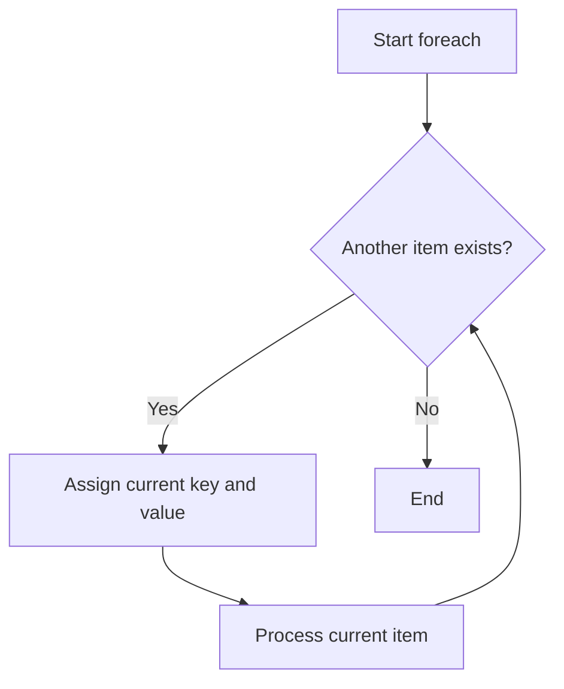

# PHP Foreach and Collections

## Table of Contents

- [Overview](#overview)
- [Collections in PHP](#collections-in-php)
- [Foreach Syntax](#foreach-syntax)
- [Loop Through Values](#loop-through-values)
- [Loop Through Keys and Values](#loop-through-keys-and-values)
- [Modify Values](#modify-values)
- [Nested Foreach](#nested-foreach)
- [Practical Examples](#practical-examples)
- [Common Mistakes](#common-mistakes)
- [Best Practices](#best-practices)
- [Practice Exercises](#practice-exercises)
- [Official Documentation](#official-documentation)

---

## Overview

A `foreach` loop is designed for arrays and iterable objects. It is usually the clearest way to process a PHP collection.



---

## Collections in PHP

A collection is a group of values stored together. The most common PHP collection is an array.

### Indexed Array

```php
<?php

$fruits = ['Apple', 'Banana', 'Orange'];

echo $fruits[0]; // Apple
```

### Associative Array

```php
<?php

$user = [
    'name' => 'Alan',
    'age' => 26,
    'role' => 'Developer',
];

echo $user['name'];
```

### Multidimensional Array

```php
<?php

$users = [
    ['name' => 'Alan', 'role' => 'Developer'],
    ['name' => 'Anna', 'role' => 'Designer'],
];
```

---

## Foreach Syntax

Values only:

```php
foreach ($collection as $value) {
    // Use current value
}
```

Keys and values:

```php
foreach ($collection as $key => $value) {
    // Use current key and value
}
```

PHP automatically advances to the next item. No manual counter is required.

---

## Loop Through Values

```php
<?php

$fruits = ['Apple', 'Banana', 'Orange'];

foreach ($fruits as $fruit) {
    echo $fruit . PHP_EOL;
}
```

Output:

```text
Apple
Banana
Orange
```

### Generate an HTML List

```php
<?php

$technologies = ['PHP', 'MySQL', 'Joomla'];

echo '<ul>';

foreach ($technologies as $technology) {
    echo '<li>'
        . htmlspecialchars($technology, ENT_QUOTES | ENT_SUBSTITUTE, 'UTF-8')
        . '</li>';
}

echo '</ul>';
```

Escape untrusted values before inserting them into HTML.

---

## Loop Through Keys and Values

```php
<?php

$user = [
    'name' => 'Alan',
    'age' => 26,
    'role' => 'Developer',
];

foreach ($user as $key => $value) {
    echo "{$key}: {$value}" . PHP_EOL;
}
```

### Display Numbering from One

```php
<?php

$tasks = ['Learn PHP', 'Practice loops', 'Build a project'];

foreach ($tasks as $index => $task) {
    $number = $index + 1;

    echo "{$number}. {$task}" . PHP_EOL;
}
```

---

## Modify Values

By default, the loop variable receives the current value. Changing it does not change the original array.

```php
<?php

$prices = [10, 20, 30];

foreach ($prices as $price) {
    $price *= 2;
}

print_r($prices); // Still 10, 20, 30
```

### Modify by Reference

```php
<?php

$prices = [10, 20, 30];

foreach ($prices as &$price) {
    $price *= 2;
}

unset($price);

print_r($prices);
```

Output:

```text
Array
(
    [0] => 20
    [1] => 40
    [2] => 60
)
```

Always call `unset()` after a reference-based loop because the variable remains linked to the final array item.

### Safer Key-Based Alternative

```php
<?php

$prices = [10, 20, 30];

foreach ($prices as $index => $price) {
    $prices[$index] = $price * 2;
}
```

This is explicit and avoids lingering references.

---

## Nested Foreach

Use nested loops for multidimensional collections.

```php
<?php

$departments = [
    'Development' => ['Alan', 'John'],
    'Design' => ['Anna', 'Mary'],
];

foreach ($departments as $department => $members) {
    echo $department . PHP_EOL;

    foreach ($members as $member) {
        echo '- ' . $member . PHP_EOL;
    }
}
```

Output:

```text
Development
- Alan
- John
Design
- Anna
- Mary
```

Be careful with nested loops over large collections because the number of operations can grow quickly.

---

## Practical Examples

### Calculate a Shopping Cart Total

```php
<?php

$cart = [
    ['name' => 'Keyboard', 'price' => 50, 'quantity' => 2],
    ['name' => 'Mouse', 'price' => 25, 'quantity' => 1],
    ['name' => 'Monitor', 'price' => 200, 'quantity' => 1],
];

$total = 0;

foreach ($cart as $item) {
    $subtotal = $item['price'] * $item['quantity'];
    $total += $subtotal;

    echo $item['name']
        . ': $'
        . number_format($subtotal, 2)
        . PHP_EOL;
}

echo 'Total: $' . number_format($total, 2);
```

### Filter Valid Emails

```php
<?php

$emails = [
    'alan@example.com',
    'invalid-email',
    '',
    'anna@example.com',
];

$validEmails = [];

foreach ($emails as $email) {
    if ($email === '') {
        continue;
    }

    if (filter_var($email, FILTER_VALIDATE_EMAIL) === false) {
        continue;
    }

    $validEmails[] = $email;
}

print_r($validEmails);
```

### Find the First Matching Record

```php
<?php

$users = [
    ['id' => 1, 'name' => 'Anna'],
    ['id' => 2, 'name' => 'John'],
    ['id' => 3, 'name' => 'Alan'],
];

$matchedUser = null;

foreach ($users as $user) {
    if ($user['id'] === 3) {
        $matchedUser = $user;
        break;
    }
}
```

---

## Common Mistakes

### Forgetting to Unset a Reference

```php
foreach ($numbers as &$number) {
    $number *= 2;
}

unset($number);
```

Without `unset()`, a later assignment can accidentally overwrite the last array item.

### Modifying the Same Array Unexpectedly

Risky:

```php
foreach ($numbers as $number) {
    $numbers[] = $number * 10;
}
```

Safer:

```php
$newNumbers = [];

foreach ($numbers as $number) {
    $newNumbers[] = $number * 10;
}
```

### Assuming Every Record Has the Same Keys

```php
foreach ($products as $product) {
    if (!isset($product['name'], $product['price'])) {
        continue;
    }

    echo $product['name'] . ': ' . $product['price'];
}
```

### Using Foreach When an Array Function Is Clearer

For simple transformations, `array_map()`, `array_filter()`, or `array_reduce()` may be appropriate. Choose the version that is easiest to understand and debug.

---

## Best Practices

- Prefer `foreach` for arrays and iterable objects.
- Use meaningful singular names: `$users as $user`.
- Validate expected keys before reading them.
- Escape values for their output context.
- Use `continue` to skip invalid items and reduce nesting.
- Use `break` after finding the required result.
- Avoid references unless direct mutation is necessary.
- Avoid deeply nested loops over large datasets.
- Consider indexing related data by ID instead of repeatedly scanning it.

---

## Practice Exercises

### Exercise 1: Calculate a Total

```php
<?php

$numbers = [10, 20, 30, 40];
$total = 0;

foreach ($numbers as $number) {
    $total += $number;
}

echo $total; // 100
```

### Exercise 2: Skip Unavailable Products

```php
<?php

$products = [
    ['name' => 'Keyboard', 'available' => true],
    ['name' => 'Mouse', 'available' => false],
    ['name' => 'Monitor', 'available' => true],
];

foreach ($products as $product) {
    if (!$product['available']) {
        continue;
    }

    echo $product['name'] . PHP_EOL;
}
```

### Exercise 3: Double Every Price

```php
<?php

$prices = [10, 20, 30];

foreach ($prices as $index => $price) {
    $prices[$index] = $price * 2;
}

print_r($prices);
```

---

## Quick Reference

```php
foreach ($items as $item) {
    // Process value
}

foreach ($items as $key => $item) {
    // Process key and value
}
```

---

## Official Documentation

- [PHP foreach](https://www.php.net/manual/en/control-structures.foreach.php)
- [PHP arrays](https://www.php.net/manual/en/language.types.array.php)
- [PHP array functions](https://www.php.net/manual/en/ref.array.php)
- [PHP Traversable](https://www.php.net/manual/en/class.traversable.php)

No additional package is required.