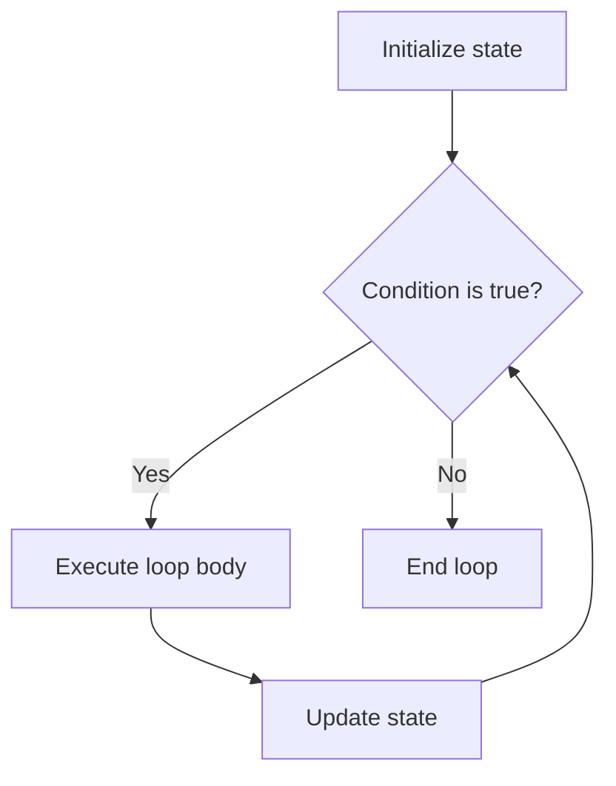
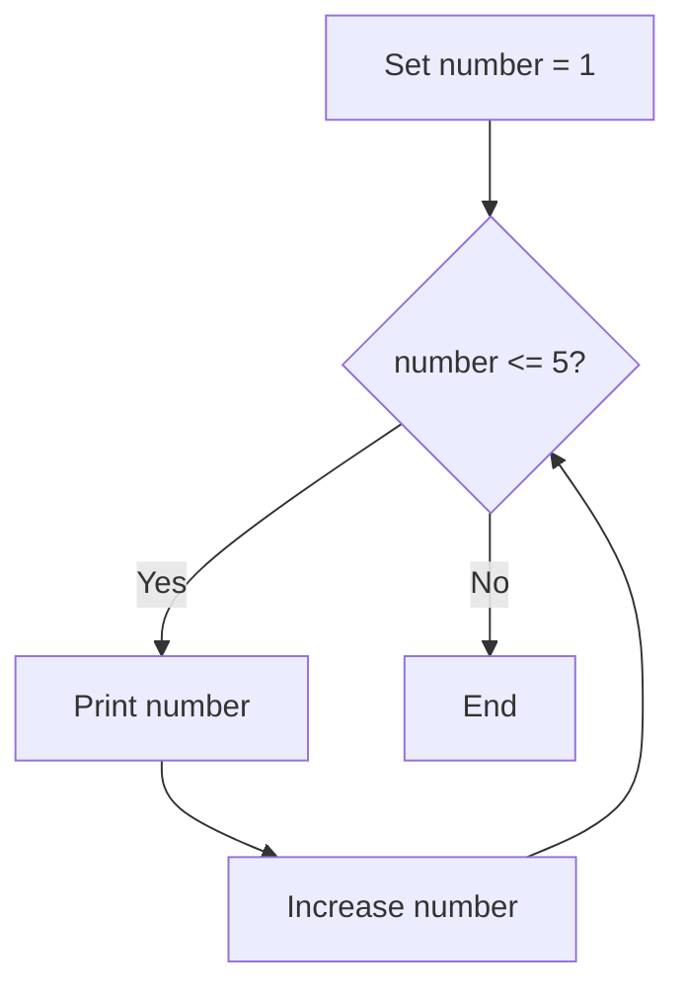

# PHP While Loop

## Table of Contents

- [Overview](#overview)
- [Syntax](#syntax)
- [Basic Example](#basic-example)
- [How It Works](#how-it-works)
- [Practical Examples](#practical-examples)
- [Common Mistakes](#common-mistakes)
- [Best Practices](#best-practices)
- [Practice Exercises](#practice-exercises)
- [Official Documentation](#official-documentation)

---

## Overview

A `while` loop repeats a block of code while its condition remains `true`.

Use it when the number of repetitions is not known in advance and execution depends on a changing condition.



---

## Syntax

```php
while (condition) {
    // Code to repeat
}
```

The condition is checked before every iteration. Therefore, a `while` loop may execute zero times.

---

## Basic Example

```php
<?php

$number = 1;

while ($number <= 5) {
    echo $number . PHP_EOL;
    $number++;
}
```

Output:

```text
1
2
3
4
5
```

---

## How It Works

1. `$number` starts at `1`.
2. PHP checks whether `$number <= 5`.
3. The number is printed.
4. `$number++` increases the value.
5. PHP checks the condition again.
6. The loop stops when `$number` becomes `6`.



---

## Practical Examples

### Calculate a Sum

```php
<?php

$number = 1;
$total = 0;

while ($number <= 5) {
    $total += $number;
    $number++;
}

echo $total; // 15
```

### Process an Indexed Array

```php
<?php

$fruits = ['Apple', 'Banana', 'Orange'];
$index = 0;
$itemCount = count($fruits);

while ($index < $itemCount) {
    echo $fruits[$index] . PHP_EOL;
    $index++;
}
```

For arrays, `foreach` is usually clearer unless you specifically need index control.

### Retry an Operation

```php
<?php

$maximumAttempts = 3;
$attempt = 0;
$success = false;

while (!$success && $attempt < $maximumAttempts) {
    $attempt++;

    echo "Attempt {$attempt}" . PHP_EOL;

    // Simulated operation
    $success = $attempt === 2;
}

echo $success
    ? 'Operation completed.'
    : 'Operation failed.';
```

This pattern can be used for controlled API, file, or database retries. Real applications should also handle exceptions and retry delays.

### Infinite Loop with a Safe Exit

```php
<?php

$number = 1;

while (true) {
    echo $number . PHP_EOL;

    if ($number >= 5) {
        break;
    }

    $number++;
}
```

Use `while (true)` carefully. The loop must contain a reliable exit condition.

---

## Common Mistakes

### Forgetting to Update the Condition

Incorrect:

```php
<?php

$number = 1;

while ($number <= 5) {
    echo $number;
}
```

This creates an infinite loop because `$number` never changes.

Correct:

```php
<?php

while ($number <= 5) {
    echo $number;
    $number++;
}
```

### Using an Invalid Array Boundary

Incorrect:

```php
while ($index <= count($items)) {
    echo $items[$index];
    $index++;
}
```

The final index does not exist. Use `<` instead:

```php
$itemCount = count($items);

while ($index < $itemCount) {
    echo $items[$index];
    $index++;
}
```

### Depending on an Unchanging External Value

Make sure the condition can eventually become false. Otherwise, define a maximum attempt count or another safe exit.

---

## Best Practices

- Initialize loop state before entering the loop.
- Update the state on every possible path.
- Add a maximum iteration count for retry operations.
- Prefer `foreach` for normal array iteration.
- Use descriptive variables such as `$attempt`, `$index`, and `$isConnected`.
- Avoid complex side effects inside the condition.
- Use braces consistently.

---

## Practice Exercises

### Exercise 1: Print 1 to 10

```php
<?php

$number = 1;

while ($number <= 10) {
    echo $number . PHP_EOL;
    $number++;
}
```

### Exercise 2: Count Down

Print the numbers from `5` to `1`.

```php
<?php

$number = 5;

while ($number >= 1) {
    echo $number . PHP_EOL;
    $number--;
}
```

### Exercise 3: Add Array Values

```php
<?php

$numbers = [10, 20, 30, 40];
$index = 0;
$total = 0;
$count = count($numbers);

while ($index < $count) {
    $total += $numbers[$index];
    $index++;
}

echo $total; // 100
```

---

## Quick Reference

```php
$counter = 0;

while ($counter < 5) {
    echo $counter;
    $counter++;
}
```

Choose `while` when:

- The iteration count is unknown.
- A condition controls repetition.
- The state changes during execution.

---

## Official Documentation

- [PHP while](https://www.php.net/manual/en/control-structures.while.php)
- [PHP control structures](https://www.php.net/manual/en/language.control-structures.php)
- [PHP break](https://www.php.net/manual/en/control-structures.break.php)
- [PHP continue](https://www.php.net/manual/en/control-structures.continue.php)

No additional package is required.