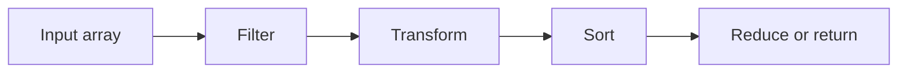

# PHP Array Functions

## Table of Contents

- [Overview](#overview)
- [Add and Remove Items](#add-and-remove-items)
- [Search and Check](#search-and-check)
- [Transform Arrays](#transform-arrays)
- [Filter Arrays](#filter-arrays)
- [Reduce Arrays](#reduce-arrays)
- [Combine and Split Arrays](#combine-and-split-arrays)
- [Keys and Values](#keys-and-values)
- [Practical Pipeline](#practical-pipeline)
- [Common Mistakes](#common-mistakes)
- [Official Documentation](#official-documentation)

## Overview

PHP array functions help add, remove, search, transform, filter, combine, split, and summarize array data.



## Add and Remove Items

```php
<?php

$fruits = ['Apple'];

$fruits[] = 'Banana';
array_push($fruits, 'Orange', 'Mango');

$last = array_pop($fruits);
$first = array_shift($fruits);
array_unshift($fruits, 'Grape');
```

Use `$array[] = $value` for a simple append.

## Search and Check

Strict value check:

```php
<?php

$roles = ['admin', 'editor', 'viewer'];

if (in_array('editor', $roles, true)) {
    echo 'Role exists';
}
```

Find a key:

```php
<?php

$index = array_search('editor', $roles, true);

if ($index !== false) {
    echo "Found at {$index}";
}
```

Check a named key:

```php
<?php

$user = ['phone' => null];

var_dump(isset($user['phone']));
var_dump(array_key_exists('phone', $user));
```

## Transform Arrays

Use `array_map()` to create a new transformed array.

```php
<?php

$numbers = [1, 2, 3];

$doubled = array_map(
    fn (int $number): int => $number * 2,
    $numbers
);
```

Transform records:

```php
<?php

$users = [
    ['name' => 'alan'],
    ['name' => 'anna'],
];

$names = array_map(
    fn (array $user): string => ucfirst($user['name']),
    $users
);
```

## Filter Arrays

```php
<?php

$numbers = [1, 2, 3, 4, 5, 6];

$evenNumbers = array_filter(
    $numbers,
    fn (int $number): bool => $number % 2 === 0
);

$evenNumbers = array_values($evenNumbers);
```

`array_filter()` preserves original keys. Use `array_values()` when sequential indexes are needed.

## Reduce Arrays

Use `array_reduce()` to combine all items into one result.

```php
<?php

$total = array_reduce(
    [10, 20, 30],
    fn (int $carry, int $number): int => $carry + $number,
    0
);
```

Cart total:

```php
<?php

$cart = [
    ['price' => 50, 'quantity' => 2],
    ['price' => 25, 'quantity' => 1],
];

$total = array_reduce(
    $cart,
    fn (float $carry, array $item): float =>
        $carry + ($item['price'] * $item['quantity']),
    0.0
);
```

## Combine and Split Arrays

Merge arrays:

```php
<?php

$result = array_merge($defaults, $customSettings);
```

Spread arrays:

```php
<?php

$result = [...$first, ...$second];
```

Read part of an array without changing it:

```php
<?php

$part = array_slice([10, 20, 30, 40], 1, 2);
```

Remove or replace part of the original array:

```php
<?php

$numbers = [10, 20, 30, 40];
$removed = array_splice($numbers, 1, 2);
```

Split into groups:

```php
<?php

$groups = array_chunk([1, 2, 3, 4, 5], 2);
```

## Keys and Values

```php
<?php

$keys = array_keys($user);
$values = array_values($user);
$count = count($user);
```

Extract a column:

```php
<?php

$users = [
    ['id' => 1, 'name' => 'Alan'],
    ['id' => 2, 'name' => 'Anna'],
];

$names = array_column($users, 'name');
$namesById = array_column($users, 'name', 'id');
```

Other useful functions:

```php
array_unique($values);
array_reverse($values);
array_sum($numbers);
array_product($numbers);
array_key_first($array);
array_key_last($array);
```

## Practical Pipeline

```php
<?php

$products = [
    ['name' => 'Keyboard', 'price' => 50, 'available' => true],
    ['name' => 'Mouse', 'price' => 25, 'available' => false],
    ['name' => 'Monitor', 'price' => 200, 'available' => true],
];

$available = array_filter(
    $products,
    fn (array $product): bool => $product['available']
);

$labels = array_map(
    fn (array $product): string =>
        $product['name'] . ': $' . number_format($product['price'], 2),
    $available
);
```

## Common Mistakes

- Using non-strict `in_array()` or `array_search()`.
- Checking `array_search()` with a truthy test instead of `!== false`.
- Forgetting that `array_filter()` preserves keys.
- Expecting mutating functions such as `sort()` to return the modified array.
- Using `array_splice()` when `array_slice()` was intended.
- Writing callbacks that perform too many unrelated tasks.

## Official Documentation

- [PHP array functions](https://www.php.net/manual/en/ref.array.php)
- [`array_map()`](https://www.php.net/manual/en/function.array-map.php)
- [`array_filter()`](https://www.php.net/manual/en/function.array-filter.php)
- [`array_reduce()`](https://www.php.net/manual/en/function.array-reduce.php)
- [`array_column()`](https://www.php.net/manual/en/function.array-column.php)
