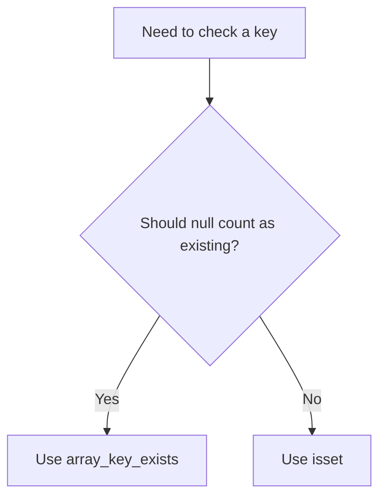

# PHP Associative Arrays

## Table of Contents

- [Overview](#overview)
- [Create and Access Values](#create-and-access-values)
- [Add, Update, and Remove Values](#add-update-and-remove-values)
- [Safe Key Checks](#safe-key-checks)
- [Loop Through Keys and Values](#loop-through-keys-and-values)
- [Merge Settings](#merge-settings)
- [Common Mistakes](#common-mistakes)
- [Practice](#practice)
- [Official Documentation](#official-documentation)

## Overview

An associative array stores values using named keys.

```php
<?php

$user = [
    'name' => 'Alan',
    'age' => 26,
    'role' => 'Developer',
];
```

Associative arrays are useful for structured records, configuration, API data, and database rows.

## Create and Access Values

```php
<?php

$product = [
    'name' => 'Keyboard',
    'price' => 50.0,
    'available' => true,
];

echo $product['name'];
```

Use a fallback for optional keys:

```php
<?php

$description = $product['description'] ?? 'No description';
```

## Add, Update, and Remove Values

```php
<?php

$user['email'] = 'alan@example.com';
$user['role'] = 'Senior Developer';
unset($user['age']);
```

## Safe Key Checks

`isset()` returns `false` when a key is missing or its value is `null`.

```php
<?php

$user = ['phone' => null];

var_dump(isset($user['phone'])); // false
```

`array_key_exists()` checks whether the key exists, even when its value is `null`.

```php
<?php

var_dump(array_key_exists('phone', $user)); // true
```



## Loop Through Keys and Values

```php
<?php

foreach ($user as $key => $value) {
    echo "{$key}: {$value}" . PHP_EOL;
}
```

Generate safe HTML:

```php
<?php

foreach ($user as $key => $value) {
    echo '<dt>' . htmlspecialchars((string) $key, ENT_QUOTES, 'UTF-8') . '</dt>';
    echo '<dd>' . htmlspecialchars((string) $value, ENT_QUOTES, 'UTF-8') . '</dd>';
}
```

## Merge Settings

```php
<?php

$defaults = [
    'theme' => 'light',
    'language' => 'en',
];

$custom = [
    'theme' => 'dark',
];

$settings = array_merge($defaults, $custom);
```

Later string-key values replace earlier values.

Result:

```php
[
    'theme' => 'dark',
    'language' => 'en',
]
```

## Common Mistakes

- Accessing an associative array with a numeric index.
- Assuming `isset()` returns true for a key whose value is `null`.
- Printing untrusted values into HTML without escaping.
- Using unclear abbreviated key names.
- Merging configuration arrays without understanding which value wins.

## Practice

```php
<?php

$user = [
    'name' => 'Alan',
    'email' => 'alan@example.com',
    'active' => true,
];

function getUserLabel(array $user): string
{
    $name = $user['name'] ?? 'Unknown';
    $status = ($user['active'] ?? false) ? 'Active' : 'Inactive';

    return "{$name} ({$status})";
}

echo getUserLabel($user);
```

## Official Documentation

- [PHP arrays](https://www.php.net/manual/en/language.types.array.php)
- [`array_key_exists()`](https://www.php.net/manual/en/function.array-key-exists.php)
- [`array_merge()`](https://www.php.net/manual/en/function.array-merge.php)
