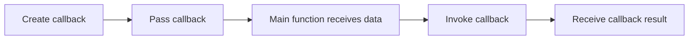

# PHP Callback Functions

## Table of Contents

- [Overview](#overview)
- [Named Callbacks](#named-callbacks)
- [Anonymous and Arrow Callbacks](#anonymous-and-arrow-callbacks)
- [Method Callbacks](#method-callbacks)
- [Callbacks with Array Functions](#callbacks-with-array-functions)
- [Reusable Callback Processor](#reusable-callback-processor)
- [Common Mistakes](#common-mistakes)
- [Official Documentation](#official-documentation)

## Overview

A callback is a function passed to another function as data.



Use the `callable` type when a parameter must accept a callback.

```php
<?php

function processNumber(int $number, callable $callback): int
{
    return $callback($number);
}
```

## Named Callbacks

```php
<?php

function doubleNumber(int $number): int
{
    return $number * 2;
}

echo processNumber(5, 'doubleNumber');
```

The string `'doubleNumber'` identifies the function PHP should call.

## Anonymous and Arrow Callbacks

Anonymous callback:

```php
<?php

$result = processNumber(
    5,
    function (int $number): int {
        return $number * 3;
    }
);
```

Arrow callback:

```php
<?php

$result = processNumber(
    5,
    fn (int $number): int => $number * 4
);
```

Use arrow functions for short expressions. Use named or anonymous functions when the logic needs multiple statements.

## Method Callbacks

Static method callback:

```php
<?php

class Formatter
{
    public static function uppercase(string $value): string
    {
        return strtoupper($value);
    }
}

$callback = [Formatter::class, 'uppercase'];

echo $callback('alan');
```

Object method callback:

```php
<?php

class PriceFormatter
{
    public function format(float $price): string
    {
        return '$' . number_format($price, 2);
    }
}

$formatter = new PriceFormatter();
$callback = [$formatter, 'format'];

echo $callback(19.99);
```

## Callbacks with Array Functions

### `array_map()`

Transform each item:

```php
<?php

$numbers = [1, 2, 3, 4];

$doubled = array_map(
    fn (int $number): int => $number * 2,
    $numbers
);
```

### `array_filter()`

Keep matching items:

```php
<?php

$numbers = [1, 2, 3, 4, 5, 6];

$evenNumbers = array_filter(
    $numbers,
    fn (int $number): bool => $number % 2 === 0
);
```

### `array_reduce()`

Combine all items into one result:

```php
<?php

$total = array_reduce(
    [10, 20, 30],
    fn (int $carry, int $number): int => $carry + $number,
    0
);
```

### `usort()`

Apply custom sorting:

```php
<?php

$products = [
    ['name' => 'Keyboard', 'price' => 50],
    ['name' => 'Mouse', 'price' => 25],
];

usort(
    $products,
    fn (array $first, array $second): int =>
        $first['price'] <=> $second['price']
);
```

## Reusable Callback Processor

```php
<?php

function transformValues(array $values, callable $callback): array
{
    return array_map($callback, $values);
}

$squares = transformValues(
    [1, 2, 3],
    fn (int $number): int => $number ** 2
);
```

Callbacks make behavior configurable without duplicating the processing structure.

## Common Mistakes

- Passing a function result instead of the callback itself.
- Using a callback whose parameter types do not match the supplied data.
- Placing database calls or unrelated side effects inside simple array callbacks.
- Writing a callback so large that a named function would be clearer.
- Assuming `array_filter()` rebuilds numeric indexes; use `array_values()` when needed.

## Official Documentation

- [Callbacks and callables](https://www.php.net/manual/en/language.types.callable.php)
- [Anonymous functions](https://www.php.net/manual/en/functions.anonymous.php)
- [Arrow functions](https://www.php.net/manual/en/functions.arrow.php)
- [Array functions](https://www.php.net/manual/en/ref.array.php)
