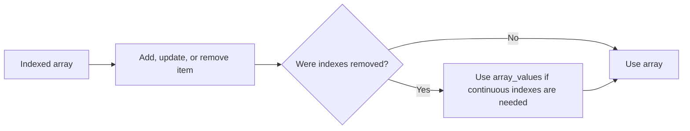

# PHP Indexed Arrays

## Table of Contents

- [Overview](#overview)
- [Create an Indexed Array](#create-an-indexed-array)
- [Access and Update Items](#access-and-update-items)
- [Add and Remove Items](#add-and-remove-items)
- [Loop Through Items](#loop-through-items)
- [Useful Functions](#useful-functions)
- [Common Mistakes](#common-mistakes)
- [Practice](#practice)
- [Official Documentation](#official-documentation)

## Overview

An indexed array stores multiple values using numeric keys.

```php
<?php

$fruits = ['Apple', 'Banana', 'Orange'];
```

Default indexes start at zero:

```text
0 => Apple
1 => Banana
2 => Orange
```

## Create an Indexed Array

Short syntax:

```php
<?php

$colors = ['Red', 'Green', 'Blue'];
```

Long syntax:

```php
<?php

$colors = array('Red', 'Green', 'Blue');
```

The short syntax is preferred in modern PHP.

## Access and Update Items

```php
<?php

$fruits = ['Apple', 'Banana', 'Orange'];

echo $fruits[0];

$fruits[1] = 'Grape';
```

Safe access with a fallback:

```php
<?php

$fruit = $fruits[10] ?? 'Unknown';
```

## Add and Remove Items

Append an item:

```php
<?php

$fruits[] = 'Mango';
```

Add several items:

```php
<?php

array_push($fruits, 'Grape', 'Melon');
```

Remove the last item:

```php
<?php

$lastFruit = array_pop($fruits);
```

Remove the first item:

```php
<?php

$firstFruit = array_shift($fruits);
```

Remove a specific index:

```php
<?php

unset($fruits[1]);
```

`unset()` leaves a gap in numeric indexes. Rebuild them with:

```php
<?php

$fruits = array_values($fruits);
```



## Loop Through Items

Values only:

```php
<?php

foreach ($fruits as $fruit) {
    echo $fruit . PHP_EOL;
}
```

Indexes and values:

```php
<?php

foreach ($fruits as $index => $fruit) {
    echo "{$index}: {$fruit}" . PHP_EOL;
}
```

Use a `for` loop when the numeric index is central to the operation:

```php
<?php

$count = count($fruits);

for ($index = 0; $index < $count; $index++) {
    echo $fruits[$index] . PHP_EOL;
}
```

## Useful Functions

```php
count($fruits);
in_array('Apple', $fruits, true);
array_search('Apple', $fruits, true);
array_slice($fruits, 0, 2);
array_chunk($fruits, 2);
array_reverse($fruits);
array_unique($fruits);
```

Always use strict comparison with `in_array()` and `array_search()` when possible.

## Common Mistakes

### Using an invalid index

```php
$value = $fruits[10] ?? null;
```

### Using `<= count()` in a loop

Correct:

```php
for ($index = 0; $index < count($fruits); $index++) {
    // ...
}
```

### Assuming `unset()` reindexes the array

Use `array_values()` when sequential indexes are required.

### Checking `array_search()` incorrectly

```php
$index = array_search('Apple', $fruits, true);

if ($index !== false) {
    echo 'Found';
}
```

## Practice

```php
<?php

$numbers = [10, 20, 30, 40];
$total = 0;

foreach ($numbers as $number) {
    $total += $number;
}

echo $total;
```

## Official Documentation

- [PHP arrays](https://www.php.net/manual/en/language.types.array.php)
- [Array functions](https://www.php.net/manual/en/ref.array.php)
