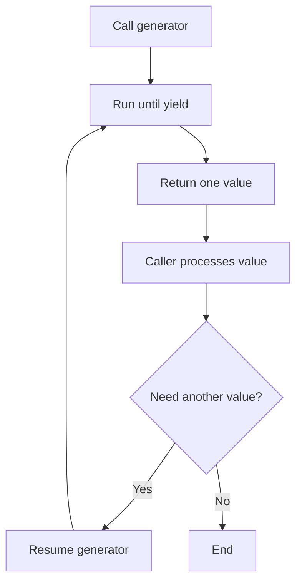

# PHP Iterables and Generators

## Table of Contents

- [Overview](#overview)
- [Iterable Parameters](#iterable-parameters)
- [Iterable Return Types](#iterable-return-types)
- [Generators](#generators)
- [Generator Keys](#generator-keys)
- [Arrays vs Generators](#arrays-vs-generators)
- [Practical Examples](#practical-examples)
- [Common Mistakes](#common-mistakes)
- [Practice](#practice)
- [Official Documentation](#official-documentation)

## Overview

An iterable is any value that can be processed with `foreach`.

The `iterable` type accepts:

- Arrays.
- Objects implementing `Traversable`.
- Generators.

```php
<?php

function printItems(iterable $items): void
{
    foreach ($items as $item) {
        echo $item . PHP_EOL;
    }
}

printItems(['PHP', 'MySQL', 'Joomla']);
```

## Iterable Parameters

Use `iterable` when a function should accept both arrays and traversable objects.

```php
<?php

function calculateTotal(iterable $numbers): int|float
{
    $total = 0;

    foreach ($numbers as $number) {
        $total += $number;
    }

    return $total;
}
```

An `array` parameter accepts only arrays. An `iterable` parameter is more flexible.

## Iterable Return Types

A function may return an array:

```php
<?php

function getNumbers(): iterable
{
    return [1, 2, 3];
}
```

It may also return a generator:

```php
<?php

function generateNumbers(int $maximum): iterable
{
    for ($number = 1; $number <= $maximum; $number++) {
        yield $number;
    }
}
```

## Generators

A generator produces values one at a time with `yield`.

```php
<?php

foreach (generateNumbers(5) as $number) {
    echo $number . PHP_EOL;
}
```



Unlike a normal array-building function, the generator pauses after each `yield` and resumes when the next value is requested.

## Generator Keys

Generators may yield keys and values:

```php
<?php

function getStatuses(): iterable
{
    yield 'draft' => 'Draft';
    yield 'published' => 'Published';
    yield 'archived' => 'Archived';
}

foreach (getStatuses() as $key => $label) {
    echo "{$key}: {$label}" . PHP_EOL;
}
```

## Arrays vs Generators

Array-building function:

```php
<?php

function createNumbers(int $maximum): array
{
    $numbers = [];

    for ($number = 1; $number <= $maximum; $number++) {
        $numbers[] = $number;
    }

    return $numbers;
}
```

Generator:

```php
<?php

function generateLargeRange(int $maximum): iterable
{
    for ($number = 1; $number <= $maximum; $number++) {
        yield $number;
    }
}
```

| Array | Generator |
|---|---|
| Builds all values before returning | Produces one value at a time |
| Supports direct random access | Normally processed sequentially |
| May use more memory for large data | Often more memory-efficient |
| Can be counted and reused easily | Usually consumed through iteration |

Generators are useful for:

- Large files.
- Database result streams.
- API pagination.
- Large numeric ranges.
- Data-processing pipelines.

## Practical Examples

Read a file one line at a time:

```php
<?php

function readLines(string $filePath): iterable
{
    $handle = fopen($filePath, 'rb');

    if ($handle === false) {
        throw new RuntimeException('Unable to open file.');
    }

    try {
        while (($line = fgets($handle)) !== false) {
            yield rtrim($line, "\r\n");
        }
    } finally {
        fclose($handle);
    }
}
```

Generate even numbers:

```php
<?php

function generateEvenNumbers(int $maximum): iterable
{
    for ($number = 2; $number <= $maximum; $number += 2) {
        yield $number;
    }
}
```

## Common Mistakes

- Expecting a generator to behave exactly like an array.
- Trying to access a generator item by numeric index.
- Iterating a completed generator again without creating a new one.
- Using a generator when the complete result must be sorted or accessed repeatedly.
- Forgetting to close files or other resources used by a generator.
- Performing hidden side effects each time a yielded value is requested.

## Practice

```php
<?php

function generateMultiples(int $value, int $maximum): iterable
{
    for ($number = $value; $number <= $maximum; $number += $value) {
        yield $number;
    }
}

foreach (generateMultiples(3, 15) as $number) {
    echo $number . PHP_EOL;
}
```

## Official Documentation

- [PHP iterable type](https://www.php.net/manual/en/language.types.iterable.php)
- [Generators overview](https://www.php.net/manual/en/language.generators.overview.php)
- [Generator syntax](https://www.php.net/manual/en/language.generators.syntax.php)
- [`Traversable`](https://www.php.net/manual/en/class.traversable.php)
