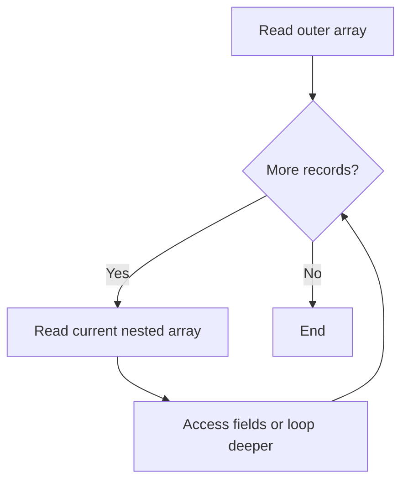

# PHP Multidimensional Arrays

## Table of Contents

- [Overview](#overview)
- [Create Nested Arrays](#create-nested-arrays)
- [Access Nested Values](#access-nested-values)
- [Loop Through Records](#loop-through-records)
- [Safe Nested Access](#safe-nested-access)
- [Transform Nested Data](#transform-nested-data)
- [Common Mistakes](#common-mistakes)
- [Practice](#practice)
- [Official Documentation](#official-documentation)

## Overview

A multidimensional array contains one or more arrays inside another array.

```php
<?php

$users = [
    [
        'id' => 1,
        'name' => 'Alan',
        'role' => 'Developer',
    ],
    [
        'id' => 2,
        'name' => 'Anna',
        'role' => 'Designer',
    ],
];
```

This structure is common for database rows, API responses, products, orders, and grouped configuration.

## Create Nested Arrays

```php
<?php

$company = [
    'name' => 'Example Company',
    'departments' => [
        'development' => ['Alan', 'John'],
        'design' => ['Anna', 'Mary'],
    ],
];
```

## Access Nested Values

```php
<?php

echo $users[0]['name'];
echo $users[1]['role'];
echo $company['departments']['development'][0];
```

Read the path from left to right:

```text
company → departments → development → first member
```

## Loop Through Records

```php
<?php

foreach ($users as $user) {
    echo $user['name'] . ' - ' . $user['role'] . PHP_EOL;
}
```

Nested loop:

```php
<?php

foreach ($company['departments'] as $department => $members) {
    echo $department . PHP_EOL;

    foreach ($members as $member) {
        echo '- ' . $member . PHP_EOL;
    }
}
```



## Safe Nested Access

Use `??` for optional nested keys:

```php
<?php

$city = $user['address']['city'] ?? 'Unknown';
```

Validate required structure:

```php
<?php

foreach ($users as $user) {
    if (!isset($user['id'], $user['name'], $user['role'])) {
        continue;
    }

    echo $user['name'] . PHP_EOL;
}
```

For deeply nested external data, validate each expected level before using it.

## Transform Nested Data

Extract one column:

```php
<?php

$names = array_column($users, 'name');
```

Use IDs as keys:

```php
<?php

$namesById = array_column($users, 'name', 'id');
```

Transform records:

```php
<?php

$labels = array_map(
    fn (array $user): string =>
        $user['name'] . ' (' . $user['role'] . ')',
    $users
);
```

## Common Mistakes

- Using the wrong key at one nesting level.
- Assuming every record has the same structure.
- Creating excessive nesting that is difficult to read.
- Modifying nested arrays by reference without cleaning up the reference.
- Mixing unrelated record shapes in one collection.

## Practice

```php
<?php

$products = [
    ['name' => 'Keyboard', 'price' => 50],
    ['name' => 'Mouse', 'price' => 25],
];

$total = 0.0;

foreach ($products as $product) {
    $total += (float) ($product['price'] ?? 0);
}

echo number_format($total, 2);
```

## Official Documentation

- [PHP arrays](https://www.php.net/manual/en/language.types.array.php)
- [`array_column()`](https://www.php.net/manual/en/function.array-column.php)
- [Array functions](https://www.php.net/manual/en/ref.array.php)
